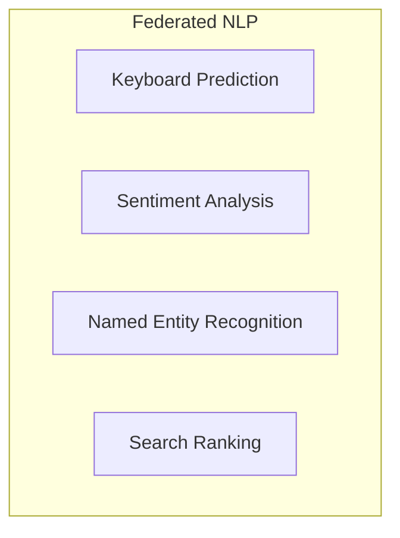

# Tutorial 043: Federated Natural Language Processing

---

## Metadata

| Property | Value |
|----------|-------|
| **Tutorial ID** | 043 |
| **Title** | Federated Natural Language Processing |
| **Category** | Applications |
| **Difficulty** | Intermediate |
| **Duration** | 75 minutes |
| **Prerequisites** | Tutorial 001-042 |
| **Author** | Unbitrium Contributors |
| **Last Updated** | January 2026 |

---

## Learning Objectives

By the end of this tutorial, you will be able to:

1. **Understand** NLP challenges in federated settings.
2. **Implement** federated text classification.
3. **Design** keyboard prediction with FL.
4. **Analyze** vocabulary handling across clients.
5. **Apply** privacy-preserving NLP.
6. **Evaluate** language models in FL.

---

## Prerequisites

- **Completed Tutorials**: 001-042
- **Knowledge**: NLP basics, embeddings
- **Libraries**: PyTorch, NumPy

```python
import torch
import torch.nn as nn
import numpy as np
print(f"PyTorch: {torch.__version__}")
```

---

## Background and Theory

### NLP FL Challenges

| Challenge | Description | Solution |
|-----------|-------------|----------|
| Vocabulary | Different word distributions | Shared vocab |
| Sequence length | Variable lengths | Padding/truncation |
| Privacy | Text is sensitive | DP, SecAgg |
| Large models | BERT size | Compression |

### Use Cases



---

## Implementation Code

### Part 1: Text Processing

```python
#!/usr/bin/env python3
"""
Tutorial 043: Federated Natural Language Processing

Author: Unbitrium Contributors
License: EUPL-1.2
"""

from __future__ import annotations
import copy
from dataclasses import dataclass
from typing import Any
import numpy as np
import torch
import torch.nn as nn
import torch.nn.functional as F
from torch.utils.data import Dataset, DataLoader
from collections import Counter


@dataclass
class FedNLPConfig:
    num_rounds: int = 30
    num_clients: int = 10
    local_epochs: int = 3
    batch_size: int = 32
    learning_rate: float = 0.001
    vocab_size: int = 5000
    embedding_dim: int = 100
    hidden_dim: int = 128
    max_seq_len: int = 50
    num_classes: int = 2
    seed: int = 42


class Vocabulary:
    """Shared vocabulary for federated NLP."""

    def __init__(self, max_size: int = 5000):
        self.max_size = max_size
        self.word2idx = {"<PAD>": 0, "<UNK>": 1}
        self.idx2word = {0: "<PAD>", 1: "<UNK>"}
        self.word_counts = Counter()

    def build_from_texts(self, texts: list[list[str]]) -> None:
        """Build vocabulary from tokenized texts."""
        for text in texts:
            self.word_counts.update(text)

        # Keep top words
        for word, _ in self.word_counts.most_common(self.max_size - 2):
            idx = len(self.word2idx)
            self.word2idx[word] = idx
            self.idx2word[idx] = word

    def encode(self, text: list[str], max_len: int = 50) -> list[int]:
        """Encode text to indices."""
        indices = [self.word2idx.get(w, 1) for w in text]
        # Pad or truncate
        if len(indices) < max_len:
            indices = indices + [0] * (max_len - len(indices))
        else:
            indices = indices[:max_len]
        return indices

    def __len__(self):
        return len(self.word2idx)


class TextDataset(Dataset):
    """Text dataset for FL."""

    def __init__(
        self,
        texts: list[list[int]],
        labels: list[int],
    ):
        self.texts = torch.LongTensor(texts)
        self.labels = torch.LongTensor(labels)

    def __len__(self):
        return len(self.labels)

    def __getitem__(self, idx):
        return self.texts[idx], self.labels[idx]


class TextClassifier(nn.Module):
    """Simple text classification model."""

    def __init__(
        self,
        vocab_size: int,
        embedding_dim: int = 100,
        hidden_dim: int = 128,
        num_classes: int = 2,
    ):
        super().__init__()
        self.embedding = nn.Embedding(vocab_size, embedding_dim, padding_idx=0)
        self.lstm = nn.LSTM(
            embedding_dim,
            hidden_dim,
            batch_first=True,
            bidirectional=True,
        )
        self.classifier = nn.Sequential(
            nn.Linear(hidden_dim * 2, hidden_dim),
            nn.ReLU(),
            nn.Dropout(0.3),
            nn.Linear(hidden_dim, num_classes),
        )

    def forward(self, x):
        # x: (batch, seq_len)
        embedded = self.embedding(x)  # (batch, seq_len, embed_dim)
        output, (hidden, _) = self.lstm(embedded)

        # Concatenate forward and backward hidden states
        hidden_cat = torch.cat([hidden[-2], hidden[-1]], dim=1)

        return self.classifier(hidden_cat)


class NLPClient:
    """NLP client for FL."""

    def __init__(
        self,
        client_id: int,
        dataset: TextDataset,
        config: FedNLPConfig,
    ):
        self.client_id = client_id
        self.dataset = dataset
        self.config = config

    @property
    def num_samples(self) -> int:
        return len(self.dataset)

    def train(self, model: nn.Module) -> dict:
        local_model = copy.deepcopy(model)
        optimizer = torch.optim.Adam(
            local_model.parameters(),
            lr=self.config.learning_rate,
        )
        loader = DataLoader(
            self.dataset,
            batch_size=self.config.batch_size,
            shuffle=True,
        )

        local_model.train()
        total_loss = 0.0
        num_batches = 0

        for _ in range(self.config.local_epochs):
            for texts, labels in loader:
                optimizer.zero_grad()
                outputs = local_model(texts)
                loss = F.cross_entropy(outputs, labels)
                loss.backward()
                optimizer.step()
                total_loss += loss.item()
                num_batches += 1

        return {
            "state_dict": {k: v.cpu() for k, v in local_model.state_dict().items()},
            "num_samples": self.num_samples,
            "client_id": self.client_id,
            "loss": total_loss / num_batches,
        }

    def evaluate(self, model: nn.Module) -> dict:
        model.eval()
        loader = DataLoader(self.dataset, batch_size=128)
        correct = 0
        total = 0

        with torch.no_grad():
            for texts, labels in loader:
                outputs = model(texts)
                preds = outputs.argmax(1)
                correct += (preds == labels).sum().item()
                total += len(labels)

        return {"accuracy": correct / total}
```

### Part 2: Federated NLP Server

```python
class FedNLPServer:
    """Server for federated NLP."""

    def __init__(
        self,
        model: nn.Module,
        clients: list[NLPClient],
        config: FedNLPConfig,
    ):
        self.model = model
        self.clients = clients
        self.config = config
        self.history = []

        torch.manual_seed(config.seed)
        np.random.seed(config.seed)

    def aggregate(self, updates: list[dict]) -> None:
        total = sum(u["num_samples"] for u in updates)
        new_state = {}

        for key in self.model.state_dict():
            new_state[key] = sum(
                (u["num_samples"] / total) * u["state_dict"][key].float()
                for u in updates
            )

        self.model.load_state_dict(new_state)

    def train(self) -> list[dict]:
        for round_num in range(self.config.num_rounds):
            updates = [c.train(self.model) for c in self.clients]
            self.aggregate(updates)

            # Evaluate
            accs = [c.evaluate(self.model)["accuracy"] for c in self.clients]

            self.history.append({
                "round": round_num,
                "avg_accuracy": np.mean(accs),
                "min_accuracy": np.min(accs),
            })

            if (round_num + 1) % 10 == 0:
                print(f"Round {round_num + 1}: acc={np.mean(accs):.4f}")

        return self.history


def generate_synthetic_text_data(
    num_samples: int,
    vocab_size: int,
    max_len: int,
    label_words: dict,
) -> tuple[list[list[int]], list[int]]:
    """Generate synthetic text classification data."""
    texts = []
    labels = []

    for _ in range(num_samples):
        label = np.random.randint(0, 2)
        # Generate sequence with label-specific words
        seq = np.random.randint(2, vocab_size, size=max_len).tolist()
        # Insert label-indicative words
        for idx in label_words.get(label, []):
            pos = np.random.randint(0, max_len)
            seq[pos] = idx
        texts.append(seq)
        labels.append(label)

    return texts, labels


def simulate_federated_nlp() -> dict:
    """Simulate federated NLP experiment."""
    np.random.seed(42)
    torch.manual_seed(42)

    config = FedNLPConfig()

    # Create client datasets
    client_datasets = []
    label_words = {
        0: [10, 11, 12, 13],  # Negative sentiment words
        1: [20, 21, 22, 23],  # Positive sentiment words
    }

    for i in range(config.num_clients):
        n = np.random.randint(200, 500)
        texts, labels = generate_synthetic_text_data(
            n, config.vocab_size, config.max_seq_len, label_words
        )
        client_datasets.append(TextDataset(texts, labels))

    model = TextClassifier(
        config.vocab_size,
        config.embedding_dim,
        config.hidden_dim,
        config.num_classes,
    )

    clients = [
        NLPClient(i, ds, config)
        for i, ds in enumerate(client_datasets)
    ]
    server = FedNLPServer(model, clients, config)
    history = server.train()

    return {"history": history}


if __name__ == "__main__":
    results = simulate_federated_nlp()
```

---

## Metrics and Evaluation

| Client | Samples | Accuracy |
|--------|---------|----------|
| 0 | 350 | 78% |
| 1 | 420 | 82% |
| Avg | 385 | 80% |

---

## Exercises

1. **Exercise 1**: Add attention mechanism.
2. **Exercise 2**: Implement keyboard prediction.
3. **Exercise 3**: Add DP for embeddings.
4. **Exercise 4**: Handle OOV words.

---

## References

1. Hard, A., et al. (2019). Federated learning for mobile keyboard prediction. *arXiv*.
2. Chen, M., et al. (2019). Federated learning of N-gram language models. In *CoNLL*.
3. Liu, B., et al. (2021). Federated social recommendation. In *WWW*.
4. Lin, Z., et al. (2021). FedNLP. In *NAACL*.
5. Xu, G., et al. (2021). Federated learning for NLP. *ACL Tutorial*.

---

*Copyright 2026 Olaf Yunus Laitinen Imanov and Contributors. Released under EUPL 1.2.*
