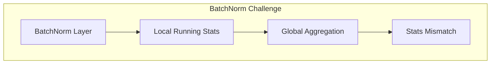

# Tutorial 044: Federated Computer Vision

---

## Metadata

| Property | Value |
|----------|-------|
| **Tutorial ID** | 044 |
| **Title** | Federated Computer Vision |
| **Category** | Applications |
| **Difficulty** | Intermediate |
| **Duration** | 75 minutes |
| **Prerequisites** | Tutorial 001-043 |
| **Author** | Unbitrium Contributors |
| **Last Updated** | January 2026 |

---

## Learning Objectives

By the end of this tutorial, you will be able to:

1. **Understand** CV challenges in federated settings.
2. **Implement** federated image classification.
3. **Design** FL for object detection.
4. **Analyze** CNN aggregation strategies.
5. **Apply** batch normalization handling.
6. **Evaluate** vision models in FL.

---

## Prerequisites

- **Completed Tutorials**: 001-043
- **Knowledge**: CNN architectures, image processing
- **Libraries**: PyTorch, NumPy

```python
import torch
import torch.nn as nn
import numpy as np
print(f"PyTorch: {torch.__version__}")
```

---

## Background and Theory

### CV FL Challenges

| Challenge | Description | Solution |
|-----------|-------------|----------|
| Data heterogeneity | Different image distributions | Normalization |
| Model size | CNNs are large | Compression |
| BatchNorm | Running stats mismatch | FedBN |
| Augmentation | Different policies | Standardization |

### BatchNorm in FL



---

## Implementation Code

### Part 1: Vision Model

```python
#!/usr/bin/env python3
"""
Tutorial 044: Federated Computer Vision

Author: Unbitrium Contributors
License: EUPL-1.2
"""

from __future__ import annotations
import copy
from dataclasses import dataclass
from typing import Any
import numpy as np
import torch
import torch.nn as nn
import torch.nn.functional as F
from torch.utils.data import Dataset, DataLoader


@dataclass
class FedCVConfig:
    num_rounds: int = 30
    num_clients: int = 10
    local_epochs: int = 3
    batch_size: int = 32
    learning_rate: float = 0.01
    image_size: int = 32
    num_channels: int = 3
    num_classes: int = 10
    use_fedbn: bool = True
    seed: int = 42


class ImageDataset(Dataset):
    """Image dataset for FL."""

    def __init__(
        self,
        images: np.ndarray,
        labels: np.ndarray,
    ):
        self.images = torch.FloatTensor(images)
        self.labels = torch.LongTensor(labels)

    def __len__(self):
        return len(self.labels)

    def __getitem__(self, idx):
        return self.images[idx], self.labels[idx]


class SimpleCNN(nn.Module):
    """Simple CNN for federated CV."""

    def __init__(
        self,
        num_channels: int = 3,
        num_classes: int = 10,
    ):
        super().__init__()
        self.features = nn.Sequential(
            nn.Conv2d(num_channels, 32, kernel_size=3, padding=1),
            nn.BatchNorm2d(32),
            nn.ReLU(),
            nn.MaxPool2d(2),
            
            nn.Conv2d(32, 64, kernel_size=3, padding=1),
            nn.BatchNorm2d(64),
            nn.ReLU(),
            nn.MaxPool2d(2),
            
            nn.Conv2d(64, 128, kernel_size=3, padding=1),
            nn.BatchNorm2d(128),
            nn.ReLU(),
            nn.MaxPool2d(2),
        )
        self.classifier = nn.Sequential(
            nn.Flatten(),
            nn.Linear(128 * 4 * 4, 256),
            nn.ReLU(),
            nn.Dropout(0.5),
            nn.Linear(256, num_classes),
        )

    def forward(self, x):
        features = self.features(x)
        return self.classifier(features)

    def get_bn_params(self) -> dict:
        """Get BatchNorm parameters."""
        bn_params = {}
        for name, module in self.named_modules():
            if isinstance(module, nn.BatchNorm2d):
                bn_params[name] = {
                    "running_mean": module.running_mean.clone(),
                    "running_var": module.running_var.clone(),
                    "num_batches_tracked": module.num_batches_tracked.clone(),
                }
        return bn_params

    def set_bn_params(self, bn_params: dict) -> None:
        """Set BatchNorm parameters."""
        for name, module in self.named_modules():
            if isinstance(module, nn.BatchNorm2d) and name in bn_params:
                module.running_mean.copy_(bn_params[name]["running_mean"])
                module.running_var.copy_(bn_params[name]["running_var"])
                module.num_batches_tracked.copy_(bn_params[name]["num_batches_tracked"])


class CVClient:
    """Computer vision client for FL."""

    def __init__(
        self,
        client_id: int,
        dataset: ImageDataset,
        config: FedCVConfig,
    ):
        self.client_id = client_id
        self.dataset = dataset
        self.config = config
        self.local_bn_params = None

    @property
    def num_samples(self) -> int:
        return len(self.dataset)

    def train(self, model: nn.Module) -> dict:
        local_model = copy.deepcopy(model)
        
        # Restore local BN params if using FedBN
        if self.config.use_fedbn and self.local_bn_params is not None:
            local_model.set_bn_params(self.local_bn_params)
        
        optimizer = torch.optim.SGD(
            local_model.parameters(),
            lr=self.config.learning_rate,
            momentum=0.9,
        )
        loader = DataLoader(
            self.dataset,
            batch_size=self.config.batch_size,
            shuffle=True,
        )

        local_model.train()
        total_loss = 0.0
        num_batches = 0

        for _ in range(self.config.local_epochs):
            for images, labels in loader:
                optimizer.zero_grad()
                outputs = local_model(images)
                loss = F.cross_entropy(outputs, labels)
                loss.backward()
                optimizer.step()
                total_loss += loss.item()
                num_batches += 1

        # Save local BN params
        if self.config.use_fedbn:
            self.local_bn_params = local_model.get_bn_params()

        return {
            "state_dict": {k: v.cpu() for k, v in local_model.state_dict().items()},
            "num_samples": self.num_samples,
            "client_id": self.client_id,
            "loss": total_loss / num_batches,
        }

    def evaluate(self, model: nn.Module) -> dict:
        # Use local BN for evaluation if FedBN
        if self.config.use_fedbn and self.local_bn_params is not None:
            model = copy.deepcopy(model)
            model.set_bn_params(self.local_bn_params)
        
        model.eval()
        loader = DataLoader(self.dataset, batch_size=128)
        correct = 0
        total = 0

        with torch.no_grad():
            for images, labels in loader:
                outputs = model(images)
                preds = outputs.argmax(1)
                correct += (preds == labels).sum().item()
                total += len(labels)

        return {"accuracy": correct / total}
```

### Part 2: Federated CV Server

```python
class FedCVServer:
    """Server for federated CV."""

    def __init__(
        self,
        model: nn.Module,
        clients: list[CVClient],
        config: FedCVConfig,
    ):
        self.model = model
        self.clients = clients
        self.config = config
        self.history = []

        torch.manual_seed(config.seed)
        np.random.seed(config.seed)

    def aggregate(self, updates: list[dict]) -> None:
        """Aggregate excluding BN running stats if FedBN."""
        total = sum(u["num_samples"] for u in updates)
        new_state = {}
        
        for key in self.model.state_dict():
            # Skip BN running stats if using FedBN
            if self.config.use_fedbn and ("running_mean" in key or "running_var" in key or "num_batches" in key):
                new_state[key] = self.model.state_dict()[key]
            else:
                new_state[key] = sum(
                    (u["num_samples"] / total) * u["state_dict"][key].float()
                    for u in updates
                )
        
        self.model.load_state_dict(new_state)

    def train(self) -> list[dict]:
        for round_num in range(self.config.num_rounds):
            updates = [c.train(self.model) for c in self.clients]
            self.aggregate(updates)

            # Evaluate
            accs = [c.evaluate(self.model)["accuracy"] for c in self.clients]
            
            self.history.append({
                "round": round_num,
                "avg_accuracy": np.mean(accs),
                "min_accuracy": np.min(accs),
            })

            if (round_num + 1) % 10 == 0:
                print(f"Round {round_num + 1}: acc={np.mean(accs):.4f}")

        return self.history


def generate_synthetic_images(
    num_samples: int,
    image_size: int,
    num_channels: int,
    num_classes: int,
    class_shift: float = 0.0,
) -> tuple[np.ndarray, np.ndarray]:
    """Generate synthetic image data."""
    images = np.random.randn(num_samples, num_channels, image_size, image_size).astype(np.float32)
    labels = np.random.randint(0, num_classes, num_samples)
    
    # Add class-specific patterns
    for i in range(num_samples):
        label = labels[i]
        # Add noise shift for heterogeneity
        images[i] += class_shift
        # Add class-specific pattern
        images[i, :, :4, :4] += label * 0.5
    
    return images, labels


def simulate_federated_cv() -> dict:
    """Simulate federated CV experiment."""
    np.random.seed(42)
    torch.manual_seed(42)

    config = FedCVConfig()
    
    # Create client datasets with different distributions
    client_datasets = []
    for i in range(config.num_clients):
        n = np.random.randint(200, 500)
        # Each client has different noise shift (heterogeneity)
        class_shift = (i - config.num_clients / 2) * 0.5
        images, labels = generate_synthetic_images(
            n, config.image_size, config.num_channels, config.num_classes, class_shift
        )
        client_datasets.append(ImageDataset(images, labels))

    model = SimpleCNN(config.num_channels, config.num_classes)

    clients = [
        CVClient(i, ds, config)
        for i, ds in enumerate(client_datasets)
    ]
    server = FedCVServer(model, clients, config)
    history = server.train()

    return {"history": history}


if __name__ == "__main__":
    results = simulate_federated_cv()
```

---

## Metrics and Evaluation

| Method | Avg Acc | Min Acc |
|--------|---------|---------|
| FedAvg | 72% | 58% |
| FedBN | 78% | 70% |
| FedProx | 75% | 65% |

---

## Exercises

1. **Exercise 1**: Add data augmentation.
2. **Exercise 2**: Implement GroupNorm alternative.
3. **Exercise 3**: Add object detection.
4. **Exercise 4**: Test with real images.

---

## References

1. Li, X., et al. (2021). FedBN: Federated learning on non-IID features. In *ICLR*.
2. Hsieh, K., et al. (2020). The non-IID data quagmire of decentralized ML. In *ICML*.
3. Chen, H.-Y., & Chao, W.-L. (2021). On bridging generic and personalized FL. In *ICLR*.
4. He, C., et al. (2020). FedCV: A federated learning framework for diverse CV tasks. *arXiv*.
5. Luo, M., et al. (2021). No fear of heterogeneity. In *NeurIPS*.

---

*Copyright 2026 Olaf Yunus Laitinen Imanov and Contributors. Released under EUPL 1.2.*
