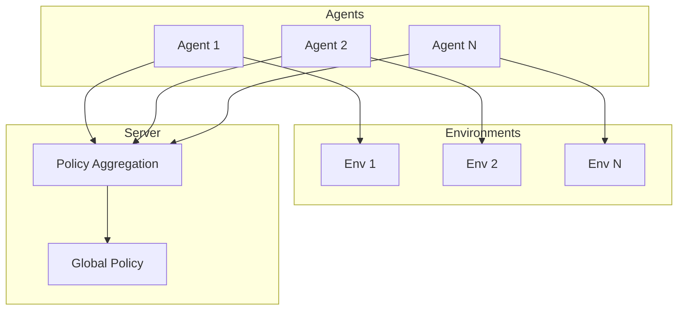

# Tutorial 045: Federated Reinforcement Learning

---

## Metadata

| Property | Value |
|----------|-------|
| **Tutorial ID** | 045 |
| **Title** | Federated Reinforcement Learning |
| **Category** | Applications |
| **Difficulty** | Advanced |
| **Duration** | 90 minutes |
| **Prerequisites** | Tutorial 001-044 |
| **Author** | Unbitrium Contributors |
| **Last Updated** | January 2026 |

---

## Learning Objectives

By the end of this tutorial, you will be able to:

1. **Understand** federated reinforcement learning concepts.
2. **Implement** distributed policy gradient methods.
3. **Design** FL for multi-agent systems.
4. **Analyze** sample efficiency in federated RL.
5. **Apply** FRL to robotics and games.
6. **Evaluate** policy aggregation strategies.

---

## Prerequisites

- **Completed Tutorials**: 001-044
- **Knowledge**: RL basics, policy gradients
- **Libraries**: PyTorch, NumPy

```python
import torch
import torch.nn as nn
import numpy as np
print(f"PyTorch: {torch.__version__}")
```

---

## Background and Theory

### FRL Challenges

| Challenge | Description | Solution |
|-----------|-------------|----------|
| Environment heterogeneity | Different state spaces | Transfer learning |
| Reward shaping | Different reward functions | Meta-learning |
| Sample efficiency | Many interactions needed | Experience sharing |
| Policy divergence | Different optimal policies | Personalization |

### FRL Architecture



---

## Implementation Code

### Part 1: RL Components

```python
#!/usr/bin/env python3
"""
Tutorial 045: Federated Reinforcement Learning

Author: Unbitrium Contributors
License: EUPL-1.2
"""

from __future__ import annotations
import copy
from dataclasses import dataclass
from typing import Any
import numpy as np
import torch
import torch.nn as nn
import torch.nn.functional as F
from torch.distributions import Categorical


@dataclass
class FRLConfig:
    num_rounds: int = 30
    num_agents: int = 5
    episodes_per_round: int = 10
    max_steps: int = 200
    gamma: float = 0.99
    learning_rate: float = 0.001
    state_dim: int = 4
    action_dim: int = 2
    seed: int = 42


class SimpleEnvironment:
    """Simple environment for RL."""

    def __init__(
        self,
        state_dim: int = 4,
        action_dim: int = 2,
        difficulty: float = 1.0,
    ):
        self.state_dim = state_dim
        self.action_dim = action_dim
        self.difficulty = difficulty
        self.state = None
        self.steps = 0

    def reset(self) -> np.ndarray:
        """Reset environment."""
        self.state = np.random.randn(self.state_dim).astype(np.float32)
        self.steps = 0
        return self.state

    def step(self, action: int) -> tuple[np.ndarray, float, bool]:
        """Take action and return (state, reward, done)."""
        self.steps += 1

        # Simple dynamics
        direction = 1 if action == 1 else -1
        self.state = self.state + direction * 0.1 * self.difficulty

        # Reward based on state norm
        reward = -np.abs(self.state).mean()

        # Done if state too large or steps exceeded
        done = np.abs(self.state).max() > 5 or self.steps >= 200

        return self.state.copy(), reward, done


class PolicyNetwork(nn.Module):
    """Simple policy network."""

    def __init__(self, state_dim: int, action_dim: int, hidden_dim: int = 64):
        super().__init__()
        self.net = nn.Sequential(
            nn.Linear(state_dim, hidden_dim),
            nn.ReLU(),
            nn.Linear(hidden_dim, hidden_dim),
            nn.ReLU(),
            nn.Linear(hidden_dim, action_dim),
        )

    def forward(self, state):
        return F.softmax(self.net(state), dim=-1)

    def select_action(self, state: np.ndarray) -> tuple[int, torch.Tensor]:
        """Select action from policy."""
        state_t = torch.FloatTensor(state)
        probs = self.forward(state_t)
        dist = Categorical(probs)
        action = dist.sample()
        log_prob = dist.log_prob(action)
        return action.item(), log_prob


class FRLAgent:
    """Federated RL agent."""

    def __init__(
        self,
        agent_id: int,
        env: SimpleEnvironment,
        config: FRLConfig,
    ):
        self.agent_id = agent_id
        self.env = env
        self.config = config

    def collect_trajectories(
        self,
        policy: PolicyNetwork,
        num_episodes: int,
    ) -> list[dict]:
        """Collect trajectories using policy."""
        trajectories = []

        for _ in range(num_episodes):
            states = []
            actions = []
            rewards = []
            log_probs = []

            state = self.env.reset()
            done = False

            while not done:
                action, log_prob = policy.select_action(state)
                next_state, reward, done = self.env.step(action)

                states.append(state)
                actions.append(action)
                rewards.append(reward)
                log_probs.append(log_prob)

                state = next_state

            trajectories.append({
                "states": states,
                "actions": actions,
                "rewards": rewards,
                "log_probs": log_probs,
            })

        return trajectories

    def compute_returns(self, rewards: list[float]) -> list[float]:
        """Compute discounted returns."""
        returns = []
        R = 0
        for r in reversed(rewards):
            R = r + self.config.gamma * R
            returns.insert(0, R)
        return returns

    def train(self, policy: PolicyNetwork) -> dict:
        """Train policy locally."""
        local_policy = copy.deepcopy(policy)
        optimizer = torch.optim.Adam(
            local_policy.parameters(),
            lr=self.config.learning_rate,
        )

        # Collect trajectories
        trajectories = self.collect_trajectories(
            local_policy,
            self.config.episodes_per_round,
        )

        # Compute policy gradient
        total_loss = 0.0
        total_reward = 0.0

        for traj in trajectories:
            returns = self.compute_returns(traj["rewards"])
            returns = torch.FloatTensor(returns)
            returns = (returns - returns.mean()) / (returns.std() + 1e-8)

            log_probs = torch.stack(traj["log_probs"])
            loss = -(log_probs * returns).mean()

            optimizer.zero_grad()
            loss.backward()
            optimizer.step()

            total_loss += loss.item()
            total_reward += sum(traj["rewards"])

        return {
            "state_dict": {k: v.cpu() for k, v in local_policy.state_dict().items()},
            "agent_id": self.agent_id,
            "avg_reward": total_reward / len(trajectories),
            "loss": total_loss / len(trajectories),
        }
```

### Part 2: FRL Server

```python
class FRLServer:
    """Server for federated RL."""

    def __init__(
        self,
        policy: PolicyNetwork,
        agents: list[FRLAgent],
        config: FRLConfig,
    ):
        self.policy = policy
        self.agents = agents
        self.config = config
        self.history = []

        torch.manual_seed(config.seed)
        np.random.seed(config.seed)

    def aggregate(self, updates: list[dict]) -> None:
        """Aggregate policy updates."""
        n = len(updates)
        new_state = {}

        for key in self.policy.state_dict():
            new_state[key] = sum(
                u["state_dict"][key].float() / n
                for u in updates
            )

        self.policy.load_state_dict(new_state)

    def train(self) -> list[dict]:
        for round_num in range(self.config.num_rounds):
            updates = [a.train(self.policy) for a in self.agents]
            self.aggregate(updates)

            avg_reward = np.mean([u["avg_reward"] for u in updates])

            self.history.append({
                "round": round_num,
                "avg_reward": avg_reward,
            })

            if (round_num + 1) % 10 == 0:
                print(f"Round {round_num + 1}: reward={avg_reward:.4f}")

        return self.history


def simulate_federated_rl() -> dict:
    """Simulate federated RL experiment."""
    np.random.seed(42)
    torch.manual_seed(42)

    config = FRLConfig()

    # Create agents with different environments
    agents = []
    for i in range(config.num_agents):
        # Different difficulty levels
        env = SimpleEnvironment(
            config.state_dim,
            config.action_dim,
            difficulty=0.5 + i * 0.2,
        )
        agents.append(FRLAgent(i, env, config))

    policy = PolicyNetwork(config.state_dim, config.action_dim)
    server = FRLServer(policy, agents, config)
    history = server.train()

    return {"history": history}


if __name__ == "__main__":
    results = simulate_federated_rl()
```

---

## Metrics and Evaluation

| Agent | Env Difficulty | Avg Reward |
|-------|---------------|------------|
| 0 | 0.5 | -45 |
| 1 | 0.7 | -52 |
| 2 | 0.9 | -60 |

---

## Exercises

1. **Exercise 1**: Add value network (A2C).
2. **Exercise 2**: Implement experience replay sharing.
3. **Exercise 3**: Add multi-agent coordination.
4. **Exercise 4**: Test with gym environments.

---

## References

1. Zhuo, H. H., et al. (2019). Federated reinforcement learning. *arXiv*.
2. Khodadadian, S., et al. (2022). Federated reinforcement learning. In *ICML*.
3. Qi, J., et al. (2021). Federated deep reinforcement learning for autonomous driving. *IEEE TITS*.
4. Liu, B., et al. (2019). Lifelong federated reinforcement learning. *arXiv*.
5. Nadiger, C., et al. (2019). Federated reinforcement learning for UAVs. In *VTC*.

---

*Copyright 2026 Olaf Yunus Laitinen Imanov and Contributors. Released under EUPL 1.2.*
