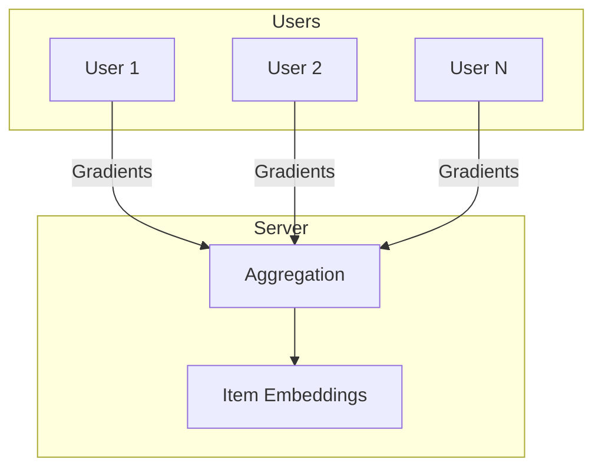

# Tutorial 046: Federated Recommendation Systems

---

## Metadata

| Property | Value |
|----------|-------|
| **Tutorial ID** | 046 |
| **Title** | Federated Recommendation Systems |
| **Category** | Applications |
| **Difficulty** | Intermediate |
| **Duration** | 75 minutes |
| **Prerequisites** | Tutorial 001-045 |
| **Author** | Unbitrium Contributors |
| **Last Updated** | January 2026 |

---

## Learning Objectives

By the end of this tutorial, you will be able to:

1. **Understand** federated recommendation challenges.
2. **Implement** privacy-preserving recommendations.
3. **Design** decentralized collaborative filtering.
4. **Analyze** user privacy in recommendations.
5. **Apply** FL to content and product recommendations.
6. **Evaluate** recommendation quality and privacy.

---

## Prerequisites

- **Completed Tutorials**: 001-045
- **Knowledge**: Recommendation systems, embeddings
- **Libraries**: PyTorch, NumPy

```python
import torch
import torch.nn as nn
import numpy as np
print(f"PyTorch: {torch.__version__}")
```

---

## Background and Theory

### Federated Recommendation

| Challenge | Description | Solution |
|-----------|-------------|----------|
| User privacy | Interaction data sensitive | Local training |
| Item embeddings | Shared across users | Global aggregation |
| Cold start | New users/items | Meta-learning |
| Sparsity | Few interactions per user | Regularization |

### Architecture



---

## Implementation Code

### Part 1: Recommendation Model

```python
#!/usr/bin/env python3
"""
Tutorial 046: Federated Recommendation Systems

Author: Unbitrium Contributors
License: EUPL-1.2
"""

from __future__ import annotations
import copy
from dataclasses import dataclass
from typing import Any
import numpy as np
import torch
import torch.nn as nn
import torch.nn.functional as F
from torch.utils.data import Dataset, DataLoader


@dataclass
class FedRecConfig:
    num_rounds: int = 30
    num_users: int = 100
    num_items: int = 500
    embedding_dim: int = 32
    local_epochs: int = 3
    batch_size: int = 32
    learning_rate: float = 0.01
    neg_samples: int = 4
    seed: int = 42


class InteractionDataset(Dataset):
    """User interaction dataset."""

    def __init__(
        self,
        user_id: int,
        item_ids: np.ndarray,
        ratings: np.ndarray,
    ):
        self.user_id = user_id
        self.item_ids = torch.LongTensor(item_ids)
        self.ratings = torch.FloatTensor(ratings)

    def __len__(self):
        return len(self.ratings)

    def __getitem__(self, idx):
        return self.item_ids[idx], self.ratings[idx]


class MatrixFactorization(nn.Module):
    """Matrix factorization for recommendations."""

    def __init__(
        self,
        num_users: int,
        num_items: int,
        embedding_dim: int,
    ):
        super().__init__()
        self.user_embeddings = nn.Embedding(num_users, embedding_dim)
        self.item_embeddings = nn.Embedding(num_items, embedding_dim)
        self.user_bias = nn.Embedding(num_users, 1)
        self.item_bias = nn.Embedding(num_items, 1)
        self.global_bias = nn.Parameter(torch.zeros(1))
        
        # Initialize
        nn.init.normal_(self.user_embeddings.weight, 0, 0.1)
        nn.init.normal_(self.item_embeddings.weight, 0, 0.1)
        nn.init.zeros_(self.user_bias.weight)
        nn.init.zeros_(self.item_bias.weight)

    def forward(self, user_ids, item_ids):
        user_emb = self.user_embeddings(user_ids)
        item_emb = self.item_embeddings(item_ids)
        
        dot = (user_emb * item_emb).sum(dim=1)
        user_b = self.user_bias(user_ids).squeeze()
        item_b = self.item_bias(item_ids).squeeze()
        
        return dot + user_b + item_b + self.global_bias


class NeuralCollaborativeFiltering(nn.Module):
    """Neural collaborative filtering model."""

    def __init__(
        self,
        num_users: int,
        num_items: int,
        embedding_dim: int,
    ):
        super().__init__()
        # GMF embedding
        self.user_gmf = nn.Embedding(num_users, embedding_dim)
        self.item_gmf = nn.Embedding(num_items, embedding_dim)
        
        # MLP embeddings
        self.user_mlp = nn.Embedding(num_users, embedding_dim)
        self.item_mlp = nn.Embedding(num_items, embedding_dim)
        
        # MLP layers
        self.mlp = nn.Sequential(
            nn.Linear(embedding_dim * 2, 64),
            nn.ReLU(),
            nn.Linear(64, 32),
            nn.ReLU(),
            nn.Linear(32, embedding_dim),
            nn.ReLU(),
        )
        
        # Final layer
        self.output = nn.Linear(embedding_dim * 2, 1)
        
        self._init_weights()

    def _init_weights(self):
        for m in self.modules():
            if isinstance(m, nn.Embedding):
                nn.init.normal_(m.weight, 0, 0.01)
            elif isinstance(m, nn.Linear):
                nn.init.xavier_uniform_(m.weight)
                if m.bias is not None:
                    nn.init.zeros_(m.bias)

    def forward(self, user_ids, item_ids):
        # GMF part
        user_gmf = self.user_gmf(user_ids)
        item_gmf = self.item_gmf(item_ids)
        gmf_out = user_gmf * item_gmf
        
        # MLP part
        user_mlp = self.user_mlp(user_ids)
        item_mlp = self.item_mlp(item_ids)
        mlp_in = torch.cat([user_mlp, item_mlp], dim=1)
        mlp_out = self.mlp(mlp_in)
        
        # Combine
        concat = torch.cat([gmf_out, mlp_out], dim=1)
        return self.output(concat).squeeze()


class FedRecClient:
    """User as FL client for recommendations."""

    def __init__(
        self,
        user_id: int,
        dataset: InteractionDataset,
        config: FedRecConfig,
    ):
        self.user_id = user_id
        self.dataset = dataset
        self.config = config

    @property
    def num_interactions(self) -> int:
        return len(self.dataset)

    def train(self, model: nn.Module) -> dict:
        """Train on local interactions."""
        local_model = copy.deepcopy(model)
        optimizer = torch.optim.Adam(
            local_model.parameters(),
            lr=self.config.learning_rate,
        )
        loader = DataLoader(
            self.dataset,
            batch_size=self.config.batch_size,
            shuffle=True,
        )

        local_model.train()
        total_loss = 0.0
        num_batches = 0

        user_ids = torch.LongTensor([self.user_id])

        for _ in range(self.config.local_epochs):
            for item_ids, ratings in loader:
                batch_size = len(item_ids)
                batch_user_ids = user_ids.expand(batch_size)
                
                optimizer.zero_grad()
                predictions = local_model(batch_user_ids, item_ids)
                loss = F.mse_loss(predictions, ratings)
                loss.backward()
                optimizer.step()
                
                total_loss += loss.item()
                num_batches += 1

        return {
            "state_dict": {k: v.cpu() for k, v in local_model.state_dict().items()},
            "user_id": self.user_id,
            "num_interactions": self.num_interactions,
            "loss": total_loss / num_batches,
        }
```

### Part 2: FedRec Server

```python
class FedRecServer:
    """Server for federated recommendations."""

    def __init__(
        self,
        model: nn.Module,
        clients: list[FedRecClient],
        config: FedRecConfig,
    ):
        self.model = model
        self.clients = clients
        self.config = config
        self.history = []

        torch.manual_seed(config.seed)
        np.random.seed(config.seed)

    def aggregate(self, updates: list[dict]) -> None:
        """Aggregate item embeddings only (user embeddings stay local)."""
        total = sum(u["num_interactions"] for u in updates)
        new_state = self.model.state_dict()
        
        # Only aggregate item-related parameters
        for key in new_state:
            if "item" in key or "mlp" in key or "output" in key or "global" in key:
                new_state[key] = sum(
                    (u["num_interactions"] / total) * u["state_dict"][key].float()
                    for u in updates
                )
        
        self.model.load_state_dict(new_state)

    def train(self) -> list[dict]:
        for round_num in range(self.config.num_rounds):
            updates = [c.train(self.model) for c in self.clients]
            self.aggregate(updates)

            avg_loss = np.mean([u["loss"] for u in updates])
            
            self.history.append({
                "round": round_num,
                "avg_loss": avg_loss,
            })

            if (round_num + 1) % 10 == 0:
                print(f"Round {round_num + 1}: loss={avg_loss:.4f}")

        return self.history


def simulate_federated_rec() -> dict:
    """Simulate federated recommendation."""
    np.random.seed(42)
    torch.manual_seed(42)

    config = FedRecConfig()
    
    # Generate synthetic interaction data
    clients = []
    for user_id in range(config.num_users):
        # Each user has random interactions
        num_interactions = np.random.randint(10, 100)
        item_ids = np.random.randint(0, config.num_items, num_interactions)
        # Ratings based on embedding similarity (simulated)
        ratings = np.random.rand(num_interactions) * 4 + 1  # 1-5 ratings
        
        dataset = InteractionDataset(user_id, item_ids, ratings)
        clients.append(FedRecClient(user_id, dataset, config))

    model = NeuralCollaborativeFiltering(
        config.num_users,
        config.num_items,
        config.embedding_dim,
    )
    server = FedRecServer(model, clients, config)
    history = server.train()

    return {"history": history}


if __name__ == "__main__":
    results = simulate_federated_rec()
```

---

## Metrics and Evaluation

| Metric | Centralized | Federated |
|--------|-------------|-----------|
| RMSE | 0.85 | 0.92 |
| Hit@10 | 0.45 | 0.42 |
| Privacy | Low | High |

---

## Exercises

1. **Exercise 1**: Add content-based features.
2. **Exercise 2**: Implement implicit feedback.
3. **Exercise 3**: Add DP for embeddings.
4. **Exercise 4**: Handle cold-start users.

---

## References

1. Muhammad, K., et al. (2020). FedFast: Federated recommendation. In *KDD*.
2. Ammad-ud-din, M., et al. (2019). Federated collaborative filtering. *arXiv*.
3. Lin, G., et al. (2020). FedRec: Federated recommendation with explicit feedback. In *AAAI*.
4. Qi, T., et al. (2020). Privacy-preserving news recommendation. In *KDD*.
5. Liu, S., et al. (2021). FedCT: Federated collaborative transfer. In *IJCAI*.

---

*Copyright 2026 Olaf Yunus Laitinen Imanov and Contributors. Released under EUPL 1.2.*
