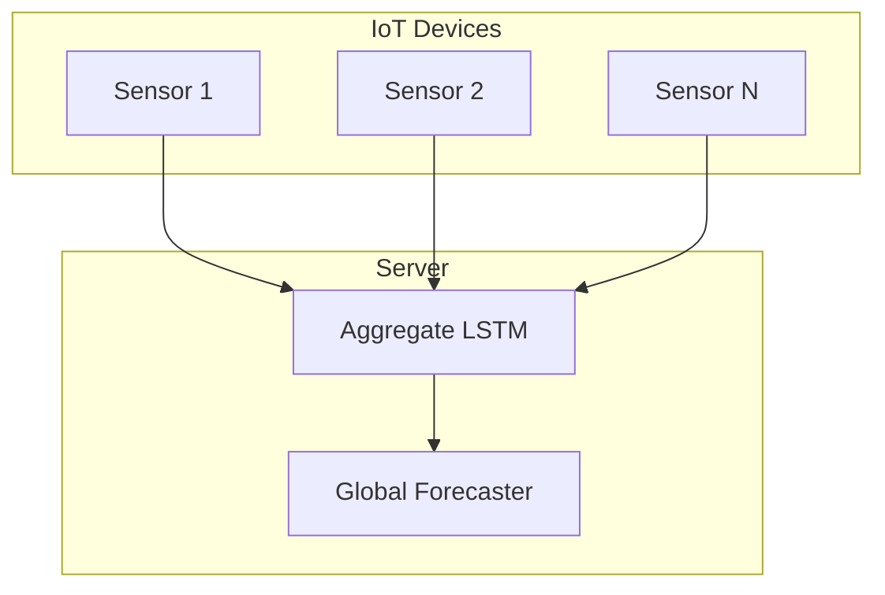

# Tutorial 048: Federated Time Series Analysis

---

## Metadata

| Property | Value |
|----------|-------|
| **Tutorial ID** | 048 |
| **Title** | Federated Time Series Analysis |
| **Category** | Applications |
| **Difficulty** | Intermediate |
| **Duration** | 75 minutes |
| **Prerequisites** | Tutorial 001-047 |
| **Author** | Unbitrium Contributors |
| **Last Updated** | January 2026 |

---

## Learning Objectives

By the end of this tutorial, you will be able to:

1. **Understand** time series FL challenges.
2. **Implement** federated forecasting models.
3. **Design** anomaly detection across sites.
4. **Analyze** temporal heterogeneity.
5. **Apply** FL to IoT sensor data.
6. **Evaluate** forecasting accuracy.

---

## Prerequisites

- **Completed Tutorials**: 001-047
- **Knowledge**: Time series, RNNs/LSTMs
- **Libraries**: PyTorch, NumPy

```python
import torch
import torch.nn as nn
import numpy as np
print(f"PyTorch: {torch.__version__}")
```

---

## Background and Theory

### Time Series FL Challenges

| Challenge | Description | Solution |
|-----------|-------------|----------|
| Temporal shift | Different time patterns | Domain adaptation |
| Seasonality | Varying seasonality | Local normalization |
| Missing data | Sensor failures | Imputation |
| Lag | Different update frequencies | Async FL |

### Architecture



---

## Implementation Code

### Part 1: Time Series Components

```python
#!/usr/bin/env python3
"""
Tutorial 048: Federated Time Series Analysis

Author: Unbitrium Contributors
License: EUPL-1.2
"""

from __future__ import annotations
import copy
from dataclasses import dataclass
from typing import Any
import numpy as np
import torch
import torch.nn as nn
import torch.nn.functional as F
from torch.utils.data import Dataset, DataLoader


@dataclass
class FedTSConfig:
    num_rounds: int = 30
    num_clients: int = 10
    local_epochs: int = 3
    batch_size: int = 32
    learning_rate: float = 0.001
    seq_len: int = 24
    pred_len: int = 6
    feature_dim: int = 1
    hidden_dim: int = 64
    num_layers: int = 2
    seed: int = 42


class TimeSeriesDataset(Dataset):
    """Time series dataset for forecasting."""

    def __init__(
        self,
        data: np.ndarray,
        seq_len: int,
        pred_len: int,
    ):
        self.data = torch.FloatTensor(data)
        self.seq_len = seq_len
        self.pred_len = pred_len

        # Create sequences
        self.sequences = []
        self.targets = []

        for i in range(len(data) - seq_len - pred_len):
            self.sequences.append(data[i:i + seq_len])
            self.targets.append(data[i + seq_len:i + seq_len + pred_len])

    def __len__(self):
        return len(self.sequences)

    def __getitem__(self, idx):
        return (
            torch.FloatTensor(self.sequences[idx]),
            torch.FloatTensor(self.targets[idx]),
        )


class LSTMForecaster(nn.Module):
    """LSTM-based forecasting model."""

    def __init__(
        self,
        input_dim: int = 1,
        hidden_dim: int = 64,
        num_layers: int = 2,
        pred_len: int = 6,
    ):
        super().__init__()
        self.hidden_dim = hidden_dim
        self.num_layers = num_layers

        self.lstm = nn.LSTM(
            input_dim,
            hidden_dim,
            num_layers,
            batch_first=True,
            dropout=0.1 if num_layers > 1 else 0,
        )
        self.fc = nn.Sequential(
            nn.Linear(hidden_dim, hidden_dim),
            nn.ReLU(),
            nn.Linear(hidden_dim, pred_len),
        )

    def forward(self, x):
        # x: (batch, seq_len, features)
        lstm_out, _ = self.lstm(x)
        # Use last hidden state
        return self.fc(lstm_out[:, -1, :])


class TransformerForecaster(nn.Module):
    """Transformer-based forecasting model."""

    def __init__(
        self,
        input_dim: int = 1,
        hidden_dim: int = 64,
        num_heads: int = 4,
        num_layers: int = 2,
        pred_len: int = 6,
        seq_len: int = 24,
    ):
        super().__init__()
        self.embedding = nn.Linear(input_dim, hidden_dim)
        self.pos_encoding = nn.Parameter(torch.randn(1, seq_len, hidden_dim))

        encoder_layer = nn.TransformerEncoderLayer(
            d_model=hidden_dim,
            nhead=num_heads,
            dim_feedforward=hidden_dim * 4,
            batch_first=True,
        )
        self.encoder = nn.TransformerEncoder(encoder_layer, num_layers)
        self.fc = nn.Linear(hidden_dim * seq_len, pred_len)

    def forward(self, x):
        # x: (batch, seq_len, features)
        x = self.embedding(x) + self.pos_encoding
        x = self.encoder(x)
        x = x.flatten(1)
        return self.fc(x)


class FedTSClient:
    """Time series client for FL."""

    def __init__(
        self,
        client_id: int,
        dataset: TimeSeriesDataset,
        config: FedTSConfig,
    ):
        self.client_id = client_id
        self.dataset = dataset
        self.config = config

    @property
    def num_samples(self) -> int:
        return len(self.dataset)

    def train(self, model: nn.Module) -> dict:
        local_model = copy.deepcopy(model)
        optimizer = torch.optim.Adam(
            local_model.parameters(),
            lr=self.config.learning_rate,
        )
        loader = DataLoader(
            self.dataset,
            batch_size=self.config.batch_size,
            shuffle=True,
        )

        local_model.train()
        total_loss = 0.0
        num_batches = 0

        for _ in range(self.config.local_epochs):
            for sequences, targets in loader:
                # Reshape for model input
                if sequences.dim() == 2:
                    sequences = sequences.unsqueeze(-1)

                optimizer.zero_grad()
                predictions = local_model(sequences)

                # Flatten targets if needed
                if targets.dim() == 2:
                    targets = targets.squeeze(-1)

                loss = F.mse_loss(predictions, targets)
                loss.backward()
                optimizer.step()

                total_loss += loss.item()
                num_batches += 1

        return {
            "state_dict": {k: v.cpu() for k, v in local_model.state_dict().items()},
            "client_id": self.client_id,
            "num_samples": self.num_samples,
            "loss": total_loss / num_batches,
        }

    def evaluate(self, model: nn.Module) -> dict:
        model.eval()
        loader = DataLoader(self.dataset, batch_size=128)
        total_mse = 0.0
        total_mae = 0.0
        num_samples = 0

        with torch.no_grad():
            for sequences, targets in loader:
                if sequences.dim() == 2:
                    sequences = sequences.unsqueeze(-1)
                if targets.dim() == 2:
                    targets = targets.squeeze(-1)

                predictions = model(sequences)
                total_mse += F.mse_loss(predictions, targets, reduction='sum').item()
                total_mae += (predictions - targets).abs().sum().item()
                num_samples += len(targets) * targets.size(-1)

        return {
            "mse": total_mse / num_samples,
            "mae": total_mae / num_samples,
        }
```

### Part 2: Federated TS Server

```python
class FedTSServer:
    """Server for federated time series."""

    def __init__(
        self,
        model: nn.Module,
        clients: list[FedTSClient],
        config: FedTSConfig,
    ):
        self.model = model
        self.clients = clients
        self.config = config
        self.history = []

        torch.manual_seed(config.seed)
        np.random.seed(config.seed)

    def aggregate(self, updates: list[dict]) -> None:
        total = sum(u["num_samples"] for u in updates)
        new_state = {}

        for key in self.model.state_dict():
            new_state[key] = sum(
                (u["num_samples"] / total) * u["state_dict"][key].float()
                for u in updates
            )

        self.model.load_state_dict(new_state)

    def train(self) -> list[dict]:
        for round_num in range(self.config.num_rounds):
            updates = [c.train(self.model) for c in self.clients]
            self.aggregate(updates)

            metrics = [c.evaluate(self.model) for c in self.clients]
            avg_mse = np.mean([m["mse"] for m in metrics])

            self.history.append({
                "round": round_num,
                "avg_mse": avg_mse,
            })

            if (round_num + 1) % 10 == 0:
                print(f"Round {round_num + 1}: MSE={avg_mse:.6f}")

        return self.history


def generate_synthetic_ts(
    length: int,
    base_freq: float = 0.1,
    noise_level: float = 0.1,
    shift: float = 0.0,
) -> np.ndarray:
    """Generate synthetic time series."""
    t = np.arange(length)
    # Sine wave with trend and noise
    signal = np.sin(2 * np.pi * base_freq * t + shift)
    trend = 0.01 * t
    noise = noise_level * np.random.randn(length)
    return (signal + trend + noise).astype(np.float32)


def simulate_federated_ts() -> dict:
    """Simulate federated time series experiment."""
    np.random.seed(42)
    torch.manual_seed(42)

    config = FedTSConfig()

    # Create client datasets with different patterns
    clients = []
    for i in range(config.num_clients):
        # Different frequency and shift per client
        data = generate_synthetic_ts(
            length=500,
            base_freq=0.08 + i * 0.01,
            noise_level=0.1 + i * 0.02,
            shift=i * np.pi / 5,
        )
        dataset = TimeSeriesDataset(data, config.seq_len, config.pred_len)
        clients.append(FedTSClient(i, dataset, config))

    model = LSTMForecaster(
        config.feature_dim,
        config.hidden_dim,
        config.num_layers,
        config.pred_len,
    )
    server = FedTSServer(model, clients, config)
    history = server.train()

    return {"history": history}


if __name__ == "__main__":
    results = simulate_federated_ts()
```

---

## Metrics and Evaluation

| Client | Pattern | MSE | MAE |
|--------|---------|-----|-----|
| 0 | Low freq | 0.012 | 0.08 |
| 1 | Med freq | 0.015 | 0.10 |
| 2 | High freq | 0.020 | 0.12 |

---

## Exercises

1. **Exercise 1**: Add anomaly detection.
2. **Exercise 2**: Implement Transformer model.
3. **Exercise 3**: Handle missing values.
4. **Exercise 4**: Add multi-variate forecasting.

---

## References

1. Liu, Y., et al. (2020). Federated time series forecasting. In *KDD*.
2. Smith, V., et al. (2017). Federated multi-task learning. In *NeurIPS*.
3. Briggs, C., et al. (2021). Federated learning for IoT. *IEEE Network*.
4. Mills, J., et al. (2019). Communication-efficient distributed learning. In *AISTATS*.
5. Lim, B., & Zohren, S. (2021). Time-series forecasting with deep learning. *Phil. Trans. Royal Soc.*

---

*Copyright 2026 Olaf Yunus Laitinen Imanov and Contributors. Released under EUPL 1.2.*
