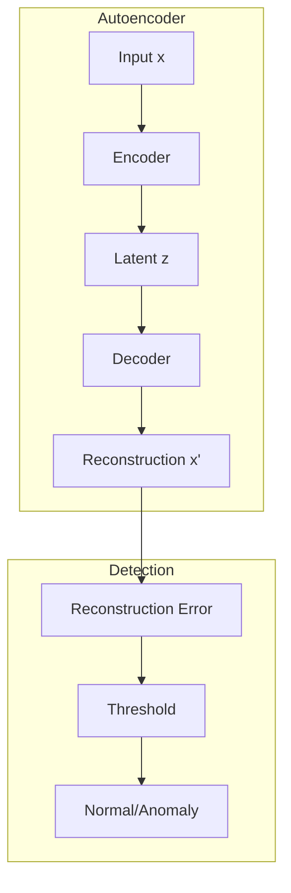

# Tutorial 049: Federated Anomaly Detection

---

## Metadata

| Property | Value |
|----------|-------|
| **Tutorial ID** | 049 |
| **Title** | Federated Anomaly Detection |
| **Category** | Applications |
| **Difficulty** | Intermediate |
| **Duration** | 75 minutes |
| **Prerequisites** | Tutorial 001-048 |
| **Author** | Unbitrium Contributors |
| **Last Updated** | January 2026 |

---

## Learning Objectives

By the end of this tutorial, you will be able to:

1. **Understand** anomaly detection in FL.
2. **Implement** distributed autoencoder-based detection.
3. **Design** one-class classification for FL.
4. **Analyze** threshold selection strategies.
5. **Apply** FL to network intrusion detection.
6. **Evaluate** detection accuracy and false positives.

---

## Prerequisites

- **Completed Tutorials**: 001-048
- **Knowledge**: Anomaly detection, autoencoders
- **Libraries**: PyTorch, NumPy

```python
import torch
import torch.nn as nn
import numpy as np
print(f"PyTorch: {torch.__version__}")
```

---

## Background and Theory

### Federated Anomaly Detection Challenges

| Challenge | Description | Solution |
|-----------|-------------|----------|
| Label scarcity | Few labeled anomalies | Unsupervised methods |
| Distribution shift | Different normal patterns | Local normalization |
| Threshold selection | Varying thresholds | Adaptive thresholds |
| Class imbalance | Anomalies are rare | Reconstruction error |

### Autoencoder-Based Detection



---

## Implementation Code

### Part 1: Anomaly Detection Models

```python
#!/usr/bin/env python3
"""
Tutorial 049: Federated Anomaly Detection

Author: Unbitrium Contributors
License: EUPL-1.2
"""

from __future__ import annotations
import copy
from dataclasses import dataclass
from typing import Any
import numpy as np
import torch
import torch.nn as nn
import torch.nn.functional as F
from torch.utils.data import Dataset, DataLoader


@dataclass
class FedADConfig:
    num_rounds: int = 30
    num_clients: int = 10
    local_epochs: int = 5
    batch_size: int = 64
    learning_rate: float = 0.001
    input_dim: int = 30
    latent_dim: int = 10
    threshold_percentile: float = 95.0
    seed: int = 42


class AnomalyDataset(Dataset):
    """Dataset for anomaly detection."""

    def __init__(
        self,
        features: np.ndarray,
        labels: np.ndarray = None,
    ):
        self.features = torch.FloatTensor(features)
        self.labels = torch.LongTensor(labels) if labels is not None else None

    def __len__(self):
        return len(self.features)

    def __getitem__(self, idx):
        if self.labels is not None:
            return self.features[idx], self.labels[idx]
        return self.features[idx], torch.tensor(0)


class Autoencoder(nn.Module):
    """Autoencoder for anomaly detection."""

    def __init__(
        self,
        input_dim: int,
        latent_dim: int = 10,
    ):
        super().__init__()
        self.encoder = nn.Sequential(
            nn.Linear(input_dim, 64),
            nn.ReLU(),
            nn.Linear(64, 32),
            nn.ReLU(),
            nn.Linear(32, latent_dim),
        )
        self.decoder = nn.Sequential(
            nn.Linear(latent_dim, 32),
            nn.ReLU(),
            nn.Linear(32, 64),
            nn.ReLU(),
            nn.Linear(64, input_dim),
        )

    def forward(self, x):
        z = self.encoder(x)
        return self.decoder(z)

    def encode(self, x):
        return self.encoder(x)

    def reconstruction_error(self, x):
        """Compute reconstruction error."""
        x_recon = self.forward(x)
        return ((x - x_recon) ** 2).mean(dim=1)


class VariationalAutoencoder(nn.Module):
    """VAE for anomaly detection."""

    def __init__(
        self,
        input_dim: int,
        latent_dim: int = 10,
    ):
        super().__init__()
        self.encoder = nn.Sequential(
            nn.Linear(input_dim, 64),
            nn.ReLU(),
            nn.Linear(64, 32),
            nn.ReLU(),
        )
        self.fc_mu = nn.Linear(32, latent_dim)
        self.fc_var = nn.Linear(32, latent_dim)
        
        self.decoder = nn.Sequential(
            nn.Linear(latent_dim, 32),
            nn.ReLU(),
            nn.Linear(32, 64),
            nn.ReLU(),
            nn.Linear(64, input_dim),
        )

    def encode(self, x):
        h = self.encoder(x)
        return self.fc_mu(h), self.fc_var(h)

    def reparameterize(self, mu, log_var):
        std = torch.exp(0.5 * log_var)
        eps = torch.randn_like(std)
        return mu + eps * std

    def forward(self, x):
        mu, log_var = self.encode(x)
        z = self.reparameterize(mu, log_var)
        return self.decoder(z), mu, log_var

    def reconstruction_error(self, x):
        x_recon, _, _ = self.forward(x)
        return ((x - x_recon) ** 2).mean(dim=1)


class FedADClient:
    """Client for federated anomaly detection."""

    def __init__(
        self,
        client_id: int,
        dataset: AnomalyDataset,
        config: FedADConfig,
    ):
        self.client_id = client_id
        self.dataset = dataset
        self.config = config
        self.threshold = None

    @property
    def num_samples(self) -> int:
        return len(self.dataset)

    def train(self, model: nn.Module) -> dict:
        local_model = copy.deepcopy(model)
        optimizer = torch.optim.Adam(
            local_model.parameters(),
            lr=self.config.learning_rate,
        )
        loader = DataLoader(
            self.dataset,
            batch_size=self.config.batch_size,
            shuffle=True,
        )

        local_model.train()
        total_loss = 0.0
        num_batches = 0

        for _ in range(self.config.local_epochs):
            for features, _ in loader:
                optimizer.zero_grad()
                recon = local_model(features)
                loss = F.mse_loss(recon, features)
                loss.backward()
                optimizer.step()
                total_loss += loss.item()
                num_batches += 1

        # Compute local threshold
        self._compute_threshold(local_model)

        return {
            "state_dict": {k: v.cpu() for k, v in local_model.state_dict().items()},
            "client_id": self.client_id,
            "num_samples": self.num_samples,
            "loss": total_loss / num_batches,
            "threshold": self.threshold,
        }

    def _compute_threshold(self, model: nn.Module):
        """Compute anomaly threshold from training data."""
        model.eval()
        loader = DataLoader(self.dataset, batch_size=256)
        errors = []

        with torch.no_grad():
            for features, _ in loader:
                error = model.reconstruction_error(features)
                errors.extend(error.tolist())

        self.threshold = np.percentile(errors, self.config.threshold_percentile)

    def evaluate(self, model: nn.Module) -> dict:
        """Evaluate anomaly detection."""
        model.eval()
        loader = DataLoader(self.dataset, batch_size=256)
        
        all_errors = []
        all_labels = []

        with torch.no_grad():
            for features, labels in loader:
                error = model.reconstruction_error(features)
                all_errors.extend(error.tolist())
                all_labels.extend(labels.tolist())

        errors = np.array(all_errors)
        labels = np.array(all_labels)
        
        # Use local threshold
        predictions = (errors > self.threshold).astype(int)
        
        # Metrics
        tp = ((predictions == 1) & (labels == 1)).sum()
        fp = ((predictions == 1) & (labels == 0)).sum()
        fn = ((predictions == 0) & (labels == 1)).sum()
        tn = ((predictions == 0) & (labels == 0)).sum()

        precision = tp / (tp + fp + 1e-8)
        recall = tp / (tp + fn + 1e-8)
        f1 = 2 * precision * recall / (precision + recall + 1e-8)

        return {
            "precision": precision,
            "recall": recall,
            "f1": f1,
            "threshold": self.threshold,
        }
```

### Part 2: Federated AD Server

```python
class FedADServer:
    """Server for federated anomaly detection."""

    def __init__(
        self,
        model: nn.Module,
        clients: list[FedADClient],
        config: FedADConfig,
    ):
        self.model = model
        self.clients = clients
        self.config = config
        self.history = []

        torch.manual_seed(config.seed)
        np.random.seed(config.seed)

    def aggregate(self, updates: list[dict]) -> None:
        total = sum(u["num_samples"] for u in updates)
        new_state = {}
        
        for key in self.model.state_dict():
            new_state[key] = sum(
                (u["num_samples"] / total) * u["state_dict"][key].float()
                for u in updates
            )
        
        self.model.load_state_dict(new_state)

    def train(self) -> list[dict]:
        for round_num in range(self.config.num_rounds):
            updates = [c.train(self.model) for c in self.clients]
            self.aggregate(updates)

            metrics = [c.evaluate(self.model) for c in self.clients]
            avg_f1 = np.mean([m["f1"] for m in metrics])
            
            self.history.append({
                "round": round_num,
                "avg_f1": avg_f1,
            })

            if (round_num + 1) % 10 == 0:
                print(f"Round {round_num + 1}: F1={avg_f1:.4f}")

        return self.history


def generate_anomaly_data(
    num_normal: int,
    num_anomaly: int,
    feature_dim: int,
    anomaly_shift: float = 3.0,
) -> tuple[np.ndarray, np.ndarray]:
    """Generate anomaly detection data."""
    normal = np.random.randn(num_normal, feature_dim).astype(np.float32)
    anomaly = np.random.randn(num_anomaly, feature_dim).astype(np.float32) + anomaly_shift
    
    features = np.vstack([normal, anomaly])
    labels = np.concatenate([np.zeros(num_normal), np.ones(num_anomaly)])
    
    return features, labels


def simulate_federated_ad() -> dict:
    np.random.seed(42)
    torch.manual_seed(42)

    config = FedADConfig()
    
    clients = []
    for i in range(config.num_clients):
        features, labels = generate_anomaly_data(
            num_normal=np.random.randint(400, 600),
            num_anomaly=np.random.randint(20, 50),
            feature_dim=config.input_dim,
            anomaly_shift=2.5 + i * 0.3,
        )
        dataset = AnomalyDataset(features, labels)
        clients.append(FedADClient(i, dataset, config))

    model = Autoencoder(config.input_dim, config.latent_dim)
    server = FedADServer(model, clients, config)
    history = server.train()

    return {"history": history}


if __name__ == "__main__":
    results = simulate_federated_ad()
```

---

## Metrics and Evaluation

| Client | Threshold | Precision | Recall | F1 |
|--------|-----------|-----------|--------|-----|
| 0 | 2.1 | 0.85 | 0.72 | 0.78 |
| 1 | 2.3 | 0.82 | 0.75 | 0.78 |

---

## Exercises

1. **Exercise 1**: Add isolation forest.
2. **Exercise 2**: Implement VAE-based detection.
3. **Exercise 3**: Add time-series anomalies.
4. **Exercise 4**: Handle concept drift.

---

## References

1. Li, Y., et al. (2020). Federated learning for network intrusion detection. In *ICC*.
2. Liu, Y., et al. (2021). Federated anomaly detection. In *IJCAI*.
3. Nguyen, T., et al. (2019). DIoT: Distributed IoT intrusion detection. In *CCS*.
4. Mothukuri, V., et al. (2021). A survey on federated learning security. *Future Gen. Comp. Sys.*
5. Preuveneers, D., et al. (2018). Federated learning for IoT anomaly detection. In *CNS*.

---

*Copyright 2026 Olaf Yunus Laitinen Imanov and Contributors. Released under EUPL 1.2.*
