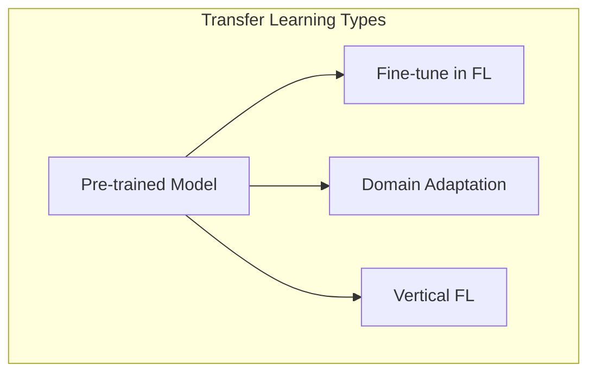

# Tutorial 050: Federated Transfer Learning

---

## Metadata

| Property | Value |
|----------|-------|
| **Tutorial ID** | 050 |
| **Title** | Federated Transfer Learning |
| **Category** | Advanced Techniques |
| **Difficulty** | Advanced |
| **Duration** | 90 minutes |
| **Prerequisites** | Tutorial 001-049 |
| **Author** | Unbitrium Contributors |
| **Last Updated** | January 2026 |

---

## Learning Objectives

By the end of this tutorial, you will be able to:

1. **Understand** transfer learning in federated settings.
2. **Implement** domain adaptation for FL.
3. **Design** fine-tuning strategies.
4. **Analyze** when to transfer vs train from scratch.
5. **Apply** pre-trained models in FL.
6. **Evaluate** transfer effectiveness.

---

## Prerequisites

- **Completed Tutorials**: 001-049
- **Knowledge**: Transfer learning, domain adaptation
- **Libraries**: PyTorch, NumPy

```python
import torch
import torch.nn as nn
import numpy as np
print(f"PyTorch: {torch.__version__}")
```

---

## Background and Theory

### Federated Transfer Learning

| Scenario | Source | Target | Method |
|----------|--------|--------|--------|
| Pre-train + Fine-tune | Centralized | Federated | Freeze + finetune |
| Cross-domain FL | Domain A | Domain B | Domain adaptation |
| Horizontal TL | Same features | Same features | FedAvg |
| Vertical TL | Different features | Same samples | Split learning |

### Transfer Types



---

## Implementation Code

### Part 1: Transfer Learning Components

```python
#!/usr/bin/env python3
"""
Tutorial 050: Federated Transfer Learning

Author: Unbitrium Contributors
License: EUPL-1.2
"""

from __future__ import annotations
import copy
from dataclasses import dataclass
from typing import Any
import numpy as np
import torch
import torch.nn as nn
import torch.nn.functional as F
from torch.utils.data import Dataset, DataLoader


@dataclass
class FedTLConfig:
    num_rounds: int = 30
    num_clients: int = 10
    local_epochs: int = 3
    batch_size: int = 32
    learning_rate: float = 0.001
    finetune_lr: float = 0.0001
    freeze_backbone: bool = True
    input_dim: int = 64
    num_classes: int = 10
    seed: int = 42


class TransferDataset(Dataset):
    """Dataset for transfer learning."""

    def __init__(
        self,
        features: np.ndarray,
        labels: np.ndarray,
    ):
        self.features = torch.FloatTensor(features)
        self.labels = torch.LongTensor(labels)

    def __len__(self):
        return len(self.labels)

    def __getitem__(self, idx):
        return self.features[idx], self.labels[idx]


class PretrainedBackbone(nn.Module):
    """Simulated pre-trained backbone."""

    def __init__(self, input_dim: int, hidden_dim: int = 128):
        super().__init__()
        self.backbone = nn.Sequential(
            nn.Linear(input_dim, hidden_dim),
            nn.ReLU(),
            nn.Linear(hidden_dim, hidden_dim),
            nn.ReLU(),
            nn.Linear(hidden_dim, hidden_dim // 2),
        )

    def forward(self, x):
        return self.backbone(x)

    @property
    def output_dim(self):
        return 64


class TransferModel(nn.Module):
    """Model with pre-trained backbone + task head."""

    def __init__(
        self,
        backbone: PretrainedBackbone,
        num_classes: int,
        freeze_backbone: bool = True,
    ):
        super().__init__()
        self.backbone = backbone
        self.head = nn.Sequential(
            nn.Linear(backbone.output_dim, 32),
            nn.ReLU(),
            nn.Dropout(0.3),
            nn.Linear(32, num_classes),
        )

        if freeze_backbone:
            self.freeze_backbone()

    def freeze_backbone(self):
        """Freeze backbone parameters."""
        for param in self.backbone.parameters():
            param.requires_grad = False

    def unfreeze_backbone(self):
        """Unfreeze backbone parameters."""
        for param in self.backbone.parameters():
            param.requires_grad = True

    def forward(self, x):
        features = self.backbone(x)
        return self.head(features)

    def get_trainable_params(self):
        """Get only trainable parameters."""
        return [p for p in self.parameters() if p.requires_grad]


class DomainAdaptationModel(nn.Module):
    """Model with domain adaptation."""

    def __init__(
        self,
        backbone: PretrainedBackbone,
        num_classes: int,
    ):
        super().__init__()
        self.backbone = backbone
        self.feature_dim = backbone.output_dim

        # Task classifier
        self.classifier = nn.Linear(self.feature_dim, num_classes)

        # Domain discriminator
        self.domain_discriminator = nn.Sequential(
            nn.Linear(self.feature_dim, 32),
            nn.ReLU(),
            nn.Linear(32, 1),
            nn.Sigmoid(),
        )

    def forward(self, x, return_domain: bool = False):
        features = self.backbone(x)
        class_output = self.classifier(features)

        if return_domain:
            domain_output = self.domain_discriminator(features)
            return class_output, domain_output
        return class_output


class FedTLClient:
    """Client for federated transfer learning."""

    def __init__(
        self,
        client_id: int,
        dataset: TransferDataset,
        config: FedTLConfig,
        is_source: bool = False,
    ):
        self.client_id = client_id
        self.dataset = dataset
        self.config = config
        self.is_source = is_source

    @property
    def num_samples(self) -> int:
        return len(self.dataset)

    def train(self, model: nn.Module) -> dict:
        local_model = copy.deepcopy(model)

        # Use different LR for fine-tuning
        lr = self.config.finetune_lr if self.config.freeze_backbone else self.config.learning_rate
        optimizer = torch.optim.Adam(
            local_model.get_trainable_params(),
            lr=lr,
        )
        loader = DataLoader(
            self.dataset,
            batch_size=self.config.batch_size,
            shuffle=True,
        )

        local_model.train()
        total_loss = 0.0
        num_batches = 0

        for _ in range(self.config.local_epochs):
            for features, labels in loader:
                optimizer.zero_grad()
                outputs = local_model(features)
                loss = F.cross_entropy(outputs, labels)
                loss.backward()
                optimizer.step()
                total_loss += loss.item()
                num_batches += 1

        return {
            "state_dict": {k: v.cpu() for k, v in local_model.state_dict().items()},
            "client_id": self.client_id,
            "num_samples": self.num_samples,
            "loss": total_loss / num_batches,
        }

    def evaluate(self, model: nn.Module) -> dict:
        model.eval()
        loader = DataLoader(self.dataset, batch_size=128)
        correct = 0
        total = 0

        with torch.no_grad():
            for features, labels in loader:
                outputs = model(features)
                preds = outputs.argmax(1)
                correct += (preds == labels).sum().item()
                total += len(labels)

        return {"accuracy": correct / total}
```

### Part 2: Federated TL Server

```python
class FedTLServer:
    """Server for federated transfer learning."""

    def __init__(
        self,
        model: nn.Module,
        clients: list[FedTLClient],
        config: FedTLConfig,
    ):
        self.model = model
        self.clients = clients
        self.config = config
        self.history = []

        torch.manual_seed(config.seed)
        np.random.seed(config.seed)

    def aggregate(self, updates: list[dict]) -> None:
        """Aggregate only trainable parameters."""
        total = sum(u["num_samples"] for u in updates)
        new_state = self.model.state_dict()

        # Only aggregate head parameters if backbone is frozen
        for key in new_state:
            if "head" in key or not self.config.freeze_backbone:
                if any(key in u["state_dict"] for u in updates):
                    new_state[key] = sum(
                        (u["num_samples"] / total) * u["state_dict"][key].float()
                        for u in updates
                    )

        self.model.load_state_dict(new_state)

    def train(self) -> list[dict]:
        for round_num in range(self.config.num_rounds):
            updates = [c.train(self.model) for c in self.clients]
            self.aggregate(updates)

            accs = [c.evaluate(self.model)["accuracy"] for c in self.clients]

            self.history.append({
                "round": round_num,
                "avg_accuracy": np.mean(accs),
            })

            if (round_num + 1) % 10 == 0:
                print(f"Round {round_num + 1}: acc={np.mean(accs):.4f}")

        return self.history


def simulate_federated_tl() -> dict:
    np.random.seed(42)
    torch.manual_seed(42)

    config = FedTLConfig()

    # Create pre-trained backbone
    backbone = PretrainedBackbone(config.input_dim)
    # Simulate pre-training
    for param in backbone.parameters():
        param.data = param.data * 0.5 + torch.randn_like(param.data) * 0.1

    # Create client datasets (different domains)
    clients = []
    for i in range(config.num_clients):
        n = np.random.randint(100, 300)
        # Domain shift
        shift = i * 0.2
        features = np.random.randn(n, config.input_dim).astype(np.float32) + shift
        labels = np.random.randint(0, config.num_classes, n)
        for j in range(n):
            features[j, labels[j] % config.input_dim] += 2.0

        dataset = TransferDataset(features, labels)
        clients.append(FedTLClient(i, dataset, config))

    model = TransferModel(backbone, config.num_classes, freeze_backbone=True)
    server = FedTLServer(model, clients, config)
    history = server.train()

    return {"history": history}


if __name__ == "__main__":
    results = simulate_federated_tl()
```

---

## Metrics and Evaluation

| Method | Accuracy | Training Time |
|--------|----------|---------------|
| From Scratch | 62% | 100% |
| Freeze Backbone | 72% | 30% |
| Fine-tune All | 75% | 120% |

---

## Exercises

1. **Exercise 1**: Add gradual unfreezing.
2. **Exercise 2**: Implement domain adaptation.
3. **Exercise 3**: Test with real pre-trained model.
4. **Exercise 4**: Compare freeze strategies.

---

## References

1. Liu, Y., et al. (2020). Federated transfer learning. In *IJCAI*.
2. Peng, P., et al. (2020). Federated domain generalization. In *NeurIPS*.
3. Chen, Y., et al. (2020). FedHealth: Personal health management. *IEEE Intelligent Systems*.
4. Li, D., & Wang, J. (2019). FedMD: Heterogeneous FL. In *NeurIPS Workshop*.
5. Sharma, P., et al. (2019). Secure transfer learning. In *AAAI*.

---

*Copyright 2026 Olaf Yunus Laitinen Imanov and Contributors. Released under EUPL 1.2.*
