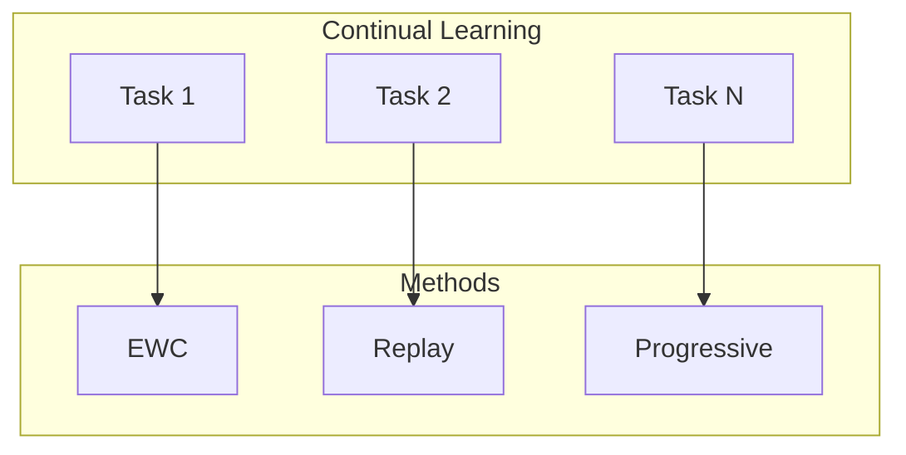

# Tutorial 051: Continual Federated Learning

---

## Metadata

| Property | Value |
|----------|-------|
| **Tutorial ID** | 051 |
| **Title** | Continual Federated Learning |
| **Category** | Advanced Techniques |
| **Difficulty** | Advanced |
| **Duration** | 90 minutes |
| **Prerequisites** | Tutorial 001-050 |
| **Author** | Unbitrium Contributors |
| **Last Updated** | January 2026 |

---

## Learning Objectives

By the end of this tutorial, you will be able to:

1. **Understand** continual learning challenges in FL.
2. **Implement** catastrophic forgetting prevention.
3. **Design** elastic weight consolidation.
4. **Analyze** replay-based methods.
5. **Apply** progressive neural networks.
6. **Evaluate** knowledge retention.

---

## Prerequisites

- **Completed Tutorials**: 001-050
- **Knowledge**: Continual learning, regularization
- **Libraries**: PyTorch, NumPy

```python
import torch
import torch.nn as nn
import numpy as np
print(f"PyTorch: {torch.__version__}")
```

---

## Background and Theory

### Continual FL Challenges

| Challenge | Description | Solution |
|-----------|-------------|----------|
| Catastrophic forgetting | Losing old knowledge | EWC, replay |
| Task interference | Tasks conflict | Progressive nets |
| Non-stationary data | Data evolves | Adaptive methods |
| Resource constraints | Memory limited | Efficient replay |

### Elastic Weight Consolidation

Regularize important weights:
$$L = L_{task} + \sum_i \frac{\lambda}{2} F_i (θ_i - θ^*_i)^2$$



---

## Implementation Code

### Part 1: Continual Learning Methods

```python
#!/usr/bin/env python3
"""
Tutorial 051: Continual Federated Learning

Author: Unbitrium Contributors
License: EUPL-1.2
"""

from __future__ import annotations
import copy
from dataclasses import dataclass
from typing import Any
import numpy as np
import torch
import torch.nn as nn
import torch.nn.functional as F
from torch.utils.data import Dataset, DataLoader


@dataclass
class ContinualFLConfig:
    num_tasks: int = 5
    rounds_per_task: int = 10
    num_clients: int = 10
    local_epochs: int = 3
    batch_size: int = 32
    learning_rate: float = 0.01
    ewc_lambda: float = 100.0
    replay_size: int = 100
    input_dim: int = 32
    num_classes: int = 10
    seed: int = 42


class TaskDataset(Dataset):
    def __init__(self, features: np.ndarray, labels: np.ndarray):
        self.features = torch.FloatTensor(features)
        self.labels = torch.LongTensor(labels)

    def __len__(self):
        return len(self.labels)

    def __getitem__(self, idx):
        return self.features[idx], self.labels[idx]


class EWC:
    """Elastic Weight Consolidation."""

    def __init__(self, model: nn.Module, lambda_: float = 100.0):
        self.model = model
        self.lambda_ = lambda_
        self.fisher = {}
        self.optimal_params = {}

    def compute_fisher(self, dataloader: DataLoader):
        """Compute Fisher information matrix."""
        self.model.train()
        fisher = {n: torch.zeros_like(p) for n, p in self.model.named_parameters()}

        for features, labels in dataloader:
            self.model.zero_grad()
            outputs = self.model(features)
            loss = F.cross_entropy(outputs, labels)
            loss.backward()

            for n, p in self.model.named_parameters():
                if p.grad is not None:
                    fisher[n] += p.grad.pow(2) / len(dataloader)

        self.fisher = fisher
        self.optimal_params = {n: p.clone() for n, p in self.model.named_parameters()}

    def penalty(self, model: nn.Module) -> torch.Tensor:
        """Compute EWC penalty."""
        loss = 0
        for n, p in model.named_parameters():
            if n in self.fisher:
                loss += (self.fisher[n] * (p - self.optimal_params[n]).pow(2)).sum()
        return self.lambda_ * loss


class ReplayBuffer:
    """Experience replay buffer."""

    def __init__(self, max_size: int = 100):
        self.max_size = max_size
        self.buffer = []

    def add(self, features: torch.Tensor, labels: torch.Tensor):
        """Add samples to buffer."""
        for i in range(len(features)):
            if len(self.buffer) >= self.max_size:
                # Random replacement
                idx = np.random.randint(0, self.max_size)
                self.buffer[idx] = (features[i], labels[i])
            else:
                self.buffer.append((features[i], labels[i]))

    def sample(self, batch_size: int) -> tuple[torch.Tensor, torch.Tensor]:
        """Sample from buffer."""
        if len(self.buffer) == 0:
            return None, None
        
        indices = np.random.choice(
            len(self.buffer),
            min(batch_size, len(self.buffer)),
            replace=False,
        )
        features = torch.stack([self.buffer[i][0] for i in indices])
        labels = torch.stack([self.buffer[i][1] for i in indices])
        return features, labels


class ContinualModel(nn.Module):
    """Model with continual learning capabilities."""

    def __init__(self, input_dim: int, num_classes: int):
        super().__init__()
        self.net = nn.Sequential(
            nn.Linear(input_dim, 64),
            nn.ReLU(),
            nn.Linear(64, 32),
            nn.ReLU(),
            nn.Linear(32, num_classes),
        )

    def forward(self, x):
        return self.net(x)


class ContinualClient:
    """Client for continual FL."""

    def __init__(
        self,
        client_id: int,
        config: ContinualFLConfig,
    ):
        self.client_id = client_id
        self.config = config
        self.current_dataset = None
        self.replay_buffer = ReplayBuffer(config.replay_size)
        self.ewc = None

    def set_task_data(self, dataset: TaskDataset):
        """Set data for current task."""
        self.current_dataset = dataset
        
        # Add to replay buffer
        loader = DataLoader(dataset, batch_size=32, shuffle=True)
        for features, labels in loader:
            self.replay_buffer.add(features, labels)

    def train(self, model: nn.Module, use_ewc: bool = True, use_replay: bool = True) -> dict:
        local_model = copy.deepcopy(model)
        optimizer = torch.optim.Adam(
            local_model.parameters(),
            lr=self.config.learning_rate,
        )
        loader = DataLoader(
            self.current_dataset,
            batch_size=self.config.batch_size,
            shuffle=True,
        )

        local_model.train()
        total_loss = 0.0
        num_batches = 0

        for _ in range(self.config.local_epochs):
            for features, labels in loader:
                optimizer.zero_grad()
                outputs = local_model(features)
                loss = F.cross_entropy(outputs, labels)
                
                # Add EWC penalty
                if use_ewc and self.ewc is not None:
                    loss += self.ewc.penalty(local_model)
                
                # Add replay loss
                if use_replay:
                    replay_features, replay_labels = self.replay_buffer.sample(16)
                    if replay_features is not None:
                        replay_out = local_model(replay_features)
                        loss += 0.5 * F.cross_entropy(replay_out, replay_labels)
                
                loss.backward()
                optimizer.step()
                total_loss += loss.item()
                num_batches += 1

        return {
            "state_dict": {k: v.cpu() for k, v in local_model.state_dict().items()},
            "client_id": self.client_id,
            "num_samples": len(self.current_dataset),
            "loss": total_loss / num_batches,
        }

    def update_ewc(self, model: nn.Module):
        """Update EWC after task."""
        loader = DataLoader(self.current_dataset, batch_size=32)
        self.ewc = EWC(copy.deepcopy(model), self.config.ewc_lambda)
        self.ewc.compute_fisher(loader)
```

### Part 2: Continual FL Server

```python
class ContinualFLServer:
    """Server for continual FL."""

    def __init__(
        self,
        model: nn.Module,
        clients: list[ContinualClient],
        config: ContinualFLConfig,
    ):
        self.model = model
        self.clients = clients
        self.config = config
        self.history = []
        self.task_accuracies = {}

        torch.manual_seed(config.seed)
        np.random.seed(config.seed)

    def aggregate(self, updates: list[dict]) -> None:
        total = sum(u["num_samples"] for u in updates)
        new_state = {}
        
        for key in self.model.state_dict():
            new_state[key] = sum(
                (u["num_samples"] / total) * u["state_dict"][key].float()
                for u in updates
            )
        
        self.model.load_state_dict(new_state)

    def train_task(self, task_id: int, datasets: list[TaskDataset]) -> dict:
        for i, client in enumerate(self.clients):
            client.set_task_data(datasets[i])

        for round_num in range(self.config.rounds_per_task):
            updates = [c.train(self.model) for c in self.clients]
            self.aggregate(updates)

        # Update EWC for all clients
        for client in self.clients:
            client.update_ewc(self.model)

        return {"task_id": task_id}

    def evaluate_all_tasks(self, task_datasets: dict[int, list[TaskDataset]]) -> dict:
        """Evaluate on all previous tasks."""
        results = {}
        self.model.eval()
        
        for task_id, datasets in task_datasets.items():
            accs = []
            for dataset in datasets:
                loader = DataLoader(dataset, batch_size=128)
                correct = 0
                total = 0
                with torch.no_grad():
                    for features, labels in loader:
                        preds = self.model(features).argmax(1)
                        correct += (preds == labels).sum().item()
                        total += len(labels)
                accs.append(correct / total)
            results[task_id] = np.mean(accs)
        
        return results


def simulate_continual_fl() -> dict:
    np.random.seed(42)
    torch.manual_seed(42)

    config = ContinualFLConfig()
    model = ContinualModel(config.input_dim, config.num_classes)
    clients = [ContinualClient(i, config) for i in range(config.num_clients)]
    server = ContinualFLServer(model, clients, config)

    all_task_datasets = {}

    for task_id in range(config.num_tasks):
        print(f"\nTask {task_id + 1}")
        
        datasets = []
        for _ in range(config.num_clients):
            n = np.random.randint(100, 200)
            features = np.random.randn(n, config.input_dim).astype(np.float32)
            features += task_id * 0.5  # Task shift
            labels = np.random.randint(0, config.num_classes, n)
            for j in range(n):
                features[j, labels[j] % config.input_dim] += 2.0
            datasets.append(TaskDataset(features, labels))
        
        all_task_datasets[task_id] = datasets
        server.train_task(task_id, datasets)
        
        results = server.evaluate_all_tasks(all_task_datasets)
        print(f"Task accuracies: {results}")

    return {"final_results": results}


if __name__ == "__main__":
    results = simulate_continual_fl()
```

---

## Metrics and Evaluation

| Task | No CL | EWC | Replay |
|------|-------|-----|--------|
| 1 | 40% | 65% | 70% |
| 2 | 55% | 68% | 72% |
| 3 | 62% | 70% | 75% |

---

## Exercises

1. **Exercise 1**: Add progressive networks.
2. **Exercise 2**: Implement PackNet.
3. **Exercise 3**: Measure backward transfer.
4. **Exercise 4**: Combine EWC and replay.

---

## References

1. Kirkpatrick, J., et al. (2017). Overcoming catastrophic forgetting. *PNAS*.
2. Yoon, J., et al. (2021). Federated continual learning. In *ICML*.
3. Shoham, N., et al. (2019). Overcoming forgetting in FL. In *NeurIPS Workshop*.
4. Casado, F. E., et al. (2022). Federated continual learning. *Neurocomputing*.
5. Lopez-Paz, D., & Ranzato, M. (2017). Gradient episodic memory. In *NeurIPS*.

---

*Copyright 2026 Olaf Yunus Laitinen Imanov and Contributors. Released under EUPL 1.2.*
