# Tutorial 052: Federated Neural Architecture Search

---

## Metadata

| Property | Value |
|----------|-------|
| **Tutorial ID** | 052 |
| **Title** | Federated Neural Architecture Search |
| **Category** | Advanced Techniques |
| **Difficulty** | Advanced |
| **Duration** | 90 minutes |
| **Prerequisites** | Tutorial 001-051 |
| **Author** | Unbitrium Contributors |
| **Last Updated** | January 2026 |

---

## Learning Objectives

By the end of this tutorial, you will be able to:

1. **Understand** NAS in federated settings.
2. **Implement** distributed architecture search.
3. **Design** searchable architecture spaces.
4. **Analyze** communication-efficient NAS.
5. **Apply** DARTS-like methods to FL.
6. **Evaluate** discovered architectures.

---

## Prerequisites

- **Completed Tutorials**: 001-051
- **Knowledge**: NAS, differentiable search
- **Libraries**: PyTorch, NumPy

```python
import torch
import torch.nn as nn
import numpy as np
print(f"PyTorch: {torch.__version__}")
```

---

## Background and Theory

### Federated NAS Challenges

| Challenge | Description | Solution |
|-----------|-------------|----------|
| Search cost | Expensive across clients | Weight sharing |
| Heterogeneity | Different optimal archs | Personalized NAS |
| Communication | Large search space | Supernet training |
| Privacy | Architecture reveals data | Secure search |

### DARTS-Style Search

Learn architecture weights $\alpha$:
$$\bar{o}(x) = \sum_{o \in O} \frac{\exp(\alpha_o)}{\sum_{o'} \exp(\alpha_{o'})} o(x)$$

```mermaid
graph TB
    subgraph "Search Space"
        CONV[Conv 3x3]
        SEP[SepConv]
        POOL[MaxPool]
        SKIP[Skip]
    end

    subgraph "Mixed Op"
        ALPHA[α weights]
        MIX[Weighted Sum]
    end

    CONV --> ALPHA
    SEP --> ALPHA
    POOL --> ALPHA
    SKIP --> ALPHA
    ALPHA --> MIX
```



---

## Implementation Code

### Part 1: Search Space

```python
#!/usr/bin/env python3
"""
Tutorial 052: Federated Neural Architecture Search

Author: Unbitrium Contributors
License: EUPL-1.2
"""

from __future__ import annotations
import copy
from dataclasses import dataclass
from typing import Any
import numpy as np
import torch
import torch.nn as nn
import torch.nn.functional as F
from torch.utils.data import Dataset, DataLoader


@dataclass
class FedNASConfig:
    num_rounds: int = 30
    num_clients: int = 5
    local_epochs: int = 3
    batch_size: int = 32
    learning_rate: float = 0.01
    arch_lr: float = 0.001
    input_dim: int = 32
    hidden_dims: list[int] = None
    num_classes: int = 10
    num_ops: int = 4
    seed: int = 42

    def __post_init__(self):
        if self.hidden_dims is None:
            self.hidden_dims = [64, 32]


class NASDataset(Dataset):
    def __init__(self, features: np.ndarray, labels: np.ndarray):
        self.features = torch.FloatTensor(features)
        self.labels = torch.LongTensor(labels)

    def __len__(self):
        return len(self.labels)

    def __getitem__(self, idx):
        return self.features[idx], self.labels[idx]


class MixedOp(nn.Module):
    """Mixed operation with learnable weights."""

    def __init__(self, in_dim: int, out_dim: int):
        super().__init__()
        self.ops = nn.ModuleList([
            nn.Linear(in_dim, out_dim),  # Linear
            nn.Sequential(nn.Linear(in_dim, out_dim), nn.ReLU()),  # Linear + ReLU
            nn.Sequential(nn.Linear(in_dim, out_dim), nn.Tanh()),  # Linear + Tanh
            nn.Sequential(nn.Linear(in_dim, in_dim), nn.ReLU(), nn.Linear(in_dim, out_dim)),  # MLP
        ])
        self.num_ops = len(self.ops)

    def forward(self, x, weights):
        """Forward with architecture weights."""
        return sum(w * op(x) for w, op in zip(weights, self.ops))


class SearchableCell(nn.Module):
    """Searchable cell with mixed operations."""

    def __init__(self, in_dim: int, out_dim: int, num_ops: int = 4):
        super().__init__()
        self.mixed_op = MixedOp(in_dim, out_dim)
        # Architecture parameters
        self.arch_weights = nn.Parameter(torch.zeros(num_ops))

    def forward(self, x):
        weights = F.softmax(self.arch_weights, dim=0)
        return self.mixed_op(x, weights)

    def get_selected_op(self) -> int:
        """Get operation with highest weight."""
        return self.arch_weights.argmax().item()


class SearchableNetwork(nn.Module):
    """Network with searchable architecture."""

    def __init__(
        self,
        input_dim: int,
        hidden_dims: list[int],
        num_classes: int,
        num_ops: int = 4,
    ):
        super().__init__()
        self.cells = nn.ModuleList()
        
        prev_dim = input_dim
        for hidden_dim in hidden_dims:
            self.cells.append(SearchableCell(prev_dim, hidden_dim, num_ops))
            prev_dim = hidden_dim
        
        self.classifier = nn.Linear(prev_dim, num_classes)

    def forward(self, x):
        for cell in self.cells:
            x = cell(x)
        return self.classifier(x)

    def arch_parameters(self):
        """Get architecture parameters."""
        for cell in self.cells:
            yield cell.arch_weights

    def weight_parameters(self):
        """Get weight parameters (excluding arch)."""
        for name, param in self.named_parameters():
            if "arch_weights" not in name:
                yield param

    def get_architecture(self) -> list[int]:
        """Get discrete architecture."""
        return [cell.get_selected_op() for cell in self.cells]


class FedNASClient:
    """Client for federated NAS."""

    def __init__(
        self,
        client_id: int,
        train_data: NASDataset,
        val_data: NASDataset,
        config: FedNASConfig,
    ):
        self.client_id = client_id
        self.train_data = train_data
        self.val_data = val_data
        self.config = config

    @property
    def num_samples(self) -> int:
        return len(self.train_data)

    def train(self, model: nn.Module) -> dict:
        """Train weights and architecture."""
        local_model = copy.deepcopy(model)
        
        # Two optimizers: weights and architecture
        weight_optimizer = torch.optim.Adam(
            local_model.weight_parameters(),
            lr=self.config.learning_rate,
        )
        arch_optimizer = torch.optim.Adam(
            local_model.arch_parameters(),
            lr=self.config.arch_lr,
        )
        
        train_loader = DataLoader(
            self.train_data,
            batch_size=self.config.batch_size,
            shuffle=True,
        )
        val_loader = DataLoader(
            self.val_data,
            batch_size=self.config.batch_size,
            shuffle=True,
        )

        local_model.train()
        total_loss = 0.0
        num_batches = 0

        for _ in range(self.config.local_epochs):
            for (train_x, train_y), (val_x, val_y) in zip(train_loader, val_loader):
                # Update architecture on validation data
                arch_optimizer.zero_grad()
                val_out = local_model(val_x)
                arch_loss = F.cross_entropy(val_out, val_y)
                arch_loss.backward()
                arch_optimizer.step()

                # Update weights on training data
                weight_optimizer.zero_grad()
                train_out = local_model(train_x)
                weight_loss = F.cross_entropy(train_out, train_y)
                weight_loss.backward()
                weight_optimizer.step()

                total_loss += weight_loss.item()
                num_batches += 1

        return {
            "state_dict": {k: v.cpu() for k, v in local_model.state_dict().items()},
            "client_id": self.client_id,
            "num_samples": self.num_samples,
            "loss": total_loss / num_batches,
            "architecture": local_model.get_architecture(),
        }
```

### Part 2: Federated NAS Server

```python
class FedNASServer:
    """Server for federated NAS."""

    def __init__(
        self,
        model: SearchableNetwork,
        clients: list[FedNASClient],
        config: FedNASConfig,
    ):
        self.model = model
        self.clients = clients
        self.config = config
        self.history = []

        torch.manual_seed(config.seed)
        np.random.seed(config.seed)

    def aggregate(self, updates: list[dict]) -> None:
        total = sum(u["num_samples"] for u in updates)
        new_state = {}
        
        for key in self.model.state_dict():
            new_state[key] = sum(
                (u["num_samples"] / total) * u["state_dict"][key].float()
                for u in updates
            )
        
        self.model.load_state_dict(new_state)

    def train(self) -> list[dict]:
        for round_num in range(self.config.num_rounds):
            updates = [c.train(self.model) for c in self.clients]
            self.aggregate(updates)

            # Get global architecture
            arch = self.model.get_architecture()
            
            self.history.append({
                "round": round_num,
                "architecture": arch,
            })

            if (round_num + 1) % 10 == 0:
                print(f"Round {round_num + 1}: arch={arch}")

        return self.history


def simulate_federated_nas() -> dict:
    np.random.seed(42)
    torch.manual_seed(42)

    config = FedNASConfig()
    
    clients = []
    for i in range(config.num_clients):
        # Training data
        n_train = np.random.randint(200, 400)
        train_features = np.random.randn(n_train, config.input_dim).astype(np.float32)
        train_labels = np.random.randint(0, config.num_classes, n_train)
        for j in range(n_train):
            train_features[j, train_labels[j] % config.input_dim] += 2.0
        
        # Validation data
        n_val = n_train // 4
        val_features = np.random.randn(n_val, config.input_dim).astype(np.float32)
        val_labels = np.random.randint(0, config.num_classes, n_val)
        for j in range(n_val):
            val_features[j, val_labels[j] % config.input_dim] += 2.0
        
        train_data = NASDataset(train_features, train_labels)
        val_data = NASDataset(val_features, val_labels)
        clients.append(FedNASClient(i, train_data, val_data, config))

    model = SearchableNetwork(
        config.input_dim,
        config.hidden_dims,
        config.num_classes,
        config.num_ops,
    )
    server = FedNASServer(model, clients, config)
    history = server.train()

    return {
        "history": history,
        "final_arch": model.get_architecture(),
    }


if __name__ == "__main__":
    results = simulate_federated_nas()
    print(f"Final architecture: {results['final_arch']}")
```

---

## Metrics and Evaluation

| Method | Search Cost | Accuracy |
|--------|-------------|----------|
| Random | 1x | 68% |
| Local NAS | 5x | 73% |
| FedNAS | 3x | 75% |

---

## Exercises

1. **Exercise 1**: Add more operations.
2. **Exercise 2**: Implement ENAS.
3. **Exercise 3**: Add personalized architectures.
4. **Exercise 4**: Reduce search cost.

---

## References

1. He, C., et al. (2020). FedNAS: Federated deep learning via NAS. *arXiv*.
2. Liu, H., et al. (2019). DARTS: Differentiable architecture search. In *ICLR*.
3. Zhu, H., & Jin, Y. (2020). Real-time federated evolutionary NAS. *IEEE TCYB*.
4. Xu, M., et al. (2021). FedPNAS. In *ICCV*.
5. Singh, A., et al. (2020). Differential NAS with data heterogeneity. *arXiv*.

---

*Copyright 2026 Olaf Yunus Laitinen Imanov and Contributors. Released under EUPL 1.2.*
