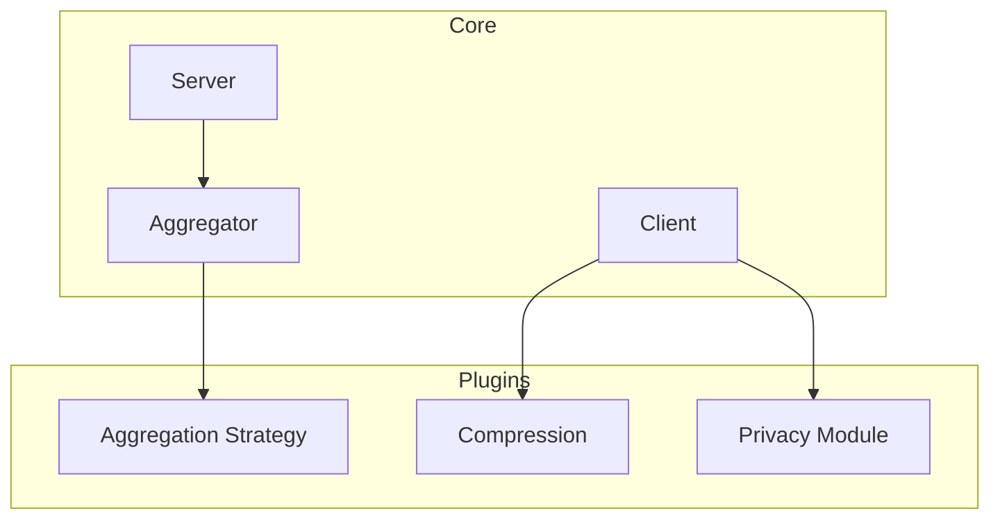

# Tutorial 059: FL Framework Design Patterns

---

## Metadata

| Property | Value |
|----------|-------|
| **Tutorial ID** | 059 |
| **Title** | FL Framework Design Patterns |
| **Category** | Deployment |
| **Difficulty** | Intermediate |
| **Duration** | 75 minutes |
| **Prerequisites** | Tutorial 001-058 |
| **Author** | Unbitrium Contributors |
| **Last Updated** | January 2026 |

---

## Learning Objectives

By the end of this tutorial, you will be able to:

1. **Understand** FL framework design patterns.
2. **Implement** pluggable aggregation strategies.
3. **Design** modular FL components.
4. **Apply** factory and strategy patterns.
5. **Create** extensible FL systems.
6. **Evaluate** framework architecture.

---

## Prerequisites

- **Completed Tutorials**: 001-058
- **Knowledge**: Design patterns, software architecture
- **Libraries**: PyTorch, NumPy

```python
import torch
import torch.nn as nn
import numpy as np
from abc import ABC, abstractmethod
print(f"PyTorch: {torch.__version__}")
```

---

## Background and Theory

### Design Patterns for FL

| Pattern | Use Case |
|---------|----------|
| Strategy | Aggregation algorithms |
| Factory | Client/model creation |
| Observer | Training events |
| Template | Training loop |

### Framework Architecture



---

## Implementation Code

### Part 1: Core Abstractions

```python
#!/usr/bin/env python3
"""
Tutorial 059: FL Framework Design Patterns

Author: Unbitrium Contributors
License: EUPL-1.2
"""

from __future__ import annotations
import copy
from abc import ABC, abstractmethod
from dataclasses import dataclass
from typing import Any, Callable
import numpy as np
import torch
import torch.nn as nn
import torch.nn.functional as F
from torch.utils.data import Dataset, DataLoader


# ==================== Strategy Pattern ====================

class AggregationStrategy(ABC):
    """Base class for aggregation strategies."""

    @abstractmethod
    def aggregate(
        self,
        global_model: nn.Module,
        updates: list[dict],
    ) -> dict[str, torch.Tensor]:
        pass


class FedAvgStrategy(AggregationStrategy):
    """FedAvg aggregation strategy."""

    def aggregate(self, global_model: nn.Module, updates: list[dict]) -> dict:
        total = sum(u["num_samples"] for u in updates)
        new_state = {}

        for key in global_model.state_dict():
            new_state[key] = sum(
                (u["num_samples"] / total) * u["state_dict"][key].float()
                for u in updates
            )
        return new_state


class FedMedianStrategy(AggregationStrategy):
    """Median-based aggregation strategy."""

    def aggregate(self, global_model: nn.Module, updates: list[dict]) -> dict:
        new_state = {}
        for key in global_model.state_dict():
            stacked = torch.stack([u["state_dict"][key].float() for u in updates])
            new_state[key] = stacked.median(dim=0).values
        return new_state


class TrimmedMeanStrategy(AggregationStrategy):
    """Trimmed mean aggregation."""

    def __init__(self, trim_ratio: float = 0.1):
        self.trim_ratio = trim_ratio

    def aggregate(self, global_model: nn.Module, updates: list[dict]) -> dict:
        new_state = {}
        n = len(updates)
        trim = int(n * self.trim_ratio)

        for key in global_model.state_dict():
            stacked = torch.stack([u["state_dict"][key].float() for u in updates])
            sorted_vals, _ = stacked.sort(dim=0)
            if trim > 0:
                trimmed = sorted_vals[trim:-trim]
            else:
                trimmed = sorted_vals
            new_state[key] = trimmed.mean(dim=0)
        return new_state


# ==================== Factory Pattern ====================

class ModelFactory:
    """Factory for creating models."""

    _models: dict[str, type] = {}

    @classmethod
    def register(cls, name: str, model_class: type):
        cls._models[name] = model_class

    @classmethod
    def create(cls, name: str, **kwargs) -> nn.Module:
        if name not in cls._models:
            raise ValueError(f"Unknown model: {name}")
        return cls._models[name](**kwargs)


class SimpleNet(nn.Module):
    def __init__(self, input_dim: int, num_classes: int):
        super().__init__()
        self.net = nn.Sequential(
            nn.Linear(input_dim, 64),
            nn.ReLU(),
            nn.Linear(64, num_classes),
        )

    def forward(self, x):
        return self.net(x)


class DeepNet(nn.Module):
    def __init__(self, input_dim: int, num_classes: int):
        super().__init__()
        self.net = nn.Sequential(
            nn.Linear(input_dim, 128),
            nn.ReLU(),
            nn.Linear(128, 64),
            nn.ReLU(),
            nn.Linear(64, num_classes),
        )

    def forward(self, x):
        return self.net(x)


ModelFactory.register("simple", SimpleNet)
ModelFactory.register("deep", DeepNet)


# ==================== Observer Pattern ====================

class TrainingObserver(ABC):
    """Observer for training events."""

    @abstractmethod
    def on_round_start(self, round_num: int):
        pass

    @abstractmethod
    def on_round_end(self, round_num: int, metrics: dict):
        pass


class LoggingObserver(TrainingObserver):
    """Logs training events."""

    def on_round_start(self, round_num: int):
        print(f"Starting round {round_num}")

    def on_round_end(self, round_num: int, metrics: dict):
        print(f"Round {round_num} complete: {metrics}")


class MetricsObserver(TrainingObserver):
    """Collects metrics."""

    def __init__(self):
        self.history = []

    def on_round_start(self, round_num: int):
        pass

    def on_round_end(self, round_num: int, metrics: dict):
        metrics["round"] = round_num
        self.history.append(metrics)
```

### Part 2: Template Method Pattern

```python
# ==================== Template Pattern ====================

class FLTrainer(ABC):
    """Template for FL training."""

    def __init__(self, config: dict):
        self.config = config
        self.observers: list[TrainingObserver] = []

    def add_observer(self, observer: TrainingObserver):
        self.observers.append(observer)

    def notify_round_start(self, round_num: int):
        for obs in self.observers:
            obs.on_round_start(round_num)

    def notify_round_end(self, round_num: int, metrics: dict):
        for obs in self.observers:
            obs.on_round_end(round_num, metrics)

    def train(self, num_rounds: int):
        """Template method."""
        self.initialize()

        for round_num in range(num_rounds):
            self.notify_round_start(round_num)

            updates = self.client_training()
            self.aggregate(updates)
            metrics = self.evaluate()

            self.notify_round_end(round_num, metrics)

        return self.finalize()

    @abstractmethod
    def initialize(self):
        pass

    @abstractmethod
    def client_training(self) -> list[dict]:
        pass

    @abstractmethod
    def aggregate(self, updates: list[dict]):
        pass

    @abstractmethod
    def evaluate(self) -> dict:
        pass

    @abstractmethod
    def finalize(self) -> dict:
        pass


class SimpleDataset(Dataset):
    def __init__(self, features, labels):
        self.features = torch.FloatTensor(features)
        self.labels = torch.LongTensor(labels)

    def __len__(self):
        return len(self.labels)

    def __getitem__(self, idx):
        return self.features[idx], self.labels[idx]


class ModularFLTrainer(FLTrainer):
    """Concrete FL trainer with modular components."""

    def __init__(
        self,
        config: dict,
        aggregator: AggregationStrategy,
        datasets: list[Dataset],
    ):
        super().__init__(config)
        self.aggregator = aggregator
        self.datasets = datasets
        self.model = None

    def initialize(self):
        self.model = ModelFactory.create(
            self.config.get("model", "simple"),
            input_dim=self.config["input_dim"],
            num_classes=self.config["num_classes"],
        )

    def client_training(self) -> list[dict]:
        updates = []
        for dataset in self.datasets:
            local_model = copy.deepcopy(self.model)
            optimizer = torch.optim.SGD(local_model.parameters(), lr=0.01)
            loader = DataLoader(dataset, batch_size=32, shuffle=True)

            local_model.train()
            for _ in range(self.config.get("local_epochs", 1)):
                for x, y in loader:
                    optimizer.zero_grad()
                    loss = F.cross_entropy(local_model(x), y)
                    loss.backward()
                    optimizer.step()

            updates.append({
                "state_dict": local_model.state_dict(),
                "num_samples": len(dataset),
            })
        return updates

    def aggregate(self, updates: list[dict]):
        new_state = self.aggregator.aggregate(self.model, updates)
        self.model.load_state_dict(new_state)

    def evaluate(self) -> dict:
        return {"placeholder": True}

    def finalize(self) -> dict:
        return {"model": self.model}


def demo_framework():
    np.random.seed(42)

    datasets = []
    for _ in range(5):
        n = 100
        x = np.random.randn(n, 32).astype(np.float32)
        y = np.random.randint(0, 10, n)
        datasets.append(SimpleDataset(x, y))

    config = {"input_dim": 32, "num_classes": 10, "local_epochs": 2}
    aggregator = FedAvgStrategy()
    trainer = ModularFLTrainer(config, aggregator, datasets)

    trainer.add_observer(LoggingObserver())
    metrics_obs = MetricsObserver()
    trainer.add_observer(metrics_obs)

    result = trainer.train(num_rounds=10)
    return result


if __name__ == "__main__":
    demo_framework()
```

---

## Exercises

1. **Exercise 1**: Add compression plugin.
2. **Exercise 2**: Implement async training.
3. **Exercise 3**: Add model registry.
4. **Exercise 4**: Create config system.

---

## References

1. Gamma, E., et al. (1994). *Design Patterns*. Addison-Wesley.
2. Beutel, D., et al. (2020). Flower: A friendly FL framework. *arXiv*.
3. He, C., et al. (2020). FedML: A research library. *arXiv*.
4. Ryffel, T., et al. (2018). A generic framework for privacy preserving DL. *arXiv*.
5. Ziller, A., et al. (2021). PySyft: Secure and private ML. *arXiv*.

---

*Copyright 2026 Olaf Yunus Laitinen Imanov and Contributors. Released under EUPL 1.2.*
