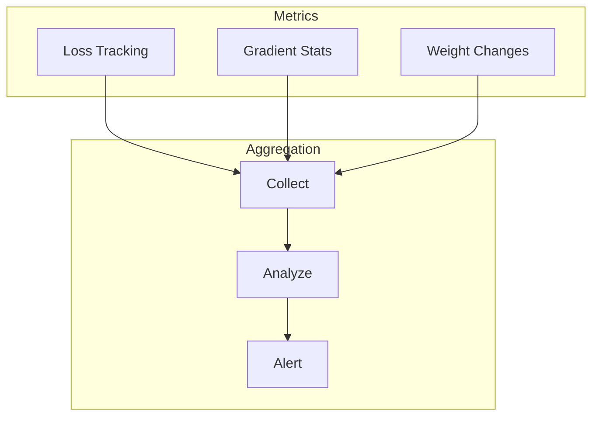

# Tutorial 060: FL Monitoring and Debugging

---

## Metadata

| Property | Value |
|----------|-------|
| **Tutorial ID** | 060 |
| **Title** | FL Monitoring and Debugging |
| **Category** | Deployment |
| **Difficulty** | Intermediate |
| **Duration** | 75 minutes |
| **Prerequisites** | Tutorial 001-059 |
| **Author** | Unbitrium Contributors |
| **Last Updated** | January 2026 |

---

## Learning Objectives

By the end of this tutorial, you will be able to:

1. **Understand** FL monitoring challenges.
2. **Implement** training metrics collection.
3. **Design** debugging tools for FL.
4. **Analyze** client behavior anomalies.
5. **Apply** visualization techniques.
6. **Evaluate** system health.

---

## Prerequisites

- **Completed Tutorials**: 001-059
- **Knowledge**: Monitoring systems, debugging
- **Libraries**: PyTorch, NumPy

```python
import torch
import torch.nn as nn
import numpy as np
print(f"PyTorch: {torch.__version__}")
```

---

## Background and Theory

### Monitoring Challenges

| Challenge | Description |
|-----------|-------------|
| Distributed | Data across clients |
| Privacy | Can't inspect raw data |
| Heterogeneity | Different behaviors |
| Scale | Many clients to track |

### Monitoring Architecture



---

## Implementation Code

### Part 1: Monitoring Components

```python
#!/usr/bin/env python3
"""
Tutorial 060: FL Monitoring and Debugging

Author: Unbitrium Contributors
License: EUPL-1.2
"""

from __future__ import annotations
import copy
from dataclasses import dataclass, field
from typing import Any
import numpy as np
import torch
import torch.nn as nn
import torch.nn.functional as F
from torch.utils.data import Dataset, DataLoader
from collections import defaultdict


@dataclass
class MonitoringConfig:
    num_rounds: int = 30
    num_clients: int = 10
    local_epochs: int = 2
    batch_size: int = 32
    learning_rate: float = 0.01
    track_gradients: bool = True
    track_weights: bool = True
    anomaly_threshold: float = 3.0
    seed: int = 42


class MetricsCollector:
    """Collects and stores training metrics."""

    def __init__(self):
        self.round_metrics: list[dict] = []
        self.client_metrics: dict[int, list[dict]] = defaultdict(list)
        self.gradient_history: dict[str, list[torch.Tensor]] = defaultdict(list)
        self.weight_history: dict[str, list[torch.Tensor]] = defaultdict(list)

    def log_round(self, round_num: int, metrics: dict):
        metrics["round"] = round_num
        self.round_metrics.append(metrics)

    def log_client(self, client_id: int, metrics: dict):
        self.client_metrics[client_id].append(metrics)

    def log_gradients(self, name: str, grad: torch.Tensor):
        self.gradient_history[name].append(grad.clone().cpu())

    def log_weights(self, name: str, weight: torch.Tensor):
        self.weight_history[name].append(weight.clone().cpu())

    def get_summary(self) -> dict:
        return {
            "num_rounds": len(self.round_metrics),
            "num_clients": len(self.client_metrics),
            "layers_tracked": len(self.gradient_history),
        }


class GradientMonitor:
    """Monitors gradient statistics."""

    def __init__(self, model: nn.Module):
        self.model = model
        self.stats_history = []

    def compute_stats(self) -> dict:
        """Compute gradient statistics."""
        stats = {}
        for name, param in self.model.named_parameters():
            if param.grad is not None:
                grad = param.grad
                stats[name] = {
                    "mean": grad.mean().item(),
                    "std": grad.std().item(),
                    "norm": grad.norm().item(),
                    "max": grad.abs().max().item(),
                    "sparsity": (grad == 0).float().mean().item(),
                }
        self.stats_history.append(stats)
        return stats

    def detect_anomalies(self, threshold: float = 3.0) -> list[str]:
        """Detect gradient anomalies."""
        if len(self.stats_history) < 2:
            return []

        anomalies = []
        current = self.stats_history[-1]
        previous = self.stats_history[-2]

        for name in current:
            if name in previous:
                norm_change = abs(current[name]["norm"] - previous[name]["norm"])
                if previous[name]["norm"] > 0:
                    relative_change = norm_change / previous[name]["norm"]
                    if relative_change > threshold:
                        anomalies.append(f"{name}: {relative_change:.2f}x change")

        return anomalies


class WeightMonitor:
    """Monitors weight statistics."""

    def __init__(self, model: nn.Module):
        self.model = model
        self.initial_weights = None
        self.weight_history = []

    def save_initial(self):
        self.initial_weights = {
            n: p.data.clone()
            for n, p in self.model.named_parameters()
        }

    def compute_stats(self) -> dict:
        """Compute weight statistics."""
        stats = {}
        for name, param in self.model.named_parameters():
            w = param.data
            stats[name] = {
                "mean": w.mean().item(),
                "std": w.std().item(),
                "norm": w.norm().item(),
            }
            if self.initial_weights and name in self.initial_weights:
                change = (w - self.initial_weights[name]).norm().item()
                stats[name]["change_from_init"] = change

        self.weight_history.append(stats)
        return stats


class SimpleDataset(Dataset):
    def __init__(self, features, labels):
        self.features = torch.FloatTensor(features)
        self.labels = torch.LongTensor(labels)

    def __len__(self):
        return len(self.labels)

    def __getitem__(self, idx):
        return self.features[idx], self.labels[idx]


class SimpleModel(nn.Module):
    def __init__(self, input_dim=32, num_classes=10):
        super().__init__()
        self.net = nn.Sequential(
            nn.Linear(input_dim, 64),
            nn.ReLU(),
            nn.Linear(64, num_classes),
        )

    def forward(self, x):
        return self.net(x)
```

### Part 2: Monitored FL

```python
class MonitoredClient:
    """Client with monitoring."""

    def __init__(
        self,
        client_id: int,
        dataset: SimpleDataset,
        config: MonitoringConfig,
        collector: MetricsCollector,
    ):
        self.client_id = client_id
        self.dataset = dataset
        self.config = config
        self.collector = collector

    def train(self, model: nn.Module, round_num: int) -> dict:
        local_model = copy.deepcopy(model)
        grad_monitor = GradientMonitor(local_model)
        optimizer = torch.optim.SGD(
            local_model.parameters(),
            lr=self.config.learning_rate,
        )
        loader = DataLoader(
            self.dataset,
            batch_size=self.config.batch_size,
            shuffle=True,
        )

        local_model.train()
        total_loss = 0.0
        num_batches = 0

        for epoch in range(self.config.local_epochs):
            for features, labels in loader:
                optimizer.zero_grad()
                outputs = local_model(features)
                loss = F.cross_entropy(outputs, labels)
                loss.backward()

                # Track gradients
                if self.config.track_gradients:
                    grad_stats = grad_monitor.compute_stats()

                optimizer.step()
                total_loss += loss.item()
                num_batches += 1

        # Check for anomalies
        anomalies = grad_monitor.detect_anomalies(self.config.anomaly_threshold)

        metrics = {
            "client_id": self.client_id,
            "round": round_num,
            "loss": total_loss / num_batches,
            "anomalies": anomalies,
        }
        self.collector.log_client(self.client_id, metrics)

        return {
            "state_dict": {k: v.cpu() for k, v in local_model.state_dict().items()},
            "num_samples": len(self.dataset),
            "metrics": metrics,
        }


class MonitoredServer:
    """Server with monitoring."""

    def __init__(
        self,
        clients: list[MonitoredClient],
        config: MonitoringConfig,
    ):
        self.clients = clients
        self.config = config
        self.model = SimpleModel()
        self.collector = MetricsCollector()
        self.weight_monitor = WeightMonitor(self.model)
        self.weight_monitor.save_initial()

        torch.manual_seed(config.seed)

    def train(self) -> dict:
        for round_num in range(self.config.num_rounds):
            updates = [c.train(self.model, round_num) for c in self.clients]
            self.aggregate(updates)

            # Monitor weights
            weight_stats = self.weight_monitor.compute_stats()

            metrics = {
                "num_updates": len(updates),
                "avg_loss": np.mean([u["metrics"]["loss"] for u in updates]),
            }
            self.collector.log_round(round_num, metrics)

            if (round_num + 1) % 10 == 0:
                print(f"Round {round_num + 1}: loss={metrics['avg_loss']:.4f}")

        return self.collector.get_summary()

    def aggregate(self, updates):
        total = sum(u["num_samples"] for u in updates)
        new_state = {}
        for key in self.model.state_dict():
            new_state[key] = sum(
                (u["num_samples"] / total) * u["state_dict"][key].float()
                for u in updates
            )
        self.model.load_state_dict(new_state)


def demo_monitoring():
    np.random.seed(42)
    config = MonitoringConfig()
    collector = MetricsCollector()

    clients = []
    for i in range(config.num_clients):
        n = np.random.randint(50, 150)
        x = np.random.randn(n, 32).astype(np.float32)
        y = np.random.randint(0, 10, n)
        dataset = SimpleDataset(x, y)
        clients.append(MonitoredClient(i, dataset, config, collector))

    server = MonitoredServer(clients, config)
    summary = server.train()
    print(f"Summary: {summary}")


if __name__ == "__main__":
    demo_monitoring()
```

---

## Exercises

1. **Exercise 1**: Add real-time dashboard.
2. **Exercise 2**: Implement alerting.
3. **Exercise 3**: Add distributed tracing.
4. **Exercise 4**: Create logging system.

---

## References

1. Blundell, C., et al. (2015). Weight uncertainty in neural networks. In *ICML*.
2. Ludwig, H., et al. (2020). IBM FL: An enterprise framework. *arXiv*.
3. He, C., et al. (2020). FedML debugging tools. *arXiv*.
4. Beutel, D., et al. (2020). Flower monitoring. *arXiv*.
5. Zhu, H., et al. (2021). Real-time FL monitoring. *arXiv*.

---

*Copyright 2026 Olaf Yunus Laitinen Imanov and Contributors. Released under EUPL 1.2.*
