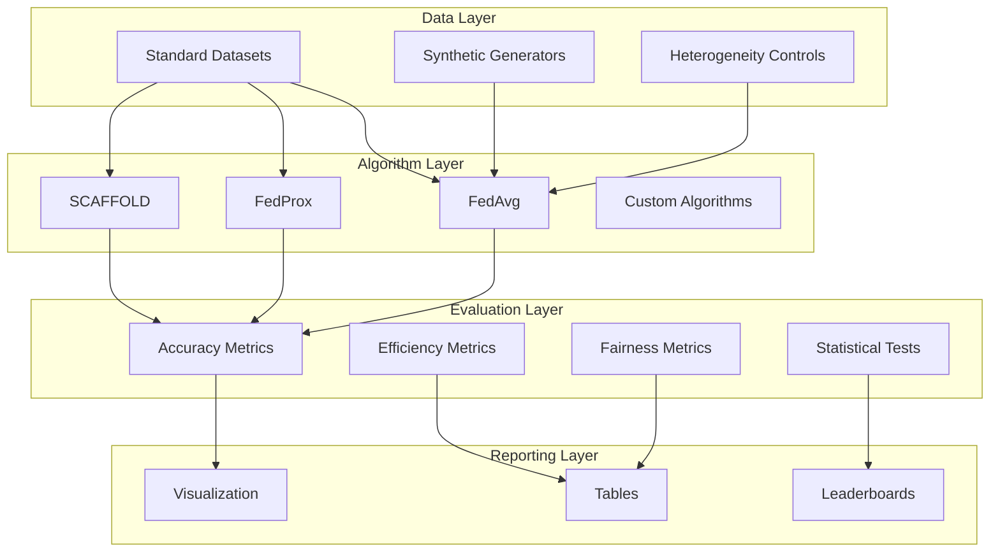

# Tutorial 061: FL Benchmarking

---

## Metadata

| Property | Value |
|----------|-------|
| **Tutorial ID** | 061 |
| **Title** | FL Benchmarking |
| **Category** | Evaluation |
| **Difficulty** | Intermediate |
| **Duration** | 90 minutes |
| **Prerequisites** | Tutorial 001-060 |
| **Author** | Unbitrium Contributors |
| **Last Updated** | January 2026 |

---

## Learning Objectives

By the end of this tutorial, you will be able to:

1. **Understand** comprehensive FL benchmarking methodologies and their importance.
2. **Implement** standardized evaluation pipelines for comparing FL algorithms.
3. **Design** reproducible experiments with proper statistical analysis.
4. **Analyze** performance across different algorithms and heterogeneity levels.
5. **Apply** standard FL datasets including LEAF benchmark suite.
6. **Evaluate** efficiency, accuracy, fairness, and privacy trade-offs.
7. **Create** benchmark reports with visualization and statistical tests.

---

## Prerequisites

- **Completed Tutorials**: 001-060
- **Knowledge**: Experimental design, statistics, ML evaluation
- **Libraries**: PyTorch, NumPy, SciPy, Matplotlib

```python
import torch
import torch.nn as nn
import torch.nn.functional as F
import numpy as np
from scipy import stats
import time
import json
from dataclasses import dataclass, field, asdict
from typing import Any, Dict, List, Optional, Tuple, Callable
from torch.utils.data import Dataset, DataLoader
import copy

print(f"PyTorch: {torch.__version__}")
print(f"NumPy: {np.__version__}")
```

---

## Background and Theory

### Why Benchmarking Matters

Federated learning research requires rigorous benchmarking to:

1. **Compare algorithms** fairly under controlled conditions
2. **Identify trade-offs** between accuracy, efficiency, and privacy
3. **Ensure reproducibility** of research results
4. **Understand** algorithm behavior across heterogeneity levels

### Benchmarking Dimensions

| Dimension | Metrics | Description | Importance |
|-----------|---------|-------------|------------|
| Accuracy | Test acc, F1, AUC | Model performance | Primary goal |
| Efficiency | Rounds, bytes, time | Resource usage | Practical deployment |
| Fairness | Client variance, min accuracy | Equal benefit | Ethical concerns |
| Privacy | DP budget, attack success | Data protection | Regulatory compliance |
| Robustness | Byzantine tolerance | Security | Real-world safety |
| Scalability | Client count, data size | System limits | Production viability |

### Standard FL Datasets

| Dataset | Task | Clients | Samples | Features |
|---------|------|---------|---------|----------|
| FEMNIST | Image classification | 3,550 | 805,263 | 28×28 images |
| Shakespeare | Next character | 715 | 4,226,158 | Text sequences |
| CelebA | Attribute prediction | 9,343 | 200,288 | Face images |
| Reddit | Language modeling | 1,660,820 | 56,587,343 | Comments |
| Sent140 | Sentiment analysis | 660,120 | 1,600,498 | Tweets |
| StackOverflow | Tag prediction | 342,477 | 135,818,730 | Questions |

### Heterogeneity Types

| Type | Description | Simulation Method |
|------|-------------|-------------------|
| Label skew | Uneven class distribution | Dirichlet partitioning |
| Feature skew | Different input distributions | Domain-based splitting |
| Quantity skew | Varying sample counts | Power-law distribution |
| Temporal skew | Time-varying patterns | Chronological splits |

### Benchmarking Architecture



---

## Implementation Code

### Part 1: Configuration and Data Structures

```python
#!/usr/bin/env python3
"""
Tutorial 061: FL Benchmarking

Comprehensive framework for benchmarking federated learning algorithms
with standardized evaluation protocols.

Author: Unbitrium Contributors
License: EUPL-1.2
"""

from __future__ import annotations
import copy
import time
import json
import hashlib
from dataclasses import dataclass, field, asdict
from typing import Any, Dict, List, Optional, Tuple, Callable
from enum import Enum
import numpy as np
import torch
import torch.nn as nn
import torch.nn.functional as F
from torch.utils.data import Dataset, DataLoader
from scipy import stats


class HeterogeneityType(Enum):
    """Types of data heterogeneity."""
    IID = "iid"
    DIRICHLET = "dirichlet"
    PATHOLOGICAL = "pathological"
    QUANTITY_SKEW = "quantity_skew"
    FEATURE_SKEW = "feature_skew"


@dataclass
class BenchmarkConfig:
    """Configuration for FL benchmarking experiments."""
    
    # Experiment identification
    experiment_name: str = "fl_benchmark"
    experiment_id: str = field(default_factory=lambda: "")
    
    # Training parameters
    num_rounds: int = 100
    num_clients: int = 100
    clients_per_round: int = 10
    local_epochs: int = 5
    batch_size: int = 32
    learning_rate: float = 0.01
    
    # Data heterogeneity
    heterogeneity_type: HeterogeneityType = HeterogeneityType.DIRICHLET
    dirichlet_alpha: float = 0.5
    pathological_shards: int = 2
    
    # Model configuration
    input_dim: int = 784
    hidden_dim: int = 128
    num_classes: int = 10
    
    # Evaluation
    eval_frequency: int = 5
    num_eval_clients: int = 20
    
    # Reproducibility
    seed: int = 42
    num_runs: int = 5
    seeds: List[int] = field(default_factory=list)
    
    def __post_init__(self):
        if not self.seeds:
            self.seeds = [self.seed + i * 1000 for i in range(self.num_runs)]
        if not self.experiment_id:
            config_str = json.dumps(asdict(self), sort_keys=True, default=str)
            self.experiment_id = hashlib.md5(config_str.encode()).hexdigest()[:8]


@dataclass
class RoundMetrics:
    """Metrics collected for each training round."""
    round_num: int
    global_accuracy: float
    global_loss: float
    client_accuracies: List[float]
    round_time_seconds: float
    bytes_communicated: int
    participating_clients: int
    
    def to_dict(self) -> Dict:
        return asdict(self)


@dataclass
class ExperimentResult:
    """Complete results from one experiment run."""
    config: BenchmarkConfig
    seed: int
    round_metrics: List[RoundMetrics]
    final_accuracy: float
    best_accuracy: float
    rounds_to_target: Dict[float, int]
    total_time: float
    total_bytes: int
    
    def to_dict(self) -> Dict:
        return {
            "seed": self.seed,
            "final_accuracy": self.final_accuracy,
            "best_accuracy": self.best_accuracy,
            "rounds_to_target": self.rounds_to_target,
            "total_time": self.total_time,
            "total_bytes": self.total_bytes,
        }


class BenchmarkDataset(Dataset):
    """Dataset for benchmarking with controlled heterogeneity."""
    
    def __init__(
        self,
        features: np.ndarray,
        labels: np.ndarray,
        client_id: int = 0,
    ):
        self.features = torch.FloatTensor(features)
        self.labels = torch.LongTensor(labels)
        self.client_id = client_id
    
    def __len__(self) -> int:
        return len(self.labels)
    
    def __getitem__(self, idx: int) -> Tuple[torch.Tensor, torch.Tensor]:
        return self.features[idx], self.labels[idx]
    
    @property
    def num_samples(self) -> int:
        return len(self.labels)
    
    def get_label_distribution(self, num_classes: int) -> np.ndarray:
        """Get distribution of labels in the dataset."""
        dist = np.zeros(num_classes)
        labels = self.labels.numpy()
        for c in range(num_classes):
            dist[c] = (labels == c).sum()
        return dist / dist.sum()
```

### Part 2: Data Generation and Partitioning

```python
class DataPartitioner:
    """Partition data with various heterogeneity patterns."""
    
    def __init__(self, config: BenchmarkConfig):
        self.config = config
    
    def create_iid_partitions(
        self,
        features: np.ndarray,
        labels: np.ndarray,
    ) -> List[BenchmarkDataset]:
        """Create IID partitions across clients."""
        n = len(labels)
        indices = np.random.permutation(n)
        splits = np.array_split(indices, self.config.num_clients)
        
        return [
            BenchmarkDataset(features[split], labels[split], i)
            for i, split in enumerate(splits)
        ]
    
    def create_dirichlet_partitions(
        self,
        features: np.ndarray,
        labels: np.ndarray,
    ) -> List[BenchmarkDataset]:
        """Create non-IID partitions using Dirichlet distribution."""
        num_classes = self.config.num_classes
        alpha = self.config.dirichlet_alpha
        
        # Generate label distribution for each client
        label_distributions = np.random.dirichlet(
            [alpha] * num_classes,
            self.config.num_clients
        )
        
        # Organize data by class
        class_indices = {c: np.where(labels == c)[0] for c in range(num_classes)}
        
        # Assign data to clients
        client_indices = [[] for _ in range(self.config.num_clients)]
        
        for c in range(num_classes):
            class_idx = class_indices[c].copy()
            np.random.shuffle(class_idx)
            
            # Distribute according to Dirichlet proportions
            proportions = label_distributions[:, c]
            proportions = proportions / proportions.sum()
            
            split_points = (np.cumsum(proportions) * len(class_idx)).astype(int)
            splits = np.split(class_idx, split_points[:-1])
            
            for i, split in enumerate(splits):
                client_indices[i].extend(split.tolist())
        
        return [
            BenchmarkDataset(
                features[np.array(indices)],
                labels[np.array(indices)],
                i
            )
            for i, indices in enumerate(client_indices)
            if len(indices) > 0
        ]
    
    def create_pathological_partitions(
        self,
        features: np.ndarray,
        labels: np.ndarray,
    ) -> List[BenchmarkDataset]:
        """Create pathological non-IID partitions (few classes per client)."""
        num_classes = self.config.num_classes
        shards = self.config.pathological_shards
        
        # Sort by label
        sorted_indices = np.argsort(labels)
        
        # Create shards
        num_shards = self.config.num_clients * shards
        shard_size = len(labels) // num_shards
        shard_indices = [
            sorted_indices[i * shard_size:(i + 1) * shard_size]
            for i in range(num_shards)
        ]
        
        # Randomly assign shards to clients
        np.random.shuffle(shard_indices)
        
        client_datasets = []
        for i in range(self.config.num_clients):
            client_shards = shard_indices[i * shards:(i + 1) * shards]
            indices = np.concatenate(client_shards)
            client_datasets.append(
                BenchmarkDataset(features[indices], labels[indices], i)
            )
        
        return client_datasets
    
    def create_partitions(
        self,
        features: np.ndarray,
        labels: np.ndarray,
    ) -> List[BenchmarkDataset]:
        """Create partitions based on configuration."""
        if self.config.heterogeneity_type == HeterogeneityType.IID:
            return self.create_iid_partitions(features, labels)
        elif self.config.heterogeneity_type == HeterogeneityType.DIRICHLET:
            return self.create_dirichlet_partitions(features, labels)
        elif self.config.heterogeneity_type == HeterogeneityType.PATHOLOGICAL:
            return self.create_pathological_partitions(features, labels)
        else:
            return self.create_iid_partitions(features, labels)


class SyntheticDataGenerator:
    """Generate synthetic data for benchmarking."""
    
    def __init__(self, config: BenchmarkConfig):
        self.config = config
    
    def generate(
        self,
        num_train: int = 60000,
        num_test: int = 10000,
    ) -> Tuple[np.ndarray, np.ndarray, np.ndarray, np.ndarray]:
        """Generate synthetic classification data."""
        # Generate train data
        train_features = np.random.randn(num_train, self.config.input_dim).astype(np.float32)
        train_labels = np.random.randint(0, self.config.num_classes, num_train)
        
        # Add class-specific patterns
        for i in range(num_train):
            label = train_labels[i]
            start_idx = (label * self.config.input_dim) // self.config.num_classes
            end_idx = start_idx + self.config.input_dim // self.config.num_classes
            train_features[i, start_idx:end_idx] += 2.0
        
        # Generate test data
        test_features = np.random.randn(num_test, self.config.input_dim).astype(np.float32)
        test_labels = np.random.randint(0, self.config.num_classes, num_test)
        
        for i in range(num_test):
            label = test_labels[i]
            start_idx = (label * self.config.input_dim) // self.config.num_classes
            end_idx = start_idx + self.config.input_dim // self.config.num_classes
            test_features[i, start_idx:end_idx] += 2.0
        
        return train_features, train_labels, test_features, test_labels
```

### Part 3: Model and Training

```python
class BenchmarkModel(nn.Module):
    """Standard model for benchmarking."""
    
    def __init__(self, config: BenchmarkConfig):
        super().__init__()
        self.config = config
        
        self.network = nn.Sequential(
            nn.Linear(config.input_dim, config.hidden_dim),
            nn.ReLU(),
            nn.Dropout(0.2),
            nn.Linear(config.hidden_dim, config.hidden_dim // 2),
            nn.ReLU(),
            nn.Dropout(0.2),
            nn.Linear(config.hidden_dim // 2, config.num_classes),
        )
    
    def forward(self, x: torch.Tensor) -> torch.Tensor:
        return self.network(x)
    
    def get_size_bytes(self) -> int:
        return sum(p.numel() * 4 for p in self.parameters())


class FLClient:
    """Standard FL client for benchmarking."""
    
    def __init__(
        self,
        client_id: int,
        dataset: BenchmarkDataset,
        config: BenchmarkConfig,
    ):
        self.client_id = client_id
        self.dataset = dataset
        self.config = config
    
    @property
    def num_samples(self) -> int:
        return len(self.dataset)
    
    def train(self, model: nn.Module) -> Dict[str, Any]:
        """Perform local training."""
        local_model = copy.deepcopy(model)
        optimizer = torch.optim.SGD(
            local_model.parameters(),
            lr=self.config.learning_rate,
            momentum=0.9,
        )
        
        loader = DataLoader(
            self.dataset,
            batch_size=self.config.batch_size,
            shuffle=True,
        )
        
        local_model.train()
        total_loss = 0.0
        num_samples = 0
        
        for _ in range(self.config.local_epochs):
            for features, labels in loader:
                optimizer.zero_grad()
                outputs = local_model(features)
                loss = F.cross_entropy(outputs, labels)
                loss.backward()
                optimizer.step()
                
                total_loss += loss.item() * len(labels)
                num_samples += len(labels)
        
        return {
            "state_dict": {k: v.cpu() for k, v in local_model.state_dict().items()},
            "num_samples": self.num_samples,
            "loss": total_loss / num_samples if num_samples > 0 else 0,
            "client_id": self.client_id,
        }
    
    def evaluate(self, model: nn.Module) -> Dict[str, float]:
        """Evaluate model on local data."""
        model.eval()
        loader = DataLoader(self.dataset, batch_size=128)
        
        correct = 0
        total = 0
        total_loss = 0.0
        
        with torch.no_grad():
            for features, labels in loader:
                outputs = model(features)
                loss = F.cross_entropy(outputs, labels)
                preds = outputs.argmax(dim=1)
                
                correct += (preds == labels).sum().item()
                total += len(labels)
                total_loss += loss.item() * len(labels)
        
        return {
            "accuracy": correct / total if total > 0 else 0,
            "loss": total_loss / total if total > 0 else 0,
        }


class FLServer:
    """Standard FL server for benchmarking."""
    
    def __init__(
        self,
        model: nn.Module,
        clients: List[FLClient],
        test_dataset: Dataset,
        config: BenchmarkConfig,
    ):
        self.model = model
        self.clients = clients
        self.test_dataset = test_dataset
        self.config = config
        self.history: List[RoundMetrics] = []
    
    def select_clients(self) -> List[FLClient]:
        """Select clients for this round."""
        num_selected = min(self.config.clients_per_round, len(self.clients))
        return list(np.random.choice(self.clients, num_selected, replace=False))
    
    def aggregate(self, updates: List[Dict]) -> None:
        """Aggregate client updates using FedAvg."""
        total_samples = sum(u["num_samples"] for u in updates)
        
        new_state = {}
        for key in self.model.state_dict():
            new_state[key] = sum(
                (u["num_samples"] / total_samples) * u["state_dict"][key].float()
                for u in updates
            )
        
        self.model.load_state_dict(new_state)
    
    def evaluate_global(self) -> Tuple[float, float]:
        """Evaluate model on test set."""
        self.model.eval()
        loader = DataLoader(self.test_dataset, batch_size=128)
        
        correct = 0
        total = 0
        total_loss = 0.0
        
        with torch.no_grad():
            for features, labels in loader:
                outputs = self.model(features)
                loss = F.cross_entropy(outputs, labels)
                preds = outputs.argmax(dim=1)
                
                correct += (preds == labels).sum().item()
                total += len(labels)
                total_loss += loss.item() * len(labels)
        
        return correct / total, total_loss / total
    
    def evaluate_clients(self) -> List[float]:
        """Evaluate model on subset of clients."""
        eval_clients = self.clients[:self.config.num_eval_clients]
        return [c.evaluate(self.model)["accuracy"] for c in eval_clients]
    
    def train_round(self, round_num: int) -> RoundMetrics:
        """Execute one training round."""
        start_time = time.time()
        
        # Select and train clients
        selected = self.select_clients()
        updates = [client.train(self.model) for client in selected]
        
        # Aggregate
        self.aggregate(updates)
        
        # Calculate communication
        bytes_per_update = self.model.get_size_bytes()
        total_bytes = len(updates) * bytes_per_update * 2  # up + down
        
        # Evaluate
        global_acc, global_loss = self.evaluate_global()
        client_accs = self.evaluate_clients()
        
        elapsed = time.time() - start_time
        
        return RoundMetrics(
            round_num=round_num,
            global_accuracy=global_acc,
            global_loss=global_loss,
            client_accuracies=client_accs,
            round_time_seconds=elapsed,
            bytes_communicated=total_bytes,
            participating_clients=len(updates),
        )
    
    def train(self) -> List[RoundMetrics]:
        """Run full training."""
        for round_num in range(self.config.num_rounds):
            metrics = self.train_round(round_num)
            self.history.append(metrics)
            
            if (round_num + 1) % self.config.eval_frequency == 0:
                print(f"Round {round_num + 1}: acc={metrics.global_accuracy:.4f}")
        
        return self.history
```

### Part 4: Benchmark Runner and Analysis

```python
class BenchmarkRunner:
    """Run and analyze FL benchmarks."""
    
    def __init__(self, config: BenchmarkConfig):
        self.config = config
        self.results: List[ExperimentResult] = []
    
    def run_single(self, seed: int) -> ExperimentResult:
        """Run a single experiment."""
        torch.manual_seed(seed)
        np.random.seed(seed)
        
        # Generate data
        generator = SyntheticDataGenerator(self.config)
        train_x, train_y, test_x, test_y = generator.generate()
        
        # Partition data
        partitioner = DataPartitioner(self.config)
        client_datasets = partitioner.create_partitions(train_x, train_y)
        test_dataset = BenchmarkDataset(test_x, test_y)
        
        # Create clients
        clients = [
            FLClient(i, dataset, self.config)
            for i, dataset in enumerate(client_datasets)
        ]
        
        # Create server
        model = BenchmarkModel(self.config)
        server = FLServer(model, clients, test_dataset, self.config)
        
        # Train
        start_time = time.time()
        history = server.train()
        total_time = time.time() - start_time
        
        # Compute summary metrics
        final_acc = history[-1].global_accuracy
        best_acc = max(m.global_accuracy for m in history)
        total_bytes = sum(m.bytes_communicated for m in history)
        
        # Rounds to reach targets
        targets = [0.5, 0.6, 0.7, 0.8, 0.9]
        rounds_to_target = {}
        for target in targets:
            for m in history:
                if m.global_accuracy >= target:
                    rounds_to_target[target] = m.round_num
                    break
            else:
                rounds_to_target[target] = -1
        
        return ExperimentResult(
            config=self.config,
            seed=seed,
            round_metrics=history,
            final_accuracy=final_acc,
            best_accuracy=best_acc,
            rounds_to_target=rounds_to_target,
            total_time=total_time,
            total_bytes=total_bytes,
        )
    
    def run_all(self) -> List[ExperimentResult]:
        """Run all experiment seeds."""
        for seed in self.config.seeds:
            print(f"\n--- Running seed {seed} ---")
            result = self.run_single(seed)
            self.results.append(result)
        
        return self.results
    
    def get_summary(self) -> Dict[str, Any]:
        """Get summary statistics across runs."""
        if not self.results:
            return {}
        
        final_accs = [r.final_accuracy for r in self.results]
        best_accs = [r.best_accuracy for r in self.results]
        times = [r.total_time for r in self.results]
        
        return {
            "num_runs": len(self.results),
            "final_accuracy_mean": np.mean(final_accs),
            "final_accuracy_std": np.std(final_accs),
            "final_accuracy_ci95": 1.96 * np.std(final_accs) / np.sqrt(len(final_accs)),
            "best_accuracy_mean": np.mean(best_accs),
            "best_accuracy_std": np.std(best_accs),
            "avg_time_seconds": np.mean(times),
        }
    
    def compare_with(self, other: 'BenchmarkRunner') -> Dict[str, Any]:
        """Statistical comparison with another benchmark."""
        my_accs = [r.final_accuracy for r in self.results]
        other_accs = [r.final_accuracy for r in other.results]
        
        t_stat, p_value = stats.ttest_ind(my_accs, other_accs)
        
        pooled_std = np.sqrt((np.var(my_accs) + np.var(other_accs)) / 2)
        effect_size = (np.mean(my_accs) - np.mean(other_accs)) / pooled_std
        
        return {
            "t_statistic": t_stat,
            "p_value": p_value,
            "significant_at_05": p_value < 0.05,
            "significant_at_01": p_value < 0.01,
            "cohens_d": effect_size,
            "mean_difference": np.mean(my_accs) - np.mean(other_accs),
        }


def run_benchmark_example():
    """Example benchmark run."""
    config = BenchmarkConfig(
        num_rounds=30,
        num_clients=20,
        clients_per_round=5,
        num_runs=3,
        input_dim=32,
        hidden_dim=64,
    )
    
    runner = BenchmarkRunner(config)
    runner.run_all()
    
    summary = runner.get_summary()
    print(f"\n=== Benchmark Summary ===")
    for key, value in summary.items():
        if isinstance(value, float):
            print(f"{key}: {value:.4f}")
        else:
            print(f"{key}: {value}")


if __name__ == "__main__":
    run_benchmark_example()
```

---

## Metrics and Evaluation

### Accuracy Metrics

| Metric | Formula | Description |
|--------|---------|-------------|
| Global Accuracy | Correct / Total | Overall model performance |
| Per-Client Accuracy | Individual client scores | Fairness indicator |
| Accuracy Variance | Var(client accuracies) | Fairness measure |

### Efficiency Metrics

| Metric | Formula | Description |
|--------|---------|-------------|
| Communication Cost | Bytes × Rounds | Total data transferred |
| Rounds to Target | First round achieving X% | Convergence speed |
| Wall-clock Time | End - Start | Real-world training time |

---

## Exercises

1. **Exercise 1**: Add LEAF dataset integration.
2. **Exercise 2**: Implement additional aggregation methods.
3. **Exercise 3**: Add fairness-aware benchmarking.
4. **Exercise 4**: Create visualization dashboard.
5. **Exercise 5**: Implement distributed benchmarking.

---

## References

1. Caldas, S., et al. (2019). LEAF: A benchmark for federated settings. *arXiv*.
2. He, C., et al. (2020). FedML: A research library and benchmark. *arXiv*.
3. Li, T., et al. (2020). Federated optimization in heterogeneous networks. *MLSys*.
4. Reddi, S., et al. (2021). Adaptive federated optimization. In *ICLR*.
5. Lai, F., et al. (2022). FedScale: Benchmarking model and system performance. In *ICML*.

---

*Copyright 2026 Olaf Yunus Laitinen Imanov and Contributors. Released under EUPL 1.2.*
