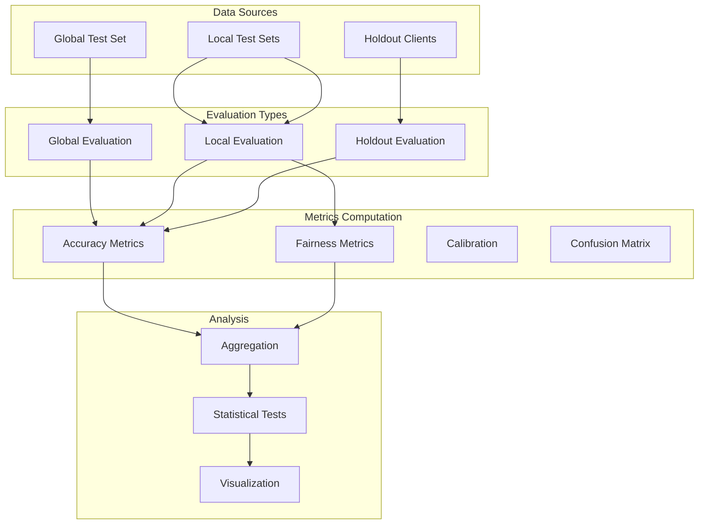

# Tutorial 062: FL Model Evaluation

---

## Metadata

| Property | Value |
|----------|-------|
| **Tutorial ID** | 062 |
| **Title** | FL Model Evaluation |
| **Category** | Evaluation |
| **Difficulty** | Intermediate |
| **Duration** | 90 minutes |
| **Prerequisites** | Tutorial 001-061 |
| **Author** | Unbitrium Contributors |
| **Last Updated** | January 2026 |

---

## Learning Objectives

By the end of this tutorial, you will be able to:

1. **Understand** FL-specific evaluation challenges and methodologies.
2. **Implement** global, local, and weighted evaluation protocols.
3. **Design** fair evaluation procedures across heterogeneous clients.
4. **Analyze** per-client performance and identify underperforming groups.
5. **Apply** specialized FL metrics including fairness indices.
6. **Evaluate** model generalization across different data distributions.
7. **Create** comprehensive evaluation reports and visualizations.

---

## Prerequisites

- **Completed Tutorials**: 001-061
- **Knowledge**: ML evaluation, metrics, statistics
- **Libraries**: PyTorch, NumPy, scikit-learn

```python
import torch
import torch.nn as nn
import torch.nn.functional as F
import numpy as np
from dataclasses import dataclass, field
from typing import Any, Dict, List, Optional, Tuple
from torch.utils.data import Dataset, DataLoader
import copy

print(f"PyTorch: {torch.__version__}")
```

---

## Background and Theory

### Evaluation Challenges in FL

| Challenge | Description | Solution |
|-----------|-------------|----------|
| Distributed data | Cannot centralize test data | Local + global evaluation |
| Heterogeneity | Different client distributions | Weighted metrics |
| Privacy | Test data is private | Federated evaluation |
| Fairness | Unequal client benefit | Per-client analysis |
| Generalization | Unseen clients/domains | Holdout client testing |

### Evaluation Types

| Type | Description | When to Use | Pros | Cons |
|------|-------------|-------------|------|------|
| Global | Centralized test set | Standard benchmark | Comparable | May not reflect real use |
| Local | Per-client test | Personalization | Realistic | Hard to aggregate |
| Weighted | Sample-weighted avg | Fair comparison | Accounts for size | Biased to large clients |
| Worst-case | Min client accuracy | Fairness focus | Ensures minimum quality | Ignores overall perf |
| Holdout | Unseen clients | Generalization | True test | Reduces training data |

### Fairness Metrics

| Metric | Formula | Interpretation |
|--------|---------|----------------|
| Jain's Index | (Σx)² / (n×Σx²) | 1 = perfect fairness |
| Gini Coefficient | Σ\|xi - xj\| / 2n²μ | 0 = perfect equality |
| Accuracy Gap | max(x) - min(x) | Lower is better |
| Worst 10% | 10th percentile | Minimum performance |
| CoV | σ/μ | Lower is more consistent |

### Evaluation Pipeline



---

## Implementation Code

### Part 1: Configuration and Data Structures

```python
#!/usr/bin/env python3
"""
Tutorial 062: FL Model Evaluation

Comprehensive evaluation framework for federated learning models
with support for global, local, and fairness-aware metrics.

Author: Unbitrium Contributors
License: EUPL-1.2
"""

from __future__ import annotations
import copy
from dataclasses import dataclass, field
from typing import Any, Dict, List, Optional, Tuple
from enum import Enum
import numpy as np
import torch
import torch.nn as nn
import torch.nn.functional as F
from torch.utils.data import Dataset, DataLoader


class EvaluationType(Enum):
    """Types of evaluation."""
    GLOBAL = "global"
    LOCAL = "local"
    WEIGHTED = "weighted"
    WORST_CASE = "worst_case"
    HOLDOUT = "holdout"


@dataclass
class EvalConfig:
    """Configuration for FL evaluation."""
    num_classes: int = 10
    eval_batch_size: int = 128
    compute_confusion: bool = True
    compute_calibration: bool = True
    calibration_bins: int = 10
    fairness_threshold: float = 0.8
    worst_percentile: float = 10.0
    seed: int = 42


@dataclass
class ClientMetrics:
    """Metrics for a single client."""
    client_id: int
    accuracy: float
    loss: float
    num_samples: int
    per_class_accuracy: Dict[int, float]
    confusion_matrix: Optional[np.ndarray] = None
    confidence_mean: float = 0.0
    confidence_std: float = 0.0


@dataclass
class GlobalMetrics:
    """Global evaluation metrics."""
    accuracy: float
    loss: float
    per_class_accuracy: Dict[int, float]
    macro_f1: float
    weighted_f1: float
    confusion_matrix: Optional[np.ndarray] = None


@dataclass
class FairnessMetrics:
    """Fairness evaluation metrics."""
    jain_index: float
    gini_coefficient: float
    accuracy_gap: float
    worst_10_percent: float
    coefficient_of_variation: float
    num_underperforming: int
    accuracy_histogram: List[int]


@dataclass
class EvaluationReport:
    """Complete evaluation report."""
    global_metrics: GlobalMetrics
    client_metrics: List[ClientMetrics]
    fairness_metrics: FairnessMetrics
    weighted_accuracy: float
    holdout_accuracy: Optional[float] = None


class EvalDataset(Dataset):
    """Dataset for evaluation."""
    
    def __init__(
        self,
        features: np.ndarray,
        labels: np.ndarray,
        client_id: int = 0,
    ):
        self.features = torch.FloatTensor(features)
        self.labels = torch.LongTensor(labels)
        self.client_id = client_id
    
    def __len__(self) -> int:
        return len(self.labels)
    
    def __getitem__(self, idx: int) -> Tuple[torch.Tensor, torch.Tensor]:
        return self.features[idx], self.labels[idx]


class EvalModel(nn.Module):
    """Model for evaluation demonstrations."""
    
    def __init__(self, input_dim: int = 32, num_classes: int = 10):
        super().__init__()
        self.network = nn.Sequential(
            nn.Linear(input_dim, 64),
            nn.ReLU(),
            nn.Linear(64, 32),
            nn.ReLU(),
            nn.Linear(32, num_classes),
        )
    
    def forward(self, x: torch.Tensor) -> torch.Tensor:
        return self.network(x)
    
    def predict_proba(self, x: torch.Tensor) -> torch.Tensor:
        logits = self.forward(x)
        return F.softmax(logits, dim=1)
```

### Part 2: Core Evaluation Functions

```python
class FLEvaluator:
    """Comprehensive FL model evaluator."""
    
    def __init__(self, config: EvalConfig):
        self.config = config
    
    def evaluate_on_dataset(
        self,
        model: nn.Module,
        dataset: Dataset,
        client_id: int = 0,
    ) -> ClientMetrics:
        """Evaluate model on a single dataset."""
        model.eval()
        loader = DataLoader(
            dataset,
            batch_size=self.config.eval_batch_size,
            shuffle=False,
        )
        
        all_preds = []
        all_labels = []
        all_probs = []
        total_loss = 0.0
        num_samples = 0
        
        with torch.no_grad():
            for features, labels in loader:
                outputs = model(features)
                probs = F.softmax(outputs, dim=1)
                preds = outputs.argmax(dim=1)
                loss = F.cross_entropy(outputs, labels)
                
                all_preds.extend(preds.cpu().numpy())
                all_labels.extend(labels.cpu().numpy())
                all_probs.extend(probs.cpu().numpy())
                total_loss += loss.item() * len(labels)
                num_samples += len(labels)
        
        all_preds = np.array(all_preds)
        all_labels = np.array(all_labels)
        all_probs = np.array(all_probs)
        
        # Compute metrics
        accuracy = (all_preds == all_labels).mean()
        avg_loss = total_loss / num_samples if num_samples > 0 else 0
        
        # Per-class accuracy
        per_class_acc = {}
        for c in range(self.config.num_classes):
            mask = all_labels == c
            if mask.sum() > 0:
                per_class_acc[c] = (all_preds[mask] == c).mean()
            else:
                per_class_acc[c] = 0.0
        
        # Confidence statistics
        max_probs = all_probs.max(axis=1)
        conf_mean = max_probs.mean()
        conf_std = max_probs.std()
        
        # Confusion matrix
        confusion = None
        if self.config.compute_confusion:
            confusion = np.zeros((self.config.num_classes, self.config.num_classes), dtype=int)
            for true, pred in zip(all_labels, all_preds):
                confusion[true, pred] += 1
        
        return ClientMetrics(
            client_id=client_id,
            accuracy=accuracy,
            loss=avg_loss,
            num_samples=num_samples,
            per_class_accuracy=per_class_acc,
            confusion_matrix=confusion,
            confidence_mean=conf_mean,
            confidence_std=conf_std,
        )
    
    def evaluate_global(
        self,
        model: nn.Module,
        test_dataset: Dataset,
    ) -> GlobalMetrics:
        """Evaluate model on global test set."""
        metrics = self.evaluate_on_dataset(model, test_dataset, client_id=-1)
        
        # Compute F1 scores
        if metrics.confusion_matrix is not None:
            precision, recall, f1 = self._compute_f1_scores(metrics.confusion_matrix)
            macro_f1 = np.mean(f1)
            
            class_counts = metrics.confusion_matrix.sum(axis=1)
            weighted_f1 = np.average(f1, weights=class_counts)
        else:
            macro_f1 = 0.0
            weighted_f1 = 0.0
        
        return GlobalMetrics(
            accuracy=metrics.accuracy,
            loss=metrics.loss,
            per_class_accuracy=metrics.per_class_accuracy,
            macro_f1=macro_f1,
            weighted_f1=weighted_f1,
            confusion_matrix=metrics.confusion_matrix,
        )
    
    def evaluate_local(
        self,
        model: nn.Module,
        client_datasets: List[Dataset],
    ) -> List[ClientMetrics]:
        """Evaluate model on each client's local data."""
        return [
            self.evaluate_on_dataset(model, dataset, client_id=i)
            for i, dataset in enumerate(client_datasets)
        ]
    
    def compute_fairness_metrics(
        self,
        client_metrics: List[ClientMetrics],
    ) -> FairnessMetrics:
        """Compute fairness metrics across clients."""
        accuracies = np.array([m.accuracy for m in client_metrics])
        n = len(accuracies)
        
        if n == 0:
            return FairnessMetrics(
                jain_index=0, gini_coefficient=1, accuracy_gap=1,
                worst_10_percent=0, coefficient_of_variation=1,
                num_underperforming=0, accuracy_histogram=[],
            )
        
        # Jain's fairness index
        jain = (accuracies.sum() ** 2) / (n * (accuracies ** 2).sum() + 1e-8)
        
        # Gini coefficient
        diffs = np.abs(accuracies[:, None] - accuracies[None, :]).sum()
        gini = diffs / (2 * n * n * accuracies.mean() + 1e-8)
        
        # Accuracy gap
        gap = accuracies.max() - accuracies.min()
        
        # Worst percentile
        worst_pct = np.percentile(accuracies, self.config.worst_percentile)
        
        # Coefficient of variation
        cov = accuracies.std() / (accuracies.mean() + 1e-8)
        
        # Underperforming clients
        threshold = self.config.fairness_threshold * accuracies.mean()
        num_under = (accuracies < threshold).sum()
        
        # Histogram
        bins = np.linspace(0, 1, 11)
        histogram = np.histogram(accuracies, bins=bins)[0].tolist()
        
        return FairnessMetrics(
            jain_index=jain,
            gini_coefficient=gini,
            accuracy_gap=gap,
            worst_10_percent=worst_pct,
            coefficient_of_variation=cov,
            num_underperforming=int(num_under),
            accuracy_histogram=histogram,
        )
    
    def compute_weighted_accuracy(
        self,
        client_metrics: List[ClientMetrics],
    ) -> float:
        """Compute sample-weighted accuracy."""
        total_correct = sum(m.accuracy * m.num_samples for m in client_metrics)
        total_samples = sum(m.num_samples for m in client_metrics)
        return total_correct / total_samples if total_samples > 0 else 0
    
    def _compute_f1_scores(
        self,
        confusion: np.ndarray,
    ) -> Tuple[np.ndarray, np.ndarray, np.ndarray]:
        """Compute per-class precision, recall, and F1."""
        num_classes = confusion.shape[0]
        precision = np.zeros(num_classes)
        recall = np.zeros(num_classes)
        f1 = np.zeros(num_classes)
        
        for c in range(num_classes):
            tp = confusion[c, c]
            fp = confusion[:, c].sum() - tp
            fn = confusion[c, :].sum() - tp
            
            precision[c] = tp / (tp + fp + 1e-8)
            recall[c] = tp / (tp + fn + 1e-8)
            f1[c] = 2 * precision[c] * recall[c] / (precision[c] + recall[c] + 1e-8)
        
        return precision, recall, f1
    
    def full_evaluation(
        self,
        model: nn.Module,
        global_test: Dataset,
        client_datasets: List[Dataset],
        holdout_dataset: Optional[Dataset] = None,
    ) -> EvaluationReport:
        """Perform comprehensive evaluation."""
        global_metrics = self.evaluate_global(model, global_test)
        client_metrics = self.evaluate_local(model, client_datasets)
        fairness_metrics = self.compute_fairness_metrics(client_metrics)
        weighted_acc = self.compute_weighted_accuracy(client_metrics)
        
        holdout_acc = None
        if holdout_dataset is not None:
            holdout_metrics = self.evaluate_on_dataset(model, holdout_dataset, client_id=-2)
            holdout_acc = holdout_metrics.accuracy
        
        return EvaluationReport(
            global_metrics=global_metrics,
            client_metrics=client_metrics,
            fairness_metrics=fairness_metrics,
            weighted_accuracy=weighted_acc,
            holdout_accuracy=holdout_acc,
        )
```

### Part 3: Calibration and Analysis

```python
class CalibrationAnalyzer:
    """Analyze model calibration."""
    
    def __init__(self, num_bins: int = 10):
        self.num_bins = num_bins
    
    def compute_ece(
        self,
        confidences: np.ndarray,
        correct: np.ndarray,
    ) -> float:
        """Compute Expected Calibration Error."""
        bin_boundaries = np.linspace(0, 1, self.num_bins + 1)
        ece = 0.0
        
        for i in range(self.num_bins):
            mask = (confidences > bin_boundaries[i]) & (confidences <= bin_boundaries[i + 1])
            if mask.sum() > 0:
                bin_acc = correct[mask].mean()
                bin_conf = confidences[mask].mean()
                ece += mask.sum() * abs(bin_acc - bin_conf)
        
        return ece / len(confidences)
    
    def get_reliability_diagram_data(
        self,
        confidences: np.ndarray,
        correct: np.ndarray,
    ) -> Tuple[np.ndarray, np.ndarray, np.ndarray]:
        """Get data for reliability diagram."""
        bin_boundaries = np.linspace(0, 1, self.num_bins + 1)
        bin_centers = (bin_boundaries[:-1] + bin_boundaries[1:]) / 2
        bin_accuracies = np.zeros(self.num_bins)
        bin_counts = np.zeros(self.num_bins)
        
        for i in range(self.num_bins):
            mask = (confidences > bin_boundaries[i]) & (confidences <= bin_boundaries[i + 1])
            if mask.sum() > 0:
                bin_accuracies[i] = correct[mask].mean()
                bin_counts[i] = mask.sum()
        
        return bin_centers, bin_accuracies, bin_counts


class EvaluationAnalyzer:
    """Analyze evaluation results."""
    
    @staticmethod
    def identify_underperforming_clients(
        client_metrics: List[ClientMetrics],
        threshold_percentile: float = 25,
    ) -> List[int]:
        """Identify clients performing below threshold."""
        accuracies = [m.accuracy for m in client_metrics]
        threshold = np.percentile(accuracies, threshold_percentile)
        return [m.client_id for m in client_metrics if m.accuracy < threshold]
    
    @staticmethod
    def analyze_class_performance(
        client_metrics: List[ClientMetrics],
        num_classes: int,
    ) -> Dict[int, Dict[str, float]]:
        """Analyze per-class performance across clients."""
        class_stats = {}
        
        for c in range(num_classes):
            class_accs = [
                m.per_class_accuracy.get(c, 0)
                for m in client_metrics
                if c in m.per_class_accuracy
            ]
            if class_accs:
                class_stats[c] = {
                    "mean": np.mean(class_accs),
                    "std": np.std(class_accs),
                    "min": np.min(class_accs),
                    "max": np.max(class_accs),
                }
        
        return class_stats
    
    @staticmethod
    def compute_correlation_with_size(
        client_metrics: List[ClientMetrics],
    ) -> float:
        """Compute correlation between dataset size and accuracy."""
        sizes = [m.num_samples for m in client_metrics]
        accs = [m.accuracy for m in client_metrics]
        
        if len(sizes) < 2:
            return 0.0
        
        return np.corrcoef(sizes, accs)[0, 1]


def create_test_scenario():
    """Create test scenario for demonstration."""
    np.random.seed(42)
    torch.manual_seed(42)
    
    config = EvalConfig()
    
    # Create datasets
    num_clients = 10
    client_datasets = []
    for i in range(num_clients):
        n = np.random.randint(50, 200)
        x = np.random.randn(n, 32).astype(np.float32)
        y = np.random.randint(0, 10, n)
        for j in range(n):
            x[j, y[j] % 32] += 2.0 + i * 0.1
        client_datasets.append(EvalDataset(x, y, client_id=i))
    
    # Global test
    test_x = np.random.randn(500, 32).astype(np.float32)
    test_y = np.random.randint(0, 10, 500)
    for j in range(500):
        test_x[j, test_y[j] % 32] += 2.0
    global_test = EvalDataset(test_x, test_y)
    
    # Model
    model = EvalModel()
    
    # Evaluate
    evaluator = FLEvaluator(config)
    report = evaluator.full_evaluation(model, global_test, client_datasets)
    
    print(f"Global Accuracy: {report.global_metrics.accuracy:.4f}")
    print(f"Weighted Accuracy: {report.weighted_accuracy:.4f}")
    print(f"Jain Index: {report.fairness_metrics.jain_index:.4f}")
    print(f"Accuracy Gap: {report.fairness_metrics.accuracy_gap:.4f}")
    
    analyzer = EvaluationAnalyzer()
    underperforming = analyzer.identify_underperforming_clients(report.client_metrics)
    print(f"Underperforming clients: {underperforming}")


if __name__ == "__main__":
    create_test_scenario()
```

---

## Metrics and Evaluation Summary

### Accuracy Metrics

| Metric | Description | Range |
|--------|-------------|-------|
| Global Accuracy | Overall correct predictions | 0-1 |
| Per-Class Accuracy | Accuracy per label | 0-1 |
| Macro F1 | Unweighted average F1 | 0-1 |
| Weighted F1 | Sample-weighted F1 | 0-1 |

### Fairness Metrics

| Metric | Description | Optimal |
|--------|-------------|---------|
| Jain Index | Fairness of distribution | 1.0 |
| Gini Coefficient | Inequality measure | 0.0 |
| Accuracy Gap | Max - Min accuracy | 0.0 |
| CoV | Relative standard deviation | 0.0 |

---

## Exercises

1. **Exercise 1**: Implement AUC-ROC evaluation.
2. **Exercise 2**: Add calibration temperature scaling.
3. **Exercise 3**: Create evaluation visualization dashboard.
4. **Exercise 4**: Implement group fairness metrics.
5. **Exercise 5**: Add confidence interval estimation.

---

## References

1. Li, T., et al. (2020). Fair resource allocation in federated learning. In *ICLR*.
2. Kairouz, P., et al. (2021). Advances and open problems in FL. *FnTML*.
3. Mohri, M., et al. (2019). Agnostic federated learning. In *ICML*.
4. Wang, H., et al. (2021). Federated evaluation for heterogeneous data. *arXiv*.
5. Guo, C., et al. (2017). On calibration of modern neural networks. In *ICML*.

---

*Copyright 2026 Olaf Yunus Laitinen Imanov and Contributors. Released under EUPL 1.2.*
