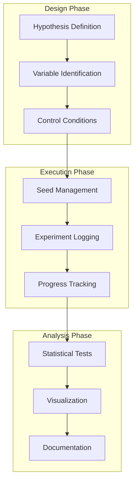

# Tutorial 063: FL Experimentation Best Practices

---

## Metadata

| Property | Value |
|----------|-------|
| **Tutorial ID** | 063 |
| **Title** | FL Experimentation Best Practices |
| **Category** | Evaluation |
| **Difficulty** | Intermediate |
| **Duration** | 90 minutes |
| **Prerequisites** | Tutorial 001-062 |
| **Author** | Unbitrium Contributors |
| **Last Updated** | January 2026 |

---

## Learning Objectives

By the end of this tutorial, you will be able to:

1. **Understand** FL experimentation challenges and pitfalls.
2. **Implement** reproducible experiments with proper seed management.
3. **Design** proper ablation studies for FL research.
4. **Apply** statistical significance testing for FL results.
5. **Create** comprehensive experiment tracking systems.
6. **Evaluate** result reliability and confidence intervals.
7. **Document** experiments for reproducibility.

---

## Prerequisites

- **Completed Tutorials**: 001-062
- **Knowledge**: Experimental design, statistics, hypothesis testing
- **Libraries**: PyTorch, NumPy, SciPy

```python
import torch
import torch.nn as nn
import torch.nn.functional as F
import numpy as np
from scipy import stats
from dataclasses import dataclass, field, asdict
from typing import Any, Dict, List, Optional, Tuple
from torch.utils.data import Dataset, DataLoader
import copy
import json
import hashlib
import time
from datetime import datetime

print(f"PyTorch: {torch.__version__}")
```

---

## Background and Theory

### Experimentation Challenges in FL

| Challenge | Description | Best Practice |
|-----------|-------------|---------------|
| Reproducibility | Results must be repeatable | Seed management, versioning |
| Statistical rigor | Variance can be high | Multiple runs, significance tests |
| Fair comparison | Different conditions bias results | Controlled experiments |
| Hyperparameter tuning | Many parameters to tune | Ablation studies |
| Reporting bias | Only best results shown | Report all trials |

### Common Pitfalls

| Pitfall | Problem | Solution |
|---------|---------|----------|
| Single-run evaluation | No variance estimate | Run 5+ seeds |
| Cherry-picking | Reporting only best results | Pre-registration |
| Data leakage | Test set used in tuning | Separate validation |
| Unfair baselines | Weak baseline comparisons | Tune all methods equally |
| Missing details | Cannot reproduce | Document everything |

### Experimental Design Principles



### Statistical Testing Framework

| Test | Use Case | Assumptions |
|------|----------|-------------|
| Paired t-test | Same clients, different algorithms | Normal distribution |
| Welch's t-test | Different sample sizes | Unequal variances |
| Mann-Whitney U | Non-parametric comparison | No normality assumption |
| Wilcoxon signed-rank | Paired non-parametric | Ordinal data |
| Bootstrap | Confidence intervals | No distribution assumption |

---

## Implementation Code

### Part 1: Configuration and Experiment Setup

```python
#!/usr/bin/env python3
"""
Tutorial 063: FL Experimentation Best Practices

Comprehensive framework for reproducible FL experiments
with statistical analysis and proper documentation.

Author: Unbitrium Contributors
License: EUPL-1.2
"""

from __future__ import annotations
import copy
import json
import time
import hashlib
from datetime import datetime
from dataclasses import dataclass, field, asdict
from typing import Any, Dict, List, Optional, Tuple, Callable
from enum import Enum
import numpy as np
import torch
import torch.nn as nn
import torch.nn.functional as F
from torch.utils.data import Dataset, DataLoader
from scipy import stats


class ExperimentStatus(Enum):
    """Status of an experiment."""
    PENDING = "pending"
    RUNNING = "running"
    COMPLETED = "completed"
    FAILED = "failed"


@dataclass
class ExperimentConfig:
    """Configuration for an experiment."""
    
    # Experiment metadata
    experiment_name: str = "fl_experiment"
    description: str = ""
    author: str = "experimenter"
    
    # Reproducibility
    num_runs: int = 5
    base_seed: int = 42
    seeds: List[int] = field(default_factory=list)
    
    # Training parameters
    num_rounds: int = 50
    num_clients: int = 20
    clients_per_round: int = 5
    local_epochs: int = 2
    batch_size: int = 32
    learning_rate: float = 0.01
    
    # Data parameters
    input_dim: int = 32
    num_classes: int = 10
    samples_per_client: int = 100
    heterogeneity_alpha: float = 0.5
    
    # Ablation tracking
    ablation_variable: Optional[str] = None
    ablation_values: List[Any] = field(default_factory=list)
    
    def __post_init__(self):
        if not self.seeds:
            self.seeds = [self.base_seed + i * 1000 for i in range(self.num_runs)]
    
    def get_config_hash(self) -> str:
        """Generate unique hash for this configuration."""
        config_dict = asdict(self)
        config_str = json.dumps(config_dict, sort_keys=True, default=str)
        return hashlib.md5(config_str.encode()).hexdigest()[:12]


@dataclass
class RunResult:
    """Result of a single experiment run."""
    seed: int
    final_accuracy: float
    best_accuracy: float
    final_loss: float
    accuracy_history: List[float]
    loss_history: List[float]
    training_time: float
    rounds_to_target: Dict[float, int]
    
    def to_dict(self) -> Dict:
        return asdict(self)


@dataclass
class ExperimentResult:
    """Complete result of an experiment."""
    config: ExperimentConfig
    runs: List[RunResult]
    status: ExperimentStatus
    start_time: datetime
    end_time: Optional[datetime]
    
    @property
    def mean_accuracy(self) -> float:
        return np.mean([r.final_accuracy for r in self.runs])
    
    @property
    def std_accuracy(self) -> float:
        return np.std([r.final_accuracy for r in self.runs])
    
    @property
    def ci_95(self) -> Tuple[float, float]:
        accs = [r.final_accuracy for r in self.runs]
        mean = np.mean(accs)
        sem = stats.sem(accs)
        ci = stats.t.interval(0.95, len(accs) - 1, loc=mean, scale=sem)
        return ci
    
    def to_dict(self) -> Dict:
        return {
            "config_hash": self.config.get_config_hash(),
            "num_runs": len(self.runs),
            "mean_accuracy": self.mean_accuracy,
            "std_accuracy": self.std_accuracy,
            "ci_95": self.ci_95,
            "runs": [r.to_dict() for r in self.runs],
        }


class ExperimentDataset(Dataset):
    """Dataset for experiments."""
    
    def __init__(self, features: np.ndarray, labels: np.ndarray):
        self.features = torch.FloatTensor(features)
        self.labels = torch.LongTensor(labels)
    
    def __len__(self) -> int:
        return len(self.labels)
    
    def __getitem__(self, idx: int) -> Tuple[torch.Tensor, torch.Tensor]:
        return self.features[idx], self.labels[idx]


class ExperimentModel(nn.Module):
    """Model for experiments."""
    
    def __init__(self, input_dim: int = 32, num_classes: int = 10):
        super().__init__()
        self.network = nn.Sequential(
            nn.Linear(input_dim, 64),
            nn.ReLU(),
            nn.Linear(64, 32),
            nn.ReLU(),
            nn.Linear(32, num_classes),
        )
    
    def forward(self, x: torch.Tensor) -> torch.Tensor:
        return self.network(x)
```

### Part 2: Experiment Runner

```python
class ExperimentLogger:
    """Logger for experiment tracking."""
    
    def __init__(self, experiment_id: str):
        self.experiment_id = experiment_id
        self.logs: List[Dict] = []
        self.start_time = datetime.now()
    
    def log(self, message: str, level: str = "INFO", **kwargs):
        entry = {
            "timestamp": datetime.now().isoformat(),
            "level": level,
            "message": message,
            **kwargs,
        }
        self.logs.append(entry)
    
    def log_metric(self, name: str, value: float, step: int):
        self.log(f"{name}: {value:.4f}", metric=name, value=value, step=step)
    
    def export(self) -> str:
        return json.dumps(self.logs, indent=2)


class SeedManager:
    """Manage random seeds for reproducibility."""
    
    @staticmethod
    def set_all_seeds(seed: int):
        """Set all random seeds."""
        np.random.seed(seed)
        torch.manual_seed(seed)
        if torch.cuda.is_available():
            torch.cuda.manual_seed_all(seed)
        # For deterministic operations
        torch.backends.cudnn.deterministic = True
        torch.backends.cudnn.benchmark = False
    
    @staticmethod
    def get_generator(seed: int) -> torch.Generator:
        """Get a seeded generator."""
        g = torch.Generator()
        g.manual_seed(seed)
        return g


class DataGenerator:
    """Generate data for experiments."""
    
    def __init__(self, config: ExperimentConfig):
        self.config = config
    
    def generate_client_data(
        self,
        seed: int,
    ) -> Tuple[List[ExperimentDataset], ExperimentDataset]:
        """Generate heterogeneous client data."""
        np.random.seed(seed)
        
        # Dirichlet distribution for label assignment
        label_distributions = np.random.dirichlet(
            [self.config.heterogeneity_alpha] * self.config.num_classes,
            self.config.num_clients
        )
        
        client_datasets = []
        for i in range(self.config.num_clients):
            n = self.config.samples_per_client
            features = np.random.randn(n, self.config.input_dim).astype(np.float32)
            labels = np.random.choice(
                self.config.num_classes,
                n,
                p=label_distributions[i]
            )
            
            # Add signal
            for j in range(n):
                features[j, labels[j] % self.config.input_dim] += 2.0
            
            client_datasets.append(ExperimentDataset(features, labels))
        
        # Test set
        test_features = np.random.randn(500, self.config.input_dim).astype(np.float32)
        test_labels = np.random.randint(0, self.config.num_classes, 500)
        for j in range(500):
            test_features[j, test_labels[j] % self.config.input_dim] += 2.0
        test_dataset = ExperimentDataset(test_features, test_labels)
        
        return client_datasets, test_dataset


class SingleRunExecutor:
    """Execute a single experiment run."""
    
    def __init__(self, config: ExperimentConfig):
        self.config = config
    
    def execute(self, seed: int) -> RunResult:
        """Execute one run with the given seed."""
        SeedManager.set_all_seeds(seed)
        
        # Generate data
        data_gen = DataGenerator(self.config)
        client_datasets, test_dataset = data_gen.generate_client_data(seed)
        
        # Initialize model
        model = ExperimentModel(self.config.input_dim, self.config.num_classes)
        
        # Training history
        accuracy_history = []
        loss_history = []
        
        start_time = time.time()
        
        for round_num in range(self.config.num_rounds):
            # Select clients
            selected_indices = np.random.choice(
                len(client_datasets),
                min(self.config.clients_per_round, len(client_datasets)),
                replace=False,
            )
            
            # Local training
            updates = []
            for idx in selected_indices:
                local_model = copy.deepcopy(model)
                optimizer = torch.optim.SGD(
                    local_model.parameters(),
                    lr=self.config.learning_rate,
                )
                loader = DataLoader(
                    client_datasets[idx],
                    batch_size=self.config.batch_size,
                    shuffle=True,
                )
                
                local_model.train()
                for _ in range(self.config.local_epochs):
                    for x, y in loader:
                        optimizer.zero_grad()
                        loss = F.cross_entropy(local_model(x), y)
                        loss.backward()
                        optimizer.step()
                
                updates.append({
                    "state": local_model.state_dict(),
                    "n": len(client_datasets[idx]),
                })
            
            # Aggregate
            total = sum(u["n"] for u in updates)
            new_state = {}
            for key in model.state_dict():
                new_state[key] = sum(
                    u["n"] / total * u["state"][key].float()
                    for u in updates
                )
            model.load_state_dict(new_state)
            
            # Evaluate
            model.eval()
            loader = DataLoader(test_dataset, batch_size=128)
            correct, total_samples, total_loss = 0, 0, 0.0
            with torch.no_grad():
                for x, y in loader:
                    out = model(x)
                    total_loss += F.cross_entropy(out, y).item() * len(y)
                    correct += (out.argmax(1) == y).sum().item()
                    total_samples += len(y)
            
            acc = correct / total_samples
            loss = total_loss / total_samples
            accuracy_history.append(acc)
            loss_history.append(loss)
        
        training_time = time.time() - start_time
        
        # Compute rounds to target
        targets = [0.5, 0.6, 0.7, 0.8]
        rounds_to_target = {}
        for target in targets:
            for i, acc in enumerate(accuracy_history):
                if acc >= target:
                    rounds_to_target[target] = i
                    break
            else:
                rounds_to_target[target] = -1
        
        return RunResult(
            seed=seed,
            final_accuracy=accuracy_history[-1],
            best_accuracy=max(accuracy_history),
            final_loss=loss_history[-1],
            accuracy_history=accuracy_history,
            loss_history=loss_history,
            training_time=training_time,
            rounds_to_target=rounds_to_target,
        )


class ExperimentRunner:
    """Run complete experiments with multiple seeds."""
    
    def __init__(self, config: ExperimentConfig):
        self.config = config
        self.logger = ExperimentLogger(config.get_config_hash())
    
    def run(self) -> ExperimentResult:
        """Run experiment with all seeds."""
        result = ExperimentResult(
            config=self.config,
            runs=[],
            status=ExperimentStatus.RUNNING,
            start_time=datetime.now(),
            end_time=None,
        )
        
        executor = SingleRunExecutor(self.config)
        
        for i, seed in enumerate(self.config.seeds):
            print(f"Running seed {seed} ({i + 1}/{len(self.config.seeds)})")
            
            try:
                run_result = executor.execute(seed)
                result.runs.append(run_result)
                
                self.logger.log(
                    f"Seed {seed} completed: acc={run_result.final_accuracy:.4f}"
                )
            except Exception as e:
                self.logger.log(f"Seed {seed} failed: {e}", level="ERROR")
        
        result.status = ExperimentStatus.COMPLETED
        result.end_time = datetime.now()
        
        return result
```

### Part 3: Statistical Analysis

```python
class StatisticalAnalyzer:
    """Statistical analysis of experiment results."""
    
    @staticmethod
    def paired_t_test(
        results1: List[float],
        results2: List[float],
    ) -> Dict[str, float]:
        """Paired t-test for comparing two methods."""
        t_stat, p_value = stats.ttest_rel(results1, results2)
        return {
            "t_statistic": t_stat,
            "p_value": p_value,
            "significant_05": p_value < 0.05,
            "significant_01": p_value < 0.01,
        }
    
    @staticmethod
    def welch_t_test(
        results1: List[float],
        results2: List[float],
    ) -> Dict[str, float]:
        """Welch's t-test for independent samples."""
        t_stat, p_value = stats.ttest_ind(results1, results2, equal_var=False)
        return {
            "t_statistic": t_stat,
            "p_value": p_value,
            "significant_05": p_value < 0.05,
            "significant_01": p_value < 0.01,
        }
    
    @staticmethod
    def mann_whitney_u(
        results1: List[float],
        results2: List[float],
    ) -> Dict[str, float]:
        """Mann-Whitney U test (non-parametric)."""
        u_stat, p_value = stats.mannwhitneyu(results1, results2, alternative="two-sided")
        return {
            "u_statistic": u_stat,
            "p_value": p_value,
            "significant_05": p_value < 0.05,
        }
    
    @staticmethod
    def bootstrap_ci(
        results: List[float],
        confidence: float = 0.95,
        n_bootstrap: int = 10000,
    ) -> Tuple[float, float]:
        """Bootstrap confidence interval."""
        results = np.array(results)
        bootstrap_means = []
        
        for _ in range(n_bootstrap):
            sample = np.random.choice(results, size=len(results), replace=True)
            bootstrap_means.append(sample.mean())
        
        lower = np.percentile(bootstrap_means, (1 - confidence) / 2 * 100)
        upper = np.percentile(bootstrap_means, (1 + confidence) / 2 * 100)
        
        return lower, upper
    
    @staticmethod
    def cohens_d(
        results1: List[float],
        results2: List[float],
    ) -> float:
        """Compute Cohen's d effect size."""
        n1, n2 = len(results1), len(results2)
        var1, var2 = np.var(results1, ddof=1), np.var(results2, ddof=1)
        pooled_std = np.sqrt(((n1 - 1) * var1 + (n2 - 1) * var2) / (n1 + n2 - 2))
        return (np.mean(results1) - np.mean(results2)) / pooled_std


class AblationRunner:
    """Run ablation studies."""
    
    def __init__(self, base_config: ExperimentConfig):
        self.base_config = base_config
    
    def run_ablation(
        self,
        variable_name: str,
        values: List[Any],
    ) -> Dict[Any, ExperimentResult]:
        """Run ablation on a single variable."""
        results = {}
        
        for value in values:
            config = copy.deepcopy(self.base_config)
            setattr(config, variable_name, value)
            config.ablation_variable = variable_name
            
            print(f"\n=== Ablation: {variable_name}={value} ===")
            
            runner = ExperimentRunner(config)
            result = runner.run()
            results[value] = result
            
            print(f"Mean accuracy: {result.mean_accuracy:.4f} ± {result.std_accuracy:.4f}")
        
        return results


def run_experiment_demo():
    """Demonstrate experiment best practices."""
    config = ExperimentConfig(
        experiment_name="demo_experiment",
        num_runs=3,
        num_rounds=20,
        num_clients=10,
    )
    
    runner = ExperimentRunner(config)
    result = runner.run()
    
    print(f"\n=== Experiment Summary ===")
    print(f"Mean accuracy: {result.mean_accuracy:.4f}")
    print(f"Std accuracy: {result.std_accuracy:.4f}")
    print(f"95% CI: {result.ci_95}")
    
    # Bootstrap CI
    accs = [r.final_accuracy for r in result.runs]
    boot_ci = StatisticalAnalyzer.bootstrap_ci(accs)
    print(f"Bootstrap 95% CI: {boot_ci}")


if __name__ == "__main__":
    run_experiment_demo()
```

---

## Exercises

1. **Exercise 1**: Implement hyperparameter search with Optuna.
2. **Exercise 2**: Add W&B experiment tracking.
3. **Exercise 3**: Create automated ablation reporting.
4. **Exercise 4**: Implement cross-validation for FL.
5. **Exercise 5**: Add experiment checkpointing.

---

## References

1. Bouthillier, X., et al. (2019). Unreproducible research is reproducible. In *NeurIPS*.
2. Henderson, P., et al. (2018). Deep RL that matters. In *AAAI*.
3. Lipton, Z. C., & Steinhardt, J. (2019). Troubling trends in ML. *Queue*.
4. Pineau, J., et al. (2021). Improving reproducibility in ML research. *JMLR*.
5. Dodge, J., et al. (2019). Show your work: Improved reporting. In *EMNLP*.

---

*Copyright 2026 Olaf Yunus Laitinen Imanov and Contributors. Released under EUPL 1.2.*
