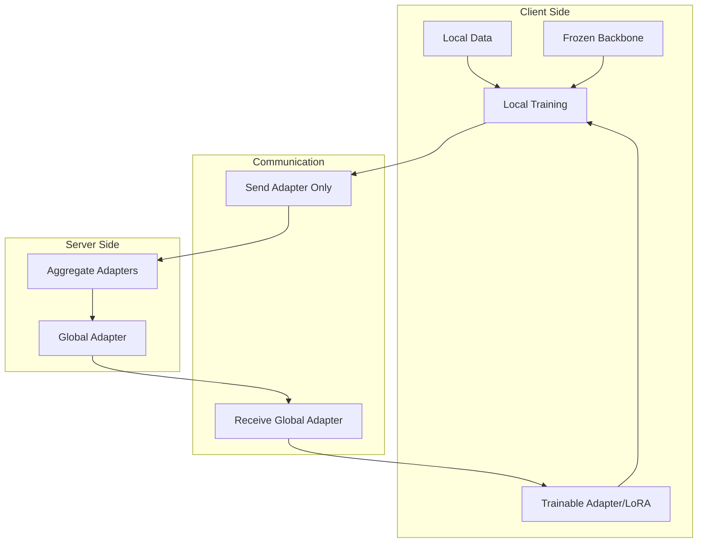

# Tutorial 064: FL with Large Language Models

---

## Metadata

| Property | Value |
|----------|-------|
| **Tutorial ID** | 064 |
| **Title** | FL with Large Language Models |
| **Category** | Emerging Topics |
| **Difficulty** | Advanced |
| **Duration** | 120 minutes |
| **Prerequisites** | Tutorial 001-063 |
| **Author** | Unbitrium Contributors |
| **Last Updated** | January 2026 |

---

## Learning Objectives

By the end of this tutorial, you will be able to:

1. **Understand** LLM challenges in federated learning settings.
2. **Implement** parameter-efficient fine-tuning (PEFT) for FL.
3. **Design** LoRA-based federated training pipelines.
4. **Analyze** communication costs for large model federation.
5. **Apply** prompt tuning and adapter methods in FL.
6. **Evaluate** federated LLM performance and privacy.
7. **Compare** different PEFT strategies for FL.

---

## Prerequisites

- **Completed Tutorials**: 001-063
- **Knowledge**: Transformers, LLMs, attention mechanisms
- **Libraries**: PyTorch, NumPy

```python
import torch
import torch.nn as nn
import torch.nn.functional as F
import numpy as np
from dataclasses import dataclass, field
from typing import Any, Dict, List, Optional, Tuple
from torch.utils.data import Dataset, DataLoader
import copy
import math

print(f"PyTorch: {torch.__version__}")
```

---

## Background and Theory

### LLM Challenges in FL

| Challenge | Description | Impact | Solution |
|-----------|-------------|--------|----------|
| Model size | Billions of parameters | Communication bottleneck | PEFT methods |
| Memory | GPU memory limits | Cannot train locally | Gradient checkpointing |
| Communication | Full model too large | Bandwidth constraints | Share only adapters |
| Compute | Training is expensive | Client participation | Freeze backbone |
| Privacy | Text data is sensitive | Privacy risks | DP + secure aggregation |

### Parameter-Efficient Fine-Tuning Methods

| Method | Trainable % | Memory | Description |
|--------|-------------|--------|-------------|
| Full fine-tuning | 100% | Very high | All parameters |
| LoRA | ~0.1-1% | Low | Low-rank adaptation |
| Adapter | ~1-3% | Medium | Bottleneck modules |
| Prompt tuning | ~0.01% | Very low | Soft prompt tokens |
| Prefix tuning | ~0.1% | Low | Prefix embeddings |
| BitFit | ~0.1% | Very low | Bias terms only |
| IA³ | ~0.01% | Very low | Learned vectors |

### LoRA Mathematics

Low-Rank Adaptation modifies weight matrices:

$$W' = W + \Delta W = W + BA$$

Where:
- $W \in \mathbb{R}^{d \times k}$ is the original frozen weight
- $B \in \mathbb{R}^{d \times r}$ and $A \in \mathbb{R}^{r \times k}$ are trainable
- $r \ll \min(d, k)$ is the rank

### Federated PEFT Architecture



---

## Implementation Code

### Part 1: Configuration and Core Components

```python
#!/usr/bin/env python3
"""
Tutorial 064: FL with Large Language Models

Comprehensive implementation of parameter-efficient federated learning
for large language models using LoRA, adapters, and prompt tuning.

Author: Unbitrium Contributors
License: EUPL-1.2
"""

from __future__ import annotations
import copy
import math
from dataclasses import dataclass, field
from typing import Any, Dict, List, Optional, Tuple
from enum import Enum
import numpy as np
import torch
import torch.nn as nn
import torch.nn.functional as F
from torch.utils.data import Dataset, DataLoader


class PEFTMethod(Enum):
    """Parameter-efficient fine-tuning methods."""
    LORA = "lora"
    ADAPTER = "adapter"
    PROMPT = "prompt"
    PREFIX = "prefix"
    BITFIT = "bitfit"


@dataclass
class FedLLMConfig:
    """Configuration for federated LLM training."""

    # Training
    num_rounds: int = 20
    num_clients: int = 10
    clients_per_round: int = 5
    local_epochs: int = 2
    batch_size: int = 8
    learning_rate: float = 1e-4
    weight_decay: float = 0.01
    max_grad_norm: float = 1.0

    # Model architecture
    vocab_size: int = 10000
    hidden_dim: int = 256
    num_heads: int = 4
    num_layers: int = 4
    max_seq_len: int = 128
    dropout: float = 0.1

    # PEFT configuration
    peft_method: PEFTMethod = PEFTMethod.LORA
    lora_rank: int = 8
    lora_alpha: float = 16.0
    lora_dropout: float = 0.05
    adapter_dim: int = 64
    prompt_length: int = 10
    prefix_length: int = 10

    # Task
    num_classes: int = 5
    task_type: str = "classification"

    # Reproducibility
    seed: int = 42

    def get_scaling(self) -> float:
        """Get LoRA scaling factor."""
        return self.lora_alpha / self.lora_rank


class LoRALinear(nn.Module):
    """
    Linear layer with Low-Rank Adaptation.

    The original weight remains frozen while low-rank matrices
    A and B are trained to adapt the layer.
    """

    def __init__(
        self,
        in_features: int,
        out_features: int,
        rank: int = 8,
        alpha: float = 16.0,
        dropout: float = 0.0,
    ):
        super().__init__()
        self.in_features = in_features
        self.out_features = out_features
        self.rank = rank
        self.alpha = alpha
        self.scaling = alpha / rank

        # Original frozen weight
        self.weight = nn.Parameter(
            torch.randn(out_features, in_features) * 0.02,
            requires_grad=False
        )
        self.bias = nn.Parameter(torch.zeros(out_features), requires_grad=False)

        # LoRA trainable matrices
        self.lora_A = nn.Parameter(torch.randn(rank, in_features) * 0.01)
        self.lora_B = nn.Parameter(torch.zeros(out_features, rank))

        self.dropout = nn.Dropout(dropout) if dropout > 0 else nn.Identity()

    def forward(self, x: torch.Tensor) -> torch.Tensor:
        # Original frozen path
        result = F.linear(x, self.weight, self.bias)

        # LoRA path
        lora_out = self.dropout(x)
        lora_out = F.linear(lora_out, self.lora_A)
        lora_out = F.linear(lora_out, self.lora_B)

        return result + lora_out * self.scaling

    def get_lora_state(self) -> Dict[str, torch.Tensor]:
        """Get only the LoRA parameters."""
        return {
            "lora_A": self.lora_A.data.clone(),
            "lora_B": self.lora_B.data.clone(),
        }

    def set_lora_state(self, state: Dict[str, torch.Tensor]) -> None:
        """Set LoRA parameters."""
        self.lora_A.data.copy_(state["lora_A"])
        self.lora_B.data.copy_(state["lora_B"])

    def get_trainable_params(self) -> int:
        """Count trainable parameters."""
        return self.lora_A.numel() + self.lora_B.numel()

    def get_total_params(self) -> int:
        """Count all parameters."""
        return self.weight.numel() + self.bias.numel() + self.get_trainable_params()


class Adapter(nn.Module):
    """
    Adapter module for transformer layers.

    Bottleneck architecture: down-project -> activation -> up-project + residual
    """

    def __init__(
        self,
        hidden_dim: int,
        adapter_dim: int = 64,
        dropout: float = 0.1,
    ):
        super().__init__()
        self.down_project = nn.Linear(hidden_dim, adapter_dim)
        self.activation = nn.GELU()
        self.up_project = nn.Linear(adapter_dim, hidden_dim)
        self.dropout = nn.Dropout(dropout)
        self.layer_norm = nn.LayerNorm(hidden_dim)

        # Initialize for near-identity
        nn.init.zeros_(self.up_project.weight)
        nn.init.zeros_(self.up_project.bias)

    def forward(self, x: torch.Tensor) -> torch.Tensor:
        residual = x
        x = self.layer_norm(x)
        x = self.down_project(x)
        x = self.activation(x)
        x = self.dropout(x)
        x = self.up_project(x)
        return residual + x


class PromptEmbedding(nn.Module):
    """
    Learnable soft prompt tokens.
    """

    def __init__(
        self,
        prompt_length: int,
        hidden_dim: int,
    ):
        super().__init__()
        self.prompt_length = prompt_length
        self.embeddings = nn.Parameter(
            torch.randn(1, prompt_length, hidden_dim) * 0.01
        )

    def forward(self, batch_size: int) -> torch.Tensor:
        return self.embeddings.expand(batch_size, -1, -1)
```

### Part 2: Transformer Model with PEFT

```python
class MultiHeadAttention(nn.Module):
    """Multi-head attention with optional LoRA."""

    def __init__(
        self,
        hidden_dim: int,
        num_heads: int,
        dropout: float = 0.1,
        use_lora: bool = False,
        lora_rank: int = 8,
        lora_alpha: float = 16.0,
    ):
        super().__init__()
        self.num_heads = num_heads
        self.head_dim = hidden_dim // num_heads
        self.scale = self.head_dim ** -0.5

        if use_lora:
            self.q_proj = LoRALinear(hidden_dim, hidden_dim, lora_rank, lora_alpha)
            self.k_proj = LoRALinear(hidden_dim, hidden_dim, lora_rank, lora_alpha)
            self.v_proj = LoRALinear(hidden_dim, hidden_dim, lora_rank, lora_alpha)
            self.o_proj = LoRALinear(hidden_dim, hidden_dim, lora_rank, lora_alpha)
        else:
            self.q_proj = nn.Linear(hidden_dim, hidden_dim)
            self.k_proj = nn.Linear(hidden_dim, hidden_dim)
            self.v_proj = nn.Linear(hidden_dim, hidden_dim)
            self.o_proj = nn.Linear(hidden_dim, hidden_dim)

        self.dropout = nn.Dropout(dropout)

    def forward(
        self,
        x: torch.Tensor,
        mask: Optional[torch.Tensor] = None,
    ) -> torch.Tensor:
        batch_size, seq_len, _ = x.shape

        q = self.q_proj(x).view(batch_size, seq_len, self.num_heads, self.head_dim).transpose(1, 2)
        k = self.k_proj(x).view(batch_size, seq_len, self.num_heads, self.head_dim).transpose(1, 2)
        v = self.v_proj(x).view(batch_size, seq_len, self.num_heads, self.head_dim).transpose(1, 2)

        attn = torch.matmul(q, k.transpose(-2, -1)) * self.scale

        if mask is not None:
            attn = attn.masked_fill(mask == 0, float('-inf'))

        attn = F.softmax(attn, dim=-1)
        attn = self.dropout(attn)

        out = torch.matmul(attn, v)
        out = out.transpose(1, 2).contiguous().view(batch_size, seq_len, -1)

        return self.o_proj(out)


class FeedForward(nn.Module):
    """Feed-forward network with optional LoRA."""

    def __init__(
        self,
        hidden_dim: int,
        dropout: float = 0.1,
        use_lora: bool = False,
        lora_rank: int = 8,
        lora_alpha: float = 16.0,
    ):
        super().__init__()

        if use_lora:
            self.fc1 = LoRALinear(hidden_dim, hidden_dim * 4, lora_rank, lora_alpha)
            self.fc2 = LoRALinear(hidden_dim * 4, hidden_dim, lora_rank, lora_alpha)
        else:
            self.fc1 = nn.Linear(hidden_dim, hidden_dim * 4)
            self.fc2 = nn.Linear(hidden_dim * 4, hidden_dim)

        self.activation = nn.GELU()
        self.dropout = nn.Dropout(dropout)

    def forward(self, x: torch.Tensor) -> torch.Tensor:
        x = self.fc1(x)
        x = self.activation(x)
        x = self.dropout(x)
        x = self.fc2(x)
        return x


class TransformerBlock(nn.Module):
    """Transformer block with PEFT support."""

    def __init__(
        self,
        config: FedLLMConfig,
        use_lora: bool = True,
        use_adapter: bool = False,
    ):
        super().__init__()
        self.config = config

        self.attention = MultiHeadAttention(
            config.hidden_dim,
            config.num_heads,
            config.dropout,
            use_lora=use_lora,
            lora_rank=config.lora_rank,
            lora_alpha=config.lora_alpha,
        )

        self.ffn = FeedForward(
            config.hidden_dim,
            config.dropout,
            use_lora=use_lora,
            lora_rank=config.lora_rank,
            lora_alpha=config.lora_alpha,
        )

        self.norm1 = nn.LayerNorm(config.hidden_dim)
        self.norm2 = nn.LayerNorm(config.hidden_dim)
        self.dropout = nn.Dropout(config.dropout)

        self.use_adapter = use_adapter
        if use_adapter:
            self.adapter1 = Adapter(config.hidden_dim, config.adapter_dim)
            self.adapter2 = Adapter(config.hidden_dim, config.adapter_dim)

    def forward(self, x: torch.Tensor, mask: Optional[torch.Tensor] = None) -> torch.Tensor:
        # Attention + residual
        normed = self.norm1(x)
        attn_out = self.attention(normed, mask)
        x = x + self.dropout(attn_out)

        if self.use_adapter:
            x = self.adapter1(x)

        # FFN + residual
        normed = self.norm2(x)
        ffn_out = self.ffn(normed)
        x = x + self.dropout(ffn_out)

        if self.use_adapter:
            x = self.adapter2(x)

        return x


class FederatedLLM(nn.Module):
    """LLM with PEFT support for federated learning."""

    def __init__(self, config: FedLLMConfig):
        super().__init__()
        self.config = config

        # Embeddings (frozen)
        self.token_embedding = nn.Embedding(config.vocab_size, config.hidden_dim)
        self.position_embedding = nn.Parameter(
            torch.randn(1, config.max_seq_len, config.hidden_dim) * 0.02
        )

        # Freeze embeddings for PEFT
        self.token_embedding.weight.requires_grad = False
        self.position_embedding.requires_grad = False

        # Prompt tuning (if enabled)
        if config.peft_method == PEFTMethod.PROMPT:
            self.prompt_embeddings = PromptEmbedding(
                config.prompt_length,
                config.hidden_dim
            )

        # Transformer blocks
        use_lora = config.peft_method == PEFTMethod.LORA
        use_adapter = config.peft_method == PEFTMethod.ADAPTER

        self.layers = nn.ModuleList([
            TransformerBlock(config, use_lora=use_lora, use_adapter=use_adapter)
            for _ in range(config.num_layers)
        ])

        self.norm = nn.LayerNorm(config.hidden_dim)
        self.classifier = nn.Linear(config.hidden_dim, config.num_classes)

        # For BitFit, freeze all except biases
        if config.peft_method == PEFTMethod.BITFIT:
            self._apply_bitfit()

    def _apply_bitfit(self):
        """Freeze all parameters except biases."""
        for name, param in self.named_parameters():
            if 'bias' not in name:
                param.requires_grad = False

    def forward(self, input_ids: torch.Tensor) -> torch.Tensor:
        batch_size, seq_len = input_ids.shape

        # Embeddings
        x = self.token_embedding(input_ids)
        x = x + self.position_embedding[:, :seq_len, :]

        # Add prompt if enabled
        if hasattr(self, 'prompt_embeddings'):
            prompts = self.prompt_embeddings(batch_size)
            x = torch.cat([prompts, x], dim=1)

        # Transformer layers
        for layer in self.layers:
            x = layer(x)

        x = self.norm(x)

        # Pool and classify
        pooled = x.mean(dim=1)
        return self.classifier(pooled)

    def get_peft_state(self) -> Dict[str, torch.Tensor]:
        """Get only PEFT parameters."""
        peft_state = {}
        for name, param in self.named_parameters():
            if param.requires_grad:
                peft_state[name] = param.data.clone()
        return peft_state

    def set_peft_state(self, state: Dict[str, torch.Tensor]) -> None:
        """Set PEFT parameters."""
        for name, param in self.named_parameters():
            if name in state:
                param.data.copy_(state[name])

    def count_parameters(self) -> Dict[str, int]:
        """Count parameters."""
        total = sum(p.numel() for p in self.parameters())
        trainable = sum(p.numel() for p in self.parameters() if p.requires_grad)
        return {
            "total": total,
            "trainable": trainable,
            "frozen": total - trainable,
            "trainable_pct": 100 * trainable / total,
        }
```

### Part 3: Federated Training

```python
class TextDataset(Dataset):
    """Text dataset for LLM."""

    def __init__(
        self,
        num_samples: int,
        seq_len: int,
        vocab_size: int,
        num_classes: int,
        client_id: int = 0,
    ):
        np.random.seed(client_id)
        self.sequences = torch.randint(0, vocab_size, (num_samples, seq_len))
        self.labels = torch.randint(0, num_classes, (num_samples,))

    def __len__(self) -> int:
        return len(self.labels)

    def __getitem__(self, idx: int) -> Tuple[torch.Tensor, torch.Tensor]:
        return self.sequences[idx], self.labels[idx]


class FedLLMClient:
    """Client for federated LLM training."""

    def __init__(
        self,
        client_id: int,
        dataset: TextDataset,
        config: FedLLMConfig,
    ):
        self.client_id = client_id
        self.dataset = dataset
        self.config = config

    def train(self, model: FederatedLLM) -> Dict[str, Any]:
        """Train PEFT parameters locally."""
        local_model = copy.deepcopy(model)

        trainable_params = [p for p in local_model.parameters() if p.requires_grad]
        optimizer = torch.optim.AdamW(
            trainable_params,
            lr=self.config.learning_rate,
            weight_decay=self.config.weight_decay,
        )

        loader = DataLoader(
            self.dataset,
            batch_size=self.config.batch_size,
            shuffle=True,
        )

        local_model.train()
        total_loss = 0
        num_batches = 0

        for _ in range(self.config.local_epochs):
            for input_ids, labels in loader:
                optimizer.zero_grad()
                outputs = local_model(input_ids)
                loss = F.cross_entropy(outputs, labels)
                loss.backward()

                torch.nn.utils.clip_grad_norm_(
                    trainable_params,
                    self.config.max_grad_norm,
                )

                optimizer.step()
                total_loss += loss.item()
                num_batches += 1

        return {
            "peft_state": local_model.get_peft_state(),
            "num_samples": len(self.dataset),
            "loss": total_loss / num_batches,
        }


class FedLLMServer:
    """Server for federated LLM training."""

    def __init__(
        self,
        model: FederatedLLM,
        clients: List[FedLLMClient],
        config: FedLLMConfig,
    ):
        self.model = model
        self.clients = clients
        self.config = config
        self.history: List[Dict] = []

    def aggregate_peft(self, updates: List[Dict]) -> None:
        """Aggregate PEFT parameters."""
        total = sum(u["num_samples"] for u in updates)
        new_state = {}

        for key in updates[0]["peft_state"]:
            new_state[key] = sum(
                (u["num_samples"] / total) * u["peft_state"][key]
                for u in updates
            )

        self.model.set_peft_state(new_state)

    def train(self) -> List[Dict]:
        """Run federated training."""
        params = self.model.count_parameters()
        print(f"Trainable: {params['trainable']:,} ({params['trainable_pct']:.2f}%)")

        for round_num in range(self.config.num_rounds):
            selected = np.random.choice(
                self.clients,
                min(self.config.clients_per_round, len(self.clients)),
                replace=False,
            )

            updates = [c.train(self.model) for c in selected]
            self.aggregate_peft(updates)

            avg_loss = np.mean([u["loss"] for u in updates])
            self.history.append({"round": round_num, "loss": avg_loss})

            if (round_num + 1) % 5 == 0:
                print(f"Round {round_num + 1}: loss={avg_loss:.4f}")

        return self.history


def run_fedllm():
    """Run federated LLM demo."""
    config = FedLLMConfig(
        num_rounds=15,
        num_clients=5,
        peft_method=PEFTMethod.LORA,
    )

    torch.manual_seed(config.seed)
    np.random.seed(config.seed)

    clients = [
        FedLLMClient(
            i,
            TextDataset(80, config.max_seq_len, config.vocab_size, config.num_classes, i),
            config,
        )
        for i in range(config.num_clients)
    ]

    model = FederatedLLM(config)
    server = FedLLMServer(model, clients, config)
    server.train()


if __name__ == "__main__":
    run_fedllm()
```

---

## Exercises

1. **Exercise 1**: Compare LoRA vs Adapter for different ranks.
2. **Exercise 2**: Add prefix tuning implementation.
3. **Exercise 3**: Benchmark communication reduction.
4. **Exercise 4**: Implement LoRA merging for inference.
5. **Exercise 5**: Add differential privacy to PEFT.

---

## References

1. Hu, E., et al. (2022). LoRA: Low-rank adaptation. In *ICLR*.
2. Houlsby, N., et al. (2019). Parameter-efficient transfer learning. In *ICML*.
3. Li, X. L., & Liang, P. (2021). Prefix-tuning. In *ACL*.
4. Zhang, J., et al. (2023). FedPETuning. *arXiv*.
5. Kuang, W., et al. (2023). FederatedScope-LLM. *arXiv*.

---

*Copyright 2026 Olaf Yunus Laitinen Imanov and Contributors. Released under EUPL 1.2.*
