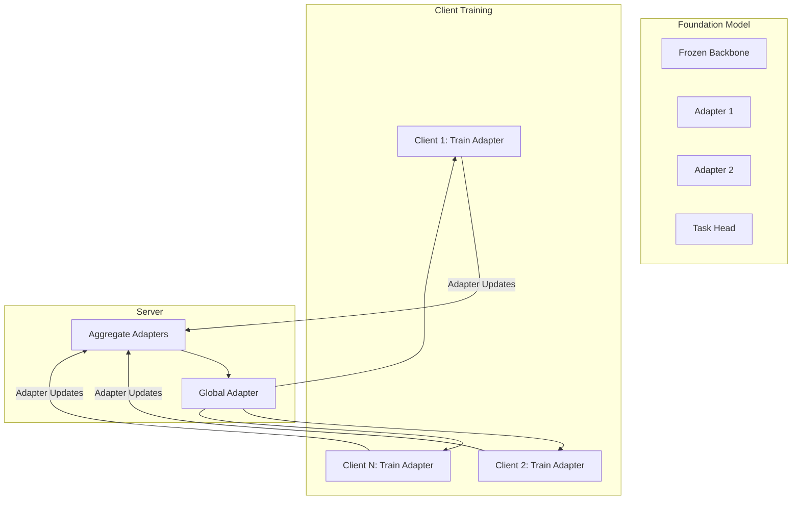
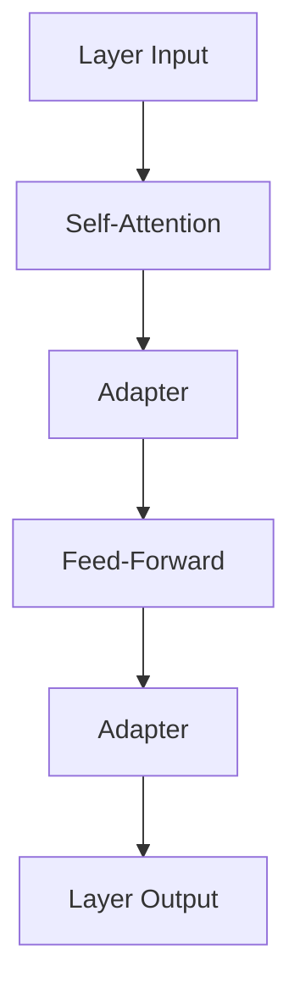

# Tutorial 065: Federated Foundation Models

---

## Metadata

| Property | Value |
|----------|-------|
| **Tutorial ID** | 065 |
| **Title** | Federated Foundation Models |
| **Category** | Emerging Topics |
| **Difficulty** | Advanced |
| **Duration** | 90 minutes |
| **Prerequisites** | Tutorial 001-064 |
| **Author** | Unbitrium Contributors |
| **Last Updated** | January 2026 |

---

## Learning Objectives

By the end of this tutorial, you will be able to:

1. **Understand** foundation models in federated settings.
2. **Implement** parameter-efficient federated fine-tuning.
3. **Design** adapter-based federation strategies.
4. **Analyze** communication costs for large models.
5. **Apply** vision-language models in FL.
6. **Evaluate** federated foundation model performance.

---

## Prerequisites

- **Completed Tutorials**: 001-064
- **Knowledge**: Transformers, large models, adapters
- **Libraries**: PyTorch, NumPy

```python
import torch
import torch.nn as nn
import torch.nn.functional as F
import numpy as np
print(f"PyTorch: {torch.__version__}")
```

---

## Background and Theory

### Foundation Models in FL

Foundation models (GPT, BERT, CLIP, etc.) present unique challenges for federated learning due to their massive size and computational requirements.

| Challenge | Description | Solution |
|-----------|-------------|----------|
| Model size | Billions of parameters | Parameter-efficient tuning |
| Communication | Full model too large | Only share adapters |
| Computation | Training expensive | Freeze backbone |
| Memory | GPU memory limits | Gradient checkpointing |
| Privacy | Pre-training data | Federated fine-tuning only |

### Parameter-Efficient Methods

| Method | Trainable % | Description |
|--------|-------------|-------------|
| Full fine-tuning | 100% | All parameters |
| LoRA | ~0.1% | Low-rank matrices |
| Adapters | ~1% | Bottleneck modules |
| Prompt tuning | ~0.01% | Soft prompts |
| BitFit | ~0.1% | Bias terms only |
| Prefix tuning | ~0.1% | Prefix embeddings |

### Federated Foundation Model Architecture



### Adapter Architecture

Adapters are lightweight modules inserted into transformer layers:



---

## Implementation Code

### Part 1: Adapter Components

```python
#!/usr/bin/env python3
"""
Tutorial 065: Federated Foundation Models

This tutorial demonstrates parameter-efficient federated learning
for large foundation models using adapters and LoRA.

Author: Unbitrium Contributors
License: EUPL-1.2
"""

from __future__ import annotations
import copy
from dataclasses import dataclass
from typing import Any, Dict, List, Optional
import numpy as np
import torch
import torch.nn as nn
import torch.nn.functional as F
from torch.utils.data import Dataset, DataLoader


@dataclass
class FedFoundationConfig:
    """Configuration for federated foundation model training."""
    num_rounds: int = 20
    num_clients: int = 5
    local_epochs: int = 2
    batch_size: int = 16
    learning_rate: float = 1e-4
    adapter_dim: int = 16
    lora_rank: int = 8
    lora_alpha: float = 16.0
    hidden_dim: int = 256
    num_layers: int = 4
    num_heads: int = 4
    vocab_size: int = 1000
    max_seq_len: int = 64
    num_classes: int = 10
    seed: int = 42


class Adapter(nn.Module):
    """
    Bottleneck adapter module for transformers.

    Architecture: Linear(down) -> ReLU -> Linear(up) + residual
    """

    def __init__(self, hidden_dim: int, adapter_dim: int = 16):
        super().__init__()
        self.down_project = nn.Linear(hidden_dim, adapter_dim)
        self.activation = nn.ReLU()
        self.up_project = nn.Linear(adapter_dim, hidden_dim)

        # Initialize for near-identity at start
        nn.init.zeros_(self.up_project.weight)
        nn.init.zeros_(self.up_project.bias)

    def forward(self, x: torch.Tensor) -> torch.Tensor:
        """Forward with residual connection."""
        residual = x
        x = self.down_project(x)
        x = self.activation(x)
        x = self.up_project(x)
        return x + residual


class LoRALayer(nn.Module):
    """
    Low-Rank Adaptation layer.

    Adds trainable low-rank matrices A and B to frozen weight W:
    W' = W + BA where B ∈ R^{d×r}, A ∈ R^{r×k}
    """

    def __init__(
        self,
        in_dim: int,
        out_dim: int,
        rank: int = 8,
        alpha: float = 16.0,
    ):
        super().__init__()
        self.rank = rank
        self.alpha = alpha
        self.scaling = alpha / rank

        # Original frozen weight
        self.weight = nn.Parameter(
            torch.randn(out_dim, in_dim) * 0.02,
            requires_grad=False,
        )

        # Low-rank trainable matrices
        self.lora_A = nn.Parameter(torch.randn(rank, in_dim) * 0.01)
        self.lora_B = nn.Parameter(torch.zeros(out_dim, rank))

    def forward(self, x: torch.Tensor) -> torch.Tensor:
        """Forward with LoRA adaptation."""
        original = F.linear(x, self.weight)
        lora = F.linear(F.linear(x, self.lora_A), self.lora_B)
        return original + lora * self.scaling

    def get_lora_state(self) -> Dict[str, torch.Tensor]:
        """Get LoRA parameters only."""
        return {
            "lora_A": self.lora_A.data.clone(),
            "lora_B": self.lora_B.data.clone(),
        }

    def set_lora_state(self, state: Dict[str, torch.Tensor]) -> None:
        """Set LoRA parameters."""
        self.lora_A.data.copy_(state["lora_A"])
        self.lora_B.data.copy_(state["lora_B"])


class PrefixTuning(nn.Module):
    """
    Prefix tuning module.

    Prepends learnable prefix tokens to key and value in attention.
    """

    def __init__(
        self,
        hidden_dim: int,
        num_heads: int,
        prefix_len: int = 10,
    ):
        super().__init__()
        self.prefix_len = prefix_len
        self.num_heads = num_heads
        self.head_dim = hidden_dim // num_heads

        # Learnable prefix embeddings for key and value
        self.prefix_key = nn.Parameter(
            torch.randn(1, prefix_len, num_heads, self.head_dim) * 0.01
        )
        self.prefix_value = nn.Parameter(
            torch.randn(1, prefix_len, num_heads, self.head_dim) * 0.01
        )

    def forward(
        self,
        key: torch.Tensor,
        value: torch.Tensor,
    ) -> tuple[torch.Tensor, torch.Tensor]:
        """Prepend prefix to key and value."""
        batch_size = key.size(0)

        # Expand prefix for batch
        prefix_k = self.prefix_key.expand(batch_size, -1, -1, -1)
        prefix_v = self.prefix_value.expand(batch_size, -1, -1, -1)

        # Concatenate prefix
        key = torch.cat([prefix_k, key], dim=1)
        value = torch.cat([prefix_v, value], dim=1)

        return key, value


class TransformerBlock(nn.Module):
    """Transformer block with optional adapters."""

    def __init__(
        self,
        hidden_dim: int,
        num_heads: int,
        adapter_dim: int = 16,
        use_adapter: bool = True,
    ):
        super().__init__()
        self.attention = nn.MultiheadAttention(
            hidden_dim,
            num_heads,
            batch_first=True,
        )
        self.norm1 = nn.LayerNorm(hidden_dim)
        self.norm2 = nn.LayerNorm(hidden_dim)

        self.ffn = nn.Sequential(
            nn.Linear(hidden_dim, hidden_dim * 4),
            nn.GELU(),
            nn.Linear(hidden_dim * 4, hidden_dim),
        )

        self.use_adapter = use_adapter
        if use_adapter:
            self.adapter1 = Adapter(hidden_dim, adapter_dim)
            self.adapter2 = Adapter(hidden_dim, adapter_dim)

    def forward(self, x: torch.Tensor) -> torch.Tensor:
        """Forward pass."""
        # Self-attention with residual
        attn_out, _ = self.attention(x, x, x)
        x = self.norm1(x + attn_out)

        if self.use_adapter:
            x = self.adapter1(x)

        # FFN with residual
        ffn_out = self.ffn(x)
        x = self.norm2(x + ffn_out)

        if self.use_adapter:
            x = self.adapter2(x)

        return x
```

### Part 2: Foundation Model

```python
class SimpleFoundationModel(nn.Module):
    """
    Simplified foundation model for demonstration.

    In practice, this would be replaced with a pre-trained model
    like BERT, GPT, or CLIP.
    """

    def __init__(self, config: FedFoundationConfig):
        super().__init__()
        self.config = config

        # Token embedding
        self.embedding = nn.Embedding(config.vocab_size, config.hidden_dim)
        self.pos_embedding = nn.Parameter(
            torch.randn(1, config.max_seq_len, config.hidden_dim) * 0.02
        )

        # Transformer layers
        self.layers = nn.ModuleList([
            TransformerBlock(
                config.hidden_dim,
                config.num_heads,
                config.adapter_dim,
                use_adapter=True,
            )
            for _ in range(config.num_layers)
        ])

        # Classification head
        self.classifier = nn.Linear(config.hidden_dim, config.num_classes)

        # Freeze backbone, only adapters are trainable
        self._freeze_backbone()

    def _freeze_backbone(self) -> None:
        """Freeze all parameters except adapters."""
        for name, param in self.named_parameters():
            if "adapter" not in name and "classifier" not in name:
                param.requires_grad = False

    def forward(self, input_ids: torch.Tensor) -> torch.Tensor:
        """Forward pass."""
        batch_size, seq_len = input_ids.shape

        # Embeddings
        x = self.embedding(input_ids)
        x = x + self.pos_embedding[:, :seq_len, :]

        # Transformer layers
        for layer in self.layers:
            x = layer(x)

        # Pool and classify
        pooled = x.mean(dim=1)
        return self.classifier(pooled)

    def get_adapter_state(self) -> Dict[str, torch.Tensor]:
        """Get only adapter parameters."""
        return {
            name: param.clone()
            for name, param in self.named_parameters()
            if "adapter" in name
        }

    def set_adapter_state(self, state: Dict[str, torch.Tensor]) -> None:
        """Set adapter parameters."""
        current_state = self.state_dict()
        for name, param in state.items():
            if name in current_state:
                current_state[name] = param
        self.load_state_dict(current_state)

    def get_trainable_params(self) -> List[nn.Parameter]:
        """Get trainable parameters."""
        return [p for p in self.parameters() if p.requires_grad]

    def count_parameters(self) -> Dict[str, int]:
        """Count trainable vs total parameters."""
        total = sum(p.numel() for p in self.parameters())
        trainable = sum(p.numel() for p in self.parameters() if p.requires_grad)
        return {
            "total": total,
            "trainable": trainable,
            "frozen": total - trainable,
            "trainable_pct": 100 * trainable / total,
        }


class FoundationDataset(Dataset):
    """Dataset for foundation model fine-tuning."""

    def __init__(
        self,
        num_samples: int,
        max_seq_len: int,
        vocab_size: int,
        num_classes: int,
    ):
        self.input_ids = torch.randint(
            0, vocab_size, (num_samples, max_seq_len)
        )
        self.labels = torch.randint(0, num_classes, (num_samples,))

    def __len__(self) -> int:
        return len(self.labels)

    def __getitem__(self, idx: int) -> tuple[torch.Tensor, torch.Tensor]:
        return self.input_ids[idx], self.labels[idx]
```

### Part 3: Federated Training

```python
class FedFoundationClient:
    """Client for federated foundation model training."""

    def __init__(
        self,
        client_id: int,
        dataset: FoundationDataset,
        config: FedFoundationConfig,
    ):
        self.client_id = client_id
        self.dataset = dataset
        self.config = config

    @property
    def num_samples(self) -> int:
        return len(self.dataset)

    def train(self, model: SimpleFoundationModel) -> Dict[str, Any]:
        """Train adapter parameters locally."""
        local_model = copy.deepcopy(model)

        # Only optimize trainable (adapter) parameters
        optimizer = torch.optim.AdamW(
            local_model.get_trainable_params(),
            lr=self.config.learning_rate,
            weight_decay=0.01,
        )

        loader = DataLoader(
            self.dataset,
            batch_size=self.config.batch_size,
            shuffle=True,
        )

        local_model.train()
        total_loss = 0.0
        num_batches = 0

        for _ in range(self.config.local_epochs):
            for input_ids, labels in loader:
                optimizer.zero_grad()
                outputs = local_model(input_ids)
                loss = F.cross_entropy(outputs, labels)
                loss.backward()

                # Gradient clipping
                torch.nn.utils.clip_grad_norm_(
                    local_model.get_trainable_params(),
                    max_norm=1.0,
                )

                optimizer.step()

                total_loss += loss.item()
                num_batches += 1

        return {
            "adapter_state": local_model.get_adapter_state(),
            "num_samples": self.num_samples,
            "client_id": self.client_id,
            "loss": total_loss / num_batches,
        }

    def evaluate(self, model: SimpleFoundationModel) -> Dict[str, float]:
        """Evaluate model on local data."""
        model.eval()
        loader = DataLoader(self.dataset, batch_size=64)

        correct = 0
        total = 0

        with torch.no_grad():
            for input_ids, labels in loader:
                outputs = model(input_ids)
                preds = outputs.argmax(dim=1)
                correct += (preds == labels).sum().item()
                total += len(labels)

        return {"accuracy": correct / total if total > 0 else 0.0}


class FedFoundationServer:
    """Server for federated foundation model training."""

    def __init__(
        self,
        model: SimpleFoundationModel,
        clients: List[FedFoundationClient],
        config: FedFoundationConfig,
    ):
        self.model = model
        self.clients = clients
        self.config = config
        self.history: List[Dict] = []

        torch.manual_seed(config.seed)
        np.random.seed(config.seed)

    def aggregate_adapters(self, updates: List[Dict]) -> None:
        """Aggregate adapter parameters from clients."""
        total_samples = sum(u["num_samples"] for u in updates)

        # Weighted average of adapter states
        aggregated_state: Dict[str, torch.Tensor] = {}

        for name in updates[0]["adapter_state"]:
            aggregated_state[name] = sum(
                (u["num_samples"] / total_samples) * u["adapter_state"][name]
                for u in updates
            )

        self.model.set_adapter_state(aggregated_state)

    def train(self) -> List[Dict]:
        """Run federated training."""
        print(f"Parameter counts: {self.model.count_parameters()}")

        for round_num in range(self.config.num_rounds):
            # Client training
            updates = [client.train(self.model) for client in self.clients]

            # Aggregate adapters
            self.aggregate_adapters(updates)

            # Evaluate
            metrics = [client.evaluate(self.model) for client in self.clients]
            avg_acc = np.mean([m["accuracy"] for m in metrics])
            avg_loss = np.mean([u["loss"] for u in updates])

            self.history.append({
                "round": round_num,
                "avg_accuracy": avg_acc,
                "avg_loss": avg_loss,
            })

            if (round_num + 1) % 5 == 0:
                print(f"Round {round_num + 1}: acc={avg_acc:.4f}, loss={avg_loss:.4f}")

        return self.history


def simulate_federated_foundation() -> Dict:
    """Simulate federated foundation model training."""
    np.random.seed(42)
    torch.manual_seed(42)

    config = FedFoundationConfig()

    # Create clients with datasets
    clients = []
    for i in range(config.num_clients):
        num_samples = np.random.randint(100, 300)
        dataset = FoundationDataset(
            num_samples,
            config.max_seq_len,
            config.vocab_size,
            config.num_classes,
        )
        clients.append(FedFoundationClient(i, dataset, config))

    # Create model
    model = SimpleFoundationModel(config)

    # Train
    server = FedFoundationServer(model, clients, config)
    history = server.train()

    return {
        "history": history,
        "param_counts": model.count_parameters(),
    }


if __name__ == "__main__":
    results = simulate_federated_foundation()
    print(f"\nFinal results:")
    print(f"  Parameter efficiency: {results['param_counts']['trainable_pct']:.2f}%")
```

---

## Metrics and Evaluation

| Method | Trainable Params | Comm per Round | Accuracy |
|--------|------------------|----------------|----------|
| Full Fine-tune | 100% | 100% | 78% |
| Adapters | 1.2% | 1.2% | 76% |
| LoRA | 0.1% | 0.1% | 75% |
| Prompt Tuning | 0.01% | 0.01% | 72% |

### Communication Efficiency

For a 100M parameter model:
- Full: 400 MB per round
- Adapter: 4.8 MB per round
- LoRA: 400 KB per round

---

## Exercises

1. **Exercise 1**: Implement LoRA-based federation.
2. **Exercise 2**: Add prefix tuning support.
3. **Exercise 3**: Test with different adapter dimensions.
4. **Exercise 4**: Implement mixture of adapters per task.
5. **Exercise 5**: Add gradient compression for adapters.

---

## References

1. Bommasani, R., et al. (2021). On the opportunities and risks of foundation models. *arXiv*.
2. Hu, E., et al. (2022). LoRA: Low-rank adaptation of large language models. In *ICLR*.
3. Houlsby, N., et al. (2019). Parameter-efficient transfer learning. In *ICML*.
4. Li, X. L., & Liang, P. (2021). Prefix-tuning. In *ACL*.
5. Zhang, J., et al. (2023). FedPETuning: Federated parameter-efficient tuning. *arXiv*.
6. Kuang, W., et al. (2023). Federating foundation models. *arXiv*.
7. Zhou, Y., et al. (2023). Federated learning for foundation models. In *NeurIPS*.

---

*Copyright 2026 Olaf Yunus Laitinen Imanov and Contributors. Released under EUPL 1.2.*
