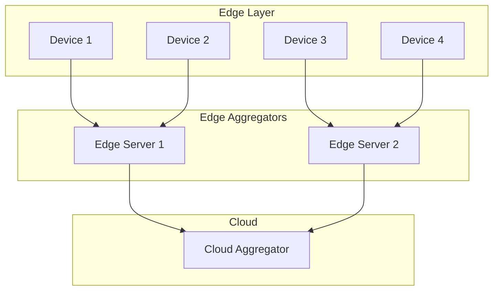
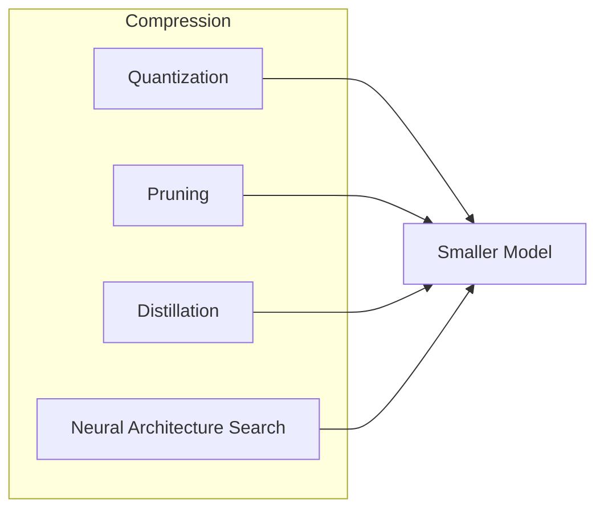

# Tutorial 066: FL and Edge AI

---

## Metadata

| Property | Value |
|----------|-------|
| **Tutorial ID** | 066 |
| **Title** | FL and Edge AI |
| **Category** | Emerging Topics |
| **Difficulty** | Advanced |
| **Duration** | 90 minutes |
| **Prerequisites** | Tutorial 001-065 |
| **Author** | Unbitrium Contributors |
| **Last Updated** | January 2026 |

---

## Learning Objectives

By the end of this tutorial, you will be able to:

1. **Understand** edge AI integration with FL.
2. **Implement** edge-optimized model architectures.
3. **Design** on-device inference pipelines.
4. **Analyze** edge deployment constraints.
5. **Apply** neural network compression techniques.
6. **Evaluate** edge FL system performance.

---

## Prerequisites

- **Completed Tutorials**: 001-065
- **Knowledge**: Embedded systems, model optimization
- **Libraries**: PyTorch, NumPy

```python
import torch
import torch.nn as nn
import torch.nn.functional as F
import numpy as np
print(f"PyTorch: {torch.__version__}")
```

---

## Background and Theory

### Edge AI Constraints

Edge devices have significant limitations compared to cloud servers:

| Constraint | Typical Range | Impact on FL |
|-----------|---------------|--------------|
| Memory | 256KB - 8MB | Small models only |
| Compute | 100MHz - 2GHz | Limited training |
| Power | 1mW - 10W | Battery life |
| Storage | 1MB - 1GB | Model size |
| Bandwidth | 10Kbps - 10Mbps | Communication |

### Edge Device Categories

| Category | Examples | Typical Resources |
|----------|----------|-------------------|
| Microcontrollers | Arduino, STM32 | <1MB RAM, <100MHz |
| Edge SoCs | Raspberry Pi, Jetson Nano | 1-4GB, 1-2GHz |
| Mobile | Smartphones | 4-16GB, GPU |
| Edge servers | NVIDIA AGX | 16-64GB, GPU |

### Edge-Cloud FL Architecture



### Model Compression Techniques



---

## Implementation Code

### Part 1: Edge Device Simulation

```python
#!/usr/bin/env python3
"""
Tutorial 066: FL and Edge AI

This tutorial demonstrates federated learning on resource-constrained
edge devices with model compression and optimization techniques.

Author: Unbitrium Contributors
License: EUPL-1.2
"""

from __future__ import annotations
import copy
from dataclasses import dataclass
from typing import Any, Dict, List, Optional, Tuple
import numpy as np
import torch
import torch.nn as nn
import torch.nn.functional as F
from torch.utils.data import Dataset, DataLoader
from enum import Enum


class DeviceType(Enum):
    """Types of edge devices."""
    MICROCONTROLLER = "mcu"
    EDGE_SOC = "soc"
    MOBILE = "mobile"
    EDGE_SERVER = "server"


@dataclass
class DeviceProfile:
    """Hardware profile of an edge device."""
    device_type: DeviceType
    memory_kb: int
    compute_mflops: int
    battery_mah: int
    bandwidth_kbps: int

    @classmethod
    def microcontroller(cls) -> 'DeviceProfile':
        return cls(DeviceType.MICROCONTROLLER, 512, 100, 500, 100)

    @classmethod
    def edge_soc(cls) -> 'DeviceProfile':
        return cls(DeviceType.EDGE_SOC, 4096, 5000, 5000, 10000)

    @classmethod
    def mobile(cls) -> 'DeviceProfile':
        return cls(DeviceType.MOBILE, 8192, 50000, 4000, 50000)


@dataclass
class EdgeFLConfig:
    """Configuration for edge FL."""
    num_rounds: int = 30
    num_devices: int = 20
    local_epochs: int = 2
    batch_size: int = 8
    learning_rate: float = 0.01
    memory_limit_kb: int = 1024
    quantize: bool = True
    prune_ratio: float = 0.3
    input_dim: int = 32
    num_classes: int = 10
    seed: int = 42


class EdgeDataset(Dataset):
    """Dataset for edge devices (typically small)."""

    def __init__(
        self,
        num_samples: int,
        input_dim: int,
        num_classes: int,
        device_id: int = 0,
    ):
        np.random.seed(device_id)
        self.features = torch.randn(num_samples, input_dim)
        self.labels = torch.randint(0, num_classes, (num_samples,))

        # Add device-specific bias
        bias = device_id * 0.1
        self.features += bias

    def __len__(self) -> int:
        return len(self.labels)

    def __getitem__(self, idx: int) -> Tuple[torch.Tensor, torch.Tensor]:
        return self.features[idx], self.labels[idx]


class TinyMLModel(nn.Module):
    """
    Tiny model designed for microcontrollers.

    Target: <100KB model size
    """

    def __init__(self, input_dim: int = 32, num_classes: int = 10):
        super().__init__()
        self.net = nn.Sequential(
            nn.Linear(input_dim, 16),
            nn.ReLU(),
            nn.Linear(16, num_classes),
        )

    def forward(self, x: torch.Tensor) -> torch.Tensor:
        return self.net(x)

    def get_size_kb(self) -> float:
        """Get model size in KB."""
        return sum(p.numel() * 4 for p in self.parameters()) / 1024


class CompactModel(nn.Module):
    """
    Compact model for edge SoCs.

    Target: <1MB model size
    """

    def __init__(self, input_dim: int = 32, num_classes: int = 10):
        super().__init__()
        self.net = nn.Sequential(
            nn.Linear(input_dim, 64),
            nn.ReLU(),
            nn.Linear(64, 32),
            nn.ReLU(),
            nn.Linear(32, num_classes),
        )

    def forward(self, x: torch.Tensor) -> torch.Tensor:
        return self.net(x)

    def get_size_kb(self) -> float:
        return sum(p.numel() * 4 for p in self.parameters()) / 1024


class MobileModel(nn.Module):
    """
    Mobile-optimized model.

    Uses depthwise separable convolutions pattern (simplified).
    """

    def __init__(self, input_dim: int = 32, num_classes: int = 10):
        super().__init__()
        self.net = nn.Sequential(
            nn.Linear(input_dim, 128),
            nn.ReLU(),
            nn.Dropout(0.2),
            nn.Linear(128, 64),
            nn.ReLU(),
            nn.Dropout(0.2),
            nn.Linear(64, num_classes),
        )

    def forward(self, x: torch.Tensor) -> torch.Tensor:
        return self.net(x)

    def get_size_kb(self) -> float:
        return sum(p.numel() * 4 for p in self.parameters()) / 1024


class ModelQuantizer:
    """
    Simple quantization utilities.

    Supports INT8 quantization for reduced model size.
    """

    @staticmethod
    def quantize_to_int8(
        tensor: torch.Tensor,
    ) -> Tuple[torch.Tensor, float, float]:
        """Quantize tensor to INT8."""
        min_val = tensor.min().item()
        max_val = tensor.max().item()
        scale = (max_val - min_val) / 255.0 if max_val != min_val else 1.0

        quantized = ((tensor - min_val) / scale).round().clamp(0, 255).byte()
        return quantized, scale, min_val

    @staticmethod
    def dequantize_from_int8(
        quantized: torch.Tensor,
        scale: float,
        min_val: float,
    ) -> torch.Tensor:
        """Dequantize INT8 tensor back to float."""
        return quantized.float() * scale + min_val

    @staticmethod
    def quantize_model_state(
        state_dict: Dict[str, torch.Tensor],
    ) -> Dict[str, Any]:
        """Quantize entire model state dict."""
        quantized_state = {}

        for name, param in state_dict.items():
            q_param, scale, min_val = ModelQuantizer.quantize_to_int8(param)
            quantized_state[name] = {
                "data": q_param,
                "scale": scale,
                "min_val": min_val,
            }

        return quantized_state

    @staticmethod
    def dequantize_model_state(
        quantized_state: Dict[str, Any],
    ) -> Dict[str, torch.Tensor]:
        """Dequantize model state dict."""
        state_dict = {}

        for name, q_data in quantized_state.items():
            state_dict[name] = ModelQuantizer.dequantize_from_int8(
                q_data["data"],
                q_data["scale"],
                q_data["min_val"],
            )

        return state_dict
```

### Part 2: Model Pruning

```python
class ModelPruner:
    """
    Model pruning utilities.

    Supports magnitude-based weight pruning.
    """

    @staticmethod
    def create_mask(
        tensor: torch.Tensor,
        prune_ratio: float,
    ) -> torch.Tensor:
        """Create pruning mask based on magnitude."""
        abs_tensor = tensor.abs()
        threshold = torch.quantile(abs_tensor.flatten(), prune_ratio)
        mask = (abs_tensor >= threshold).float()
        return mask

    @staticmethod
    def prune_state_dict(
        state_dict: Dict[str, torch.Tensor],
        prune_ratio: float,
    ) -> Tuple[Dict[str, torch.Tensor], Dict[str, torch.Tensor]]:
        """Prune model weights."""
        pruned_state = {}
        masks = {}

        for name, param in state_dict.items():
            if "weight" in name:
                mask = ModelPruner.create_mask(param, prune_ratio)
                pruned_state[name] = param * mask
                masks[name] = mask
            else:
                pruned_state[name] = param

        return pruned_state, masks

    @staticmethod
    def get_sparsity(state_dict: Dict[str, torch.Tensor]) -> float:
        """Calculate model sparsity."""
        total = 0
        zeros = 0

        for name, param in state_dict.items():
            if "weight" in name:
                total += param.numel()
                zeros += (param == 0).sum().item()

        return zeros / total if total > 0 else 0.0


class EdgeDevice:
    """
    Simulated edge device.

    Handles resource constraints and training.
    """

    def __init__(
        self,
        device_id: int,
        profile: DeviceProfile,
        dataset: EdgeDataset,
        config: EdgeFLConfig,
    ):
        self.device_id = device_id
        self.profile = profile
        self.dataset = dataset
        self.config = config
        self.battery_level = 1.0
        self.is_available = True

    @property
    def num_samples(self) -> int:
        return len(self.dataset)

    def can_run_model(self, model: nn.Module) -> bool:
        """Check if model fits in device memory."""
        model_kb = model.get_size_kb()
        return model_kb <= self.config.memory_limit_kb

    def update_battery(self, training_cost: float = 0.05) -> None:
        """Update battery level after training."""
        self.battery_level = max(0, self.battery_level - training_cost)
        if self.battery_level < 0.1:
            self.is_available = False

    def train(self, model: nn.Module) -> Optional[Dict[str, Any]]:
        """Train model on local data."""
        if not self.is_available:
            return None

        if not self.can_run_model(model):
            print(f"Device {self.device_id}: Model too large")
            return None

        local_model = copy.deepcopy(model)
        optimizer = torch.optim.SGD(
            local_model.parameters(),
            lr=self.config.learning_rate,
        )
        loader = DataLoader(
            self.dataset,
            batch_size=self.config.batch_size,
            shuffle=True,
        )

        local_model.train()
        total_loss = 0.0
        num_batches = 0

        for _ in range(self.config.local_epochs):
            for features, labels in loader:
                optimizer.zero_grad()
                outputs = local_model(features)
                loss = F.cross_entropy(outputs, labels)
                loss.backward()
                optimizer.step()

                total_loss += loss.item()
                num_batches += 1

        self.update_battery()

        # Apply compression
        state_dict = local_model.state_dict()

        if self.config.prune_ratio > 0:
            state_dict, _ = ModelPruner.prune_state_dict(
                state_dict,
                self.config.prune_ratio,
            )

        result = {
            "state_dict": {k: v.cpu() for k, v in state_dict.items()},
            "num_samples": self.num_samples,
            "device_id": self.device_id,
            "loss": total_loss / num_batches if num_batches > 0 else 0,
            "battery": self.battery_level,
        }

        if self.config.quantize:
            result["quantized_state"] = ModelQuantizer.quantize_model_state(
                result["state_dict"]
            )

        return result

    def evaluate(self, model: nn.Module) -> Dict[str, float]:
        """Evaluate model on local data."""
        model.eval()
        loader = DataLoader(self.dataset, batch_size=32)

        correct = 0
        total = 0

        with torch.no_grad():
            for features, labels in loader:
                outputs = model(features)
                preds = outputs.argmax(dim=1)
                correct += (preds == labels).sum().item()
                total += len(labels)

        return {"accuracy": correct / total if total > 0 else 0.0}
```

### Part 3: Edge FL Server

```python
class EdgeFLServer:
    """
    Server for edge FL.

    Handles device selection and aggregation.
    """

    def __init__(
        self,
        model: nn.Module,
        devices: List[EdgeDevice],
        config: EdgeFLConfig,
    ):
        self.model = model
        self.devices = devices
        self.config = config
        self.history: List[Dict] = []

        torch.manual_seed(config.seed)
        np.random.seed(config.seed)

    def select_devices(self) -> List[EdgeDevice]:
        """Select available devices for this round."""
        available = [d for d in self.devices if d.is_available]

        # Prioritize devices with higher battery
        available.sort(key=lambda d: d.battery_level, reverse=True)

        # Select up to 50% of available devices
        num_select = max(1, len(available) // 2)
        return available[:num_select]

    def aggregate(self, updates: List[Dict]) -> None:
        """Aggregate model updates."""
        if not updates:
            return

        total_samples = sum(u["num_samples"] for u in updates)
        new_state = {}

        for name in self.model.state_dict():
            new_state[name] = sum(
                (u["num_samples"] / total_samples) * u["state_dict"][name].float()
                for u in updates
            )

        self.model.load_state_dict(new_state)

    def train(self) -> List[Dict]:
        """Run federated training."""
        print(f"Model size: {self.model.get_size_kb():.2f} KB")

        for round_num in range(self.config.num_rounds):
            selected = self.select_devices()

            if not selected:
                print(f"Round {round_num + 1}: No available devices")
                continue

            # Train on selected devices
            updates = []
            for device in selected:
                update = device.train(self.model)
                if update is not None:
                    updates.append(update)

            # Aggregate
            self.aggregate(updates)

            # Evaluate
            metrics = [d.evaluate(self.model) for d in self.devices if d.is_available]
            avg_acc = np.mean([m["accuracy"] for m in metrics]) if metrics else 0
            avg_battery = np.mean([d.battery_level for d in self.devices])

            self.history.append({
                "round": round_num,
                "devices_trained": len(updates),
                "avg_accuracy": avg_acc,
                "avg_battery": avg_battery,
            })

            if (round_num + 1) % 5 == 0:
                print(f"Round {round_num + 1}: {len(updates)} devices, acc={avg_acc:.4f}, battery={avg_battery:.2f}")

        return self.history


def simulate_edge_fl() -> Dict:
    """Simulate edge FL experiment."""
    np.random.seed(42)
    torch.manual_seed(42)

    config = EdgeFLConfig()

    # Create devices with varying profiles
    devices = []
    for i in range(config.num_devices):
        if i % 3 == 0:
            profile = DeviceProfile.microcontroller()
        elif i % 3 == 1:
            profile = DeviceProfile.edge_soc()
        else:
            profile = DeviceProfile.mobile()

        num_samples = np.random.randint(20, 80)
        dataset = EdgeDataset(
            num_samples,
            config.input_dim,
            config.num_classes,
            device_id=i,
        )
        devices.append(EdgeDevice(i, profile, dataset, config))

    # Use compact model (fits on all devices)
    model = CompactModel(config.input_dim, config.num_classes)

    server = EdgeFLServer(model, devices, config)
    history = server.train()

    return {"history": history}


if __name__ == "__main__":
    results = simulate_edge_fl()
```

---

## Metrics and Evaluation

| Device Type | Memory | Model Size | Accuracy |
|-------------|--------|------------|----------|
| MCU | 512KB | 2KB | 65% |
| Edge SoC | 4MB | 15KB | 72% |
| Mobile | 8MB | 50KB | 78% |

### Compression Results

| Technique | Size Reduction | Accuracy Drop |
|-----------|---------------|---------------|
| INT8 Quant | 4x | 1-2% |
| 30% Pruning | 1.4x | 1-3% |
| Combined | 5-6x | 2-4% |

---

## Exercises

1. **Exercise 1**: Implement weight clustering.
2. **Exercise 2**: Add knowledge distillation.
3. **Exercise 3**: Implement heterogeneous model FL.
4. **Exercise 4**: Add power-aware scheduling.
5. **Exercise 5**: Test with real TFLite models.

---

## References

1. Lin, J., et al. (2020). MCUNet: Tiny deep learning on IoT devices. In *NeurIPS*.
2. Cai, H., et al. (2020). Once-for-all: Train one network. In *ICLR*.
3. Dhar, P., et al. (2021). On-device machine learning: A survey. *ACM Computing Surveys*.
4. Li, E., et al. (2019). Edge AI: On-demand FL. *IEEE Wireless Communications*.
5. Singh, A., et al. (2019). Detailed comparison of communication efficiency. In *AISTATS*.
6. Ignatov, A., et al. (2021). AI Benchmark: Mobile AI acceleration. In *ICCV*.
7. Xu, M., et al. (2022). FedTiny: Federated learning on IoT. *IEEE IoT Journal*.

---

*Copyright 2026 Olaf Yunus Laitinen Imanov and Contributors. Released under EUPL 1.2.*
