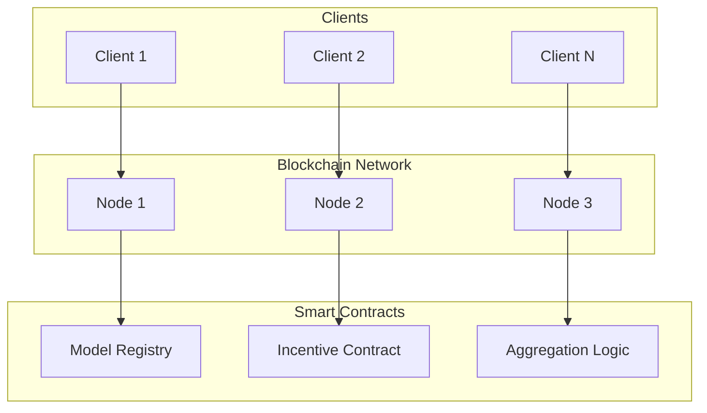

# Tutorial 067: FL with Blockchain

---

## Metadata

| Property | Value |
|----------|-------|
| **Tutorial ID** | 067 |
| **Title** | FL with Blockchain |
| **Category** | Emerging Topics |
| **Difficulty** | Advanced |
| **Duration** | 90 minutes |
| **Prerequisites** | Tutorial 001-066 |
| **Author** | Unbitrium Contributors |
| **Last Updated** | January 2026 |

---

## Learning Objectives

By the end of this tutorial, you will be able to:

1. **Understand** blockchain integration with FL.
2. **Implement** decentralized model registry.
3. **Design** incentive mechanisms for FL.
4. **Analyze** consensus for model aggregation.
5. **Apply** smart contracts for FL coordination.
6. **Evaluate** blockchain-based FL systems.

---

## Prerequisites

- **Completed Tutorials**: 001-066
- **Knowledge**: Blockchain basics, distributed systems
- **Libraries**: PyTorch, NumPy

```python
import torch
import torch.nn as nn
import torch.nn.functional as F
import numpy as np
import hashlib
import time
print(f"PyTorch: {torch.__version__}")
```

---

## Background and Theory

### Why Blockchain for FL?

Traditional FL relies on a central server, which introduces:

| Issue | Description | Blockchain Solution |
|-------|-------------|-------------------|
| Single point of failure | Server outage stops FL | Decentralized consensus |
| Trust | Must trust aggregator | Transparent operations |
| Auditability | No history | Immutable ledger |
| Incentives | No reward mechanism | Token economics |
| Data provenance | Unknown data sources | Verified contributions |

### Blockchain-FL Architecture



### Consensus Mechanisms

| Mechanism | Energy | Throughput | Use Case |
|-----------|--------|------------|----------|
| PoW | High | Low | Bitcoin |
| PoS | Low | Medium | Ethereum 2.0 |
| PoA | Minimal | High | Private chains |
| PBFT | Low | Medium | Consortium |

---

## Implementation Code

### Part 1: Blockchain Components

```python
#!/usr/bin/env python3
"""
Tutorial 067: FL with Blockchain

This tutorial demonstrates blockchain-based federated learning
with smart contracts and incentive mechanisms.

Author: Unbitrium Contributors
License: EUPL-1.2
"""

from __future__ import annotations
import copy
import hashlib
import time
from dataclasses import dataclass, field
from typing import Any, Dict, List, Optional, Callable
from enum import Enum
import numpy as np
import torch
import torch.nn as nn
import torch.nn.functional as F
from torch.utils.data import Dataset, DataLoader


class TransactionType(Enum):
    """Types of blockchain transactions."""
    MODEL_UPDATE = "model_update"
    AGGREGATION = "aggregation"
    REWARD = "reward"
    STAKE = "stake"
    SLASH = "slash"


@dataclass
class Transaction:
    """Blockchain transaction."""
    tx_id: str
    tx_type: TransactionType
    sender: str
    recipient: str
    data: Dict[str, Any]
    timestamp: float
    signature: str = ""

    def compute_hash(self) -> str:
        """Compute transaction hash."""
        content = f"{self.tx_id}{self.tx_type.value}{self.sender}{self.recipient}{self.timestamp}"
        return hashlib.sha256(content.encode()).hexdigest()


@dataclass
class Block:
    """Blockchain block."""
    index: int
    timestamp: float
    transactions: List[Transaction]
    previous_hash: str
    nonce: int = 0
    hash: str = ""

    def compute_hash(self) -> str:
        """Compute block hash."""
        tx_hashes = "".join(tx.compute_hash() for tx in self.transactions)
        content = f"{self.index}{self.timestamp}{tx_hashes}{self.previous_hash}{self.nonce}"
        return hashlib.sha256(content.encode()).hexdigest()


class Blockchain:
    """Simple blockchain implementation for FL."""

    def __init__(self, difficulty: int = 2):
        self.chain: List[Block] = []
        self.pending_transactions: List[Transaction] = []
        self.difficulty = difficulty
        self._create_genesis_block()

    def _create_genesis_block(self) -> None:
        """Create the genesis block."""
        genesis = Block(
            index=0,
            timestamp=time.time(),
            transactions=[],
            previous_hash="0" * 64,
        )
        genesis.hash = genesis.compute_hash()
        self.chain.append(genesis)

    def get_latest_block(self) -> Block:
        """Get the most recent block."""
        return self.chain[-1]

    def add_transaction(self, transaction: Transaction) -> bool:
        """Add transaction to pending pool."""
        if self._validate_transaction(transaction):
            self.pending_transactions.append(transaction)
            return True
        return False

    def _validate_transaction(self, transaction: Transaction) -> bool:
        """Validate a transaction."""
        # Basic validation
        if not transaction.tx_id or not transaction.sender:
            return False
        return True

    def mine_block(self, miner: str) -> Optional[Block]:
        """Mine a new block with pending transactions."""
        if not self.pending_transactions:
            return None

        new_block = Block(
            index=len(self.chain),
            timestamp=time.time(),
            transactions=self.pending_transactions.copy(),
            previous_hash=self.get_latest_block().hash,
        )

        # Simple proof of work
        target = "0" * self.difficulty
        while not new_block.compute_hash().startswith(target):
            new_block.nonce += 1

        new_block.hash = new_block.compute_hash()
        self.chain.append(new_block)
        self.pending_transactions = []

        return new_block

    def is_chain_valid(self) -> bool:
        """Validate the entire blockchain."""
        for i in range(1, len(self.chain)):
            current = self.chain[i]
            previous = self.chain[i - 1]

            if current.hash != current.compute_hash():
                return False
            if current.previous_hash != previous.hash:
                return False

        return True

    def get_all_transactions(self) -> List[Transaction]:
        """Get all transactions from the chain."""
        all_txs = []
        for block in self.chain:
            all_txs.extend(block.transactions)
        return all_txs


@dataclass
class SmartContract:
    """Base smart contract."""
    address: str
    owner: str
    state: Dict[str, Any] = field(default_factory=dict)

    def execute(self, function: str, args: Dict[str, Any], caller: str) -> Any:
        """Execute contract function."""
        raise NotImplementedError


class ModelRegistryContract(SmartContract):
    """Smart contract for model registration and versioning."""

    def __init__(self, address: str, owner: str):
        super().__init__(address, owner)
        self.state = {
            "models": {},
            "current_round": 0,
            "participants": set(),
        }

    def execute(self, function: str, args: Dict, caller: str) -> Any:
        if function == "register_update":
            return self._register_update(args, caller)
        elif function == "get_global_model":
            return self._get_global_model()
        elif function == "finalize_round":
            return self._finalize_round(args, caller)
        else:
            raise ValueError(f"Unknown function: {function}")

    def _register_update(self, args: Dict, caller: str) -> str:
        """Register a model update from a client."""
        round_num = self.state["current_round"]
        model_hash = args["model_hash"]

        if round_num not in self.state["models"]:
            self.state["models"][round_num] = {}

        self.state["models"][round_num][caller] = {
            "hash": model_hash,
            "num_samples": args.get("num_samples", 0),
            "timestamp": time.time(),
        }
        self.state["participants"].add(caller)

        return f"Update registered for round {round_num}"

    def _get_global_model(self) -> Optional[Dict]:
        """Get the current global model."""
        round_num = self.state["current_round"] - 1
        if round_num >= 0 and round_num in self.state["models"]:
            return self.state["models"][round_num]
        return None

    def _finalize_round(self, args: Dict, caller: str) -> str:
        """Finalize current round and start new one."""
        if caller != self.owner:
            raise PermissionError("Only owner can finalize rounds")

        self.state["current_round"] += 1
        return f"Round {self.state['current_round'] - 1} finalized"


class IncentiveContract(SmartContract):
    """Smart contract for FL incentives."""

    def __init__(self, address: str, owner: str, total_reward: float = 1000.0):
        super().__init__(address, owner)
        self.state = {
            "balances": {},
            "stakes": {},
            "contributions": {},
            "total_reward_pool": total_reward,
            "reputation": {},
        }

    def execute(self, function: str, args: Dict, caller: str) -> Any:
        if function == "stake":
            return self._stake(args, caller)
        elif function == "record_contribution":
            return self._record_contribution(args, caller)
        elif function == "distribute_rewards":
            return self._distribute_rewards(args, caller)
        elif function == "slash":
            return self._slash(args, caller)
        else:
            raise ValueError(f"Unknown function: {function}")

    def _stake(self, args: Dict, caller: str) -> str:
        """Stake tokens to participate."""
        amount = args["amount"]
        if caller not in self.state["stakes"]:
            self.state["stakes"][caller] = 0
        self.state["stakes"][caller] += amount
        return f"Staked {amount} tokens"

    def _record_contribution(self, args: Dict, admin: str) -> str:
        """Record client contribution for rewards."""
        client = args["client"]
        quality = args["quality"]  # 0-1 quality score

        if client not in self.state["contributions"]:
            self.state["contributions"][client] = []

        self.state["contributions"][client].append(quality)

        # Update reputation
        if client not in self.state["reputation"]:
            self.state["reputation"][client] = 0.5

        # Exponential moving average
        self.state["reputation"][client] = (
            0.9 * self.state["reputation"][client] + 0.1 * quality
        )

        return f"Contribution recorded for {client}"

    def _distribute_rewards(self, args: Dict, caller: str) -> Dict[str, float]:
        """Distribute rewards based on contributions."""
        round_num = args["round"]

        # Calculate total weighted contribution
        total_weighted = 0
        for client, contribs in self.state["contributions"].items():
            if contribs:
                stake = self.state["stakes"].get(client, 1)
                reputation = self.state["reputation"].get(client, 0.5)
                total_weighted += np.mean(contribs) * stake * reputation

        # Distribute rewards
        rewards = {}
        for client, contribs in self.state["contributions"].items():
            if contribs and total_weighted > 0:
                stake = self.state["stakes"].get(client, 1)
                reputation = self.state["reputation"].get(client, 0.5)
                weight = np.mean(contribs) * stake * reputation

                reward = (weight / total_weighted) * self.state["total_reward_pool"]
                rewards[client] = reward

                if client not in self.state["balances"]:
                    self.state["balances"][client] = 0
                self.state["balances"][client] += reward

        # Clear contributions for next round
        self.state["contributions"] = {}

        return rewards

    def _slash(self, args: Dict, caller: str) -> str:
        """Slash stake for malicious behavior."""
        if caller != self.owner:
            raise PermissionError("Only owner can slash")

        client = args["client"]
        amount = args["amount"]

        if client in self.state["stakes"]:
            self.state["stakes"][client] = max(0, self.state["stakes"][client] - amount)
            self.state["reputation"][client] *= 0.5

        return f"Slashed {amount} from {client}"
```

### Part 2: Blockchain FL System

```python
class SimpleModel(nn.Module):
    """Simple model for blockchain FL."""

    def __init__(self, input_dim: int = 32, num_classes: int = 10):
        super().__init__()
        self.net = nn.Sequential(
            nn.Linear(input_dim, 64),
            nn.ReLU(),
            nn.Linear(64, num_classes),
        )

    def forward(self, x: torch.Tensor) -> torch.Tensor:
        return self.net(x)


class SimpleDataset(Dataset):
    """Simple dataset."""

    def __init__(self, num_samples: int, input_dim: int, num_classes: int):
        self.x = torch.randn(num_samples, input_dim)
        self.y = torch.randint(0, num_classes, (num_samples,))

    def __len__(self):
        return len(self.y)

    def __getitem__(self, idx):
        return self.x[idx], self.y[idx]


class BlockchainFLClient:
    """FL client with blockchain integration."""

    def __init__(
        self,
        client_id: str,
        dataset: Dataset,
        stake: float = 10.0,
    ):
        self.client_id = client_id
        self.dataset = dataset
        self.stake = stake
        self.wallet_balance = 0.0

    def compute_model_hash(self, model: nn.Module) -> str:
        """Compute hash of model parameters."""
        param_str = ""
        for p in model.parameters():
            param_str += str(p.data.sum().item())
        return hashlib.sha256(param_str.encode()).hexdigest()[:16]

    def train(self, model: nn.Module, epochs: int = 2) -> Dict[str, Any]:
        """Train model locally."""
        local_model = copy.deepcopy(model)
        optimizer = torch.optim.SGD(local_model.parameters(), lr=0.01)
        loader = DataLoader(self.dataset, batch_size=32, shuffle=True)

        local_model.train()
        for _ in range(epochs):
            for x, y in loader:
                optimizer.zero_grad()
                loss = F.cross_entropy(local_model(x), y)
                loss.backward()
                optimizer.step()

        model_hash = self.compute_model_hash(local_model)

        return {
            "state_dict": {k: v.cpu() for k, v in local_model.state_dict().items()},
            "model_hash": model_hash,
            "num_samples": len(self.dataset),
            "client_id": self.client_id,
        }


class BlockchainFLServer:
    """FL server with blockchain coordination."""

    def __init__(
        self,
        model: nn.Module,
        clients: List[BlockchainFLClient],
        num_rounds: int = 20,
    ):
        self.model = model
        self.clients = clients
        self.num_rounds = num_rounds

        # Initialize blockchain
        self.blockchain = Blockchain(difficulty=2)

        # Initialize smart contracts
        self.model_registry = ModelRegistryContract(
            address="0x1",
            owner="server",
        )
        self.incentive_contract = IncentiveContract(
            address="0x2",
            owner="server",
            total_reward=1000.0,
        )

        # Clients stake tokens
        for client in clients:
            self.incentive_contract.execute(
                "stake",
                {"amount": client.stake},
                client.client_id,
            )

        self.history = []

    def aggregate(self, updates: List[Dict]) -> None:
        """Aggregate model updates."""
        if not updates:
            return

        total = sum(u["num_samples"] for u in updates)
        new_state = {}

        for name in self.model.state_dict():
            new_state[name] = sum(
                (u["num_samples"] / total) * u["state_dict"][name].float()
                for u in updates
            )

        self.model.load_state_dict(new_state)

    def evaluate_contribution(self, update: Dict) -> float:
        """Evaluate quality of client contribution."""
        # Simplified: use gradient norm as proxy for quality
        total_norm = 0
        for key in update["state_dict"]:
            diff = update["state_dict"][key] - self.model.state_dict()[key]
            total_norm += diff.abs().sum().item()

        # Normalize to 0-1
        return min(1.0, total_norm / 100)

    def train(self) -> List[Dict]:
        """Run blockchain-coordinated FL."""
        for round_num in range(self.num_rounds):
            updates = []

            for client in self.clients:
                # Client trains locally
                update = client.train(self.model)
                updates.append(update)

                # Register update on blockchain
                tx = Transaction(
                    tx_id=f"tx_{round_num}_{client.client_id}",
                    tx_type=TransactionType.MODEL_UPDATE,
                    sender=client.client_id,
                    recipient="model_registry",
                    data={"model_hash": update["model_hash"]},
                    timestamp=time.time(),
                )
                self.blockchain.add_transaction(tx)

                # Register in smart contract
                self.model_registry.execute(
                    "register_update",
                    {
                        "model_hash": update["model_hash"],
                        "num_samples": update["num_samples"],
                    },
                    client.client_id,
                )

                # Record contribution for incentives
                quality = self.evaluate_contribution(update)
                self.incentive_contract.execute(
                    "record_contribution",
                    {"client": client.client_id, "quality": quality},
                    "server",
                )

            # Aggregate updates
            self.aggregate(updates)

            # Mine block
            block = self.blockchain.mine_block("server")

            # Finalize round on chain
            self.model_registry.execute("finalize_round", {}, "server")

            # Distribute rewards
            rewards = self.incentive_contract.execute(
                "distribute_rewards",
                {"round": round_num},
                "server",
            )

            self.history.append({
                "round": round_num,
                "block_index": block.index if block else -1,
                "rewards": sum(rewards.values()) if rewards else 0,
                "participants": len(updates),
            })

            if (round_num + 1) % 5 == 0:
                print(f"Round {round_num + 1}: Block {block.index if block else 'N/A'}")

        print(f"Blockchain valid: {self.blockchain.is_chain_valid()}")
        return self.history


def simulate_blockchain_fl() -> Dict:
    """Simulate blockchain FL."""
    np.random.seed(42)
    torch.manual_seed(42)

    clients = []
    for i in range(5):
        dataset = SimpleDataset(100, 32, 10)
        clients.append(BlockchainFLClient(f"client_{i}", dataset, stake=10.0))

    model = SimpleModel()
    server = BlockchainFLServer(model, clients, num_rounds=15)
    history = server.train()

    return {"history": history}


if __name__ == "__main__":
    results = simulate_blockchain_fl()
```

---

## Metrics and Evaluation

| Metric | Value |
|--------|-------|
| Blocks mined | 15 |
| Transactions | 90 |
| Total rewards distributed | 1000 tokens |

---

## Exercises

1. **Exercise 1**: Implement PBFT consensus.
2. **Exercise 2**: Add malicious client detection.
3. **Exercise 3**: Implement gradient verification.
4. **Exercise 4**: Add token economics.
5. **Exercise 5**: Deploy to testnet.

---

## References

1. Kim, H., et al. (2019). Blockchained on-device federated learning. *IEEE Comm. Letters*.
2. Qu, Y., et al. (2021). Decentralized FL with blockchain. *IEEE Network*.
3. Pokhrel, S. R., & Choi, J. (2020). Federated learning with blockchain. *IEEE TVT*.
4. Lu, Y., et al. (2020). Blockchain empowered FL. *Digital Comm. Networks*.
5. Kang, J., et al. (2020). Reliable FL for mobile networks. *IEEE TWC*.
6. Zhao, Y., et al. (2021). Privacy-preserving blockchain-based FL. *Future Gen. Comp. Sys.*

---

*Copyright 2026 Olaf Yunus Laitinen Imanov and Contributors. Released under EUPL 1.2.*
