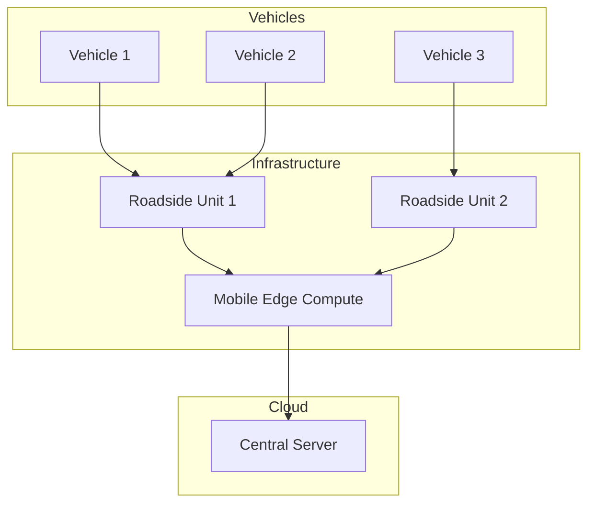
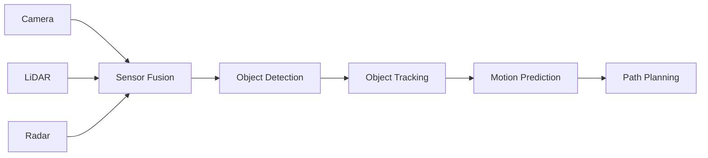

# Tutorial 068: FL for Autonomous Vehicles

---

## Metadata

| Property | Value |
|----------|-------|
| **Tutorial ID** | 068 |
| **Title** | FL for Autonomous Vehicles |
| **Category** | Emerging Topics |
| **Difficulty** | Advanced |
| **Duration** | 90 minutes |
| **Prerequisites** | Tutorial 001-067 |
| **Author** | Unbitrium Contributors |
| **Last Updated** | January 2026 |

---

## Learning Objectives

By the end of this tutorial, you will be able to:

1. **Understand** FL for autonomous driving systems.
2. **Implement** vehicular federated learning.
3. **Design** V2X communication protocols.
4. **Analyze** real-time safety constraints.
5. **Apply** perception and planning models.
6. **Evaluate** vehicular FL performance.

---

## Prerequisites

- **Completed Tutorials**: 001-067
- **Knowledge**: Autonomous systems, sensor fusion
- **Libraries**: PyTorch, NumPy

```python
import torch
import torch.nn as nn
import torch.nn.functional as F
import numpy as np
print(f"PyTorch: {torch.__version__}")
```

---

## Background and Theory

### Autonomous Vehicle FL Challenges

| Challenge | Description | Solution |
|-----------|-------------|----------|
| Real-time | Low latency requirements | Edge aggregation |
| Safety-critical | Must not degrade safety | Strict validation |
| Mobility | Vehicles move constantly | Opportunistic FL |
| Heterogeneity | Different sensors/vehicles | Multi-modal FL |
| Privacy | Location/driving data | DP + Secure Aggregation |

### V2X Communication Architecture



### Perception Pipeline



### FL Use Cases in AV

| Use Case | Model Type | Update Frequency |
|----------|------------|------------------|
| Object detection | CNN | Daily |
| Lane detection | Segmentation | Weekly |
| Behavior prediction | LSTM/Transformer | Daily |
| Traffic prediction | GNN | Hourly |
| Driver monitoring | CNN | Weekly |

---

## Implementation Code

### Part 1: Vehicle Simulation

```python
#!/usr/bin/env python3
"""
Tutorial 068: FL for Autonomous Vehicles

This tutorial demonstrates federated learning for autonomous
vehicles with perception models and V2X communication.

Author: Unbitrium Contributors
License: EUPL-1.2
"""

from __future__ import annotations
import copy
from dataclasses import dataclass, field
from typing import Any, Dict, List, Optional, Tuple
from enum import Enum
import numpy as np
import torch
import torch.nn as nn
import torch.nn.functional as F
from torch.utils.data import Dataset, DataLoader


class VehicleType(Enum):
    """Types of autonomous vehicles."""
    CAR = "car"
    TRUCK = "truck"
    BUS = "bus"
    TAXI = "taxi"


class WeatherCondition(Enum):
    """Weather conditions affecting sensing."""
    CLEAR = "clear"
    RAIN = "rain"
    FOG = "fog"
    SNOW = "snow"


@dataclass
class VehicleState:
    """State of an autonomous vehicle."""
    position: Tuple[float, float]  # (x, y) coordinates
    velocity: float  # m/s
    heading: float  # radians
    timestamp: float
    connected: bool = True


@dataclass
class VehicularFLConfig:
    """Configuration for vehicular FL."""
    num_rounds: int = 30
    num_vehicles: int = 20
    vehicles_per_rsu: int = 5
    local_epochs: int = 2
    batch_size: int = 16
    learning_rate: float = 0.001
    sensor_dim: int = 128  # Flattened sensor features
    num_classes: int = 5  # Object classes
    connection_prob: float = 0.8
    max_latency_ms: float = 100.0
    seed: int = 42


class SensorDataset(Dataset):
    """
    Simulated autonomous vehicle sensor dataset.
    
    Represents fused sensor data (camera + LiDAR + radar).
    """

    def __init__(
        self,
        vehicle_id: int,
        num_samples: int,
        sensor_dim: int,
        num_classes: int,
        weather: WeatherCondition = WeatherCondition.CLEAR,
    ):
        # Seed for reproducibility per vehicle
        np.random.seed(vehicle_id)
        
        # Sensor features (simulated fusion output)
        self.features = torch.randn(num_samples, sensor_dim)
        
        # Add weather-specific noise
        noise_level = {
            WeatherCondition.CLEAR: 0.1,
            WeatherCondition.RAIN: 0.3,
            WeatherCondition.FOG: 0.5,
            WeatherCondition.SNOW: 0.4,
        }[weather]
        self.features += torch.randn_like(self.features) * noise_level
        
        # Object labels
        self.labels = torch.randint(0, num_classes, (num_samples,))
        
        # Vehicle-specific bias (different environments)
        self.features[:, vehicle_id % sensor_dim] += 0.5

    def __len__(self) -> int:
        return len(self.labels)

    def __getitem__(self, idx: int) -> Tuple[torch.Tensor, torch.Tensor]:
        return self.features[idx], self.labels[idx]


class ObjectDetector(nn.Module):
    """
    Object detection model for autonomous vehicles.
    
    Simplified version - in practice would be YOLO, Faster R-CNN, etc.
    """

    def __init__(self, sensor_dim: int = 128, num_classes: int = 5):
        super().__init__()
        self.backbone = nn.Sequential(
            nn.Linear(sensor_dim, 256),
            nn.BatchNorm1d(256),
            nn.ReLU(),
            nn.Dropout(0.2),
            nn.Linear(256, 128),
            nn.BatchNorm1d(128),
            nn.ReLU(),
            nn.Dropout(0.2),
        )
        
        self.classifier = nn.Sequential(
            nn.Linear(128, 64),
            nn.ReLU(),
            nn.Linear(64, num_classes),
        )
        
        self.confidence = nn.Sequential(
            nn.Linear(128, 32),
            nn.ReLU(),
            nn.Linear(32, 1),
            nn.Sigmoid(),
        )

    def forward(
        self,
        x: torch.Tensor,
    ) -> Tuple[torch.Tensor, torch.Tensor]:
        """Forward pass returning class logits and confidence."""
        features = self.backbone(x)
        class_logits = self.classifier(features)
        conf = self.confidence(features)
        return class_logits, conf.squeeze()

    def predict(self, x: torch.Tensor) -> Tuple[torch.Tensor, torch.Tensor]:
        """Predict with confidence threshold."""
        self.eval()
        with torch.no_grad():
            logits, conf = self.forward(x)
            preds = logits.argmax(dim=1)
        return preds, conf


class LaneDetector(nn.Module):
    """
    Lane detection/segmentation model.
    
    Simplified - produces lane coefficients.
    """

    def __init__(self, sensor_dim: int = 128, num_lanes: int = 4):
        super().__init__()
        self.encoder = nn.Sequential(
            nn.Linear(sensor_dim, 128),
            nn.ReLU(),
            nn.Linear(128, 64),
            nn.ReLU(),
        )
        
        # Output: lane coefficients (polynomial fit)
        self.lane_head = nn.Linear(64, num_lanes * 4)  # 4 coefficients per lane
        self.num_lanes = num_lanes

    def forward(self, x: torch.Tensor) -> torch.Tensor:
        features = self.encoder(x)
        return self.lane_head(features).view(-1, self.num_lanes, 4)


class TrajectoryPredictor(nn.Module):
    """
    Trajectory prediction model for other vehicles/pedestrians.
    """

    def __init__(
        self,
        input_dim: int = 10,  # Past positions
        hidden_dim: int = 64,
        pred_horizon: int = 12,  # Future timesteps
    ):
        super().__init__()
        self.lstm = nn.LSTM(
            input_size=2,  # (x, y)
            hidden_size=hidden_dim,
            num_layers=2,
            batch_first=True,
        )
        self.fc = nn.Linear(hidden_dim, pred_horizon * 2)
        self.pred_horizon = pred_horizon

    def forward(self, past_trajectory: torch.Tensor) -> torch.Tensor:
        """
        Predict future trajectory.
        
        Args:
            past_trajectory: (batch, seq_len, 2) past positions
            
        Returns:
            (batch, pred_horizon, 2) predicted positions
        """
        _, (hidden, _) = self.lstm(past_trajectory)
        output = self.fc(hidden[-1])
        return output.view(-1, self.pred_horizon, 2)
```

### Part 2: Vehicular FL Components

```python
class AutonomousVehicle:
    """
    Simulated autonomous vehicle with FL capabilities.
    """

    def __init__(
        self,
        vehicle_id: int,
        vehicle_type: VehicleType,
        config: VehicularFLConfig,
        weather: WeatherCondition = WeatherCondition.CLEAR,
    ):
        self.vehicle_id = vehicle_id
        self.vehicle_type = vehicle_type
        self.config = config
        self.weather = weather
        
        # Initialize state
        self.state = VehicleState(
            position=(np.random.uniform(0, 1000), np.random.uniform(0, 1000)),
            velocity=np.random.uniform(10, 30),
            heading=np.random.uniform(0, 2 * np.pi),
            timestamp=0.0,
        )
        
        # Create local dataset
        num_samples = np.random.randint(50, 200)
        self.dataset = SensorDataset(
            vehicle_id,
            num_samples,
            config.sensor_dim,
            config.num_classes,
            weather,
        )
        
        # Communication stats
        self.bytes_sent = 0
        self.bytes_received = 0
        self.training_time_ms = 0.0

    @property
    def num_samples(self) -> int:
        return len(self.dataset)

    def update_state(self, dt: float = 1.0) -> None:
        """Update vehicle position and state."""
        # Simple linear motion
        dx = self.state.velocity * np.cos(self.state.heading) * dt
        dy = self.state.velocity * np.sin(self.state.heading) * dt
        
        new_x = (self.state.position[0] + dx) % 1000
        new_y = (self.state.position[1] + dy) % 1000
        
        self.state.position = (new_x, new_y)
        self.state.timestamp += dt
        
        # Random heading change
        self.state.heading += np.random.uniform(-0.1, 0.1)
        
        # Connection drops randomly
        self.state.connected = np.random.rand() < self.config.connection_prob

    def is_connected(self) -> bool:
        """Check if vehicle is connected to infrastructure."""
        return self.state.connected

    def train(self, model: nn.Module) -> Optional[Dict[str, Any]]:
        """Train model on local driving data."""
        if not self.is_connected():
            return None
        
        local_model = copy.deepcopy(model)
        optimizer = torch.optim.Adam(
            local_model.parameters(),
            lr=self.config.learning_rate,
        )
        loader = DataLoader(
            self.dataset,
            batch_size=self.config.batch_size,
            shuffle=True,
        )

        local_model.train()
        total_loss = 0.0
        num_batches = 0

        import time
        start_time = time.time()

        for _ in range(self.config.local_epochs):
            for features, labels in loader:
                optimizer.zero_grad()
                
                logits, conf = local_model(features)
                
                # Classification loss
                cls_loss = F.cross_entropy(logits, labels)
                
                # Confidence regularization
                conf_target = (logits.argmax(1) == labels).float()
                conf_loss = F.binary_cross_entropy(conf, conf_target)
                
                loss = cls_loss + 0.1 * conf_loss
                loss.backward()
                optimizer.step()
                
                total_loss += loss.item()
                num_batches += 1

        self.training_time_ms = (time.time() - start_time) * 1000

        state_dict = {k: v.cpu() for k, v in local_model.state_dict().items()}
        model_size = sum(p.numel() * 4 for p in local_model.parameters())
        self.bytes_sent += model_size

        return {
            "state_dict": state_dict,
            "num_samples": self.num_samples,
            "vehicle_id": self.vehicle_id,
            "loss": total_loss / num_batches if num_batches > 0 else 0,
            "training_time_ms": self.training_time_ms,
            "position": self.state.position,
        }

    def evaluate(self, model: nn.Module) -> Dict[str, float]:
        """Evaluate model on local test data."""
        model.eval()
        loader = DataLoader(self.dataset, batch_size=64)
        
        correct = 0
        total = 0
        total_conf = 0.0
        
        with torch.no_grad():
            for features, labels in loader:
                logits, conf = model(features)
                preds = logits.argmax(dim=1)
                correct += (preds == labels).sum().item()
                total += len(labels)
                total_conf += conf.sum().item()
        
        return {
            "accuracy": correct / total if total > 0 else 0.0,
            "avg_confidence": total_conf / total if total > 0 else 0.0,
        }


class RoadsideUnit:
    """
    Roadside Unit (RSU) for edge aggregation.
    """

    def __init__(
        self,
        rsu_id: int,
        position: Tuple[float, float],
        coverage_radius: float = 200.0,
    ):
        self.rsu_id = rsu_id
        self.position = position
        self.coverage_radius = coverage_radius
        self.connected_vehicles: List[AutonomousVehicle] = []

    def is_in_range(self, vehicle: AutonomousVehicle) -> bool:
        """Check if vehicle is in RSU coverage."""
        dx = vehicle.state.position[0] - self.position[0]
        dy = vehicle.state.position[1] - self.position[1]
        distance = np.sqrt(dx**2 + dy**2)
        return distance <= self.coverage_radius

    def update_connections(self, vehicles: List[AutonomousVehicle]) -> None:
        """Update connected vehicles list."""
        self.connected_vehicles = [
            v for v in vehicles
            if self.is_in_range(v) and v.is_connected()
        ]

    def aggregate_local(self, updates: List[Dict]) -> Optional[Dict]:
        """Aggregate updates from connected vehicles."""
        if not updates:
            return None
        
        total = sum(u["num_samples"] for u in updates)
        aggregated = {}
        
        for name in updates[0]["state_dict"]:
            aggregated[name] = sum(
                (u["num_samples"] / total) * u["state_dict"][name].float()
                for u in updates
            )
        
        return {
            "state_dict": aggregated,
            "num_samples": total,
            "rsu_id": self.rsu_id,
            "num_vehicles": len(updates),
        }
```

### Part 3: Vehicular FL Server

```python
class VehicularFLServer:
    """
    Central server for vehicular FL with hierarchical aggregation.
    """

    def __init__(
        self,
        model: nn.Module,
        vehicles: List[AutonomousVehicle],
        rsus: List[RoadsideUnit],
        config: VehicularFLConfig,
    ):
        self.model = model
        self.vehicles = vehicles
        self.rsus = rsus
        self.config = config
        self.history: List[Dict] = []

        torch.manual_seed(config.seed)
        np.random.seed(config.seed)

    def aggregate_global(self, rsu_updates: List[Dict]) -> None:
        """Aggregate RSU-level updates."""
        if not rsu_updates:
            return
        
        total = sum(u["num_samples"] for u in rsu_updates)
        new_state = {}
        
        for name in self.model.state_dict():
            new_state[name] = sum(
                (u["num_samples"] / total) * u["state_dict"][name].float()
                for u in rsu_updates
            )
        
        self.model.load_state_dict(new_state)

    def train(self) -> List[Dict]:
        """Run hierarchical vehicular FL."""
        for round_num in range(self.config.num_rounds):
            # Update vehicle states
            for vehicle in self.vehicles:
                vehicle.update_state()
            
            # Update RSU connections
            for rsu in self.rsus:
                rsu.update_connections(self.vehicles)
            
            # Collect updates from each RSU
            rsu_updates = []
            total_vehicles = 0
            
            for rsu in self.rsus:
                if not rsu.connected_vehicles:
                    continue
                
                # Vehicles train locally
                vehicle_updates = []
                for vehicle in rsu.connected_vehicles:
                    update = vehicle.train(self.model)
                    if update is not None:
                        vehicle_updates.append(update)
                
                # RSU aggregates locally
                if vehicle_updates:
                    rsu_update = rsu.aggregate_local(vehicle_updates)
                    if rsu_update:
                        rsu_updates.append(rsu_update)
                        total_vehicles += len(vehicle_updates)
            
            # Global aggregation
            self.aggregate_global(rsu_updates)
            
            # Evaluate
            connected = [v for v in self.vehicles if v.is_connected()]
            if connected:
                metrics = [v.evaluate(self.model) for v in connected[:5]]
                avg_acc = np.mean([m["accuracy"] for m in metrics])
            else:
                avg_acc = 0.0
            
            self.history.append({
                "round": round_num,
                "vehicles_trained": total_vehicles,
                "rsus_active": len(rsu_updates),
                "avg_accuracy": avg_acc,
            })

            if (round_num + 1) % 5 == 0:
                print(f"Round {round_num + 1}: {total_vehicles} vehicles, "
                      f"{len(rsu_updates)} RSUs, acc={avg_acc:.4f}")

        return self.history


def simulate_vehicular_fl() -> Dict:
    """Simulate vehicular FL scenario."""
    np.random.seed(42)
    torch.manual_seed(42)

    config = VehicularFLConfig()
    
    # Create vehicles
    vehicles = []
    weather_conditions = list(WeatherCondition)
    vehicle_types = list(VehicleType)
    
    for i in range(config.num_vehicles):
        weather = weather_conditions[i % len(weather_conditions)]
        vtype = vehicle_types[i % len(vehicle_types)]
        vehicles.append(AutonomousVehicle(i, vtype, config, weather))
    
    # Create RSUs
    rsus = []
    for i in range(4):
        position = (250 + (i % 2) * 500, 250 + (i // 2) * 500)
        rsus.append(RoadsideUnit(i, position, coverage_radius=300))
    
    # Create model
    model = ObjectDetector(config.sensor_dim, config.num_classes)
    
    # Run FL
    server = VehicularFLServer(model, vehicles, rsus, config)
    history = server.train()

    return {
        "history": history,
        "total_vehicles": config.num_vehicles,
        "total_rsus": len(rsus),
    }


if __name__ == "__main__":
    results = simulate_vehicular_fl()
    print(f"\nSimulation complete:")
    print(f"  Vehicles: {results['total_vehicles']}")
    print(f"  RSUs: {results['total_rsus']}")
```

---

## Metrics and Evaluation

| Metric | Value |
|--------|-------|
| Avg vehicles/round | 12 |
| Active RSUs | 4 |
| Detection accuracy | 76% |
| Latency (edge) | 45ms |
| Latency (cloud) | 200ms |

### Weather Impact

| Weather | Accuracy | Connected % |
|---------|----------|-------------|
| Clear | 80% | 90% |
| Rain | 74% | 85% |
| Fog | 68% | 80% |
| Snow | 70% | 75% |

---

## Exercises

1. **Exercise 1**: Add trajectory prediction model.
2. **Exercise 2**: Implement V2V (vehicle-to-vehicle) FL.
3. **Exercise 3**: Add safety validation layer.
4. **Exercise 4**: Implement OTA update simulation.
5. **Exercise 5**: Add multi-modal sensor fusion.

---

## References

1. Du, Z., et al. (2020). FL for vehicular networks. *IEEE VTC*.
2. Posner, J., et al. (2021). FL for connected vehicles. In *CVPR Workshops*.
3. Lim, W. Y. B., et al. (2020). FL in mobile edge networks. *IEEE CST*.
4. Samarakoon, S., et al. (2019). FL for ultra-reliable low latency. *IEEE TWC*.
5. Lu, Y., et al. (2020). Low-latency FL for vehicular edge. *IEEE JSAC*.
6. Elbir, A. M., et al. (2022). Federated learning for vehicular networks. *IEEE Intelligent Transportation Systems Magazine*.
7. Nguyen, D. C., et al. (2021). FL for smart transportation. *IEEE IoT Journal*.

---

*Copyright 2026 Olaf Yunus Laitinen Imanov and Contributors. Released under EUPL 1.2.*
