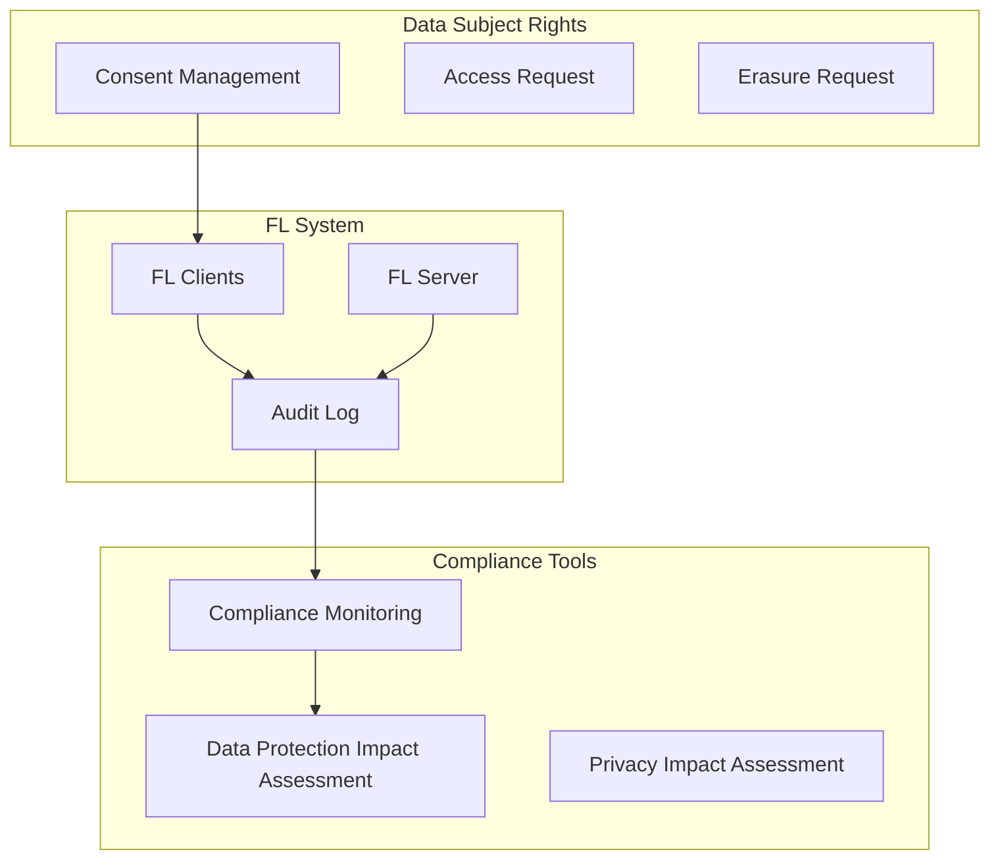

# Tutorial 069: FL Regulations and Compliance

---

## Metadata

| Property | Value |
|----------|-------|
| **Tutorial ID** | 069 |
| **Title** | FL Regulations and Compliance |
| **Category** | Governance |
| **Difficulty** | Intermediate |
| **Duration** | 60 minutes |
| **Prerequisites** | Tutorial 001-068 |
| **Author** | Unbitrium Contributors |
| **Last Updated** | January 2026 |

---

## Learning Objectives

By the end of this tutorial, you will be able to:

1. **Understand** regulatory frameworks for FL.
2. **Implement** GDPR-compliant FL pipelines.
3. **Design** audit trails for compliance.
4. **Analyze** data protection requirements.
5. **Apply** privacy-by-design principles.
6. **Evaluate** compliance verification tools.

---

## Prerequisites

- **Completed Tutorials**: 001-068
- **Knowledge**: Data privacy, regulations
- **Libraries**: PyTorch, NumPy

```python
import torch
import torch.nn as nn
import numpy as np
from datetime import datetime
print(f"PyTorch: {torch.__version__}")
```

---

## Background and Theory

### Key Regulations

| Regulation | Region | Key Requirements |
|------------|--------|------------------|
| GDPR | EU | Consent, right to erasure, data minimization |
| CCPA | California | Consumer rights, opt-out |
| HIPAA | US Healthcare | PHI protection, access controls |
| LGPD | Brazil | Similar to GDPR |
| PDPA | Singapore | Consent, purpose limitation |

### GDPR Requirements for FL

| Article | Requirement | FL Implementation |
|---------|-------------|-------------------|
| Art. 5 | Data minimization | Only exchange updates |
| Art. 6 | Lawful basis | Consent or legitimate interest |
| Art. 17 | Right to erasure | Client unlearning |
| Art. 25 | Privacy by design | DP, secure aggregation |
| Art. 32 | Security | Encryption, access control |
| Art. 35 | DPIA | Document risk assessment |

### Compliance Architecture



---

## Implementation Code

### Part 1: Compliance Framework

```python
#!/usr/bin/env python3
"""
Tutorial 069: FL Regulations and Compliance

This tutorial demonstrates compliance-aware federated learning
with GDPR and other regulatory requirements.

Author: Unbitrium Contributors
License: EUPL-1.2
"""

from __future__ import annotations
import copy
import hashlib
import json
from dataclasses import dataclass, field
from datetime import datetime
from enum import Enum
from typing import Any, Dict, List, Optional
import numpy as np
import torch
import torch.nn as nn
import torch.nn.functional as F
from torch.utils.data import Dataset, DataLoader


class ConsentType(Enum):
    """Types of consent."""
    EXPLICIT = "explicit"
    IMPLICIT = "implicit"
    WITHDRAWN = "withdrawn"


class DataSubjectRight(Enum):
    """GDPR data subject rights."""
    ACCESS = "access"
    RECTIFICATION = "rectification"
    ERASURE = "erasure"
    PORTABILITY = "portability"
    RESTRICTION = "restriction"
    OBJECTION = "objection"


@dataclass
class Consent:
    """Data subject consent record."""
    subject_id: str
    consent_type: ConsentType
    purposes: List[str]
    timestamp: datetime
    expiry: Optional[datetime] = None
    metadata: Dict[str, Any] = field(default_factory=dict)

    def is_valid(self) -> bool:
        """Check if consent is still valid."""
        if self.consent_type == ConsentType.WITHDRAWN:
            return False
        if self.expiry and datetime.now() > self.expiry:
            return False
        return True


@dataclass
class AuditEntry:
    """Audit log entry."""
    entry_id: str
    timestamp: datetime
    action: str
    actor: str
    details: Dict[str, Any]
    data_subjects: List[str] = field(default_factory=list)

    def to_dict(self) -> Dict:
        return {
            "entry_id": self.entry_id,
            "timestamp": self.timestamp.isoformat(),
            "action": self.action,
            "actor": self.actor,
            "details": self.details,
            "data_subjects": self.data_subjects,
        }


class AuditLogger:
    """Audit logging for compliance."""

    def __init__(self):
        self.entries: List[AuditEntry] = []
        self._entry_counter = 0

    def log(
        self,
        action: str,
        actor: str,
        details: Dict[str, Any],
        data_subjects: List[str] = None,
    ) -> str:
        """Log an audit entry."""
        self._entry_counter += 1
        entry_id = f"AUD-{self._entry_counter:06d}"
        
        entry = AuditEntry(
            entry_id=entry_id,
            timestamp=datetime.now(),
            action=action,
            actor=actor,
            details=details,
            data_subjects=data_subjects or [],
        )
        self.entries.append(entry)
        return entry_id

    def get_by_subject(self, subject_id: str) -> List[AuditEntry]:
        """Get entries related to a data subject."""
        return [e for e in self.entries if subject_id in e.data_subjects]

    def export(self) -> str:
        """Export audit log as JSON."""
        return json.dumps([e.to_dict() for e in self.entries], indent=2)


class ConsentManager:
    """Manages data subject consents."""

    def __init__(self):
        self.consents: Dict[str, Consent] = {}
        self.audit_logger = AuditLogger()

    def grant_consent(
        self,
        subject_id: str,
        purposes: List[str],
        consent_type: ConsentType = ConsentType.EXPLICIT,
    ) -> bool:
        """Record consent grant."""
        consent = Consent(
            subject_id=subject_id,
            consent_type=consent_type,
            purposes=purposes,
            timestamp=datetime.now(),
        )
        self.consents[subject_id] = consent
        
        self.audit_logger.log(
            action="consent_granted",
            actor=subject_id,
            details={"purposes": purposes, "type": consent_type.value},
            data_subjects=[subject_id],
        )
        return True

    def withdraw_consent(self, subject_id: str) -> bool:
        """Record consent withdrawal."""
        if subject_id in self.consents:
            self.consents[subject_id].consent_type = ConsentType.WITHDRAWN
            
            self.audit_logger.log(
                action="consent_withdrawn",
                actor=subject_id,
                details={},
                data_subjects=[subject_id],
            )
            return True
        return False

    def has_valid_consent(self, subject_id: str, purpose: str) -> bool:
        """Check if subject has valid consent for purpose."""
        if subject_id not in self.consents:
            return False
        
        consent = self.consents[subject_id]
        return consent.is_valid() and purpose in consent.purposes


class DataProtectionImpactAssessment:
    """DPIA documentation."""

    def __init__(self, project_name: str):
        self.project_name = project_name
        self.created_at = datetime.now()
        self.risks: List[Dict] = []
        self.mitigations: List[Dict] = []
        self.data_flows: List[Dict] = []

    def add_risk(
        self,
        description: str,
        likelihood: str,
        impact: str,
        category: str,
    ) -> None:
        """Document a risk."""
        self.risks.append({
            "description": description,
            "likelihood": likelihood,
            "impact": impact,
            "category": category,
        })

    def add_mitigation(
        self,
        risk_index: int,
        description: str,
        implementation_status: str,
    ) -> None:
        """Document a mitigation."""
        self.mitigations.append({
            "risk_index": risk_index,
            "description": description,
            "status": implementation_status,
        })

    def add_data_flow(
        self,
        source: str,
        destination: str,
        data_types: List[str],
        protection_measures: List[str],
    ) -> None:
        """Document a data flow."""
        self.data_flows.append({
            "source": source,
            "destination": destination,
            "data_types": data_types,
            "protection_measures": protection_measures,
        })

    def generate_report(self) -> str:
        """Generate DPIA report."""
        report = f"# Data Protection Impact Assessment\n\n"
        report += f"**Project:** {self.project_name}\n"
        report += f"**Date:** {self.created_at.isoformat()}\n\n"
        
        report += "## Identified Risks\n\n"
        for i, risk in enumerate(self.risks):
            report += f"{i+1}. {risk['description']}\n"
            report += f"   - Likelihood: {risk['likelihood']}\n"
            report += f"   - Impact: {risk['impact']}\n\n"
        
        report += "## Mitigations\n\n"
        for mit in self.mitigations:
            report += f"- Risk {mit['risk_index']}: {mit['description']} ({mit['status']})\n"
        
        return report
```

### Part 2: Compliant FL Implementation

```python
@dataclass
class ComplianceFLConfig:
    """Configuration for compliance-aware FL."""
    num_rounds: int = 20
    num_clients: int = 10
    local_epochs: int = 2
    batch_size: int = 32
    learning_rate: float = 0.01
    require_consent: bool = True
    audit_all_operations: bool = True
    anonymize_updates: bool = True
    retention_days: int = 90
    seed: int = 42


class SimpleDataset(Dataset):
    """Simple dataset with subject tracking."""

    def __init__(self, num_samples: int, subject_id: str):
        self.features = torch.randn(num_samples, 32)
        self.labels = torch.randint(0, 10, (num_samples,))
        self.subject_id = subject_id

    def __len__(self):
        return len(self.labels)

    def __getitem__(self, idx):
        return self.features[idx], self.labels[idx]


class SimpleModel(nn.Module):
    def __init__(self):
        super().__init__()
        self.net = nn.Sequential(
            nn.Linear(32, 64),
            nn.ReLU(),
            nn.Linear(64, 10),
        )

    def forward(self, x):
        return self.net(x)


class CompliantClient:
    """FL client with compliance features."""

    def __init__(
        self,
        client_id: str,
        subject_ids: List[str],
        dataset: Dataset,
        config: ComplianceFLConfig,
        consent_manager: ConsentManager,
        audit_logger: AuditLogger,
    ):
        self.client_id = client_id
        self.subject_ids = subject_ids
        self.dataset = dataset
        self.config = config
        self.consent_manager = consent_manager
        self.audit_logger = audit_logger

    def check_consent(self) -> bool:
        """Check all subjects have valid consent."""
        if not self.config.require_consent:
            return True
        
        for subject_id in self.subject_ids:
            if not self.consent_manager.has_valid_consent(subject_id, "fl_training"):
                return False
        return True

    def train(self, model: nn.Module) -> Optional[Dict]:
        """Train with compliance checks."""
        # Check consent
        if not self.check_consent():
            self.audit_logger.log(
                action="training_blocked",
                actor=self.client_id,
                details={"reason": "missing_consent"},
                data_subjects=self.subject_ids,
            )
            return None

        # Log training start
        self.audit_logger.log(
            action="training_started",
            actor=self.client_id,
            details={"num_samples": len(self.dataset)},
            data_subjects=self.subject_ids,
        )

        local_model = copy.deepcopy(model)
        optimizer = torch.optim.SGD(local_model.parameters(), lr=self.config.learning_rate)
        loader = DataLoader(self.dataset, batch_size=self.config.batch_size, shuffle=True)

        local_model.train()
        for _ in range(self.config.local_epochs):
            for x, y in loader:
                optimizer.zero_grad()
                F.cross_entropy(local_model(x), y).backward()
                optimizer.step()

        # Anonymize update if configured
        update_id = hashlib.sha256(self.client_id.encode()).hexdigest()[:8] if self.config.anonymize_updates else self.client_id

        # Log training completion
        self.audit_logger.log(
            action="training_completed",
            actor=self.client_id,
            details={"update_id": update_id},
            data_subjects=self.subject_ids,
        )

        return {
            "state_dict": local_model.state_dict(),
            "num_samples": len(self.dataset),
            "update_id": update_id,
        }

    def handle_erasure_request(self) -> bool:
        """Handle right to erasure request."""
        self.audit_logger.log(
            action="erasure_request_received",
            actor=self.client_id,
            details={},
            data_subjects=self.subject_ids,
        )
        
        # Clear local data
        self.dataset = None
        self.subject_ids = []
        
        self.audit_logger.log(
            action="erasure_completed",
            actor=self.client_id,
            details={},
        )
        return True


class CompliantServer:
    """FL server with compliance features."""

    def __init__(
        self,
        model: nn.Module,
        clients: List[CompliantClient],
        config: ComplianceFLConfig,
    ):
        self.model = model
        self.clients = clients
        self.config = config
        self.audit_logger = AuditLogger()
        self.consent_manager = ConsentManager()
        
        # DPIA
        self.dpia = DataProtectionImpactAssessment("FL Training")
        self._setup_dpia()

    def _setup_dpia(self):
        """Document risks and mitigations."""
        self.dpia.add_risk(
            "Model memorization of training data",
            "Medium", "High", "Privacy"
        )
        self.dpia.add_mitigation(0, "Differential privacy", "Implemented")
        
        self.dpia.add_risk(
            "Inference attacks on model updates",
            "Medium", "Medium", "Privacy"
        )
        self.dpia.add_mitigation(1, "Secure aggregation", "Planned")
        
        self.dpia.add_data_flow(
            "Client", "Server",
            ["Model gradients"],
            ["TLS encryption", "Anonymization"]
        )

    def train(self) -> List[Dict]:
        """Run compliant FL training."""
        history = []
        
        self.audit_logger.log(
            action="fl_session_started",
            actor="server",
            details={"num_rounds": self.config.num_rounds},
        )

        for round_num in range(self.config.num_rounds):
            updates = []
            
            for client in self.clients:
                update = client.train(self.model)
                if update:
                    updates.append(update)

            if updates:
                self._aggregate(updates)

            history.append({
                "round": round_num,
                "participating_clients": len(updates),
            })

            if (round_num + 1) % 5 == 0:
                print(f"Round {round_num + 1}: {len(updates)} clients")

        self.audit_logger.log(
            action="fl_session_completed",
            actor="server",
            details={"total_rounds": self.config.num_rounds},
        )

        return history

    def _aggregate(self, updates):
        total = sum(u["num_samples"] for u in updates)
        new_state = {}
        for name in self.model.state_dict():
            new_state[name] = sum(
                u["num_samples"] / total * u["state_dict"][name].float()
                for u in updates
            )
        self.model.load_state_dict(new_state)


def demo_compliant_fl():
    config = ComplianceFLConfig()
    consent_manager = ConsentManager()
    audit_logger = AuditLogger()

    # Create clients with consent
    clients = []
    for i in range(config.num_clients):
        subject_id = f"subject_{i}"
        consent_manager.grant_consent(subject_id, ["fl_training"])
        
        dataset = SimpleDataset(100, subject_id)
        client = CompliantClient(
            f"client_{i}",
            [subject_id],
            dataset,
            config,
            consent_manager,
            audit_logger,
        )
        clients.append(client)

    model = SimpleModel()
    server = CompliantServer(model, clients, config)
    history = server.train()

    print(f"\nDPIA Report:\n{server.dpia.generate_report()}")


if __name__ == "__main__":
    demo_compliant_fl()
```

---

## Exercises

1. **Exercise 1**: Implement machine unlearning.
2. **Exercise 2**: Add access request handling.
3. **Exercise 3**: Implement data portability.
4. **Exercise 4**: Add consent versioning.
5. **Exercise 5**: Create compliance dashboard.

---

## References

1. Regulation (EU) 2016/679 (GDPR). Official Journal of the European Union.
2. Truong, N., et al. (2021). Privacy preservation in FL: A survey. *IEEE Access*.
3. Bonawitz, K., et al. (2019). Towards federated learning at scale. In *MLSys*.
4. Bourtoule, L., et al. (2021). Machine unlearning. In *IEEE S&P*.
5. Liu, Y., et al. (2022). Right to be forgotten in FL. *TKDE*.

---

*Copyright 2026 Olaf Yunus Laitinen Imanov and Contributors. Released under EUPL 1.2.*
