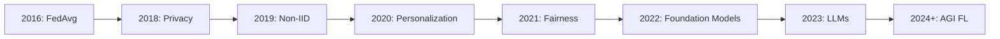

# Tutorial 070: FL Research Frontiers

---

## Metadata

| Property | Value |
|----------|-------|
| **Tutorial ID** | 070 |
| **Title** | FL Research Frontiers |
| **Category** | Research |
| **Difficulty** | Advanced |
| **Duration** | 75 minutes |
| **Prerequisites** | Tutorial 001-069 |
| **Author** | Unbitrium Contributors |
| **Last Updated** | January 2026 |

---

## Learning Objectives

By the end of this tutorial, you will be able to:

1. **Understand** open problems in FL research.
2. **Analyze** cutting-edge FL techniques.
3. **Explore** theoretical foundations.
4. **Identify** future research directions.
5. **Apply** research methodologies.
6. **Evaluate** novel FL approaches.

---

## Prerequisites

- **Completed Tutorials**: 001-069
- **Knowledge**: ML research, optimization theory
- **Libraries**: PyTorch, NumPy

```python
import torch
import torch.nn as nn
import numpy as np
print(f"PyTorch: {torch.__version__}")
```

---

## Background and Theory

### Open Research Problems

| Problem Area | Description | Current Status |
|--------------|-------------|----------------|
| Heterogeneity | Non-IID data handling | Active research |
| Communication | Bandwidth reduction | Good progress |
| Privacy | Stronger guarantees | Ongoing |
| Fairness | Equal client benefit | Emerging |
| Personalization | Per-client models | Active |
| Scalability | Millions of clients | Open |
| Robustness | Byzantine/adversarial | Active |
| Incentives | Client motivation | Emerging |

### Research Timeline



### Convergence Analysis

For FedAvg with non-IID data:

$$E[\|\nabla f(\bar{w}^t)\|^2] \leq O\left(\frac{1}{\sqrt{TKE}}\right) + O\left(\frac{\sigma^2}{K}\right) + O(\Gamma)$$

Where:
- $T$ = communication rounds
- $K$ = clients per round
- $E$ = local epochs
- $\sigma^2$ = gradient variance
- $\Gamma$ = heterogeneity measure

---

## Implementation Code

### Part 1: Research Framework

```python
#!/usr/bin/env python3
"""
Tutorial 070: FL Research Frontiers

This tutorial explores cutting-edge FL research topics
and implements experimental algorithms.

Author: Unbitrium Contributors
License: EUPL-1.2
"""

from __future__ import annotations
import copy
from abc import ABC, abstractmethod
from dataclasses import dataclass
from typing import Any, Dict, List, Optional, Tuple
import numpy as np
import torch
import torch.nn as nn
import torch.nn.functional as F
from torch.utils.data import Dataset, DataLoader


@dataclass
class ResearchConfig:
    """Configuration for research experiments."""
    num_rounds: int = 50
    num_clients: int = 20
    local_epochs: int = 5
    batch_size: int = 32
    learning_rate: float = 0.01
    input_dim: int = 32
    num_classes: int = 10
    heterogeneity_alpha: float = 0.5  # Dirichlet concentration
    seed: int = 42


class ResearchDataset(Dataset):
    """Dataset for research experiments with controlled heterogeneity."""

    def __init__(
        self,
        num_samples: int,
        input_dim: int,
        num_classes: int,
        label_dist: np.ndarray = None,
        client_id: int = 0,
    ):
        np.random.seed(client_id)

        self.features = torch.randn(num_samples, input_dim)

        if label_dist is not None:
            # Sample from provided distribution
            self.labels = torch.tensor(
                np.random.choice(num_classes, num_samples, p=label_dist)
            ).long()
        else:
            self.labels = torch.randint(0, num_classes, (num_samples,))

        # Add class-specific bias to features
        for i in range(num_samples):
            self.features[i, self.labels[i].item() % input_dim] += 2.0

    def __len__(self):
        return len(self.labels)

    def __getitem__(self, idx):
        return self.features[idx], self.labels[idx]


class SimpleModel(nn.Module):
    def __init__(self, input_dim: int = 32, num_classes: int = 10):
        super().__init__()
        self.net = nn.Sequential(
            nn.Linear(input_dim, 128),
            nn.ReLU(),
            nn.Linear(128, 64),
            nn.ReLU(),
            nn.Linear(64, num_classes),
        )

    def forward(self, x):
        return self.net(x)


class FLAlgorithm(ABC):
    """Base class for FL algorithms."""

    def __init__(self, config: ResearchConfig):
        self.config = config
        self.history: List[Dict] = []

    @abstractmethod
    def client_update(
        self,
        model: nn.Module,
        dataset: Dataset,
        client_id: int,
    ) -> Dict[str, Any]:
        """Perform client-side update."""
        pass

    @abstractmethod
    def server_aggregate(
        self,
        global_model: nn.Module,
        client_updates: List[Dict],
    ) -> None:
        """Aggregate client updates."""
        pass


class FedAvgResearch(FLAlgorithm):
    """FedAvg implementation for research."""

    def client_update(
        self,
        model: nn.Module,
        dataset: Dataset,
        client_id: int,
    ) -> Dict[str, Any]:
        local_model = copy.deepcopy(model)
        optimizer = torch.optim.SGD(
            local_model.parameters(),
            lr=self.config.learning_rate,
        )
        loader = DataLoader(
            dataset,
            batch_size=self.config.batch_size,
            shuffle=True,
        )

        local_model.train()
        total_loss = 0
        num_batches = 0

        for _ in range(self.config.local_epochs):
            for x, y in loader:
                optimizer.zero_grad()
                loss = F.cross_entropy(local_model(x), y)
                loss.backward()
                optimizer.step()
                total_loss += loss.item()
                num_batches += 1

        return {
            "state_dict": {k: v.cpu() for k, v in local_model.state_dict().items()},
            "num_samples": len(dataset),
            "loss": total_loss / num_batches,
        }

    def server_aggregate(
        self,
        global_model: nn.Module,
        client_updates: List[Dict],
    ) -> None:
        total = sum(u["num_samples"] for u in client_updates)
        new_state = {}
        for name in global_model.state_dict():
            new_state[name] = sum(
                u["num_samples"] / total * u["state_dict"][name].float()
                for u in client_updates
            )
        global_model.load_state_dict(new_state)


class FedProxResearch(FLAlgorithm):
    """FedProx implementation for research."""

    def __init__(self, config: ResearchConfig, mu: float = 0.1):
        super().__init__(config)
        self.mu = mu

    def client_update(
        self,
        model: nn.Module,
        dataset: Dataset,
        client_id: int,
    ) -> Dict[str, Any]:
        local_model = copy.deepcopy(model)
        global_params = {n: p.clone() for n, p in model.named_parameters()}

        optimizer = torch.optim.SGD(
            local_model.parameters(),
            lr=self.config.learning_rate,
        )
        loader = DataLoader(dataset, batch_size=self.config.batch_size, shuffle=True)

        local_model.train()
        for _ in range(self.config.local_epochs):
            for x, y in loader:
                optimizer.zero_grad()
                loss = F.cross_entropy(local_model(x), y)

                # Proximal term
                prox_term = 0
                for name, param in local_model.named_parameters():
                    prox_term += ((param - global_params[name]) ** 2).sum()
                loss += (self.mu / 2) * prox_term

                loss.backward()
                optimizer.step()

        return {
            "state_dict": {k: v.cpu() for k, v in local_model.state_dict().items()},
            "num_samples": len(dataset),
        }

    def server_aggregate(
        self,
        global_model: nn.Module,
        client_updates: List[Dict],
    ) -> None:
        total = sum(u["num_samples"] for u in client_updates)
        new_state = {}
        for name in global_model.state_dict():
            new_state[name] = sum(
                u["num_samples"] / total * u["state_dict"][name].float()
                for u in client_updates
            )
        global_model.load_state_dict(new_state)
```

### Part 2: Advanced Algorithms

```python
class SCAFFOLDResearch(FLAlgorithm):
    """SCAFFOLD for variance reduction."""

    def __init__(self, config: ResearchConfig):
        super().__init__(config)
        self.server_control = None
        self.client_controls: Dict[int, Dict] = {}

    def initialize_controls(self, model: nn.Module):
        """Initialize control variates."""
        self.server_control = {
            n: torch.zeros_like(p)
            for n, p in model.named_parameters()
        }

    def client_update(
        self,
        model: nn.Module,
        dataset: Dataset,
        client_id: int,
    ) -> Dict[str, Any]:
        if self.server_control is None:
            self.initialize_controls(model)

        if client_id not in self.client_controls:
            self.client_controls[client_id] = {
                n: torch.zeros_like(p)
                for n, p in model.named_parameters()
            }

        local_model = copy.deepcopy(model)
        c_i = self.client_controls[client_id]
        c = self.server_control

        optimizer = torch.optim.SGD(
            local_model.parameters(),
            lr=self.config.learning_rate,
        )
        loader = DataLoader(dataset, batch_size=self.config.batch_size, shuffle=True)

        local_model.train()
        for _ in range(self.config.local_epochs):
            for x, y in loader:
                optimizer.zero_grad()
                loss = F.cross_entropy(local_model(x), y)
                loss.backward()

                # SCAFFOLD correction
                for name, param in local_model.named_parameters():
                    if param.grad is not None:
                        param.grad.data += c[name] - c_i[name]

                optimizer.step()

        # Update client control
        new_c_i = {}
        K = self.config.local_epochs * (len(dataset) // self.config.batch_size)
        for name, param in local_model.named_parameters():
            old_param = model.state_dict()[name]
            new_c_i[name] = c_i[name] - c[name] + (old_param - param.data) / (K * self.config.learning_rate)

        delta_c = {n: new_c_i[n] - c_i[n] for n in new_c_i}
        self.client_controls[client_id] = new_c_i

        return {
            "state_dict": {k: v.cpu() for k, v in local_model.state_dict().items()},
            "num_samples": len(dataset),
            "delta_control": delta_c,
        }

    def server_aggregate(
        self,
        global_model: nn.Module,
        client_updates: List[Dict],
    ) -> None:
        # Aggregate model
        total = sum(u["num_samples"] for u in client_updates)
        new_state = {}
        for name in global_model.state_dict():
            new_state[name] = sum(
                u["num_samples"] / total * u["state_dict"][name].float()
                for u in client_updates
            )
        global_model.load_state_dict(new_state)

        # Update server control
        for name in self.server_control:
            delta_sum = sum(u["delta_control"][name] for u in client_updates)
            self.server_control[name] += delta_sum / len(client_updates)


class ResearchExperiment:
    """Framework for running FL research experiments."""

    def __init__(
        self,
        algorithm: FLAlgorithm,
        model: nn.Module,
        datasets: List[Dataset],
        test_dataset: Dataset,
        config: ResearchConfig,
    ):
        self.algorithm = algorithm
        self.model = model
        self.datasets = datasets
        self.test_dataset = test_dataset
        self.config = config

    def run(self) -> List[Dict]:
        """Run the experiment."""
        history = []

        for round_num in range(self.config.num_rounds):
            # Client updates
            updates = []
            for i, dataset in enumerate(self.datasets):
                update = self.algorithm.client_update(self.model, dataset, i)
                updates.append(update)

            # Server aggregation
            self.algorithm.server_aggregate(self.model, updates)

            # Evaluate
            acc = self.evaluate()
            history.append({"round": round_num, "accuracy": acc})

            if (round_num + 1) % 10 == 0:
                print(f"Round {round_num + 1}: acc={acc:.4f}")

        return history

    def evaluate(self) -> float:
        self.model.eval()
        loader = DataLoader(self.test_dataset, batch_size=128)
        correct, total = 0, 0
        with torch.no_grad():
            for x, y in loader:
                correct += (self.model(x).argmax(1) == y).sum().item()
                total += len(y)
        return correct / total


def create_heterogeneous_data(
    config: ResearchConfig,
) -> Tuple[List[Dataset], Dataset]:
    """Create heterogeneous client datasets."""
    # Dirichlet distribution for label heterogeneity
    label_distributions = np.random.dirichlet(
        [config.heterogeneity_alpha] * config.num_classes,
        config.num_clients,
    )

    datasets = []
    for i in range(config.num_clients):
        n = np.random.randint(50, 200)
        dataset = ResearchDataset(
            n, config.input_dim, config.num_classes,
            label_distributions[i], i
        )
        datasets.append(dataset)

    # Test dataset (IID)
    test_dataset = ResearchDataset(500, config.input_dim, config.num_classes)

    return datasets, test_dataset


def compare_algorithms():
    """Compare different FL algorithms."""
    config = ResearchConfig()
    torch.manual_seed(config.seed)
    np.random.seed(config.seed)

    datasets, test_dataset = create_heterogeneous_data(config)

    algorithms = {
        "FedAvg": FedAvgResearch(config),
        "FedProx": FedProxResearch(config, mu=0.1),
        "SCAFFOLD": SCAFFOLDResearch(config),
    }

    results = {}
    for name, algorithm in algorithms.items():
        print(f"\n=== {name} ===")
        model = SimpleModel(config.input_dim, config.num_classes)
        experiment = ResearchExperiment(
            algorithm, model, datasets, test_dataset, config
        )
        history = experiment.run()
        results[name] = history[-1]["accuracy"] if history else 0

    print(f"\nFinal Results: {results}")


if __name__ == "__main__":
    compare_algorithms()
```

---

## Exercises

1. **Exercise 1**: Implement FedOPT.
2. **Exercise 2**: Add personalization layers.
3. **Exercise 3**: Implement q-FedAvg.
4. **Exercise 4**: Add gradient compression.
5. **Exercise 5**: Design new algorithm.

---

## References

1. McMahan, B., et al. (2017). Communication-efficient learning. In *AISTATS*.
2. Karimireddy, S. P., et al. (2020). SCAFFOLD. In *ICML*.
3. Li, T., et al. (2020). Federated optimization. In *MLSys*.
4. Kairouz, P., et al. (2021). Advances in federated learning. *FnTML*.
5. Wang, J., et al. (2021). A field guide to federated optimization. *arXiv*.

---

*Copyright 2026 Olaf Yunus Laitinen Imanov and Contributors. Released under EUPL 1.2.*
