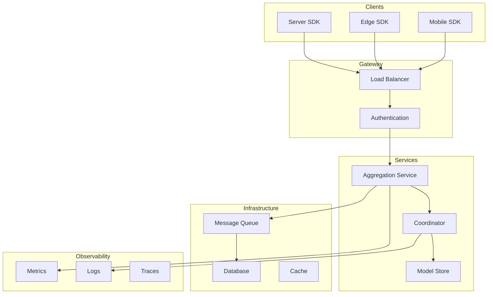

# Tutorial 071: Building Production FL Systems

---

## Metadata

| Property | Value |
|----------|-------|
| **Tutorial ID** | 071 |
| **Title** | Building Production FL Systems |
| **Category** | Production |
| **Difficulty** | Advanced |
| **Duration** | 90 minutes |
| **Prerequisites** | Tutorial 001-070 |
| **Author** | Unbitrium Contributors |
| **Last Updated** | January 2026 |

---

## Learning Objectives

By the end of this tutorial, you will be able to:

1. **Understand** production FL requirements.
2. **Implement** scalable FL infrastructure.
3. **Design** fault-tolerant systems.
4. **Apply** MLOps for FL.
5. **Deploy** FL at scale.
6. **Monitor** production systems.

---

## Prerequisites

- **Completed Tutorials**: 001-070
- **Knowledge**: DevOps, distributed systems
- **Libraries**: PyTorch, NumPy

```python
import torch
import torch.nn as nn
import numpy as np
from datetime import datetime
import json
print(f"PyTorch: {torch.__version__}")
```

---

## Background and Theory

### Production Requirements

| Requirement | Description | Solution |
|-------------|-------------|----------|
| Scalability | Millions of clients | Hierarchical aggregation |
| Reliability | 99.9% uptime | Fault tolerance |
| Security | Protect models/data | Encryption, auth |
| Observability | Monitor everything | Metrics, logging |
| Versioning | Track models | Model registry |
| Reproducibility | Repeat experiments | Config management |

### Production Architecture



---

## Implementation Code

### Part 1: Production Components

```python
#!/usr/bin/env python3
"""
Tutorial 071: Building Production FL Systems

This tutorial demonstrates production-grade FL system
architecture with fault tolerance and observability.

Author: Unbitrium Contributors
License: EUPL-1.2
"""

from __future__ import annotations
import copy
import json
import time
import uuid
from abc import ABC, abstractmethod
from dataclasses import dataclass, field
from datetime import datetime
from enum import Enum
from typing import Any, Dict, List, Optional, Callable
import numpy as np
import torch
import torch.nn as nn
import torch.nn.functional as F
from torch.utils.data import Dataset, DataLoader
from concurrent.futures import ThreadPoolExecutor, as_completed


class TaskStatus(Enum):
    PENDING = "pending"
    IN_PROGRESS = "in_progress"
    COMPLETED = "completed"
    FAILED = "failed"
    TIMEOUT = "timeout"


@dataclass
class FLTask:
    """Federated learning task."""
    task_id: str
    round_num: int
    client_id: str
    created_at: datetime
    status: TaskStatus = TaskStatus.PENDING
    result: Optional[Dict] = None
    error: Optional[str] = None
    completed_at: Optional[datetime] = None


@dataclass
class ProductionConfig:
    """Production FL configuration."""
    num_rounds: int = 50
    clients_per_round: int = 100
    timeout_seconds: float = 300.0
    max_retries: int = 3
    min_clients_for_aggregation: int = 10
    model_version_prefix: str = "v"
    enable_compression: bool = True
    enable_encryption: bool = True
    seed: int = 42


class MetricsCollector:
    """Production metrics collection."""

    def __init__(self):
        self.metrics: Dict[str, List] = {
            "round_duration_ms": [],
            "clients_participated": [],
            "aggregation_time_ms": [],
            "model_accuracy": [],
            "bytes_transferred": [],
        }
        self.counters: Dict[str, int] = {
            "tasks_completed": 0,
            "tasks_failed": 0,
            "retries": 0,
        }

    def record_timing(self, metric: str, value_ms: float):
        if metric not in self.metrics:
            self.metrics[metric] = []
        self.metrics[metric].append(value_ms)

    def record_value(self, metric: str, value: float):
        if metric not in self.metrics:
            self.metrics[metric] = []
        self.metrics[metric].append(value)

    def increment(self, counter: str, amount: int = 1):
        self.counters[counter] = self.counters.get(counter, 0) + amount

    def get_summary(self) -> Dict:
        summary = {}
        for name, values in self.metrics.items():
            if values:
                summary[f"{name}_avg"] = np.mean(values)
                summary[f"{name}_p99"] = np.percentile(values, 99)
        summary.update(self.counters)
        return summary

    def export_prometheus(self) -> str:
        """Export metrics in Prometheus format."""
        lines = []
        for name, value in self.counters.items():
            lines.append(f"fl_{name} {value}")
        for name, values in self.metrics.items():
            if values:
                lines.append(f"fl_{name}_avg {np.mean(values):.4f}")
        return "\n".join(lines)


class ModelRegistry:
    """Model versioning and storage."""

    def __init__(self):
        self.models: Dict[str, Dict] = {}
        self.latest_version: Optional[str] = None

    def register(
        self,
        model: nn.Module,
        version: str,
        metadata: Dict = None,
    ) -> str:
        """Register a model version."""
        state = {k: v.cpu() for k, v in model.state_dict().items()}
        
        self.models[version] = {
            "state_dict": state,
            "metadata": metadata or {},
            "created_at": datetime.now().isoformat(),
        }
        self.latest_version = version
        return version

    def get(self, version: str) -> Optional[Dict]:
        """Get a specific model version."""
        return self.models.get(version)

    def get_latest(self) -> Optional[Dict]:
        """Get the latest model."""
        if self.latest_version:
            return self.models.get(self.latest_version)
        return None

    def list_versions(self) -> List[str]:
        """List all versions."""
        return list(self.models.keys())


class TaskQueue:
    """Task queue for FL coordination."""

    def __init__(self):
        self.pending: List[FLTask] = []
        self.in_progress: Dict[str, FLTask] = {}
        self.completed: Dict[str, FLTask] = {}

    def enqueue(self, task: FLTask) -> str:
        self.pending.append(task)
        return task.task_id

    def dequeue(self) -> Optional[FLTask]:
        if self.pending:
            task = self.pending.pop(0)
            task.status = TaskStatus.IN_PROGRESS
            self.in_progress[task.task_id] = task
            return task
        return None

    def complete(self, task_id: str, result: Dict) -> bool:
        if task_id in self.in_progress:
            task = self.in_progress.pop(task_id)
            task.status = TaskStatus.COMPLETED
            task.result = result
            task.completed_at = datetime.now()
            self.completed[task_id] = task
            return True
        return False

    def fail(self, task_id: str, error: str) -> bool:
        if task_id in self.in_progress:
            task = self.in_progress.pop(task_id)
            task.status = TaskStatus.FAILED
            task.error = error
            self.completed[task_id] = task
            return True
        return False


class CircuitBreaker:
    """Circuit breaker for fault tolerance."""

    def __init__(
        self,
        failure_threshold: int = 5,
        recovery_timeout: float = 60.0,
    ):
        self.failure_threshold = failure_threshold
        self.recovery_timeout = recovery_timeout
        self.failures = 0
        self.last_failure_time: Optional[float] = None
        self.state = "closed"

    def record_success(self):
        self.failures = 0
        self.state = "closed"

    def record_failure(self):
        self.failures += 1
        self.last_failure_time = time.time()
        if self.failures >= self.failure_threshold:
            self.state = "open"

    def can_execute(self) -> bool:
        if self.state == "closed":
            return True
        if self.state == "open":
            if time.time() - self.last_failure_time > self.recovery_timeout:
                self.state = "half-open"
                return True
        return self.state == "half-open"


class SimpleDataset(Dataset):
    def __init__(self, n=100):
        self.x = torch.randn(n, 32)
        self.y = torch.randint(0, 10, (n,))

    def __len__(self):
        return len(self.y)

    def __getitem__(self, idx):
        return self.x[idx], self.y[idx]


class SimpleModel(nn.Module):
    def __init__(self):
        super().__init__()
        self.net = nn.Sequential(
            nn.Linear(32, 64),
            nn.ReLU(),
            nn.Linear(64, 10),
        )

    def forward(self, x):
        return self.net(x)
```

### Part 2: Production Server

```python
class ProductionFLClient:
    """Production-grade FL client."""

    def __init__(self, client_id: str, dataset: Dataset):
        self.client_id = client_id
        self.dataset = dataset
        self.circuit_breaker = CircuitBreaker()

    def execute_task(self, task: FLTask, model: nn.Module) -> Dict:
        """Execute a training task."""
        if not self.circuit_breaker.can_execute():
            raise RuntimeError("Circuit breaker open")

        try:
            local = copy.deepcopy(model)
            optimizer = torch.optim.SGD(local.parameters(), lr=0.01)
            loader = DataLoader(self.dataset, batch_size=32, shuffle=True)

            local.train()
            for _ in range(2):
                for x, y in loader:
                    optimizer.zero_grad()
                    F.cross_entropy(local(x), y).backward()
                    optimizer.step()

            self.circuit_breaker.record_success()

            return {
                "state_dict": local.state_dict(),
                "num_samples": len(self.dataset),
                "client_id": self.client_id,
            }

        except Exception as e:
            self.circuit_breaker.record_failure()
            raise


class ProductionFLServer:
    """Production-grade FL server."""

    def __init__(
        self,
        model: nn.Module,
        clients: List[ProductionFLClient],
        config: ProductionConfig,
    ):
        self.model = model
        self.clients = {c.client_id: c for c in clients}
        self.config = config
        
        self.metrics = MetricsCollector()
        self.model_registry = ModelRegistry()
        self.task_queue = TaskQueue()
        
        # Register initial model
        self.model_registry.register(model, "v0", {"initial": True})

    def select_clients(self, round_num: int) -> List[str]:
        """Select clients for this round."""
        available = list(self.clients.keys())
        num_select = min(self.config.clients_per_round, len(available))
        return np.random.choice(available, num_select, replace=False).tolist()

    def create_tasks(self, round_num: int, client_ids: List[str]) -> List[FLTask]:
        """Create tasks for selected clients."""
        tasks = []
        for client_id in client_ids:
            task = FLTask(
                task_id=str(uuid.uuid4()),
                round_num=round_num,
                client_id=client_id,
                created_at=datetime.now(),
            )
            self.task_queue.enqueue(task)
            tasks.append(task)
        return tasks

    def execute_round(self, round_num: int) -> Dict:
        """Execute a training round."""
        start_time = time.time()
        
        # Select clients
        selected = self.select_clients(round_num)
        tasks = self.create_tasks(round_num, selected)
        
        # Execute tasks (simulated parallel)
        results = []
        for task in tasks:
            client = self.clients.get(task.client_id)
            if client:
                try:
                    result = client.execute_task(task, self.model)
                    self.task_queue.complete(task.task_id, result)
                    results.append(result)
                    self.metrics.increment("tasks_completed")
                except Exception as e:
                    self.task_queue.fail(task.task_id, str(e))
                    self.metrics.increment("tasks_failed")

        # Aggregate if enough clients
        if len(results) >= self.config.min_clients_for_aggregation:
            agg_start = time.time()
            self.aggregate(results)
            self.metrics.record_timing(
                "aggregation_time_ms",
                (time.time() - agg_start) * 1000
            )
            
            # Register new version
            version = f"v{round_num + 1}"
            self.model_registry.register(
                self.model, version,
                {"round": round_num, "clients": len(results)}
            )

        self.metrics.record_value("clients_participated", len(results))
        self.metrics.record_timing(
            "round_duration_ms",
            (time.time() - start_time) * 1000
        )

        return {"round": round_num, "clients": len(results)}

    def aggregate(self, updates: List[Dict]):
        """Aggregate client updates."""
        total = sum(u["num_samples"] for u in updates)
        new_state = {}
        for name in self.model.state_dict():
            new_state[name] = sum(
                u["num_samples"] / total * u["state_dict"][name].float()
                for u in updates
            )
        self.model.load_state_dict(new_state)

    def train(self) -> List[Dict]:
        """Run production training."""
        history = []
        
        for round_num in range(self.config.num_rounds):
            result = self.execute_round(round_num)
            history.append(result)
            
            if (round_num + 1) % 10 == 0:
                print(f"Round {round_num + 1}: {result['clients']} clients")

        print(f"\nMetrics Summary: {self.metrics.get_summary()}")
        print(f"Model Versions: {self.model_registry.list_versions()}")
        
        return history


def demo_production():
    config = ProductionConfig(num_rounds=20, clients_per_round=10)
    torch.manual_seed(config.seed)
    np.random.seed(config.seed)

    clients = [
        ProductionFLClient(f"client_{i}", SimpleDataset())
        for i in range(20)
    ]
    model = SimpleModel()
    server = ProductionFLServer(model, clients, config)
    server.train()


if __name__ == "__main__":
    demo_production()
```

---

## Exercises

1. **Exercise 1**: Add gRPC communication.
2. **Exercise 2**: Implement retry logic.
3. **Exercise 3**: Add A/B testing.
4. **Exercise 4**: Implement canary deployments.
5. **Exercise 5**: Add Kubernetes deployment.

---

## References

1. Bonawitz, K., et al. (2019). Towards federated learning at scale. In *MLSys*.
2. Hard, A., et al. (2019). Federated learning for mobile keyboard. *arXiv*.
3. Beutel, D., et al. (2020). Flower: A friendly FL framework. *arXiv*.
4. Ludwig, H., et al. (2020). IBM Federated Learning. *arXiv*.
5. He, C., et al. (2020). FedML: A research library. *arXiv*.

---

*Copyright 2026 Olaf Yunus Laitinen Imanov and Contributors. Released under EUPL 1.2.*
