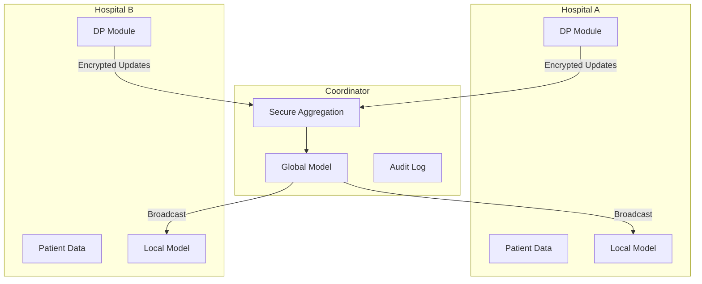

# Tutorial 072: FL Capstone Project

---

## Metadata

| Property | Value |
|----------|-------|
| **Tutorial ID** | 072 |
| **Title** | FL Capstone Project |
| **Category** | Capstone |
| **Difficulty** | Advanced |
| **Duration** | 180 minutes |
| **Prerequisites** | Tutorial 001-071 |
| **Author** | Unbitrium Contributors |
| **Last Updated** | January 2026 |

---

## Learning Objectives

By the end of this tutorial, you will be able to:

1. **Design** end-to-end FL systems.
2. **Implement** complete FL pipelines.
3. **Apply** all learned concepts.
4. **Evaluate** system performance.
5. **Document** FL projects.
6. **Present** FL solutions.

---

## Prerequisites

- **Completed Tutorials**: 001-071
- **Knowledge**: All previous tutorials
- **Libraries**: PyTorch, NumPy

```python
import torch
import torch.nn as nn
import numpy as np
print(f"PyTorch: {torch.__version__}")
```

---

## Project Overview

### Scenario: Healthcare FL System

Build a complete federated learning system for collaborative medical image classification across multiple hospitals without sharing patient data.

### Requirements

| Requirement | Description |
|-------------|-------------|
| Privacy | No raw data leaves hospitals |
| Compliance | HIPAA compliant |
| Fairness | All hospitals benefit |
| Robustness | Handle dropouts |
| Scalability | Support 10-100 hospitals |

### Architecture



---

## Implementation Code

### Part 1: Core Components

```python
#!/usr/bin/env python3
"""
Tutorial 072: FL Capstone Project

Complete healthcare federated learning system with
privacy, compliance, and fairness.

Author: Unbitrium Contributors
License: EUPL-1.2
"""

from __future__ import annotations
import copy
import hashlib
from abc import ABC, abstractmethod
from dataclasses import dataclass, field
from datetime import datetime
from enum import Enum
from typing import Any, Dict, List, Optional, Tuple
import numpy as np
import torch
import torch.nn as nn
import torch.nn.functional as F
from torch.utils.data import Dataset, DataLoader


# ==================== Configuration ====================

@dataclass
class CapstoneConfig:
    """Configuration for capstone project."""
    num_rounds: int = 30
    num_hospitals: int = 5
    local_epochs: int = 3
    batch_size: int = 16
    learning_rate: float = 0.001
    dp_epsilon: float = 1.0
    dp_delta: float = 1e-5
    dp_max_grad_norm: float = 1.0
    fairness_q: float = 0.5
    min_hospitals_per_round: int = 3
    image_dim: int = 64 * 64  # Flattened image
    num_classes: int = 3  # Normal, Benign, Malignant
    seed: int = 42


# ==================== Data ====================

class MedicalDataset(Dataset):
    """Simulated medical imaging dataset."""

    def __init__(
        self,
        hospital_id: int,
        num_patients: int,
        config: CapstoneConfig,
        class_imbalance: float = 0.5,
    ):
        np.random.seed(hospital_id)
        
        # Simulate hospital-specific class distribution
        if hospital_id % 2 == 0:
            probs = [0.6, 0.3, 0.1]  # More normal cases
        else:
            probs = [0.3, 0.4, 0.3]  # More abnormal cases
        
        self.labels = torch.tensor(
            np.random.choice(config.num_classes, num_patients, p=probs)
        ).long()
        
        # Simulated image features
        self.images = torch.randn(num_patients, config.image_dim)
        
        # Add class-specific patterns
        for i in range(num_patients):
            label = self.labels[i].item()
            self.images[i, label * 100:(label + 1) * 100] += 2.0
        
        # Hospital-specific noise pattern
        self.images += torch.randn(1, config.image_dim) * 0.1 * hospital_id

    def __len__(self):
        return len(self.labels)

    def __getitem__(self, idx):
        return self.images[idx], self.labels[idx]


# ==================== Model ====================

class MedicalCNN(nn.Module):
    """Medical image classification model."""

    def __init__(self, input_dim: int, num_classes: int):
        super().__init__()
        self.encoder = nn.Sequential(
            nn.Linear(input_dim, 512),
            nn.BatchNorm1d(512),
            nn.ReLU(),
            nn.Dropout(0.3),
            nn.Linear(512, 256),
            nn.BatchNorm1d(256),
            nn.ReLU(),
            nn.Dropout(0.3),
            nn.Linear(256, 128),
            nn.ReLU(),
        )
        
        self.classifier = nn.Sequential(
            nn.Linear(128, 64),
            nn.ReLU(),
            nn.Linear(64, num_classes),
        )

    def forward(self, x):
        features = self.encoder(x)
        return self.classifier(features)

    def get_features(self, x):
        return self.encoder(x)


# ==================== Privacy ====================

class DifferentialPrivacy:
    """Differential privacy for model updates."""

    def __init__(
        self,
        epsilon: float,
        delta: float,
        max_grad_norm: float,
    ):
        self.epsilon = epsilon
        self.delta = delta
        self.max_grad_norm = max_grad_norm

    def clip_gradients(self, model: nn.Module) -> float:
        """Clip gradients to max norm."""
        total_norm = 0.0
        for param in model.parameters():
            if param.grad is not None:
                total_norm += param.grad.data.norm(2).item() ** 2
        total_norm = total_norm ** 0.5
        
        clip_coef = self.max_grad_norm / (total_norm + 1e-6)
        if clip_coef < 1:
            for param in model.parameters():
                if param.grad is not None:
                    param.grad.data.mul_(clip_coef)
        
        return total_norm

    def add_noise(self, model: nn.Module, num_samples: int) -> None:
        """Add Gaussian noise for DP."""
        sigma = self.max_grad_norm * np.sqrt(2 * np.log(1.25 / self.delta)) / self.epsilon
        
        for param in model.parameters():
            if param.grad is not None:
                noise = torch.randn_like(param.grad) * sigma / num_samples
                param.grad.data.add_(noise)


# ==================== Fairness ====================

class FairnessMetrics:
    """Fairness metrics for FL."""

    @staticmethod
    def compute_disparity(losses: List[float]) -> Dict[str, float]:
        """Compute fairness disparity metrics."""
        losses = np.array(losses)
        return {
            "max_loss": losses.max(),
            "min_loss": losses.min(),
            "loss_range": losses.max() - losses.min(),
            "loss_std": losses.std(),
            "worst_20_pct": np.percentile(losses, 80),
        }


# ==================== Compliance ====================

class ComplianceAudit:
    """HIPAA compliance audit trail."""

    def __init__(self):
        self.entries: List[Dict] = []

    def log(
        self,
        action: str,
        actor: str,
        details: Dict,
        phi_accessed: bool = False,
    ):
        """Log compliance event."""
        self.entries.append({
            "timestamp": datetime.now().isoformat(),
            "action": action,
            "actor": actor,
            "details": details,
            "phi_accessed": phi_accessed,
        })

    def generate_report(self) -> str:
        """Generate compliance report."""
        report = "# HIPAA Compliance Audit Report\n\n"
        report += f"Report Generated: {datetime.now().isoformat()}\n\n"
        report += f"Total Events: {len(self.entries)}\n"
        
        phi_events = sum(1 for e in self.entries if e["phi_accessed"])
        report += f"PHI Access Events: {phi_events}\n"
        
        return report
```

### Part 2: Hospital Client

```python
class HospitalClient:
    """Hospital as FL client."""

    def __init__(
        self,
        hospital_id: int,
        dataset: MedicalDataset,
        config: CapstoneConfig,
        audit: ComplianceAudit,
    ):
        self.hospital_id = hospital_id
        self.hospital_name = f"Hospital_{hospital_id}"
        self.dataset = dataset
        self.config = config
        self.audit = audit
        self.dp = DifferentialPrivacy(
            config.dp_epsilon,
            config.dp_delta,
            config.dp_max_grad_norm,
        )
        self.participation_count = 0
        self.total_loss = []

    @property
    def num_patients(self) -> int:
        return len(self.dataset)

    def train(self, model: nn.Module) -> Optional[Dict]:
        """Train model on local patient data with privacy."""
        self.audit.log(
            action="training_started",
            actor=self.hospital_name,
            details={"num_patients": self.num_patients},
        )

        local_model = copy.deepcopy(model)
        optimizer = torch.optim.Adam(
            local_model.parameters(),
            lr=self.config.learning_rate,
        )
        loader = DataLoader(
            self.dataset,
            batch_size=self.config.batch_size,
            shuffle=True,
        )

        local_model.train()
        total_loss = 0.0
        num_batches = 0

        for _ in range(self.config.local_epochs):
            for images, labels in loader:
                optimizer.zero_grad()
                outputs = local_model(images)
                loss = F.cross_entropy(outputs, labels)
                loss.backward()
                
                # Apply DP
                self.dp.clip_gradients(local_model)
                self.dp.add_noise(local_model, len(images))
                
                optimizer.step()
                total_loss += loss.item()
                num_batches += 1

        avg_loss = total_loss / num_batches if num_batches > 0 else 0
        self.total_loss.append(avg_loss)
        self.participation_count += 1

        self.audit.log(
            action="training_completed",
            actor=self.hospital_name,
            details={"loss": avg_loss, "dp_epsilon": self.config.dp_epsilon},
        )

        return {
            "state_dict": {k: v.cpu() for k, v in local_model.state_dict().items()},
            "num_patients": self.num_patients,
            "hospital_id": self.hospital_id,
            "loss": avg_loss,
        }

    def evaluate(self, model: nn.Module) -> Dict[str, float]:
        """Evaluate model on local data."""
        model.eval()
        loader = DataLoader(self.dataset, batch_size=64)
        
        correct = 0
        total = 0
        class_correct = [0] * self.config.num_classes
        class_total = [0] * self.config.num_classes
        
        with torch.no_grad():
            for images, labels in loader:
                outputs = model(images)
                preds = outputs.argmax(dim=1)
                correct += (preds == labels).sum().item()
                total += len(labels)
                
                for i in range(len(labels)):
                    label = labels[i].item()
                    class_total[label] += 1
                    if preds[i] == labels[i]:
                        class_correct[label] += 1
        
        per_class_acc = [
            c / t if t > 0 else 0
            for c, t in zip(class_correct, class_total)
        ]
        
        return {
            "accuracy": correct / total if total > 0 else 0,
            "per_class_accuracy": per_class_acc,
            "balanced_accuracy": np.mean(per_class_acc),
        }
```

### Part 3: Coordinator

```python
class HealthcareFLCoordinator:
    """Central coordinator for healthcare FL."""

    def __init__(
        self,
        model: nn.Module,
        hospitals: List[HospitalClient],
        config: CapstoneConfig,
    ):
        self.model = model
        self.hospitals = hospitals
        self.config = config
        self.audit = ComplianceAudit()
        self.history: List[Dict] = []
        self.fairness = FairnessMetrics()

        torch.manual_seed(config.seed)
        np.random.seed(config.seed)

    def select_hospitals(self) -> List[HospitalClient]:
        """Select hospitals for this round."""
        available = [h for h in self.hospitals if h.num_patients > 0]
        num_select = min(len(available), max(
            self.config.min_hospitals_per_round,
            len(available) // 2,
        ))
        return list(np.random.choice(available, num_select, replace=False))

    def aggregate(self, updates: List[Dict]) -> None:
        """Aggregate with fairness consideration (q-FedAvg)."""
        q = self.config.fairness_q
        
        # Compute weights based on loss (higher loss = higher weight)
        losses = np.array([u["loss"] for u in updates])
        weights = np.power(losses, q)
        weights = weights / weights.sum()
        
        new_state = {}
        for name in self.model.state_dict():
            new_state[name] = sum(
                w * u["state_dict"][name].float()
                for w, u in zip(weights, updates)
            )
        
        self.model.load_state_dict(new_state)

    def train(self) -> List[Dict]:
        """Run federated training."""
        self.audit.log(
            action="fl_session_started",
            actor="coordinator",
            details={"num_hospitals": len(self.hospitals)},
        )

        for round_num in range(self.config.num_rounds):
            selected = self.select_hospitals()
            
            # Collect updates
            updates = []
            for hospital in selected:
                update = hospital.train(self.model)
                if update:
                    updates.append(update)

            if len(updates) >= self.config.min_hospitals_per_round:
                self.aggregate(updates)
            
            # Evaluate fairness
            losses = [u["loss"] for u in updates]
            fairness = self.fairness.compute_disparity(losses)
            
            # Evaluate accuracy
            metrics = [h.evaluate(self.model) for h in self.hospitals]
            avg_acc = np.mean([m["accuracy"] for m in metrics])
            
            self.history.append({
                "round": round_num,
                "hospitals": len(updates),
                "avg_accuracy": avg_acc,
                "fairness": fairness,
            })

            if (round_num + 1) % 5 == 0:
                print(f"Round {round_num + 1}: acc={avg_acc:.4f}, "
                      f"fairness_range={fairness['loss_range']:.4f}")

        self.audit.log(
            action="fl_session_completed",
            actor="coordinator",
            details={"total_rounds": self.config.num_rounds},
        )

        print(f"\n{self.audit.generate_report()}")
        return self.history


def run_capstone():
    """Run the capstone project."""
    config = CapstoneConfig()
    torch.manual_seed(config.seed)
    np.random.seed(config.seed)

    # Create hospitals
    audit = ComplianceAudit()
    hospitals = []
    for i in range(config.num_hospitals):
        num_patients = np.random.randint(100, 500)
        dataset = MedicalDataset(i, num_patients, config)
        hospitals.append(HospitalClient(i, dataset, config, audit))

    print(f"Created {len(hospitals)} hospitals")
    print(f"Total patients: {sum(h.num_patients for h in hospitals)}")

    # Create model
    model = MedicalCNN(config.image_dim, config.num_classes)

    # Run FL
    coordinator = HealthcareFLCoordinator(model, hospitals, config)
    history = coordinator.train()

    # Final evaluation
    print("\n=== Final Results ===")
    for hospital in hospitals:
        metrics = hospital.evaluate(model)
        print(f"{hospital.hospital_name}: acc={metrics['accuracy']:.4f}")


if __name__ == "__main__":
    run_capstone()
```

---

## Project Deliverables

1. **Code**: Complete implementation
2. **Documentation**: Architecture and design
3. **Evaluation**: Performance metrics
4. **Compliance**: Audit report
5. **Presentation**: Project summary

---

## Grading Rubric

| Component | Points |
|-----------|--------|
| Privacy Implementation | 20 |
| Fairness Handling | 20 |
| Code Quality | 15 |
| Documentation | 15 |
| Evaluation | 15 |
| Presentation | 15 |
| **Total** | **100** |

---

## Extensions

1. Add secure aggregation
2. Implement federated transfer learning
3. Add model personalization
4. Implement continual learning
5. Deploy to cloud

---

## References

1. Rieke, N., et al. (2020). The future of digital health with FL. *npj Digital Medicine*.
2. Sheller, M. J., et al. (2020). Federated learning in medicine. *Nature Medicine*.
3. Dayan, I., et al. (2021). Federated learning for predicting COVID-19 outcomes. *Nature Medicine*.
4. Lu, M. Y., et al. (2022). Federated learning for computational pathology. *Med*.
5. Kaissis, G., et al. (2021). End-to-end privacy preserving deep learning. *Nature Machine Intelligence*.

---

*Congratulations on completing the Unbitrium FL Tutorial Series!*

*Copyright 2026 Olaf Yunus Laitinen Imanov and Contributors. Released under EUPL 1.2.*
