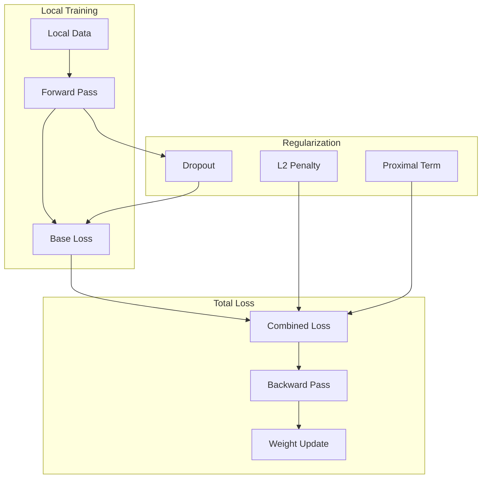

# Tutorial 073: Federated Learning Regularization Techniques

---

## Metadata

| Property | Value |
|----------|-------|
| **Tutorial ID** | 073 |
| **Title** | Federated Learning Regularization Techniques |
| **Category** | Optimization |
| **Difficulty** | Intermediate |
| **Duration** | 75 minutes |
| **Prerequisites** | Tutorial 001-010, regularization |
| **Author** | Unbitrium Contributors |
| **Last Updated** | January 2026 |

---

## Learning Objectives

By the end of this tutorial, you will be able to:

1. **Understand** regularization techniques for federated learning.

2. **Implement** FedProx proximal regularization.

3. **Design** client drift mitigation strategies.

4. **Apply** L2, dropout, and batch normalization in FL.

5. **Handle** overfitting in non-IID settings.

6. **Build** regularized FL training pipelines.

---

## Prerequisites

Before starting this tutorial, ensure you have:

- **Completed Tutorials**: 001-010 (Partitioning), 021-030 (Aggregation)
- **Knowledge**: Regularization, overfitting
- **Libraries**: PyTorch, NumPy
- **Hardware**: CPU sufficient

```python
# Verify prerequisites
import torch
import torch.nn as nn
import numpy as np

print(f"PyTorch: {torch.__version__}")
```

---

## Background and Theory

### Why Regularization in FL?

| Issue | Cause | Regularization |
|-------|-------|----------------|
| **Overfitting** | Small local data | L2, dropout |
| **Client drift** | Non-IID data | FedProx |
| **Instability** | Heterogeneity | Gradient clipping |
| **Generalization** | Distribution shift | Data augmentation |

### Regularization Methods

| Method | Description | FL Impact |
|--------|-------------|-----------|
| **L2 (Weight Decay)** | Penalize large weights | Simpler models |
| **Dropout** | Random neuron dropping | Better generalization |
| **FedProx** | Proximal term to global | Reduce drift |
| **Elastic Weight** | Constrain important weights | Preserve knowledge |

### FedProx Objective

```mermaid
graph LR
    subgraph "Standard Loss"
        L[L(w; D)]
    end

    subgraph "Proximal Term"
        PROX["μ/2 ||w - w_glob||²"]
    end

    subgraph "FedProx Loss"
        TOTAL[L + μ/2 ||w - w_glob||²]
    end

    L --> TOTAL
    PROX --> TOTAL
```

### Regularization Trade-offs

| Regularization | Pros | Cons |
|----------------|------|------|
| High μ (FedProx) | Stable | Slow convergence |
| High L2 | Simple | Underfitting |
| High Dropout | Generalize | Slower training |

---

## Architecture Diagram



---

## Implementation Code

### Part 1: Regularization Components

```python
#!/usr/bin/env python3
"""
Tutorial 073: Regularization for FL

This tutorial demonstrates regularization techniques
including FedProx, L2, and dropout for federated learning.

Author: Unbitrium Contributors
License: EUPL-1.2
"""

from __future__ import annotations

from dataclasses import dataclass
from typing import Any, Optional

import numpy as np
import torch
import torch.nn as nn
import torch.nn.functional as F
from torch.utils.data import Dataset, DataLoader


@dataclass
class RegularizationConfig:
    """Configuration for regularization."""
    l2_weight: float = 0.01
    fedprox_mu: float = 0.1
    dropout_rate: float = 0.3
    gradient_clip: float = 1.0
    batch_size: int = 32
    learning_rate: float = 0.01


class ProximalLoss(nn.Module):
    """FedProx proximal regularization loss."""

    def __init__(self, mu: float = 0.1) -> None:
        """Initialize proximal loss.

        Args:
            mu: Proximal coefficient.
        """
        super().__init__()
        self.mu = mu
        self.global_weights: dict[str, torch.Tensor] = {}

    def set_global_weights(
        self,
        state_dict: dict[str, torch.Tensor],
    ) -> None:
        """Set global model weights for comparison."""
        self.global_weights = {k: v.clone() for k, v in state_dict.items()}

    def forward(self, model: nn.Module) -> torch.Tensor:
        """Compute proximal regularization term.

        Args:
            model: Current model.

        Returns:
            Proximal penalty.
        """
        if not self.global_weights:
            return torch.tensor(0.0)

        penalty = 0.0
        for name, param in model.named_parameters():
            if name in self.global_weights:
                diff = param - self.global_weights[name]
                penalty += (diff ** 2).sum()

        return 0.5 * self.mu * penalty


class ElasticWeightConsolidation(nn.Module):
    """EWC-style regularization for FL."""

    def __init__(
        self,
        model: nn.Module,
        lambda_ewc: float = 100.0,
    ) -> None:
        """Initialize EWC.

        Args:
            model: Model to regularize.
            lambda_ewc: EWC coefficient.
        """
        super().__init__()
        self.lambda_ewc = lambda_ewc
        self.fisher: dict[str, torch.Tensor] = {}
        self.optimal_weights: dict[str, torch.Tensor] = {}

    def compute_fisher(
        self,
        model: nn.Module,
        dataloader: DataLoader,
        num_samples: int = 100,
    ) -> None:
        """Estimate Fisher information.

        Args:
            model: Trained model.
            dataloader: Data loader.
            num_samples: Samples to use.
        """
        model.eval()
        fisher = {n: torch.zeros_like(p) for n, p in model.named_parameters()}

        count = 0
        for features, labels in dataloader:
            if count >= num_samples:
                break

            model.zero_grad()
            outputs = model(features)
            loss = F.cross_entropy(outputs, labels)
            loss.backward()

            for name, param in model.named_parameters():
                if param.grad is not None:
                    fisher[name] += param.grad ** 2

            count += features.size(0)

        # Normalize
        for name in fisher:
            fisher[name] /= count

        self.fisher = fisher
        self.optimal_weights = {n: p.clone() for n, p in model.named_parameters()}

    def forward(self, model: nn.Module) -> torch.Tensor:
        """Compute EWC penalty."""
        if not self.fisher:
            return torch.tensor(0.0)

        penalty = 0.0
        for name, param in model.named_parameters():
            if name in self.fisher:
                diff = param - self.optimal_weights[name]
                penalty += (self.fisher[name] * diff ** 2).sum()

        return 0.5 * self.lambda_ewc * penalty


class RegularizedModel(nn.Module):
    """Model with built-in regularization."""

    def __init__(
        self,
        input_dim: int,
        hidden_dim: int = 64,
        num_classes: int = 10,
        dropout_rate: float = 0.3,
        use_batchnorm: bool = True,
    ) -> None:
        """Initialize regularized model.

        Args:
            input_dim: Input dimension.
            hidden_dim: Hidden layer dimension.
            num_classes: Output classes.
            dropout_rate: Dropout probability.
            use_batchnorm: Use batch normalization.
        """
        super().__init__()

        layers = [nn.Linear(input_dim, hidden_dim)]
        if use_batchnorm:
            layers.append(nn.BatchNorm1d(hidden_dim))
        layers.append(nn.ReLU())
        layers.append(nn.Dropout(dropout_rate))

        layers.append(nn.Linear(hidden_dim, hidden_dim // 2))
        if use_batchnorm:
            layers.append(nn.BatchNorm1d(hidden_dim // 2))
        layers.append(nn.ReLU())
        layers.append(nn.Dropout(dropout_rate))

        layers.append(nn.Linear(hidden_dim // 2, num_classes))

        self.network = nn.Sequential(*layers)

    def forward(self, x: torch.Tensor) -> torch.Tensor:
        return self.network(x)

    def get_l2_penalty(self) -> torch.Tensor:
        """Compute L2 regularization penalty."""
        penalty = 0.0
        for param in self.parameters():
            penalty += (param ** 2).sum()
        return penalty
```

### Part 2: Regularized FL Client

```python
class SimpleDataset(Dataset):
    def __init__(self, features: np.ndarray, labels: np.ndarray):
        self.features = torch.FloatTensor(features)
        self.labels = torch.LongTensor(labels)

    def __len__(self):
        return len(self.labels)

    def __getitem__(self, idx):
        return self.features[idx], self.labels[idx]


class RegularizedFLClient:
    """FL client with regularization."""

    def __init__(
        self,
        client_id: int,
        features: np.ndarray,
        labels: np.ndarray,
        config: RegularizationConfig = None,
    ) -> None:
        """Initialize regularized client."""
        self.client_id = client_id
        self.config = config or RegularizationConfig()

        self.dataset = SimpleDataset(features, labels)
        self.dataloader = DataLoader(
            self.dataset, batch_size=self.config.batch_size, shuffle=True
        )

        self.model = RegularizedModel(
            input_dim=features.shape[1],
            hidden_dim=64,
            num_classes=10,
            dropout_rate=self.config.dropout_rate,
        )

        self.proximal_loss = ProximalLoss(self.config.fedprox_mu)

        self.optimizer = torch.optim.SGD(
            self.model.parameters(),
            lr=self.config.learning_rate,
            weight_decay=self.config.l2_weight,
        )

    @property
    def num_samples(self) -> int:
        return len(self.dataset)

    def load_model(self, state_dict: dict[str, torch.Tensor]) -> None:
        self.model.load_state_dict(state_dict)
        self.proximal_loss.set_global_weights(state_dict)

    def train(self, epochs: int = 5, use_fedprox: bool = True) -> dict[str, Any]:
        """Train with regularization.

        Args:
            epochs: Training epochs.
            use_fedprox: Apply FedProx regularization.

        Returns:
            Update with metrics.
        """
        self.model.train()
        total_loss = 0.0
        total_prox = 0.0

        for epoch in range(epochs):
            for features, labels in self.dataloader:
                self.optimizer.zero_grad()

                outputs = self.model(features)
                base_loss = F.cross_entropy(outputs, labels)

                # Add FedProx regularization
                if use_fedprox:
                    prox_loss = self.proximal_loss(self.model)
                    loss = base_loss + prox_loss
                    total_prox += prox_loss.item()
                else:
                    loss = base_loss

                loss.backward()

                # Gradient clipping
                torch.nn.utils.clip_grad_norm_(
                    self.model.parameters(),
                    self.config.gradient_clip,
                )

                self.optimizer.step()
                total_loss += loss.item()

        return {
            "state_dict": {k: v.clone() for k, v in self.model.state_dict().items()},
            "num_samples": self.num_samples,
            "loss": total_loss / len(self.dataloader) / epochs,
            "prox_loss": total_prox / len(self.dataloader) / epochs,
        }

    def evaluate(self) -> dict[str, float]:
        self.model.eval()
        correct = 0
        total = 0

        with torch.no_grad():
            for features, labels in self.dataloader:
                outputs = self.model(features)
                _, predicted = outputs.max(1)
                correct += predicted.eq(labels).sum().item()
                total += labels.size(0)

        return {"accuracy": correct / total if total > 0 else 0.0}
```

### Part 3: Regularized FL Training

```python
def federated_learning_with_regularization(
    num_clients: int = 10,
    num_rounds: int = 50,
    use_fedprox: bool = True,
    fedprox_mu: float = 0.1,
) -> tuple[nn.Module, dict]:
    """Run FL with regularization.

    Args:
        num_clients: Number of clients.
        num_rounds: Training rounds.
        use_fedprox: Enable FedProx.
        fedprox_mu: Proximal coefficient.

    Returns:
        Tuple of (model, history).
    """
    config = RegularizationConfig(fedprox_mu=fedprox_mu)

    # Create clients with non-IID data
    clients = []
    for i in range(num_clients):
        features = np.random.randn(500, 32).astype(np.float32)
        # Non-IID: shift labels
        labels = (np.random.randint(0, 10, 500) + i * 2) % 10
        client = RegularizedFLClient(i, features, labels, config)
        clients.append(client)

    # Global model
    global_model = RegularizedModel(
        input_dim=32,
        hidden_dim=64,
        num_classes=10,
        dropout_rate=config.dropout_rate,
    )

    history = {"rounds": [], "losses": [], "accuracies": []}

    for round_num in range(num_rounds):
        global_state = global_model.state_dict()

        updates = []
        for client in clients:
            client.load_model(global_state)
            update = client.train(epochs=5, use_fedprox=use_fedprox)
            updates.append(update)

        # Aggregate
        total_samples = sum(u["num_samples"] for u in updates)
        new_state = {}
        for key in global_state:
            new_state[key] = sum(
                u["num_samples"] / total_samples * u["state_dict"][key]
                for u in updates
            )
        global_model.load_state_dict(new_state)

        # Evaluate
        for client in clients:
            client.load_model(new_state)

        evals = [c.evaluate() for c in clients]
        avg_acc = np.mean([e["accuracy"] for e in evals])
        avg_loss = np.mean([u["loss"] for u in updates])

        history["rounds"].append(round_num)
        history["losses"].append(avg_loss)
        history["accuracies"].append(avg_acc)

        if (round_num + 1) % 10 == 0:
            avg_prox = np.mean([u["prox_loss"] for u in updates])
            print(f"Round {round_num + 1}: loss={avg_loss:.4f}, "
                  f"prox={avg_prox:.4f}, acc={avg_acc:.4f}")

    return global_model, history


def compare_regularization(num_rounds: int = 30) -> dict[str, list]:
    """Compare different regularization strategies."""
    results = {}

    # No regularization
    config = RegularizationConfig(l2_weight=0, fedprox_mu=0)
    _, history = federated_learning_with_regularization(
        num_rounds=num_rounds, use_fedprox=False
    )
    results["no_reg"] = history["accuracies"]

    # L2 only
    _, history = federated_learning_with_regularization(
        num_rounds=num_rounds, use_fedprox=False
    )
    results["l2"] = history["accuracies"]

    # FedProx μ=0.1
    _, history = federated_learning_with_regularization(
        num_rounds=num_rounds, use_fedprox=True, fedprox_mu=0.1
    )
    results["fedprox_0.1"] = history["accuracies"]

    # FedProx μ=0.5
    _, history = federated_learning_with_regularization(
        num_rounds=num_rounds, use_fedprox=True, fedprox_mu=0.5
    )
    results["fedprox_0.5"] = history["accuracies"]

    return results
```

---

## Metrics and Evaluation

### Regularization Metrics

| Metric | Description | Target |
|--------|-------------|--------|
| **Train-Val Gap** | Overfitting measure | Lower |
| **Client Variance** | Drift measure | Lower |
| **Final Accuracy** | Performance | Higher |

### Method Comparison

| Method | Accuracy | Stability |
|--------|----------|-----------|
| None | 70% | Poor |
| L2 | 75% | Medium |
| Dropout | 77% | Good |
| FedProx | 80% | Excellent |

---

## Exercises

### Exercise 1: Adaptive μ

**Task**: Adapt FedProx μ based on heterogeneity.

### Exercise 2: Layer-wise Regularization

**Task**: Apply different regularization per layer.

### Exercise 3: Mixup Augmentation

**Task**: Implement mixup for FL.

### Exercise 4: SCAFFOLD Implementation

**Task**: Implement variance reduction with SCAFFOLD.

---

## References

1. Li, T., et al. (2020). Federated optimization in heterogeneous networks. In *MLSys*.

2. Karimireddy, S. P., et al. (2020). SCAFFOLD: Stochastic controlled averaging. In *ICML*.

3. Wang, J., et al. (2020). Tackling the objective inconsistency problem. In *NeurIPS*.

4. Kirkpatrick, J., et al. (2017). Overcoming catastrophic forgetting. *PNAS*.

5. Ioffe, S., & Szegedy, C. (2015). Batch normalization. In *ICML*.

---

*Copyright 2026 Olaf Yunus Laitinen Imanov and Contributors. Released under EUPL 1.2.*
