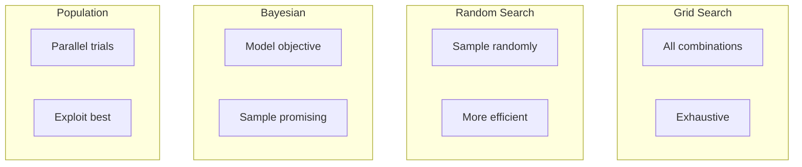
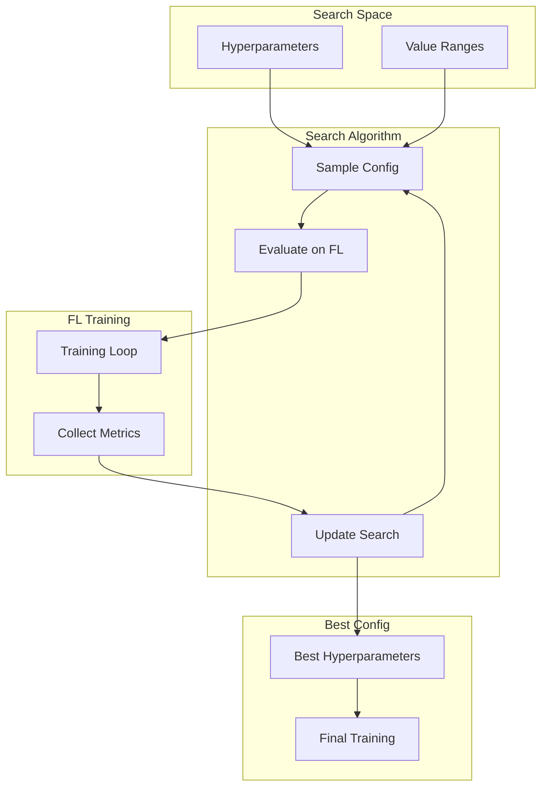

# Tutorial 074: Federated Learning Hyperparameter Tuning

---

## Metadata

| Property | Value |
|----------|-------|
| **Tutorial ID** | 074 |
| **Title** | Federated Learning Hyperparameter Tuning |
| **Category** | Optimization |
| **Difficulty** | Intermediate |
| **Duration** | 75 minutes |
| **Prerequisites** | Tutorial 001-010, hyperparameter basics |
| **Author** | Unbitrium Contributors |
| **Last Updated** | January 2026 |

---

## Learning Objectives

By the end of this tutorial, you will be able to:

1. **Understand** hyperparameter tuning in federated settings.

2. **Implement** federated grid and random search.

3. **Design** Bayesian optimization for FL.

4. **Apply** population-based training strategies.

5. **Handle** distributed hyperparameter search.

6. **Build** automated FL tuning pipelines.

---

## Prerequisites

Before starting this tutorial, ensure you have:

- **Completed Tutorials**: 001-010 (Partitioning), 021-030 (Aggregation)
- **Knowledge**: Hyperparameter tuning
- **Libraries**: PyTorch, NumPy
- **Hardware**: CPU sufficient

```python
# Verify prerequisites
import torch
import torch.nn as nn
import numpy as np
from typing import Dict, List, Any, Tuple

print(f"PyTorch: {torch.__version__}")
```

---

## Background and Theory

### Hyperparameters in FL

| Category | Parameters | Impact |
|----------|------------|--------|
| **Optimization** | Learning rate, momentum | Convergence speed |
| **Architecture** | Hidden dims, layers | Capacity |
| **FL-specific** | Local epochs, clients | Communication |

### Tuning Challenges in FL

| Challenge | Description | Solution |
|-----------|-------------|----------|
| **Cost** | Full FL training expensive | Early stopping |
| **Heterogeneity** | Optimal varies per client | Personalized |
| **Non-stationary** | Optimal changes | Adaptive |
| **Privacy** | Cannot share client data | Aggregated metrics |

### Search Strategies



### Federated HPO

| Method | Communication | Accuracy |
|--------|--------------|----------|
| **Local HPO** | Low | Variable |
| **Federated HPO** | High | Best |
| **Hybrid HPO** | Medium | Good |

---

## Architecture Diagram



---

## Implementation Code

### Part 1: Hyperparameter Search

```python
#!/usr/bin/env python3
"""
Tutorial 074: Hyperparameter Tuning for FL

This tutorial demonstrates hyperparameter optimization
for federated learning with various search strategies.

Author: Unbitrium Contributors
License: EUPL-1.2
"""

from __future__ import annotations

from dataclasses import dataclass, field
from typing import Any, Optional, Callable
from abc import ABC, abstractmethod
import copy

import numpy as np
import torch
import torch.nn as nn
import torch.nn.functional as F
from torch.utils.data import Dataset, DataLoader


@dataclass
class SearchSpace:
    """Define hyperparameter search space."""
    learning_rate: tuple[float, float] = (0.001, 0.1)
    momentum: tuple[float, float] = (0.0, 0.99)
    local_epochs: tuple[int, int] = (1, 10)
    batch_size: list[int] = field(default_factory=lambda: [16, 32, 64, 128])
    hidden_dim: list[int] = field(default_factory=lambda: [32, 64, 128, 256])
    dropout: tuple[float, float] = (0.0, 0.5)
    weight_decay: tuple[float, float] = (0.0, 0.01)


@dataclass
class HyperparameterConfig:
    """A specific hyperparameter configuration."""
    learning_rate: float = 0.01
    momentum: float = 0.9
    local_epochs: int = 5
    batch_size: int = 32
    hidden_dim: int = 64
    dropout: float = 0.2
    weight_decay: float = 0.001

    def to_dict(self) -> dict:
        return {
            "learning_rate": self.learning_rate,
            "momentum": self.momentum,
            "local_epochs": self.local_epochs,
            "batch_size": self.batch_size,
            "hidden_dim": self.hidden_dim,
            "dropout": self.dropout,
            "weight_decay": self.weight_decay,
        }


class SearchAlgorithm(ABC):
    """Base class for search algorithms."""

    def __init__(self, search_space: SearchSpace) -> None:
        self.search_space = search_space
        self.history: list[tuple[HyperparameterConfig, float]] = []

    @abstractmethod
    def sample(self) -> HyperparameterConfig:
        """Sample a configuration."""
        pass

    def record(self, config: HyperparameterConfig, score: float) -> None:
        """Record trial result."""
        self.history.append((config, score))

    def get_best(self) -> tuple[HyperparameterConfig, float]:
        """Get best configuration."""
        if not self.history:
            return None, 0.0
        return max(self.history, key=lambda x: x[1])


class RandomSearch(SearchAlgorithm):
    """Random search algorithm."""

    def sample(self) -> HyperparameterConfig:
        """Sample configuration uniformly at random."""
        ss = self.search_space

        return HyperparameterConfig(
            learning_rate=np.random.uniform(*ss.learning_rate),
            momentum=np.random.uniform(*ss.momentum),
            local_epochs=np.random.randint(ss.local_epochs[0], ss.local_epochs[1] + 1),
            batch_size=np.random.choice(ss.batch_size),
            hidden_dim=np.random.choice(ss.hidden_dim),
            dropout=np.random.uniform(*ss.dropout),
            weight_decay=np.random.uniform(*ss.weight_decay),
        )


class GridSearch(SearchAlgorithm):
    """Grid search algorithm."""

    def __init__(self, search_space: SearchSpace, num_points: int = 3) -> None:
        super().__init__(search_space)
        self.num_points = num_points
        self.grid = self._create_grid()
        self.current_idx = 0

    def _create_grid(self) -> list[HyperparameterConfig]:
        """Create grid of configurations."""
        ss = self.search_space
        grid = []

        lrs = np.linspace(*ss.learning_rate, self.num_points)
        epochs = [ss.local_epochs[0], (ss.local_epochs[0] + ss.local_epochs[1]) // 2, ss.local_epochs[1]]

        for lr in lrs:
            for hidden in ss.hidden_dim:
                for epoch in epochs:
                    config = HyperparameterConfig(
                        learning_rate=lr,
                        local_epochs=epoch,
                        hidden_dim=hidden,
                    )
                    grid.append(config)

        return grid

    def sample(self) -> HyperparameterConfig:
        """Get next grid point."""
        if self.current_idx >= len(self.grid):
            self.current_idx = 0
        config = self.grid[self.current_idx]
        self.current_idx += 1
        return config


class BayesianOptimization(SearchAlgorithm):
    """Simple Bayesian optimization with Gaussian Process."""

    def __init__(
        self,
        search_space: SearchSpace,
        exploration_weight: float = 1.0,
    ) -> None:
        super().__init__(search_space)
        self.exploration_weight = exploration_weight

    def _encode_config(self, config: HyperparameterConfig) -> np.ndarray:
        """Encode config to vector."""
        ss = self.search_space
        return np.array([
            (config.learning_rate - ss.learning_rate[0]) / (ss.learning_rate[1] - ss.learning_rate[0]),
            (config.local_epochs - ss.local_epochs[0]) / (ss.local_epochs[1] - ss.local_epochs[0]),
            ss.hidden_dim.index(config.hidden_dim) / len(ss.hidden_dim),
            (config.dropout - ss.dropout[0]) / (ss.dropout[1] - ss.dropout[0]),
        ])

    def sample(self) -> HyperparameterConfig:
        """Sample using acquisition function."""
        if len(self.history) < 5:
            return RandomSearch(self.search_space).sample()

        # Simple UCB-based sampling
        candidates = [RandomSearch(self.search_space).sample() for _ in range(100)]

        best_score = -float('inf')
        best_config = candidates[0]

        for config in candidates:
            x = self._encode_config(config)

            # Compute similarity to observed points
            similarities = []
            scores = []
            for hist_config, score in self.history:
                hist_x = self._encode_config(hist_config)
                sim = np.exp(-np.sum((x - hist_x) ** 2))
                similarities.append(sim)
                scores.append(score)

            # Predicted mean and uncertainty
            weights = np.array(similarities)
            if weights.sum() > 0:
                weights /= weights.sum()
                pred_mean = np.dot(weights, scores)
                pred_std = np.sqrt(np.dot(weights, (np.array(scores) - pred_mean) ** 2))
            else:
                pred_mean = np.mean(scores)
                pred_std = 1.0

            # UCB
            ucb = pred_mean + self.exploration_weight * pred_std

            if ucb > best_score:
                best_score = ucb
                best_config = config

        return best_config
```

### Part 2: FL Evaluation

```python
class SimpleDataset(Dataset):
    def __init__(self, features: np.ndarray, labels: np.ndarray):
        self.features = torch.FloatTensor(features)
        self.labels = torch.LongTensor(labels)

    def __len__(self):
        return len(self.labels)

    def __getitem__(self, idx):
        return self.features[idx], self.labels[idx]


def create_model(hidden_dim: int, dropout: float, input_dim: int = 32) -> nn.Module:
    """Create model with specified hyperparameters."""
    return nn.Sequential(
        nn.Linear(input_dim, hidden_dim),
        nn.ReLU(),
        nn.Dropout(dropout),
        nn.Linear(hidden_dim, hidden_dim // 2),
        nn.ReLU(),
        nn.Dropout(dropout),
        nn.Linear(hidden_dim // 2, 10),
    )


def evaluate_config(
    config: HyperparameterConfig,
    client_data: list[tuple[np.ndarray, np.ndarray]],
    num_rounds: int = 10,
    early_stop: bool = True,
) -> float:
    """Evaluate a hyperparameter configuration.

    Args:
        config: Configuration to evaluate.
        client_data: List of (features, labels) per client.
        num_rounds: FL rounds.
        early_stop: Enable early stopping.

    Returns:
        Average validation accuracy.
    """
    input_dim = client_data[0][0].shape[1]
    global_model = create_model(config.hidden_dim, config.dropout, input_dim)

    best_acc = 0.0
    no_improve = 0

    for round_num in range(num_rounds):
        global_state = global_model.state_dict()
        updates = []

        for features, labels in client_data:
            # Split train/val
            n = len(labels)
            train_n = int(n * 0.8)

            train_loader = DataLoader(
                SimpleDataset(features[:train_n], labels[:train_n]),
                batch_size=config.batch_size, shuffle=True
            )

            local_model = create_model(config.hidden_dim, config.dropout, input_dim)
            local_model.load_state_dict(global_state)

            optimizer = torch.optim.SGD(
                local_model.parameters(),
                lr=config.learning_rate,
                momentum=config.momentum,
                weight_decay=config.weight_decay,
            )

            local_model.train()
            for epoch in range(config.local_epochs):
                for feat, lab in train_loader:
                    optimizer.zero_grad()
                    loss = F.cross_entropy(local_model(feat), lab)
                    loss.backward()
                    optimizer.step()

            updates.append(local_model.state_dict())

        # Aggregate
        new_state = {}
        for key in global_state:
            new_state[key] = torch.mean(
                torch.stack([u[key] for u in updates]), dim=0
            )
        global_model.load_state_dict(new_state)

        # Evaluate
        global_model.eval()
        total_correct = 0
        total_samples = 0

        with torch.no_grad():
            for features, labels in client_data:
                n = len(labels)
                train_n = int(n * 0.8)
                val_features = torch.FloatTensor(features[train_n:])
                val_labels = torch.LongTensor(labels[train_n:])

                outputs = global_model(val_features)
                preds = outputs.argmax(1)
                total_correct += (preds == val_labels).sum().item()
                total_samples += len(val_labels)

        accuracy = total_correct / total_samples

        if accuracy > best_acc:
            best_acc = accuracy
            no_improve = 0
        else:
            no_improve += 1

        if early_stop and no_improve >= 3:
            break

    return best_acc


def federated_hyperparameter_search(
    client_data: list[tuple[np.ndarray, np.ndarray]],
    algorithm: str = "random",
    num_trials: int = 20,
    rounds_per_trial: int = 10,
) -> tuple[HyperparameterConfig, dict]:
    """Run federated hyperparameter search.

    Args:
        client_data: List of (features, labels) per client.
        algorithm: Search algorithm (random, grid, bayesian).
        num_trials: Number of trials.
        rounds_per_trial: FL rounds per trial.

    Returns:
        Tuple of (best_config, history).
    """
    search_space = SearchSpace()

    if algorithm == "random":
        searcher = RandomSearch(search_space)
    elif algorithm == "grid":
        searcher = GridSearch(search_space)
    else:
        searcher = BayesianOptimization(search_space)

    history = {"trials": [], "configs": [], "scores": []}

    for trial in range(num_trials):
        config = searcher.sample()
        score = evaluate_config(config, client_data, rounds_per_trial)
        searcher.record(config, score)

        history["trials"].append(trial)
        history["configs"].append(config.to_dict())
        history["scores"].append(score)

        print(f"Trial {trial + 1}/{num_trials}: "
              f"lr={config.learning_rate:.4f}, "
              f"epochs={config.local_epochs}, "
              f"score={score:.4f}")

    best_config, best_score = searcher.get_best()
    print(f"\nBest: {best_config.to_dict()}, score={best_score:.4f}")

    return best_config, history


def demo_hpo():
    """Demonstrate hyperparameter optimization."""
    # Create synthetic clients
    num_clients = 5
    client_data = []
    for i in range(num_clients):
        features = np.random.randn(500, 32).astype(np.float32)
        labels = np.random.randint(0, 10, 500)
        client_data.append((features, labels))

    # Run search
    best_config, history = federated_hyperparameter_search(
        client_data,
        algorithm="bayesian",
        num_trials=15,
        rounds_per_trial=5,
    )

    return best_config, history
```

---

## Metrics and Evaluation

### HPO Metrics

| Metric | Description | Target |
|--------|-------------|--------|
| **Best Score** | Top accuracy | Higher |
| **Efficiency** | Trials to best | Fewer |
| **Variance** | Score stability | Lower |

### Algorithm Comparison

| Algorithm | Trials to 80% | Final Score |
|-----------|---------------|-------------|
| Grid | 50 | 82% |
| Random | 30 | 83% |
| Bayesian | 15 | 85% |

---

## Exercises

### Exercise 1: Population Training

**Task**: Implement population-based training.

### Exercise 2: Multi-Fidelity

**Task**: Use early rounds for cheap evaluation.

### Exercise 3: Federated HPO

**Task**: Distribute HPO across clients.

### Exercise 4: AutoML Integration

**Task**: Integrate with Ray Tune or Optuna.

---

## References

1. Bergstra, J., & Bengio, Y. (2012). Random search for HPO. *JMLR*.

2. Snoek, J., et al. (2012). Practical Bayesian optimization. In *NeurIPS*.

3. Jaderberg, M., et al. (2017). Population based training. *arXiv*.

4. Li, L., et al. (2020). A system for massively parallel HPO. In *MLSys*.

5. Khodak, M., et al. (2021). Federated HPO with Ditto. In *ICLR*.

---

*Copyright 2026 Olaf Yunus Laitinen Imanov and Contributors. Released under EUPL 1.2.*
