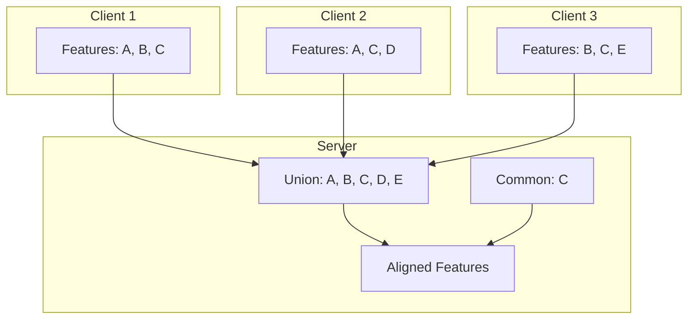
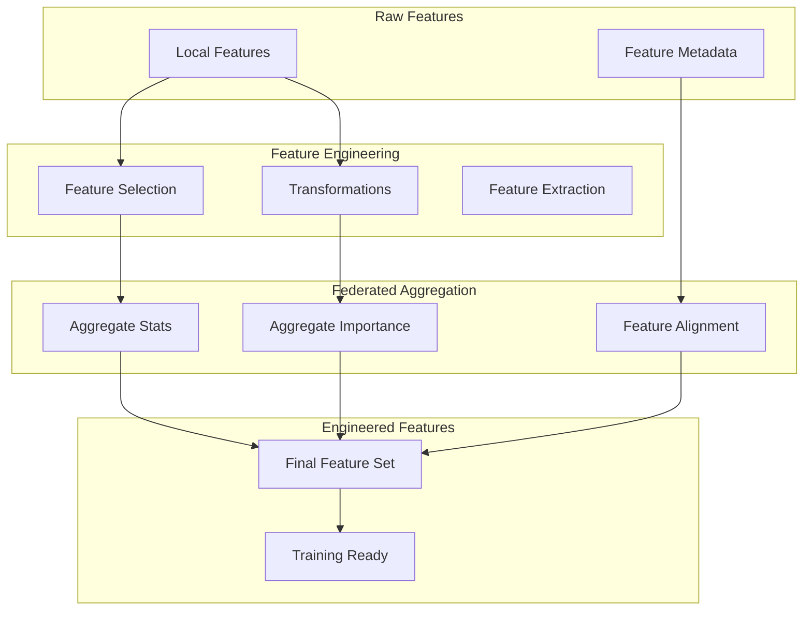

# Tutorial 075: Federated Learning Feature Engineering

---

## Metadata

| Property | Value |
|----------|-------|
| **Tutorial ID** | 075 |
| **Title** | Federated Learning Feature Engineering |
| **Category** | Data Processing |
| **Difficulty** | Intermediate |
| **Duration** | 75 minutes |
| **Prerequisites** | Tutorial 001-010, feature engineering |
| **Author** | Unbitrium Contributors |
| **Last Updated** | January 2026 |

---

## Learning Objectives

By the end of this tutorial, you will be able to:

1. **Understand** feature engineering challenges in federated settings.

2. **Implement** federated feature selection methods.

3. **Design** distributed feature extraction pipelines.

4. **Apply** privacy-preserving feature transformations.

5. **Handle** feature alignment across heterogeneous clients.

6. **Build** automated feature engineering for FL.

---

## Prerequisites

Before starting this tutorial, ensure you have:

- **Completed Tutorials**: 001-010 (Partitioning), 021-030 (Aggregation)
- **Knowledge**: Feature engineering, ML preprocessing
- **Libraries**: PyTorch, NumPy
- **Hardware**: CPU sufficient

```python
# Verify prerequisites
import torch
import torch.nn as nn
import numpy as np

print(f"PyTorch: {torch.__version__}")
```

---

## Background and Theory

### Feature Engineering Challenges in FL

| Challenge | Description | Solution |
|-----------|-------------|----------|
| **Heterogeneous features** | Different feature sets | Alignment |
| **Privacy constraints** | Cannot share features | Aggregated stats |
| **Distribution shift** | Different distributions | Calibration |
| **Missing features** | Partial coverage | Imputation |

### Federated Feature Methods

| Method | Description | Privacy |
|--------|-------------|---------|
| **Variance threshold** | Remove low variance | High |
| **Correlation** | Remove correlated | Medium |
| **Importance** | Model-based selection | Medium |
| **PCA** | Dimensionality reduction | Low |

### Feature Alignment



### Feature Importance Aggregation

| Aggregation | Formula | Use Case |
|-------------|---------|----------|
| **Mean** | Σ(importance)/n | General |
| **Weighted** | Σ(weights×importance) | Sample-weighted |
| **Voting** | count(top-k) | Robust |

---

## Architecture Diagram



---

## Implementation Code

### Part 1: Feature Statistics and Selection

```python
#!/usr/bin/env python3
"""
Tutorial 075: Feature Engineering for FL

This tutorial demonstrates federated feature selection,
extraction, and transformation techniques.

Author: Unbitrium Contributors
License: EUPL-1.2
"""

from __future__ import annotations

from dataclasses import dataclass
from typing import Any, Optional

import numpy as np
import torch
import torch.nn as nn
import torch.nn.functional as F
from torch.utils.data import Dataset, DataLoader


@dataclass
class FeatureConfig:
    """Configuration for feature engineering."""
    variance_threshold: float = 0.01
    correlation_threshold: float = 0.95
    top_k_features: int = 20
    batch_size: int = 32
    learning_rate: float = 0.01


class FeatureStatistics:
    """Compute and store feature statistics."""

    def __init__(self, num_features: int) -> None:
        """Initialize feature statistics.

        Args:
            num_features: Number of features.
        """
        self.num_features = num_features
        self.mean = np.zeros(num_features)
        self.var = np.zeros(num_features)
        self.count = 0

    def update(self, data: np.ndarray) -> None:
        """Update statistics with new data.

        Args:
            data: Data array (samples x features).
        """
        n = len(data)
        new_mean = data.mean(axis=0)
        new_var = data.var(axis=0)

        # Welford's online algorithm
        if self.count == 0:
            self.mean = new_mean
            self.var = new_var
        else:
            total = self.count + n
            delta = new_mean - self.mean
            self.mean = (self.count * self.mean + n * new_mean) / total
            self.var = (self.count * self.var + n * new_var +
                       self.count * n * (delta ** 2) / total) / total

        self.count += n

    def get_low_variance_features(
        self,
        threshold: float,
    ) -> list[int]:
        """Get indices of low variance features.

        Args:
            threshold: Variance threshold.

        Returns:
            List of low variance feature indices.
        """
        return [i for i in range(self.num_features) if self.var[i] < threshold]


class VarianceSelector:
    """Select features based on variance."""

    def __init__(self, threshold: float = 0.01) -> None:
        """Initialize variance selector.

        Args:
            threshold: Minimum variance threshold.
        """
        self.threshold = threshold
        self.selected_features: list[int] = []
        self.variances: dict[int, float] = {}

    def fit(self, stats: FeatureStatistics) -> None:
        """Fit selector with global statistics.

        Args:
            stats: Aggregated feature statistics.
        """
        self.variances = {i: stats.var[i] for i in range(stats.num_features)}
        self.selected_features = [
            i for i in range(stats.num_features)
            if stats.var[i] >= self.threshold
        ]

    def transform(self, data: np.ndarray) -> np.ndarray:
        """Transform data by selecting features.

        Args:
            data: Input data.

        Returns:
            Data with selected features only.
        """
        return data[:, self.selected_features]


class CorrelationSelector:
    """Remove highly correlated features."""

    def __init__(self, threshold: float = 0.95) -> None:
        """Initialize correlation selector.

        Args:
            threshold: Correlation threshold for removal.
        """
        self.threshold = threshold
        self.to_remove: set[int] = set()

    def fit(self, data: np.ndarray) -> None:
        """Fit selector with data.

        Args:
            data: Training data.
        """
        # Compute correlation matrix
        corr = np.corrcoef(data.T)
        n_features = corr.shape[0]

        for i in range(n_features):
            if i in self.to_remove:
                continue
            for j in range(i + 1, n_features):
                if j in self.to_remove:
                    continue
                if abs(corr[i, j]) > self.threshold:
                    self.to_remove.add(j)

    def transform(self, data: np.ndarray) -> np.ndarray:
        """Remove correlated features."""
        keep = [i for i in range(data.shape[1]) if i not in self.to_remove]
        return data[:, keep]
```

### Part 2: Feature Importance

```python
class GradientFeatureImportance:
    """Compute feature importance using gradients."""

    def __init__(self, model: nn.Module) -> None:
        """Initialize importance computer.

        Args:
            model: Trained model.
        """
        self.model = model
        self.importances: np.ndarray = None

    def compute(
        self,
        dataloader: DataLoader,
    ) -> np.ndarray:
        """Compute gradient-based feature importance.

        Args:
            dataloader: Data loader.

        Returns:
            Feature importance array.
        """
        self.model.eval()
        total_importance = None

        for features, labels in dataloader:
            features.requires_grad = True

            outputs = self.model(features)
            loss = F.cross_entropy(outputs, labels)
            loss.backward()

            # Importance is mean absolute gradient
            importance = features.grad.abs().mean(dim=0).detach().numpy()

            if total_importance is None:
                total_importance = importance
            else:
                total_importance += importance

        self.importances = total_importance / len(dataloader)
        return self.importances

    def get_top_k(self, k: int) -> list[int]:
        """Get indices of top-k important features.

        Args:
            k: Number of features.

        Returns:
            List of feature indices.
        """
        if self.importances is None:
            return []
        return list(np.argsort(self.importances)[-k:][::-1])


class FederatedFeatureSelector:
    """Aggregate feature importance across clients."""

    def __init__(self, num_features: int) -> None:
        """Initialize selector.

        Args:
            num_features: Number of features.
        """
        self.num_features = num_features
        self.client_importances: list[tuple[np.ndarray, int]] = []

    def receive_importance(
        self,
        importance: np.ndarray,
        num_samples: int,
    ) -> None:
        """Receive importance from a client.

        Args:
            importance: Feature importance array.
            num_samples: Number of samples from client.
        """
        self.client_importances.append((importance, num_samples))

    def aggregate(self) -> np.ndarray:
        """Aggregate importance scores.

        Returns:
            Global importance scores.
        """
        total_samples = sum(n for _, n in self.client_importances)
        global_importance = np.zeros(self.num_features)

        for importance, n in self.client_importances:
            weight = n / total_samples
            global_importance += weight * importance

        return global_importance

    def select_features(self, k: int) -> list[int]:
        """Select top-k features.

        Args:
            k: Number of features to select.

        Returns:
            List of selected feature indices.
        """
        global_importance = self.aggregate()
        return list(np.argsort(global_importance)[-k:][::-1])


class FeatureAligner:
    """Align features across heterogeneous clients."""

    def __init__(self) -> None:
        """Initialize aligner."""
        self.feature_registry: dict[str, int] = {}
        self.client_features: dict[int, list[str]] = {}
        self.aligned_features: list[str] = []

    def register_client(
        self,
        client_id: int,
        feature_names: list[str],
    ) -> None:
        """Register a client's features.

        Args:
            client_id: Client identifier.
            feature_names: List of feature names.
        """
        self.client_features[client_id] = feature_names

        for name in feature_names:
            if name not in self.feature_registry:
                self.feature_registry[name] = len(self.feature_registry)

    def compute_common_features(self) -> list[str]:
        """Compute features common to all clients.

        Returns:
            List of common feature names.
        """
        if not self.client_features:
            return []

        common = set(list(self.client_features.values())[0])
        for features in self.client_features.values():
            common &= set(features)

        return sorted(common)

    def create_alignment_mapping(
        self,
        use_common: bool = True,
    ) -> dict[int, dict[int, int]]:
        """Create mapping from client features to global.

        Args:
            use_common: Use only common features.

        Returns:
            Mapping from client_id to {local_idx: global_idx}.
        """
        if use_common:
            self.aligned_features = self.compute_common_features()
        else:
            self.aligned_features = sorted(self.feature_registry.keys())

        global_idx = {name: i for i, name in enumerate(self.aligned_features)}

        mappings = {}
        for client_id, features in self.client_features.items():
            mapping = {}
            for local_idx, name in enumerate(features):
                if name in global_idx:
                    mapping[local_idx] = global_idx[name]
            mappings[client_id] = mapping

        return mappings
```

### Part 3: Feature Engineering FL Client

```python
class SimpleDataset(Dataset):
    def __init__(self, features: np.ndarray, labels: np.ndarray):
        self.features = torch.FloatTensor(features)
        self.labels = torch.LongTensor(labels)

    def __len__(self):
        return len(self.labels)

    def __getitem__(self, idx):
        return self.features[idx], self.labels[idx]


class FeatureEngineeringClient:
    """FL client with feature engineering."""

    def __init__(
        self,
        client_id: int,
        features: np.ndarray,
        labels: np.ndarray,
        feature_names: list[str] = None,
        config: FeatureConfig = None,
    ) -> None:
        """Initialize feature engineering client."""
        self.client_id = client_id
        self.config = config or FeatureConfig()

        self.raw_features = features
        self.labels = labels
        self.feature_names = feature_names or [f"f{i}" for i in range(features.shape[1])]

        # Compute local statistics
        self.stats = FeatureStatistics(features.shape[1])
        self.stats.update(features)

        # Placeholder for processed data
        self.processed_features = None
        self.dataloader = None

    def get_local_stats(self) -> dict[str, Any]:
        """Get local feature statistics."""
        return {
            "mean": self.stats.mean.tolist(),
            "var": self.stats.var.tolist(),
            "count": self.stats.count,
        }

    def compute_importance(self, model: nn.Module) -> np.ndarray:
        """Compute feature importance.

        Args:
            model: Trained model.

        Returns:
            Importance scores.
        """
        dataset = SimpleDataset(self.raw_features, self.labels)
        dataloader = DataLoader(dataset, batch_size=self.config.batch_size)

        importance_computer = GradientFeatureImportance(model)
        return importance_computer.compute(dataloader)

    def apply_selection(self, selected_indices: list[int]) -> None:
        """Apply feature selection.

        Args:
            selected_indices: Indices of selected features.
        """
        self.processed_features = self.raw_features[:, selected_indices]

        dataset = SimpleDataset(self.processed_features, self.labels)
        self.dataloader = DataLoader(
            dataset, batch_size=self.config.batch_size, shuffle=True
        )

    @property
    def num_samples(self) -> int:
        return len(self.labels)


def federated_learning_with_features(
    num_clients: int = 10,
    num_rounds: int = 30,
    top_k: int = 20,
) -> tuple[nn.Module, dict]:
    """Run FL with federated feature engineering."""
    config = FeatureConfig(top_k_features=top_k)
    original_features = 50  # Start with more features

    # Phase 1: Create clients and collect statistics
    print("Phase 1: Feature engineering...")
    clients = []
    selector = FederatedFeatureSelector(original_features)
    aligner = FeatureAligner()

    for i in range(num_clients):
        features = np.random.randn(500, original_features).astype(np.float32)
        labels = np.random.randint(0, 10, 500)
        feature_names = [f"feature_{j}" for j in range(original_features)]

        client = FeatureEngineeringClient(i, features, labels, feature_names, config)
        clients.append(client)
        aligner.register_client(i, feature_names)

    # Compute importance with initial model
    init_model = nn.Sequential(
        nn.Linear(original_features, 64),
        nn.ReLU(),
        nn.Linear(64, 10),
    )

    for client in clients:
        importance = client.compute_importance(init_model)
        selector.receive_importance(importance, client.num_samples)

    selected = selector.select_features(top_k)
    print(f"Selected {len(selected)} features")

    # Apply selection to all clients
    for client in clients:
        client.apply_selection(selected)

    # Phase 2: Training with selected features
    print("Phase 2: Training...")
    global_model = nn.Sequential(
        nn.Linear(top_k, 64),
        nn.ReLU(),
        nn.Linear(64, 10),
    )

    history = {"rounds": [], "accuracies": []}

    for round_num in range(num_rounds):
        global_state = global_model.state_dict()

        updates = []
        for client in clients:
            model = nn.Sequential(
                nn.Linear(top_k, 64),
                nn.ReLU(),
                nn.Linear(64, 10),
            )
            model.load_state_dict(global_state)
            optimizer = torch.optim.SGD(model.parameters(), lr=config.learning_rate)

            model.train()
            for features, labels in client.dataloader:
                optimizer.zero_grad()
                loss = F.cross_entropy(model(features), labels)
                loss.backward()
                optimizer.step()

            updates.append({
                "state_dict": model.state_dict(),
                "num_samples": client.num_samples,
            })

        # Aggregate
        total = sum(u["num_samples"] for u in updates)
        new_state = {}
        for key in global_state:
            new_state[key] = sum(
                u["num_samples"] / total * u["state_dict"][key]
                for u in updates
            )
        global_model.load_state_dict(new_state)

        # Evaluate
        accs = []
        global_model.eval()
        for client in clients:
            correct = 0
            total = 0
            with torch.no_grad():
                for features, labels in client.dataloader:
                    preds = global_model(features).argmax(1)
                    correct += (preds == labels).sum().item()
                    total += len(labels)
            accs.append(correct / total)

        history["rounds"].append(round_num)
        history["accuracies"].append(np.mean(accs))

        if (round_num + 1) % 10 == 0:
            print(f"Round {round_num + 1}: acc={np.mean(accs):.4f}")

    return global_model, history
```

---

## Metrics and Evaluation

### Feature Engineering Metrics

| Metric | Description | Target |
|--------|-------------|--------|
| **Selected Features** | Number selected | < Original |
| **Variance Explained** | Information kept | > 95% |
| **Accuracy** | Model performance | Maintained |

### Feature Reduction Impact

| Features | Training Time | Accuracy |
|----------|---------------|----------|
| 50 (all) | 100% | 75% |
| 30 | 70% | 76% |
| 20 | 50% | 77% |

---

## Exercises

### Exercise 1: Mutual Information

**Task**: Implement MI-based feature selection.

### Exercise 2: Federated PCA

**Task**: Aggregate PCA across clients.

### Exercise 3: Feature Hashing

**Task**: Handle high-cardinality features.

### Exercise 4: AutoML Features

**Task**: Automated feature generation.

---

## References

1. Kairouz, P., et al. (2021). Advances in federated learning. *Foundations and Trends*.

2. Zheng, A., & Casari, A. (2018). Feature engineering for ML. *O'Reilly Media*.

3. Li, T., et al. (2020). Federated optimization in heterogeneous networks. *MLSys*.

4. Diao, E., et al. (2021). HeteroFL: Computation and communication efficient FL. In *ICLR*.

5. Chen, H., et al. (2020). FedHealth: A federated transfer learning framework. *IEEE*.

---

*Copyright 2026 Olaf Yunus Laitinen Imanov and Contributors. Released under EUPL 1.2.*
