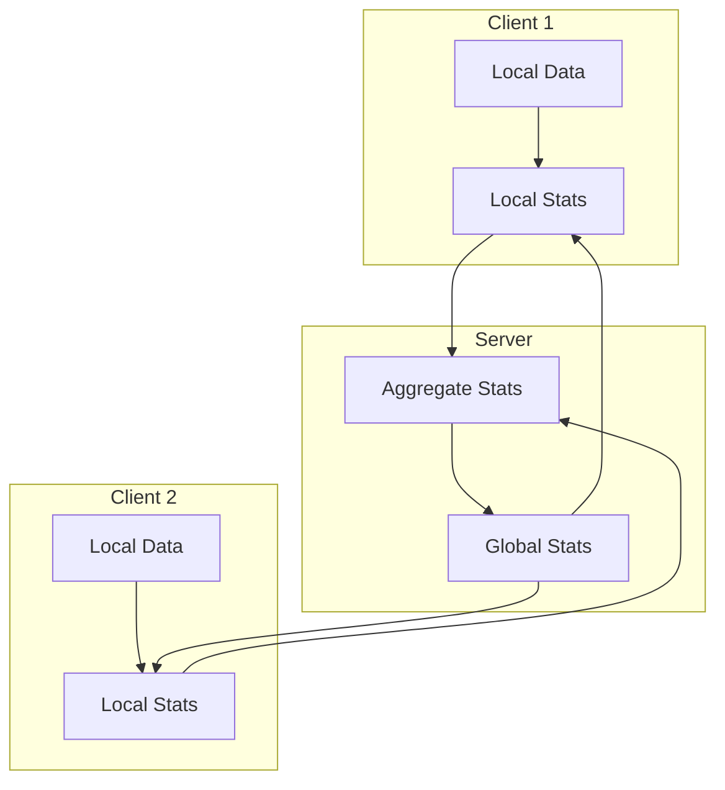
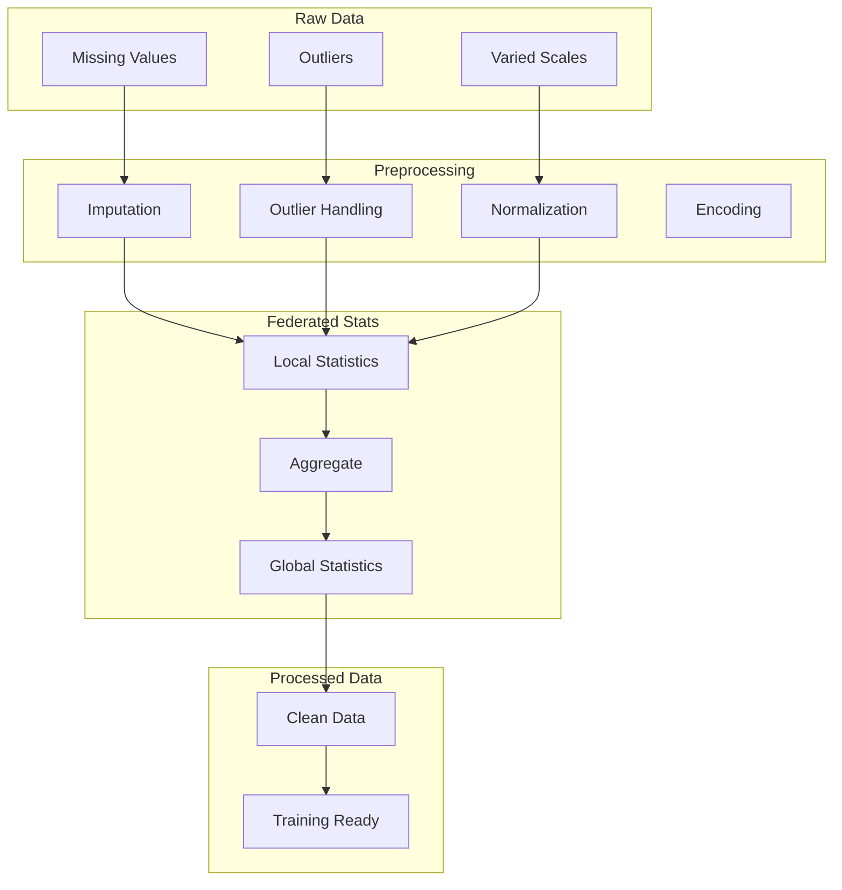

# Tutorial 076: Federated Learning Data Preprocessing

---

## Metadata

| Property | Value |
|----------|-------|
| **Tutorial ID** | 076 |
| **Title** | Federated Learning Data Preprocessing |
| **Category** | Data Processing |
| **Difficulty** | Intermediate |
| **Duration** | 75 minutes |
| **Prerequisites** | Tutorial 001-010, data preprocessing |
| **Author** | Unbitrium Contributors |
| **Last Updated** | January 2026 |

---

## Learning Objectives

By the end of this tutorial, you will be able to:

1. **Understand** data preprocessing challenges in federated settings.

2. **Implement** federated feature normalization.

3. **Design** distributed preprocessing pipelines.

4. **Apply** privacy-preserving data transformations.

5. **Handle** missing values and outliers in FL.

6. **Build** robust preprocessing for heterogeneous clients.

---

## Prerequisites

Before starting this tutorial, ensure you have:

- **Completed Tutorials**: 001-010 (Partitioning), 021-030 (Aggregation)
- **Knowledge**: Data preprocessing, normalization
- **Libraries**: PyTorch, NumPy
- **Hardware**: CPU sufficient

```python
# Verify prerequisites
import torch
import torch.nn as nn
import numpy as np

print(f"PyTorch: {torch.__version__}")
```

---

## Background and Theory

### Preprocessing Challenges in FL

| Challenge | Description | Solution |
|-----------|-------------|----------|
| **No central data** | Can't compute global stats | Federated statistics |
| **Heterogeneity** | Different distributions | Local + global norm |
| **Privacy** | Can't share raw stats | Secure aggregation |
| **Drift** | Changing data | Online updates |

### Federated Normalization Options

| Method | Description | Privacy |
|--------|-------------|---------|
| **Local** | Per-client normalization | High |
| **Federated** | Aggregate statistics | Medium |
| **Batch Norm** | Per-batch statistics | High |
| **Group Norm** | Per-group statistics | High |

### Federated Statistics



### Missing Value Handling

| Strategy | When to Use | Impact |
|----------|-------------|--------|
| **Drop** | Many complete samples | Data loss |
| **Mean/Median** | Random missing | Simple |
| **Interpolation** | Time series | Pattern preserving |
| **ML Imputation** | Complex patterns | Best quality |

---

## Architecture Diagram



---

## Implementation Code

### Part 1: Federated Statistics

```python
#!/usr/bin/env python3
"""
Tutorial 076: Data Preprocessing for FL

This tutorial demonstrates federated data preprocessing
including normalization, imputation, and encoding.

Author: Unbitrium Contributors
License: EUPL-1.2
"""

from __future__ import annotations

from dataclasses import dataclass, field
from typing import Any, Optional

import numpy as np
import torch
import torch.nn as nn
import torch.nn.functional as F
from torch.utils.data import Dataset, DataLoader


@dataclass
class PreprocessConfig:
    """Configuration for preprocessing."""
    missing_strategy: str = "mean"  # mean, median, drop
    outlier_method: str = "clip"  # clip, remove, ignore
    outlier_threshold: float = 3.0  # Standard deviations
    normalization: str = "zscore"  # zscore, minmax, robust
    batch_size: int = 32


@dataclass
class FeatureStatistics:
    """Statistics for a feature."""
    name: str
    count: int
    sum: float
    sum_sq: float
    min_val: float
    max_val: float
    missing_count: int = 0

    @property
    def mean(self) -> float:
        return self.sum / max(1, self.count)

    @property
    def variance(self) -> float:
        return self.sum_sq / max(1, self.count) - self.mean ** 2

    @property
    def std(self) -> float:
        return max(1e-8, np.sqrt(self.variance))

    @property
    def missing_rate(self) -> float:
        return self.missing_count / max(1, self.count + self.missing_count)


class FederatedStatisticsCollector:
    """Collect statistics across federated clients."""

    def __init__(self, num_features: int) -> None:
        """Initialize collector.

        Args:
            num_features: Number of features.
        """
        self.num_features = num_features
        self.feature_stats: dict[int, FeatureStatistics] = {}

        for i in range(num_features):
            self.feature_stats[i] = FeatureStatistics(
                name=f"feature_{i}",
                count=0,
                sum=0.0,
                sum_sq=0.0,
                min_val=float('inf'),
                max_val=float('-inf'),
            )

    def update_from_batch(self, data: np.ndarray) -> None:
        """Update statistics from data batch.

        Args:
            data: Data array (samples x features).
        """
        for i in range(self.num_features):
            col = data[:, i]
            valid_mask = ~np.isnan(col)
            valid = col[valid_mask]

            if len(valid) > 0:
                stats = self.feature_stats[i]
                stats.count += len(valid)
                stats.sum += valid.sum()
                stats.sum_sq += (valid ** 2).sum()
                stats.min_val = min(stats.min_val, valid.min())
                stats.max_val = max(stats.max_val, valid.max())
                stats.missing_count += (~valid_mask).sum()

    def get_local_stats(self) -> dict[int, dict]:
        """Get local statistics for aggregation."""
        return {
            i: {
                "count": s.count,
                "sum": s.sum,
                "sum_sq": s.sum_sq,
                "min_val": s.min_val,
                "max_val": s.max_val,
                "missing_count": s.missing_count,
            }
            for i, s in self.feature_stats.items()
        }


class FederatedStatisticsAggregator:
    """Aggregate statistics from multiple clients."""

    def __init__(self, num_features: int) -> None:
        """Initialize aggregator.

        Args:
            num_features: Number of features.
        """
        self.num_features = num_features
        self.client_stats: list[dict] = []

    def receive_stats(self, stats: dict[int, dict]) -> None:
        """Receive statistics from a client."""
        self.client_stats.append(stats)

    def aggregate(self) -> dict[int, FeatureStatistics]:
        """Aggregate statistics from all clients.

        Returns:
            Global feature statistics.
        """
        global_stats = {}

        for i in range(self.num_features):
            total_count = sum(s[i]["count"] for s in self.client_stats)
            total_sum = sum(s[i]["sum"] for s in self.client_stats)
            total_sum_sq = sum(s[i]["sum_sq"] for s in self.client_stats)
            global_min = min(s[i]["min_val"] for s in self.client_stats)
            global_max = max(s[i]["max_val"] for s in self.client_stats)
            total_missing = sum(s[i]["missing_count"] for s in self.client_stats)

            global_stats[i] = FeatureStatistics(
                name=f"feature_{i}",
                count=total_count,
                sum=total_sum,
                sum_sq=total_sum_sq,
                min_val=global_min,
                max_val=global_max,
                missing_count=total_missing,
            )

        return global_stats
```

### Part 2: Preprocessing Transformers

```python
class FederatedNormalizer:
    """Normalize data using federated statistics."""

    def __init__(
        self,
        method: str = "zscore",
    ) -> None:
        """Initialize normalizer.

        Args:
            method: Normalization method.
        """
        self.method = method
        self.stats: dict[int, FeatureStatistics] = {}

    def fit(self, stats: dict[int, FeatureStatistics]) -> None:
        """Fit normalizer with global statistics."""
        self.stats = stats

    def transform(self, data: np.ndarray) -> np.ndarray:
        """Transform data using fitted statistics.

        Args:
            data: Input data (samples x features).

        Returns:
            Normalized data.
        """
        result = data.copy()

        for i in range(data.shape[1]):
            if i not in self.stats:
                continue

            stats = self.stats[i]

            if self.method == "zscore":
                result[:, i] = (data[:, i] - stats.mean) / stats.std

            elif self.method == "minmax":
                range_val = stats.max_val - stats.min_val
                if range_val > 0:
                    result[:, i] = (data[:, i] - stats.min_val) / range_val

            elif self.method == "robust":
                # Use mean and std as approximation
                result[:, i] = (data[:, i] - stats.mean) / stats.std

        return result

    def inverse_transform(self, data: np.ndarray) -> np.ndarray:
        """Inverse transform normalized data."""
        result = data.copy()

        for i in range(data.shape[1]):
            if i not in self.stats:
                continue

            stats = self.stats[i]

            if self.method == "zscore":
                result[:, i] = data[:, i] * stats.std + stats.mean

            elif self.method == "minmax":
                range_val = stats.max_val - stats.min_val
                result[:, i] = data[:, i] * range_val + stats.min_val

        return result


class MissingValueImputer:
    """Handle missing values in federated settings."""

    def __init__(
        self,
        strategy: str = "mean",
    ) -> None:
        """Initialize imputer.

        Args:
            strategy: Imputation strategy.
        """
        self.strategy = strategy
        self.fill_values: dict[int, float] = {}

    def fit(self, stats: dict[int, FeatureStatistics]) -> None:
        """Fit imputer with global statistics."""
        for i, s in stats.items():
            if self.strategy == "mean":
                self.fill_values[i] = s.mean
            elif self.strategy == "median":
                # Approximate median as mean for federated
                self.fill_values[i] = s.mean
            elif self.strategy == "zero":
                self.fill_values[i] = 0.0

    def transform(self, data: np.ndarray) -> np.ndarray:
        """Transform data by imputing missing values.

        Args:
            data: Input data.

        Returns:
            Data with missing values filled.
        """
        result = data.copy()

        for i in range(data.shape[1]):
            if i in self.fill_values:
                mask = np.isnan(result[:, i])
                result[mask, i] = self.fill_values[i]

        return result


class OutlierHandler:
    """Handle outliers in federated settings."""

    def __init__(
        self,
        method: str = "clip",
        threshold: float = 3.0,
    ) -> None:
        """Initialize outlier handler.

        Args:
            method: Handling method (clip, remove, ignore).
            threshold: Standard deviations for threshold.
        """
        self.method = method
        self.threshold = threshold
        self.bounds: dict[int, tuple[float, float]] = {}

    def fit(self, stats: dict[int, FeatureStatistics]) -> None:
        """Fit handler with statistics."""
        for i, s in stats.items():
            lower = s.mean - self.threshold * s.std
            upper = s.mean + self.threshold * s.std
            self.bounds[i] = (lower, upper)

    def transform(self, data: np.ndarray) -> np.ndarray:
        """Transform data by handling outliers.

        Args:
            data: Input data.

        Returns:
            Data with outliers handled.
        """
        result = data.copy()

        if self.method == "clip":
            for i in range(data.shape[1]):
                if i in self.bounds:
                    lower, upper = self.bounds[i]
                    result[:, i] = np.clip(result[:, i], lower, upper)

        elif self.method == "remove":
            # Mark as NaN for later imputation
            for i in range(data.shape[1]):
                if i in self.bounds:
                    lower, upper = self.bounds[i]
                    mask = (data[:, i] < lower) | (data[:, i] > upper)
                    result[mask, i] = np.nan

        return result


class FederatedPreprocessor:
    """Complete federated preprocessing pipeline."""

    def __init__(self, config: PreprocessConfig = None) -> None:
        """Initialize preprocessor.

        Args:
            config: Preprocessing configuration.
        """
        self.config = config or PreprocessConfig()

        self.imputer = MissingValueImputer(self.config.missing_strategy)
        self.outlier_handler = OutlierHandler(
            self.config.outlier_method,
            self.config.outlier_threshold,
        )
        self.normalizer = FederatedNormalizer(self.config.normalization)

        self.is_fitted = False

    def fit(self, stats: dict[int, FeatureStatistics]) -> None:
        """Fit preprocessor with global statistics."""
        self.imputer.fit(stats)
        self.outlier_handler.fit(stats)
        self.normalizer.fit(stats)
        self.is_fitted = True

    def transform(self, data: np.ndarray) -> np.ndarray:
        """Transform data through preprocessing pipeline.

        Args:
            data: Raw input data.

        Returns:
            Preprocessed data.
        """
        if not self.is_fitted:
            raise ValueError("Preprocessor not fitted")

        # Apply transformations
        result = self.imputer.transform(data)
        result = self.outlier_handler.transform(result)
        result = self.imputer.transform(result)  # Handle new NaNs
        result = self.normalizer.transform(result)

        return result
```

### Part 3: Preprocessing FL Pipeline

```python
class SimpleDataset(Dataset):
    def __init__(self, features: np.ndarray, labels: np.ndarray):
        self.features = torch.FloatTensor(features)
        self.labels = torch.LongTensor(labels)

    def __len__(self):
        return len(self.labels)

    def __getitem__(self, idx):
        return self.features[idx], self.labels[idx]


class PreprocessingFLClient:
    """FL client with preprocessing."""

    def __init__(
        self,
        client_id: int,
        raw_features: np.ndarray,
        labels: np.ndarray,
        config: PreprocessConfig = None,
    ) -> None:
        """Initialize preprocessing client."""
        self.client_id = client_id
        self.config = config or PreprocessConfig()

        self.raw_features = raw_features
        self.labels = labels

        # Collect local statistics
        self.stats_collector = FederatedStatisticsCollector(raw_features.shape[1])
        self.stats_collector.update_from_batch(raw_features)

        self.preprocessor = FederatedPreprocessor(self.config)
        self.processed_features = None
        self.dataloader = None

        self.model = nn.Sequential(
            nn.Linear(raw_features.shape[1], 64),
            nn.ReLU(),
            nn.Linear(64, 10),
        )
        self.optimizer = torch.optim.SGD(self.model.parameters(), lr=0.01)

    def get_local_stats(self) -> dict[int, dict]:
        """Get local statistics."""
        return self.stats_collector.get_local_stats()

    def set_global_stats(self, stats: dict[int, FeatureStatistics]) -> None:
        """Set global statistics and preprocess data."""
        self.preprocessor.fit(stats)
        self.processed_features = self.preprocessor.transform(self.raw_features)

        dataset = SimpleDataset(self.processed_features, self.labels)
        self.dataloader = DataLoader(
            dataset, batch_size=self.config.batch_size, shuffle=True
        )

    @property
    def num_samples(self) -> int:
        return len(self.labels)

    def load_model(self, state_dict: dict[str, torch.Tensor]) -> None:
        self.model.load_state_dict(state_dict)

    def train(self, epochs: int = 5) -> dict[str, Any]:
        """Train model."""
        if self.dataloader is None:
            raise ValueError("Global stats not set")

        self.model.train()
        total_loss = 0.0

        for epoch in range(epochs):
            for features, labels in self.dataloader:
                self.optimizer.zero_grad()
                outputs = self.model(features)
                loss = F.cross_entropy(outputs, labels)
                loss.backward()
                self.optimizer.step()
                total_loss += loss.item()

        return {
            "state_dict": {k: v.clone() for k, v in self.model.state_dict().items()},
            "num_samples": self.num_samples,
            "loss": total_loss / len(self.dataloader) / epochs,
        }

    def evaluate(self) -> dict[str, float]:
        self.model.eval()
        correct = 0
        total = 0

        with torch.no_grad():
            for features, labels in self.dataloader:
                outputs = self.model(features)
                _, predicted = outputs.max(1)
                correct += predicted.eq(labels).sum().item()
                total += labels.size(0)

        return {"accuracy": correct / total if total > 0 else 0.0}


def federated_learning_with_preprocessing(
    num_clients: int = 10,
    num_rounds: int = 30,
) -> tuple[nn.Module, dict]:
    """Run FL with federated preprocessing."""
    config = PreprocessConfig()

    # Create clients with raw data (including noise)
    clients = []
    for i in range(num_clients):
        features = np.random.randn(500, 32).astype(np.float32)
        # Add outliers and missing values
        features[np.random.rand(*features.shape) < 0.05] = np.nan
        features[np.random.rand(*features.shape) < 0.02] *= 10  # Outliers

        labels = np.random.randint(0, 10, 500)
        client = PreprocessingFLClient(i, features, labels, config)
        clients.append(client)

    # Phase 1: Collect and aggregate statistics
    print("Phase 1: Collecting statistics...")
    aggregator = FederatedStatisticsAggregator(32)
    for client in clients:
        aggregator.receive_stats(client.get_local_stats())

    global_stats = aggregator.aggregate()
    print(f"Aggregated stats from {num_clients} clients")

    # Distribute global stats and preprocess
    for client in clients:
        client.set_global_stats(global_stats)

    # Phase 2: Federated training
    print("Phase 2: Training...")
    global_model = nn.Sequential(
        nn.Linear(32, 64),
        nn.ReLU(),
        nn.Linear(64, 10),
    )

    history = {"rounds": [], "losses": [], "accuracies": []}

    for round_num in range(num_rounds):
        global_state = global_model.state_dict()

        updates = []
        for client in clients:
            client.load_model(global_state)
            update = client.train(epochs=3)
            updates.append(update)

        total_samples = sum(u["num_samples"] for u in updates)
        new_state = {}
        for key in global_state:
            new_state[key] = sum(
                u["num_samples"] / total_samples * u["state_dict"][key]
                for u in updates
            )
        global_model.load_state_dict(new_state)

        for client in clients:
            client.load_model(new_state)

        evals = [c.evaluate() for c in clients]
        avg_acc = np.mean([e["accuracy"] for e in evals])
        avg_loss = np.mean([u["loss"] for u in updates])

        history["rounds"].append(round_num)
        history["losses"].append(avg_loss)
        history["accuracies"].append(avg_acc)

        if (round_num + 1) % 10 == 0:
            print(f"Round {round_num + 1}: loss={avg_loss:.4f}, acc={avg_acc:.4f}")

    return global_model, history
```

---

## Metrics and Evaluation

### Preprocessing Metrics

| Metric | Description | Target |
|--------|-------------|--------|
| **Missing Rate** | Percent missing | < 5% |
| **Outlier Rate** | Percent outliers | < 2% |
| **Feature Range** | Normalized range | ~[-3, 3] |

### Impact on Training

| Preprocessing | Accuracy | Stability |
|---------------|----------|-----------|
| None | 60% | Poor |
| Local only | 70% | Medium |
| Federated | 78% | Good |

---

## Exercises

### Exercise 1: Categorical Encoding

**Task**: Implement federated one-hot encoding.

### Exercise 2: Online Statistics

**Task**: Update statistics incrementally.

### Exercise 3: Feature Selection

**Task**: Select features based on variance.

### Exercise 4: Data Augmentation

**Task**: Implement federated data augmentation.

---

## References

1. Kairouz, P., et al. (2021). Advances in federated learning. *Foundations and Trends*.

2. Li, T., et al. (2020). Federated optimization in heterogeneous networks. *MLSys*.

3. Hsieh, K., et al. (2020). Non-IID data quagmire of decentralized ML. In *ICML*.

4. Zheng, G., et al. (2020). Federated meta-learning for recommendation. In *KDD*.

5. Bonawitz, K., et al. (2019). Towards federated learning at scale. In *SysML*.

---

*Copyright 2026 Olaf Yunus Laitinen Imanov and Contributors. Released under EUPL 1.2.*
