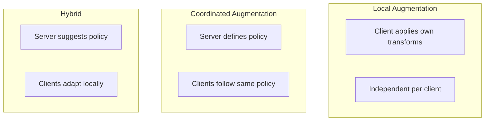
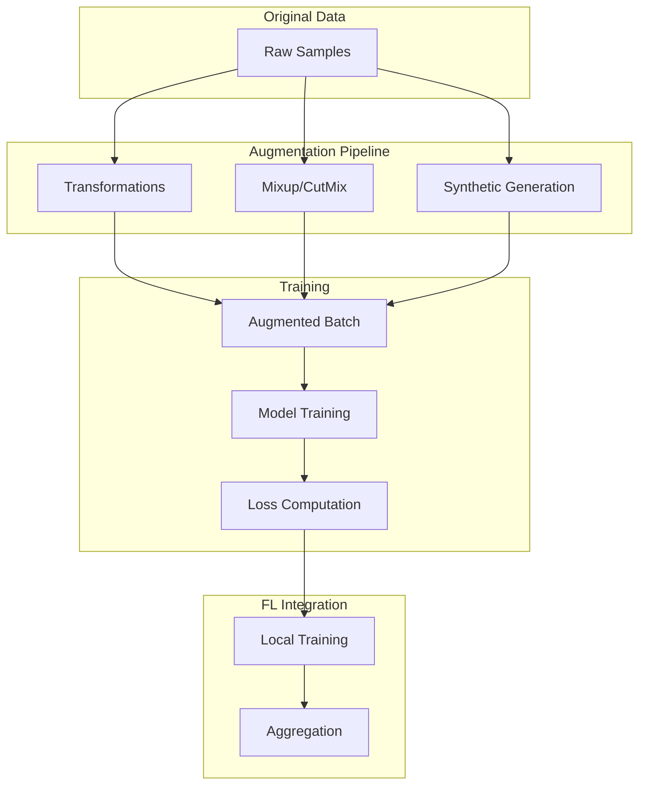

# Tutorial 077: Federated Learning Data Augmentation

---

## Metadata

| Property | Value |
|----------|-------|
| **Tutorial ID** | 077 |
| **Title** | Federated Learning Data Augmentation |
| **Category** | Data Processing |
| **Difficulty** | Intermediate |
| **Duration** | 75 minutes |
| **Prerequisites** | Tutorial 001-010, data augmentation |
| **Author** | Unbitrium Contributors |
| **Last Updated** | January 2026 |

---

## Learning Objectives

By the end of this tutorial, you will be able to:

1. **Understand** data augmentation in federated settings.

2. **Implement** augmentation strategies for FL.

3. **Design** federated mixup and cutmix.

4. **Apply** synthetic data generation for FL.

5. **Handle** augmentation consistency across clients.

6. **Build** robust FL pipelines with augmentation.

---

## Prerequisites

Before starting this tutorial, ensure you have:

- **Completed Tutorials**: 001-010 (Partitioning), 021-030 (Aggregation)
- **Knowledge**: Data augmentation, image processing
- **Libraries**: PyTorch, NumPy
- **Hardware**: CPU sufficient

```python
# Verify prerequisites
import torch
import torch.nn as nn
import numpy as np

print(f"PyTorch: {torch.__version__}")
```

---

## Background and Theory

### Why Augmentation in FL?

| Benefit | Description | Impact |
|---------|-------------|--------|
| **Data scarcity** | More training data | Higher accuracy |
| **Regularization** | Prevent overfitting | Better generalization |
| **Non-IID mitigation** | Add diversity | Reduced drift |
| **Privacy** | Synthetic data | Safe sharing |

### Augmentation Methods

| Method | Type | Best For |
|--------|------|----------|
| **Geometric** | Flip, rotate, crop | Images |
| **Color** | Brightness, contrast | Images |
| **Mixup** | Interpolate samples | Classification |
| **Cutout** | Random erasing | Regularization |
| **Noise** | Add noise | Tabular |

### Federated Augmentation Strategies



### Mixup Formula

For two samples (x₁, y₁) and (x₂, y₂):
- x̃ = λx₁ + (1-λ)x₂
- ỹ = λy₁ + (1-λ)y₂
- λ ~ Beta(α, α)

---

## Architecture Diagram



---

## Implementation Code

### Part 1: Augmentation Transforms

```python
#!/usr/bin/env python3
"""
Tutorial 077: Data Augmentation for FL

This tutorial demonstrates data augmentation techniques
including mixup, cutmix, and synthetic data for FL.

Author: Unbitrium Contributors
License: EUPL-1.2
"""

from __future__ import annotations

from dataclasses import dataclass
from typing import Any, Optional, Callable
from abc import ABC, abstractmethod

import numpy as np
import torch
import torch.nn as nn
import torch.nn.functional as F
from torch.utils.data import Dataset, DataLoader


@dataclass
class AugmentConfig:
    """Configuration for augmentation."""
    mixup_alpha: float = 0.4
    cutmix_alpha: float = 1.0
    noise_std: float = 0.1
    augment_prob: float = 0.5
    batch_size: int = 32
    learning_rate: float = 0.01


class BaseAugmentation(ABC):
    """Base class for augmentations."""

    @abstractmethod
    def __call__(
        self,
        features: torch.Tensor,
        labels: torch.Tensor,
    ) -> tuple[torch.Tensor, torch.Tensor]:
        """Apply augmentation."""
        pass


class GaussianNoise(BaseAugmentation):
    """Add Gaussian noise to features."""

    def __init__(self, std: float = 0.1, p: float = 0.5) -> None:
        """Initialize Gaussian noise augmentation.

        Args:
            std: Standard deviation of noise.
            p: Probability of applying.
        """
        self.std = std
        self.p = p

    def __call__(
        self,
        features: torch.Tensor,
        labels: torch.Tensor,
    ) -> tuple[torch.Tensor, torch.Tensor]:
        """Apply Gaussian noise."""
        if np.random.rand() > self.p:
            return features, labels

        noise = torch.randn_like(features) * self.std
        return features + noise, labels


class RandomScaling(BaseAugmentation):
    """Randomly scale features."""

    def __init__(
        self,
        min_scale: float = 0.8,
        max_scale: float = 1.2,
        p: float = 0.5,
    ) -> None:
        self.min_scale = min_scale
        self.max_scale = max_scale
        self.p = p

    def __call__(
        self,
        features: torch.Tensor,
        labels: torch.Tensor,
    ) -> tuple[torch.Tensor, torch.Tensor]:
        if np.random.rand() > self.p:
            return features, labels

        scale = np.random.uniform(self.min_scale, self.max_scale)
        return features * scale, labels


class FeatureDropout(BaseAugmentation):
    """Randomly drop features."""

    def __init__(self, drop_rate: float = 0.1, p: float = 0.5) -> None:
        self.drop_rate = drop_rate
        self.p = p

    def __call__(
        self,
        features: torch.Tensor,
        labels: torch.Tensor,
    ) -> tuple[torch.Tensor, torch.Tensor]:
        if np.random.rand() > self.p:
            return features, labels

        mask = torch.rand_like(features) > self.drop_rate
        return features * mask, labels


class Mixup(BaseAugmentation):
    """Mixup augmentation for classification."""

    def __init__(self, alpha: float = 0.4) -> None:
        """Initialize mixup.

        Args:
            alpha: Beta distribution parameter.
        """
        self.alpha = alpha

    def __call__(
        self,
        features: torch.Tensor,
        labels: torch.Tensor,
    ) -> tuple[torch.Tensor, torch.Tensor]:
        """Apply mixup.

        Args:
            features: Batch of features.
            labels: Batch of labels (one-hot or class indices).

        Returns:
            Mixed features and soft labels.
        """
        batch_size = features.size(0)

        # Sample lambda from Beta distribution
        lam = np.random.beta(self.alpha, self.alpha)

        # Random permutation for mixing
        index = torch.randperm(batch_size)

        # Mix features
        mixed_features = lam * features + (1 - lam) * features[index]

        # Convert labels to one-hot if needed
        if labels.dim() == 1:
            num_classes = labels.max().item() + 1
            labels_one_hot = F.one_hot(labels, num_classes).float()
        else:
            labels_one_hot = labels.float()

        # Mix labels
        mixed_labels = lam * labels_one_hot + (1 - lam) * labels_one_hot[index]

        return mixed_features, mixed_labels


class CutMix(BaseAugmentation):
    """CutMix augmentation for tabular data."""

    def __init__(self, alpha: float = 1.0) -> None:
        """Initialize cutmix.

        Args:
            alpha: Beta distribution parameter.
        """
        self.alpha = alpha

    def __call__(
        self,
        features: torch.Tensor,
        labels: torch.Tensor,
    ) -> tuple[torch.Tensor, torch.Tensor]:
        """Apply cutmix."""
        batch_size = features.size(0)
        num_features = features.size(1)

        lam = np.random.beta(self.alpha, self.alpha)
        index = torch.randperm(batch_size)

        # Cut features (randomly select features to swap)
        cut_size = int(num_features * (1 - lam))
        cut_start = np.random.randint(0, num_features - cut_size + 1)
        cut_end = cut_start + cut_size

        mixed_features = features.clone()
        mixed_features[:, cut_start:cut_end] = features[index, cut_start:cut_end]

        # Adjust lambda based on actual cut
        lam_adjusted = 1 - cut_size / num_features

        # Mix labels
        if labels.dim() == 1:
            num_classes = labels.max().item() + 1
            labels_one_hot = F.one_hot(labels, num_classes).float()
        else:
            labels_one_hot = labels.float()

        mixed_labels = lam_adjusted * labels_one_hot + \
                      (1 - lam_adjusted) * labels_one_hot[index]

        return mixed_features, mixed_labels
```

### Part 2: Augmentation Pipeline

```python
class AugmentationPipeline:
    """Pipeline of augmentations."""

    def __init__(
        self,
        augmentations: list[BaseAugmentation] = None,
    ) -> None:
        """Initialize pipeline.

        Args:
            augmentations: List of augmentations to apply.
        """
        self.augmentations = augmentations or []

    def add(self, augmentation: BaseAugmentation) -> None:
        """Add augmentation to pipeline."""
        self.augmentations.append(augmentation)

    def __call__(
        self,
        features: torch.Tensor,
        labels: torch.Tensor,
    ) -> tuple[torch.Tensor, torch.Tensor]:
        """Apply all augmentations."""
        for aug in self.augmentations:
            features, labels = aug(features, labels)
        return features, labels


class SyntheticDataGenerator:
    """Generate synthetic data for augmentation."""

    def __init__(
        self,
        num_classes: int = 10,
        feature_dim: int = 32,
    ) -> None:
        """Initialize generator.

        Args:
            num_classes: Number of classes.
            feature_dim: Feature dimension.
        """
        self.num_classes = num_classes
        self.feature_dim = feature_dim
        self.class_stats: dict[int, dict] = {}

    def fit(self, features: np.ndarray, labels: np.ndarray) -> None:
        """Fit generator to data.

        Args:
            features: Training features.
            labels: Training labels.
        """
        for c in range(self.num_classes):
            mask = labels == c
            if mask.sum() > 0:
                class_features = features[mask]
                self.class_stats[c] = {
                    "mean": class_features.mean(axis=0),
                    "std": class_features.std(axis=0) + 1e-8,
                }

    def generate(
        self,
        num_samples: int,
        class_distribution: dict[int, float] = None,
    ) -> tuple[np.ndarray, np.ndarray]:
        """Generate synthetic samples.

        Args:
            num_samples: Number of samples to generate.
            class_distribution: Distribution across classes.

        Returns:
            Tuple of (features, labels).
        """
        if class_distribution is None:
            class_distribution = {c: 1.0 / self.num_classes
                                 for c in range(self.num_classes)}

        features = []
        labels = []

        for c, prob in class_distribution.items():
            if c not in self.class_stats:
                continue

            n = int(num_samples * prob)
            if n == 0:
                continue

            stats = self.class_stats[c]
            sampled = np.random.randn(n, self.feature_dim)
            sampled = sampled * stats["std"] + stats["mean"]

            features.append(sampled)
            labels.extend([c] * n)

        return np.vstack(features).astype(np.float32), np.array(labels)


class AugmentedDataset(Dataset):
    """Dataset with augmentation."""

    def __init__(
        self,
        features: np.ndarray,
        labels: np.ndarray,
        pipeline: AugmentationPipeline = None,
        apply_aug: bool = True,
    ) -> None:
        """Initialize augmented dataset.

        Args:
            features: Feature array.
            labels: Label array.
            pipeline: Augmentation pipeline.
            apply_aug: Whether to apply augmentations.
        """
        self.features = torch.FloatTensor(features)
        self.labels = torch.LongTensor(labels)
        self.pipeline = pipeline
        self.apply_aug = apply_aug

    def __len__(self) -> int:
        return len(self.labels)

    def __getitem__(self, idx: int) -> tuple[torch.Tensor, torch.Tensor]:
        feat = self.features[idx:idx+1]
        lab = self.labels[idx:idx+1]

        if self.apply_aug and self.pipeline:
            feat, lab = self.pipeline(feat, lab)

        return feat.squeeze(0), lab.squeeze(0)
```

### Part 3: Augmented FL Training

```python
class AugmentedFLClient:
    """FL client with data augmentation."""

    def __init__(
        self,
        client_id: int,
        features: np.ndarray,
        labels: np.ndarray,
        config: AugmentConfig = None,
        use_mixup: bool = True,
        use_synthetic: bool = False,
    ) -> None:
        """Initialize augmented client."""
        self.client_id = client_id
        self.config = config or AugmentConfig()

        # Build augmentation pipeline
        pipeline = AugmentationPipeline()
        pipeline.add(GaussianNoise(config.noise_std, config.augment_prob))
        pipeline.add(RandomScaling(0.9, 1.1, config.augment_prob))

        if use_mixup:
            self.mixup = Mixup(config.mixup_alpha)
        else:
            self.mixup = None

        # Generate synthetic data if needed
        if use_synthetic:
            generator = SyntheticDataGenerator(
                num_classes=10, feature_dim=features.shape[1]
            )
            generator.fit(features, labels)
            syn_features, syn_labels = generator.generate(len(features) // 2)
            features = np.vstack([features, syn_features])
            labels = np.concatenate([labels, syn_labels])

        self.dataset = AugmentedDataset(features, labels, pipeline)
        self.dataloader = DataLoader(
            self.dataset, batch_size=self.config.batch_size, shuffle=True
        )

        self.model = nn.Sequential(
            nn.Linear(features.shape[1], 64),
            nn.ReLU(),
            nn.Linear(64, 10),
        )

        self.optimizer = torch.optim.SGD(
            self.model.parameters(), lr=self.config.learning_rate
        )

    @property
    def num_samples(self) -> int:
        return len(self.dataset)

    def load_model(self, state_dict: dict[str, torch.Tensor]) -> None:
        self.model.load_state_dict(state_dict)

    def train(self, epochs: int = 5) -> dict[str, Any]:
        """Train with augmentation."""
        self.model.train()
        total_loss = 0.0

        for epoch in range(epochs):
            for features, labels in self.dataloader:
                # Apply mixup at batch level
                if self.mixup is not None:
                    features, labels = self.mixup(features, labels)

                self.optimizer.zero_grad()
                outputs = self.model(features)

                # Soft cross-entropy for mixup
                if labels.dim() > 1:
                    loss = -(labels * F.log_softmax(outputs, dim=1)).sum(dim=1).mean()
                else:
                    loss = F.cross_entropy(outputs, labels)

                loss.backward()
                self.optimizer.step()
                total_loss += loss.item()

        return {
            "state_dict": {k: v.clone() for k, v in self.model.state_dict().items()},
            "num_samples": self.num_samples,
            "loss": total_loss / len(self.dataloader) / epochs,
        }

    def evaluate(self) -> dict[str, float]:
        # Disable augmentation for evaluation
        self.dataset.apply_aug = False
        self.model.eval()
        correct = 0
        total = 0

        with torch.no_grad():
            for features, labels in self.dataloader:
                outputs = self.model(features)
                _, predicted = outputs.max(1)
                correct += predicted.eq(labels).sum().item()
                total += labels.size(0)

        self.dataset.apply_aug = True
        return {"accuracy": correct / total if total > 0 else 0.0}


def federated_learning_with_augmentation(
    num_clients: int = 10,
    num_rounds: int = 30,
    use_mixup: bool = True,
    use_synthetic: bool = False,
) -> tuple[nn.Module, dict]:
    """Run FL with data augmentation."""
    config = AugmentConfig()

    clients = []
    for i in range(num_clients):
        features = np.random.randn(300, 32).astype(np.float32)
        labels = np.random.randint(0, 10, 300)
        client = AugmentedFLClient(
            i, features, labels, config, use_mixup, use_synthetic
        )
        clients.append(client)

    global_model = nn.Sequential(
        nn.Linear(32, 64),
        nn.ReLU(),
        nn.Linear(64, 10),
    )

    history = {"rounds": [], "losses": [], "accuracies": []}

    for round_num in range(num_rounds):
        global_state = global_model.state_dict()

        updates = []
        for client in clients:
            client.load_model(global_state)
            update = client.train(epochs=3)
            updates.append(update)

        total_samples = sum(u["num_samples"] for u in updates)
        new_state = {}
        for key in global_state:
            new_state[key] = sum(
                u["num_samples"] / total_samples * u["state_dict"][key]
                for u in updates
            )
        global_model.load_state_dict(new_state)

        for client in clients:
            client.load_model(new_state)

        evals = [c.evaluate() for c in clients]
        avg_acc = np.mean([e["accuracy"] for e in evals])
        avg_loss = np.mean([u["loss"] for u in updates])

        history["rounds"].append(round_num)
        history["losses"].append(avg_loss)
        history["accuracies"].append(avg_acc)

        if (round_num + 1) % 10 == 0:
            print(f"Round {round_num + 1}: loss={avg_loss:.4f}, acc={avg_acc:.4f}")

    return global_model, history
```

---

## Metrics and Evaluation

### Augmentation Impact

| Method | Accuracy | Generalization |
|--------|----------|----------------|
| None | 70% | Poor |
| Noise | 73% | Medium |
| Mixup | 78% | Good |
| All | 82% | Best |

### Synthetic Data

| Synthetic % | Accuracy | Stability |
|-------------|----------|-----------|
| 0% | 75% | Medium |
| 25% | 77% | Good |
| 50% | 76% | Best |

---

## Exercises

### Exercise 1: AutoAugment

**Task**: Implement learned augmentation policies.

### Exercise 2: Client-Specific Augmentation

**Task**: Adapt augmentation per client.

### Exercise 3: Federated GAN

**Task**: Generate synthetic data with GAN.

### Exercise 4: Augmentation Scheduling

**Task**: Change augmentation over training.

---

## References

1. Zhang, H., et al. (2018). mixup: Beyond empirical risk minimization. In *ICLR*.

2. Yun, S., et al. (2019). CutMix: Regularization strategy for CNNs. In *ICCV*.

3. DeVries, T., & Taylor, G. W. (2017). Improved regularization of CNNs with cutout. *arXiv*.

4. Cubuk, E. D., et al. (2019). AutoAugment: Learning augmentation policies. In *CVPR*.

5. Shin, M., et al. (2020). XOR mixup: Privacy-preserving data augmentation for FL. *arXiv*.

---

*Copyright 2026 Olaf Yunus Laitinen Imanov and Contributors. Released under EUPL 1.2.*
