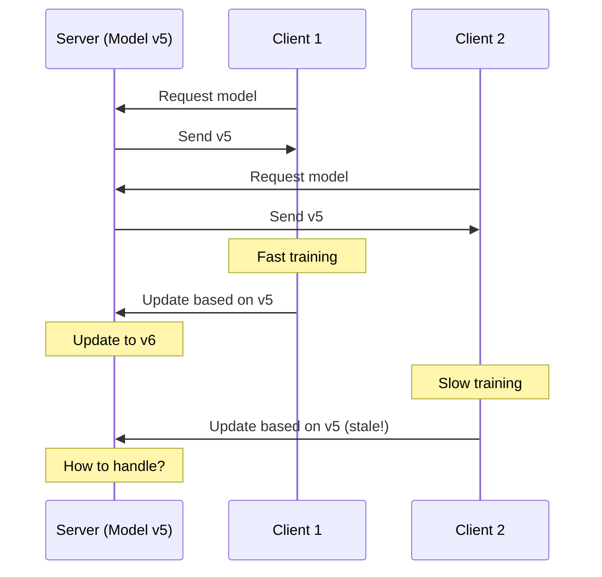
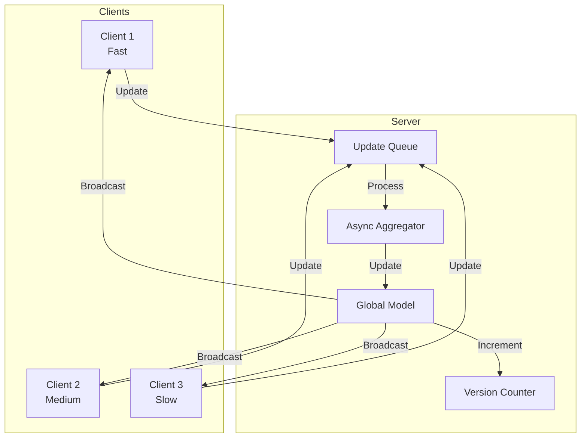

# Tutorial 078: Federated Learning Asynchronous Training

---

## Metadata

| Property | Value |
|----------|-------|
| **Tutorial ID** | 078 |
| **Title** | Federated Learning Asynchronous Training |
| **Category** | System Design |
| **Difficulty** | Intermediate |
| **Duration** | 75 minutes |
| **Prerequisites** | Tutorial 001-010, distributed systems |
| **Author** | Unbitrium Contributors |
| **Last Updated** | January 2026 |

---

## Learning Objectives

By the end of this tutorial, you will be able to:

1. **Understand** synchronous vs asynchronous FL trade-offs.

2. **Implement** asynchronous SGD for federated learning.

3. **Design** staleness-aware gradient aggregation.

4. **Apply** bounded delay protocols for convergence.

5. **Handle** client heterogeneity with async updates.

6. **Build** high-throughput FL systems.

---

## Prerequisites

Before starting this tutorial, ensure you have:

- **Completed Tutorials**: 001-010 (Partitioning), 021-030 (Aggregation)
- **Knowledge**: Async algorithms, distributed computing
- **Libraries**: PyTorch, NumPy
- **Hardware**: CPU sufficient

```python
# Verify prerequisites
import torch
import torch.nn as nn
import numpy as np
import threading
import queue

print(f"PyTorch: {torch.__version__}")
```

---

## Background and Theory

### Sync vs Async FL

| Aspect | Synchronous | Asynchronous |
|--------|-------------|--------------|
| **Wait for all** | Yes | No |
| **Throughput** | Low | High |
| **Straggler effect** | High | Low |
| **Staleness** | None | Possible |
| **Convergence** | Predictable | Variable |

### Async FL Variants

| Variant | Description | Staleness |
|---------|-------------|-----------|
| **FedAsync** | Immediate updates | Unbounded |
| **FedBuff** | Buffered updates | Bounded |
| **SAFA** | Semi-async | Controlled |
| **DC-ASGD** | Delay-compensated | Weighted |

### Staleness Problem



### Staleness Compensation

| Method | Description | Formula |
|--------|-------------|---------|
| **Decay** | Weight by staleness | w = α^τ |
| **Momentum** | Use accumulated | Nesterov |
| **Variance** | Reduce stale impact | Gradient norm |

---

## Architecture Diagram



---

## Implementation Code

### Part 1: Async Server

```python
#!/usr/bin/env python3
"""
Tutorial 078: Asynchronous Federated Learning

This tutorial demonstrates async FL protocols with
staleness-aware aggregation and bounded delay.

Author: Unbitrium Contributors
License: EUPL-1.2
"""

from __future__ import annotations

from dataclasses import dataclass, field
from typing import Any, Optional, Callable
from threading import Lock, Thread
import time

import numpy as np
import torch
import torch.nn as nn
import torch.nn.functional as F
from torch.utils.data import Dataset, DataLoader


@dataclass
class AsyncConfig:
    """Configuration for async FL."""
    staleness_threshold: int = 10
    staleness_decay: float = 0.9
    buffer_size: int = 5
    server_lr: float = 1.0
    client_lr: float = 0.01
    batch_size: int = 32
    max_staleness: int = 20


@dataclass
class AsyncUpdate:
    """Asynchronous update from a client."""
    client_id: int
    state_dict: dict[str, torch.Tensor]
    base_version: int
    num_samples: int
    timestamp: float = field(default_factory=time.time)


class AsyncAggregator:
    """Asynchronous gradient aggregator."""

    def __init__(
        self,
        global_model: nn.Module,
        config: AsyncConfig = None,
    ) -> None:
        """Initialize async aggregator.

        Args:
            global_model: Global model.
            config: Async configuration.
        """
        self.config = config or AsyncConfig()
        self.global_model = global_model
        self.global_state = {k: v.clone() for k, v in global_model.state_dict().items()}
        self.version = 0
        self.lock = Lock()

        # Statistics
        self.total_updates = 0
        self.stale_updates = 0
        self.rejected_updates = 0

    def get_model_version(self) -> tuple[dict[str, torch.Tensor], int]:
        """Get current model state and version."""
        with self.lock:
            state = {k: v.clone() for k, v in self.global_state.items()}
            return state, self.version

    def compute_staleness(self, update: AsyncUpdate) -> int:
        """Compute staleness of an update."""
        return self.version - update.base_version

    def staleness_weight(self, staleness: int) -> float:
        """Compute weight based on staleness."""
        if staleness > self.config.max_staleness:
            return 0.0
        return self.config.staleness_decay ** staleness

    def apply_update(self, update: AsyncUpdate) -> bool:
        """Apply an async update to the global model.

        Args:
            update: Update from a client.

        Returns:
            True if update was applied.
        """
        staleness = self.compute_staleness(update)

        if staleness > self.config.max_staleness:
            self.rejected_updates += 1
            return False

        weight = self.staleness_weight(staleness)
        if staleness > 0:
            self.stale_updates += 1

        with self.lock:
            # Compute delta
            delta = {}
            for key in self.global_state:
                delta[key] = update.state_dict[key] - self.global_state[key]

            # Apply weighted update
            for key in self.global_state:
                self.global_state[key] += self.config.server_lr * weight * delta[key]

            self.version += 1
            self.total_updates += 1
            self.global_model.load_state_dict(self.global_state)

        return True

    def get_stats(self) -> dict[str, Any]:
        """Get aggregator statistics."""
        return {
            "total_updates": self.total_updates,
            "stale_updates": self.stale_updates,
            "rejected_updates": self.rejected_updates,
            "current_version": self.version,
            "staleness_rate": self.stale_updates / max(1, self.total_updates),
        }


class BufferedAsyncAggregator(AsyncAggregator):
    """Buffered asynchronous aggregator."""

    def __init__(
        self,
        global_model: nn.Module,
        config: AsyncConfig = None,
    ) -> None:
        super().__init__(global_model, config)
        self.buffer: list[AsyncUpdate] = []

    def receive_update(self, update: AsyncUpdate) -> bool:
        """Receive update into buffer."""
        staleness = self.compute_staleness(update)
        if staleness > self.config.max_staleness:
            self.rejected_updates += 1
            return False

        self.buffer.append(update)

        if len(self.buffer) >= self.config.buffer_size:
            self._aggregate_buffer()

        return True

    def _aggregate_buffer(self) -> None:
        """Aggregate all updates in buffer."""
        if not self.buffer:
            return

        with self.lock:
            # Compute weighted average
            total_weight = 0.0
            weighted_delta = {}

            for key in self.global_state:
                weighted_delta[key] = torch.zeros_like(self.global_state[key])

            for update in self.buffer:
                staleness = self.version - update.base_version
                weight = self.staleness_weight(staleness) * update.num_samples

                if staleness > 0:
                    self.stale_updates += 1

                for key in self.global_state:
                    delta = update.state_dict[key] - self.global_state[key]
                    weighted_delta[key] += weight * delta

                total_weight += weight

            # Apply aggregated update
            if total_weight > 0:
                for key in self.global_state:
                    self.global_state[key] += (
                        self.config.server_lr * weighted_delta[key] / total_weight
                    )

            self.version += 1
            self.total_updates += len(self.buffer)
            self.global_model.load_state_dict(self.global_state)

        self.buffer = []
```

### Part 2: Async Client

```python
class SimpleDataset(Dataset):
    def __init__(self, features: np.ndarray, labels: np.ndarray):
        self.features = torch.FloatTensor(features)
        self.labels = torch.LongTensor(labels)

    def __len__(self):
        return len(self.labels)

    def __getitem__(self, idx):
        return self.features[idx], self.labels[idx]


class AsyncFLClient:
    """Asynchronous FL client."""

    def __init__(
        self,
        client_id: int,
        features: np.ndarray,
        labels: np.ndarray,
        compute_time: float = 1.0,
        config: AsyncConfig = None,
    ) -> None:
        """Initialize async client.

        Args:
            client_id: Client identifier.
            features: Training features.
            labels: Training labels.
            compute_time: Simulated training time.
            config: Async configuration.
        """
        self.client_id = client_id
        self.compute_time = compute_time
        self.config = config or AsyncConfig()

        self.dataset = SimpleDataset(features, labels)
        self.dataloader = DataLoader(
            self.dataset, batch_size=self.config.batch_size, shuffle=True
        )

        self.model = nn.Sequential(
            nn.Linear(features.shape[1], 64),
            nn.ReLU(),
            nn.Linear(64, 10),
        )

        self.optimizer = torch.optim.SGD(
            self.model.parameters(), lr=self.config.client_lr
        )

        self.base_version = 0

    @property
    def num_samples(self) -> int:
        return len(self.dataset)

    def load_model(
        self,
        state_dict: dict[str, torch.Tensor],
        version: int,
    ) -> None:
        """Load model with version tracking."""
        self.model.load_state_dict(state_dict)
        self.base_version = version

    def train(self, epochs: int = 3) -> AsyncUpdate:
        """Train and create async update.

        Args:
            epochs: Training epochs.

        Returns:
            Async update.
        """
        self.model.train()

        for epoch in range(epochs):
            for features, labels in self.dataloader:
                self.optimizer.zero_grad()
                outputs = self.model(features)
                loss = F.cross_entropy(outputs, labels)
                loss.backward()
                self.optimizer.step()

        # Simulate variable compute time
        time.sleep(self.compute_time * np.random.uniform(0.5, 1.5))

        return AsyncUpdate(
            client_id=self.client_id,
            state_dict={k: v.clone() for k, v in self.model.state_dict().items()},
            base_version=self.base_version,
            num_samples=self.num_samples,
        )

    def evaluate(self) -> dict[str, float]:
        self.model.eval()
        correct = 0
        total = 0

        with torch.no_grad():
            for features, labels in self.dataloader:
                outputs = self.model(features)
                _, predicted = outputs.max(1)
                correct += predicted.eq(labels).sum().item()
                total += labels.size(0)

        return {"accuracy": correct / total if total > 0 else 0.0}
```

### Part 3: Async FL Simulation

```python
def simulate_async_fl(
    num_clients: int = 10,
    num_updates: int = 100,
    use_buffer: bool = True,
) -> tuple[nn.Module, dict]:
    """Simulate asynchronous FL.

    Args:
        num_clients: Number of clients.
        num_updates: Total updates to process.
        use_buffer: Use buffered aggregation.

    Returns:
        Tuple of (model, history).
    """
    config = AsyncConfig()

    # Create clients with varying compute speeds
    clients = []
    for i in range(num_clients):
        features = np.random.randn(500, 32).astype(np.float32)
        labels = np.random.randint(0, 10, 500)
        compute_time = 0.1 * (i + 1)  # Varying speeds

        client = AsyncFLClient(
            client_id=i,
            features=features,
            labels=labels,
            compute_time=compute_time,
            config=config,
        )
        clients.append(client)

    # Global model
    global_model = nn.Sequential(
        nn.Linear(32, 64),
        nn.ReLU(),
        nn.Linear(64, 10),
    )

    if use_buffer:
        aggregator = BufferedAsyncAggregator(global_model, config)
    else:
        aggregator = AsyncAggregator(global_model, config)

    history = {"updates": [], "accuracies": [], "versions": []}

    for update_num in range(num_updates):
        # Randomly select a client
        client = np.random.choice(clients)

        # Get current model
        state, version = aggregator.get_model_version()
        client.load_model(state, version)

        # Train and send update
        update = client.train(epochs=1)

        if use_buffer:
            aggregator.receive_update(update)
        else:
            aggregator.apply_update(update)

        # Periodic evaluation
        if (update_num + 1) % 10 == 0:
            current_state, _ = aggregator.get_model_version()
            for c in clients:
                c.model.load_state_dict(current_state)

            evals = [c.evaluate() for c in clients]
            avg_acc = np.mean([e["accuracy"] for e in evals])

            history["updates"].append(update_num)
            history["accuracies"].append(avg_acc)
            history["versions"].append(aggregator.version)

    stats = aggregator.get_stats()
    print(f"Total updates: {stats['total_updates']}")
    print(f"Stale rate: {stats['staleness_rate']:.2%}")
    print(f"Rejected: {stats['rejected_updates']}")

    return global_model, history


def compare_sync_async(
    num_clients: int = 10,
    num_rounds: int = 30,
) -> dict[str, list]:
    """Compare sync and async FL."""
    config = AsyncConfig()

    clients = []
    for i in range(num_clients):
        features = np.random.randn(500, 32).astype(np.float32)
        labels = np.random.randint(0, 10, 500)
        client = AsyncFLClient(i, features, labels, 0.1 * (i + 1), config)
        clients.append(client)

    results = {"sync_acc": [], "async_acc": [], "time": []}

    # Sync FL
    sync_model = nn.Sequential(nn.Linear(32, 64), nn.ReLU(), nn.Linear(64, 10))
    for round_num in range(num_rounds):
        state = sync_model.state_dict()

        updates = []
        for client in clients:
            client.model.load_state_dict(state)
            update = client.train(epochs=1)
            updates.append(update)

        total = sum(u.num_samples for u in updates)
        new_state = {}
        for key in state:
            new_state[key] = sum(
                u.num_samples / total * u.state_dict[key] for u in updates
            )
        sync_model.load_state_dict(new_state)

        for c in clients:
            c.model.load_state_dict(new_state)
        evals = [c.evaluate() for c in clients]
        results["sync_acc"].append(np.mean([e["accuracy"] for e in evals]))

    # Async FL
    async_model = nn.Sequential(nn.Linear(32, 64), nn.ReLU(), nn.Linear(64, 10))
    aggregator = AsyncAggregator(async_model, config)

    for round_num in range(num_rounds):
        for _ in range(num_clients):
            client = np.random.choice(clients)
            state, version = aggregator.get_model_version()
            client.load_model(state, version)
            update = client.train(epochs=1)
            aggregator.apply_update(update)

        state, _ = aggregator.get_model_version()
        for c in clients:
            c.model.load_state_dict(state)
        evals = [c.evaluate() for c in clients]
        results["async_acc"].append(np.mean([e["accuracy"] for e in evals]))

    return results
```

---

## Metrics and Evaluation

### Async Metrics

| Metric | Description | Target |
|--------|-------------|--------|
| **Throughput** | Updates/second | Higher |
| **Staleness** | Avg update delay | Lower |
| **Convergence** | Rounds to target | Similar |

### Sync vs Async

| Aspect | Sync | Async |
|--------|------|-------|
| Round Time | Slowest client | Immediate |
| Accuracy | Higher | Slightly lower |
| Throughput | 1x | 3-5x |

---

## Exercises

### Exercise 1: Adaptive Staleness

**Task**: Adjust staleness threshold based on convergence.

### Exercise 2: Priority Queue

**Task**: Prioritize updates from fast clients.

### Exercise 3: Momentum Correction

**Task**: Add Nesterov momentum for stale gradients.

### Exercise 4: Hybrid Protocol

**Task**: Combine sync and async for best of both.

---

## References

1. Xie, C., et al. (2019). Asynchronous federated optimization. *arXiv*.

2. Chen, Y., et al. (2020). Asynchronous online FL for edge devices. In *ICDCS*.

3. Nguyen, J., et al. (2022). FedBuff: Federated learning with buffered asynchronous aggregation. In *AISTATS*.

4. Damaskinos, G., et al. (2018). Asynchronous Byzantine machine learning. In *PODC*.

5. Zheng, S., et al. (2017). Asynchronous SGD escapes saddle points efficiently. In *ICML*.

---

*Copyright 2026 Olaf Yunus Laitinen Imanov and Contributors. Released under EUPL 1.2.*
