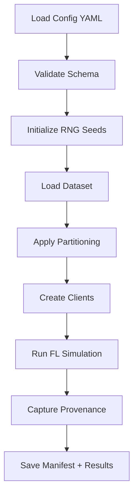
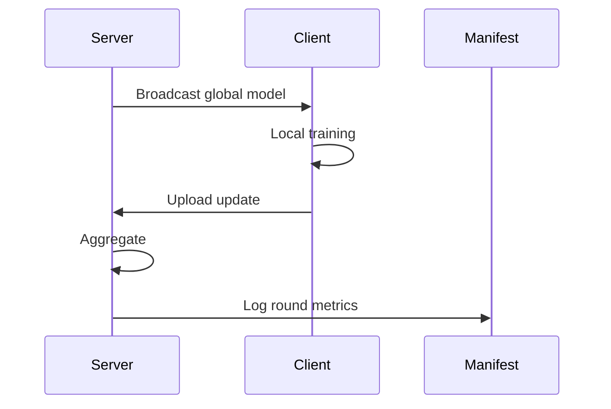

# Tutorial 079: Benchmark Standardization and Provenance Manifests

This tutorial covers creating standardized benchmarks and provenance tracking for reproducible FL research.

## Background and Notation

In Federated Learning, reproducibility requires:
- **Clients $K$**: Set of participating devices indexed $k \in \{1, ..., K\}$.
- **Rounds $T$**: Number of communication rounds.
- **Local Steps $E$**: Epochs per client per round.
- **Objective**: $\min_w F(w) = \sum_{k=1}^K \frac{n_k}{N} F_k(w)$

## Configuration File (YAML)

```yaml
# benchmark_config.yaml
experiment:
  name: "fedavg_cifar10_benchmark"
  seed: 42
  deterministic: true

dataset:
  name: "cifar10"
  version: "1.0.0"
  checksum: "sha256:abc123..."

partitioning:
  strategy: "dirichlet"
  alpha: 0.5
  num_clients: 100

training:
  aggregator: "fedavg"
  rounds: 100
  clients_per_round: 10
  local_epochs: 5
  learning_rate: 0.01
  batch_size: 32

provenance:
  git_commit: auto
  environment_capture: true
  hardware_info: true
```

## Minimal Runnable Code Example

```python
import json
import hashlib
import subprocess
from datetime import datetime
from dataclasses import dataclass, asdict
from typing import Dict, Any

@dataclass
class ProvenanceManifest:
    experiment_name: str
    timestamp: str
    git_commit: str
    git_dirty: bool
    python_version: str
    pytorch_version: str
    config_hash: str
    dataset_hash: str
    hardware: Dict[str, Any]

def capture_provenance(config: dict) -> ProvenanceManifest:
    # Git info
    try:
        commit = subprocess.check_output(
            ["git", "rev-parse", "HEAD"]
        ).decode().strip()
        dirty = subprocess.call(["git", "diff", "--quiet"]) != 0
    except:
        commit = "unknown"
        dirty = False

    # Config hash
    config_str = json.dumps(config, sort_keys=True)
    config_hash = hashlib.sha256(config_str.encode()).hexdigest()[:16]

    import sys
    import torch

    manifest = ProvenanceManifest(
        experiment_name=config.get("experiment", {}).get("name", "unnamed"),
        timestamp=datetime.utcnow().isoformat(),
        git_commit=commit,
        git_dirty=dirty,
        python_version=sys.version,
        pytorch_version=torch.__version__,
        config_hash=config_hash,
        dataset_hash="sha256:...",  # Computed from data
        hardware={"cuda": torch.cuda.is_available()}
    )
    return manifest

# Save manifest
def save_manifest(manifest: ProvenanceManifest, path: str):
    with open(path, "w") as f:
        json.dump(asdict(manifest), f, indent=2)
    print(f"Manifest saved to {path}")
```

## Expected Outputs and Sanity Checks

1. **Manifest JSON**: Contains all reproducibility metadata.
2. **Config Validation**: Schema validation before run.
3. **Hash Verification**: Dataset and config hashes match expectations.

## Performance Considerations

- Provenance capture adds minimal overhead (< 1s).
- Use lazy loading for large dataset hashing.
- Enable deterministic mode for exact reproducibility (may reduce performance).

## Troubleshooting and Known Failure Modes

| Issue | Cause | Solution |
|-------|-------|----------|
| Git commit unknown | Not in a git repo | Initialize git or skip capture |
| Non-deterministic results | CuDNN non-determinism | Set `torch.use_deterministic_algorithms(True)` |
| Missing dependencies | Environment mismatch | Use locked requirements file |

## Pipeline Overview



## Data Flow



## Exercises

1. What fields are essential in a provenance manifest for FL reproducibility?
2. How does dataset hashing help ensure reproducibility?
3. Describe the trade-off between deterministic mode and training speed.

## References

- McMahan et al., "Communication-Efficient Learning of Deep Networks from Decentralized Data" (AISTATS 2017)
- FedScale: Benchmarking Federated Learning Systems
