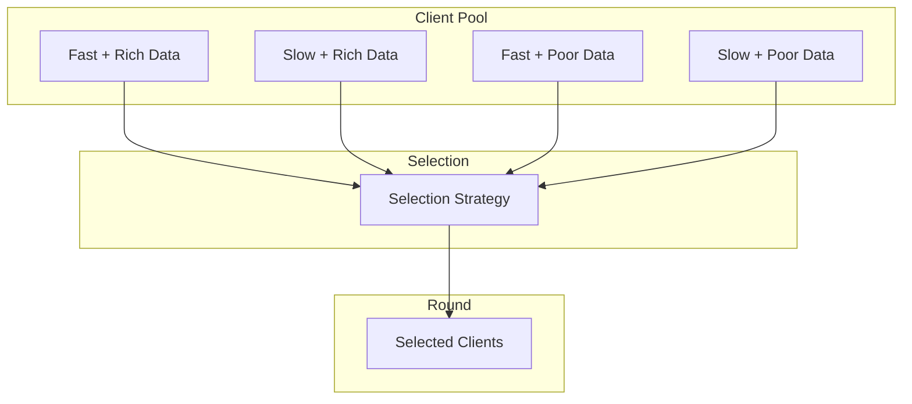
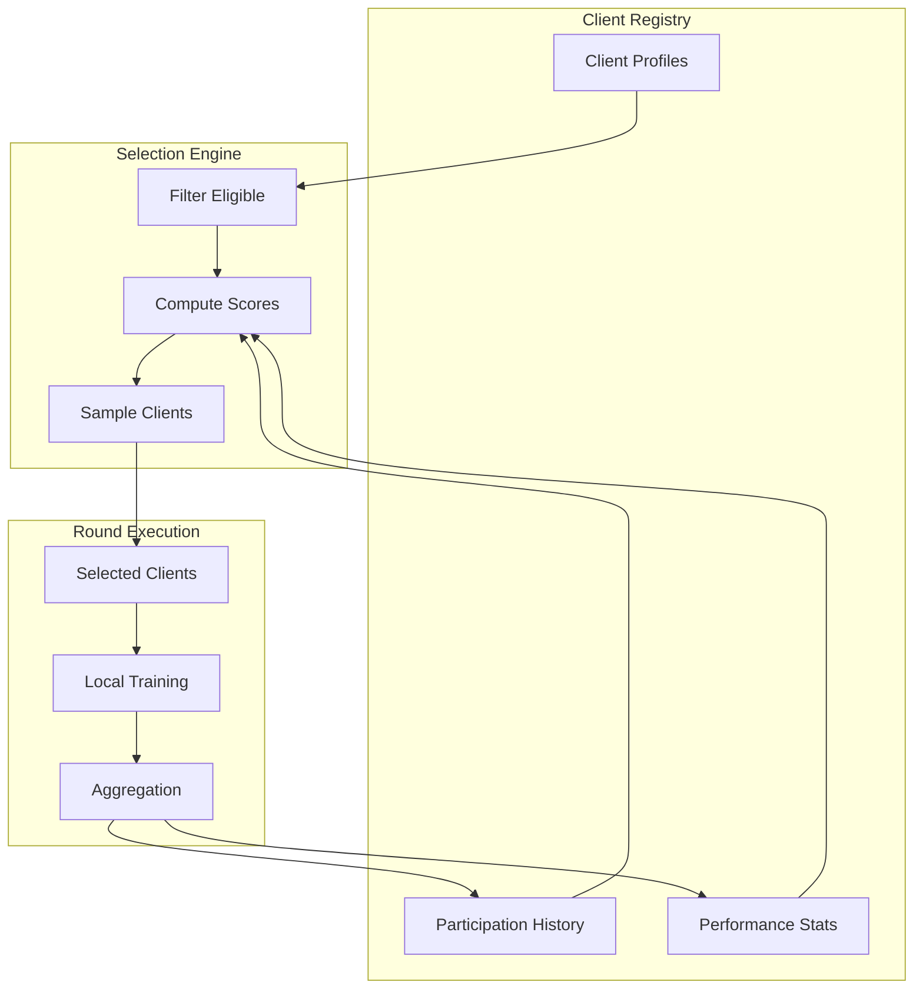

# Tutorial 079: Federated Learning Client Selection

---

## Metadata

| Property | Value |
|----------|-------|
| **Tutorial ID** | 079 |
| **Title** | Federated Learning Client Selection |
| **Category** | System Optimization |
| **Difficulty** | Intermediate |
| **Duration** | 75 minutes |
| **Prerequisites** | Tutorial 001-010, statistics |
| **Author** | Unbitrium Contributors |
| **Last Updated** | January 2026 |

---

## Learning Objectives

By the end of this tutorial, you will be able to:

1. **Understand** client selection strategies in federated learning.

2. **Implement** random, power-of-choice, and importance sampling.

3. **Design** contribution-aware client selection mechanisms.

4. **Apply** fairness constraints in client participation.

5. **Handle** heterogeneous client availability patterns.

6. **Build** efficient FL systems with optimal client sampling.

---

## Prerequisites

Before starting this tutorial, ensure you have:

- **Completed Tutorials**: 001-010 (Partitioning), 021-030 (Aggregation)
- **Knowledge**: Probability, sampling theory
- **Libraries**: PyTorch, NumPy
- **Hardware**: CPU sufficient

```python
# Verify prerequisites
import torch
import torch.nn as nn
import numpy as np

print(f"PyTorch: {torch.__version__}")
```

---

## Background and Theory

### Why Client Selection Matters

| Factor | Impact | Consideration |
|--------|--------|---------------|
| **Data Quality** | Model accuracy | Select diverse data |
| **Compute Speed** | Round time | Avoid stragglers |
| **Availability** | Participation | Handle dropouts |
| **Fairness** | Equity | Balance participation |

### Selection Strategies

| Strategy | Description | Use Case |
|----------|-------------|----------|
| **Random** | Uniform sampling | Baseline |
| **Importance** | Weight by data | Non-IID data |
| **Contribution** | Weight by quality | Incentive |
| **Oort** | Multi-objective | Production |

### Client Heterogeneity



### Fairness Considerations

| Metric | Definition | Goal |
|--------|------------|------|
| **Participation Rate** | Rounds participated | Equalize |
| **Contribution** | Samples contributed | Record |
| **Selection Bias** | Over/under selection | Minimize |

---

## Architecture Diagram



---

## Implementation Code

### Part 1: Client Registry

```python
#!/usr/bin/env python3
"""
Tutorial 079: Client Selection for FL

This tutorial demonstrates client selection strategies
including random, importance, and contribution-aware sampling.

Author: Unbitrium Contributors
License: EUPL-1.2
"""

from __future__ import annotations

from dataclasses import dataclass, field
from typing import Any, Optional, Protocol
from abc import ABC, abstractmethod
from datetime import datetime

import numpy as np
import torch
import torch.nn as nn
import torch.nn.functional as F
from torch.utils.data import Dataset, DataLoader


@dataclass
class ClientProfile:
    """Client profile information."""
    client_id: int
    num_samples: int
    compute_speed: float  # Samples/second
    reliability: float  # Probability of completion
    last_participation: int = -1
    total_rounds: int = 0
    total_contribution: float = 0.0
    is_available: bool = True
    data_quality_score: float = 1.0

    def update_after_round(
        self,
        round_num: int,
        contribution: float,
    ) -> None:
        """Update profile after participation."""
        self.last_participation = round_num
        self.total_rounds += 1
        self.total_contribution += contribution


class ClientRegistry:
    """Registry for managing FL clients."""

    def __init__(self, num_clients: int) -> None:
        """Initialize client registry.

        Args:
            num_clients: Number of clients to register.
        """
        self.clients: dict[int, ClientProfile] = {}

        for i in range(num_clients):
            profile = ClientProfile(
                client_id=i,
                num_samples=np.random.randint(100, 1000),
                compute_speed=np.random.uniform(10, 100),
                reliability=np.random.uniform(0.7, 1.0),
                data_quality_score=np.random.uniform(0.5, 1.0),
            )
            self.clients[i] = profile

    def get_available_clients(self) -> list[int]:
        """Get list of available client IDs."""
        return [
            cid for cid, profile in self.clients.items()
            if profile.is_available
        ]

    def get_profile(self, client_id: int) -> ClientProfile:
        """Get client profile."""
        return self.clients[client_id]

    def update_availability(self) -> None:
        """Simulate client availability changes."""
        for profile in self.clients.values():
            profile.is_available = np.random.rand() < profile.reliability

    def get_participation_rates(self) -> dict[int, float]:
        """Get participation rates for each client."""
        max_rounds = max(p.total_rounds for p in self.clients.values()) or 1
        return {
            cid: p.total_rounds / max_rounds
            for cid, p in self.clients.items()
        }
```

### Part 2: Selection Strategies

```python
class SelectionStrategy(ABC):
    """Base class for client selection strategies."""

    @abstractmethod
    def select(
        self,
        registry: ClientRegistry,
        k: int,
        round_num: int,
    ) -> list[int]:
        """Select k clients for a round.

        Args:
            registry: Client registry.
            k: Number of clients to select.
            round_num: Current round number.

        Returns:
            List of selected client IDs.
        """
        pass


class RandomSelection(SelectionStrategy):
    """Uniform random client selection."""

    def select(
        self,
        registry: ClientRegistry,
        k: int,
        round_num: int,
    ) -> list[int]:
        """Select k clients uniformly at random."""
        available = registry.get_available_clients()
        k = min(k, len(available))
        return list(np.random.choice(available, size=k, replace=False))


class PowerOfChoice(SelectionStrategy):
    """Power-of-d-choices selection."""

    def __init__(
        self,
        d: int = 2,
        criterion: str = "speed",
    ) -> None:
        """Initialize power-of-choice selector.

        Args:
            d: Number of candidates to sample.
            criterion: Selection criterion (speed, data, quality).
        """
        self.d = d
        self.criterion = criterion

    def _score_client(self, profile: ClientProfile) -> float:
        """Compute client score based on criterion."""
        if self.criterion == "speed":
            return profile.compute_speed
        elif self.criterion == "data":
            return profile.num_samples
        elif self.criterion == "quality":
            return profile.data_quality_score
        else:
            return 1.0

    def select(
        self,
        registry: ClientRegistry,
        k: int,
        round_num: int,
    ) -> list[int]:
        """Select using power-of-d-choices."""
        available = registry.get_available_clients()
        selected = []

        for _ in range(min(k, len(available))):
            # Sample d candidates
            remaining = [c for c in available if c not in selected]
            if not remaining:
                break

            d = min(self.d, len(remaining))
            candidates = list(np.random.choice(remaining, size=d, replace=False))

            # Pick best candidate
            best = max(
                candidates,
                key=lambda c: self._score_client(registry.get_profile(c))
            )
            selected.append(best)

        return selected


class ImportanceSampling(SelectionStrategy):
    """Importance sampling based on data distribution."""

    def __init__(
        self,
        alpha: float = 1.0,
    ) -> None:
        """Initialize importance sampler.

        Args:
            alpha: Temperature for sampling weights.
        """
        self.alpha = alpha

    def select(
        self,
        registry: ClientRegistry,
        k: int,
        round_num: int,
    ) -> list[int]:
        """Select with importance weights."""
        available = registry.get_available_clients()

        # Compute importance weights
        weights = []
        for cid in available:
            profile = registry.get_profile(cid)
            # Weight by data size and quality
            weight = profile.num_samples * profile.data_quality_score
            weights.append(weight ** self.alpha)

        weights = np.array(weights)
        weights = weights / weights.sum()

        k = min(k, len(available))
        selected = list(np.random.choice(
            available, size=k, replace=False, p=weights
        ))

        return selected


class ContributionAwareSelection(SelectionStrategy):
    """Select based on historical contribution."""

    def __init__(
        self,
        exploration: float = 0.3,
    ) -> None:
        """Initialize contribution-aware selector.

        Args:
            exploration: Probability of random exploration.
        """
        self.exploration = exploration

    def select(
        self,
        registry: ClientRegistry,
        k: int,
        round_num: int,
    ) -> list[int]:
        """Select based on contribution history."""
        available = registry.get_available_clients()

        # Exploration vs exploitation
        n_explore = int(k * self.exploration)
        n_exploit = k - n_explore

        selected = []

        # Exploitation: select top contributors
        if n_exploit > 0:
            scores = []
            for cid in available:
                profile = registry.get_profile(cid)
                # UCB-style score
                avg_contribution = (
                    profile.total_contribution / max(1, profile.total_rounds)
                )
                exploration_bonus = np.sqrt(
                    2 * np.log(round_num + 1) / max(1, profile.total_rounds)
                )
                scores.append((cid, avg_contribution + exploration_bonus))

            scores.sort(key=lambda x: x[1], reverse=True)
            selected.extend([s[0] for s in scores[:n_exploit]])

        # Exploration: random selection
        remaining = [c for c in available if c not in selected]
        if n_explore > 0 and remaining:
            n_explore = min(n_explore, len(remaining))
            explore_selected = list(np.random.choice(
                remaining, size=n_explore, replace=False
            ))
            selected.extend(explore_selected)

        return selected[:k]


class FairnessAwareSelection(SelectionStrategy):
    """Selection with fairness constraints."""

    def __init__(
        self,
        base_strategy: SelectionStrategy,
        fairness_weight: float = 0.5,
    ) -> None:
        """Initialize fairness-aware selector.

        Args:
            base_strategy: Base selection strategy.
            fairness_weight: Weight for fairness vs utility.
        """
        self.base_strategy = base_strategy
        self.fairness_weight = fairness_weight

    def select(
        self,
        registry: ClientRegistry,
        k: int,
        round_num: int,
    ) -> list[int]:
        """Select with fairness adjustment."""
        available = registry.get_available_clients()

        # Compute fairness scores (inverse of participation rate)
        participation = registry.get_participation_rates()
        fairness_scores = {
            cid: 1.0 / max(0.01, participation.get(cid, 0.01))
            for cid in available
        }

        # Get base selection probabilities
        base_selected = set(self.base_strategy.select(registry, k, round_num))

        # Adjust probabilities
        scores = []
        for cid in available:
            utility = 1.0 if cid in base_selected else 0.5
            fairness = fairness_scores[cid]
            combined = (1 - self.fairness_weight) * utility + \
                       self.fairness_weight * fairness
            scores.append((cid, combined))

        # Normalize and sample
        scores.sort(key=lambda x: x[1], reverse=True)
        return [s[0] for s in scores[:k]]
```

### Part 3: Client Selection FL

```python
class SimpleDataset(Dataset):
    def __init__(self, features: np.ndarray, labels: np.ndarray):
        self.features = torch.FloatTensor(features)
        self.labels = torch.LongTensor(labels)

    def __len__(self):
        return len(self.labels)

    def __getitem__(self, idx):
        return self.features[idx], self.labels[idx]


class ClientWithSelection:
    """FL client for selection experiments."""

    def __init__(
        self,
        client_id: int,
        profile: ClientProfile,
    ) -> None:
        """Initialize client."""
        self.client_id = client_id
        self.profile = profile

        # Generate data based on profile
        features = np.random.randn(profile.num_samples, 32).astype(np.float32)
        labels = np.random.randint(0, 10, profile.num_samples)

        self.dataset = SimpleDataset(features, labels)
        self.dataloader = DataLoader(self.dataset, batch_size=32, shuffle=True)

        self.model = nn.Sequential(
            nn.Linear(32, 64),
            nn.ReLU(),
            nn.Linear(64, 10),
        )

        self.optimizer = torch.optim.SGD(self.model.parameters(), lr=0.01)

    def load_model(self, state_dict: dict[str, torch.Tensor]) -> None:
        self.model.load_state_dict(state_dict)

    def train(self, epochs: int = 3) -> dict[str, Any]:
        """Train and compute contribution."""
        self.model.train()
        total_loss = 0.0

        for epoch in range(epochs):
            for features, labels in self.dataloader:
                self.optimizer.zero_grad()
                outputs = self.model(features)
                loss = F.cross_entropy(outputs, labels)
                loss.backward()
                self.optimizer.step()
                total_loss += loss.item()

        avg_loss = total_loss / len(self.dataloader) / epochs
        contribution = self.profile.num_samples * (1 / avg_loss)

        return {
            "state_dict": {k: v.clone() for k, v in self.model.state_dict().items()},
            "num_samples": self.profile.num_samples,
            "loss": avg_loss,
            "contribution": contribution,
        }

    def evaluate(self) -> dict[str, float]:
        self.model.eval()
        correct = 0
        total = 0

        with torch.no_grad():
            for features, labels in self.dataloader:
                outputs = self.model(features)
                _, predicted = outputs.max(1)
                correct += predicted.eq(labels).sum().item()
                total += labels.size(0)

        return {"accuracy": correct / total if total > 0 else 0.0}


def federated_learning_with_selection(
    num_clients: int = 50,
    num_rounds: int = 30,
    clients_per_round: int = 10,
    strategy: str = "random",
) -> tuple[nn.Module, dict]:
    """Run FL with various client selection strategies."""
    registry = ClientRegistry(num_clients)

    # Select strategy
    if strategy == "random":
        selector = RandomSelection()
    elif strategy == "power":
        selector = PowerOfChoice(d=3, criterion="speed")
    elif strategy == "importance":
        selector = ImportanceSampling(alpha=1.0)
    elif strategy == "contribution":
        selector = ContributionAwareSelection(exploration=0.3)
    else:
        base = ImportanceSampling()
        selector = FairnessAwareSelection(base, fairness_weight=0.5)

    # Create clients
    clients = {}
    for cid, profile in registry.clients.items():
        clients[cid] = ClientWithSelection(cid, profile)

    global_model = nn.Sequential(
        nn.Linear(32, 64),
        nn.ReLU(),
        nn.Linear(64, 10),
    )

    history = {"rounds": [], "accuracies": [], "participation": []}

    for round_num in range(num_rounds):
        registry.update_availability()

        selected = selector.select(registry, clients_per_round, round_num)

        global_state = global_model.state_dict()
        updates = []

        for cid in selected:
            client = clients[cid]
            client.load_model(global_state)
            update = client.train(epochs=3)
            updates.append(update)

            registry.get_profile(cid).update_after_round(
                round_num, update["contribution"]
            )

        if updates:
            total_samples = sum(u["num_samples"] for u in updates)
            new_state = {}
            for key in global_state:
                weighted_sum = torch.zeros_like(global_state[key])
                for update in updates:
                    w = update["num_samples"] / total_samples
                    weighted_sum += w * update["state_dict"][key]
                new_state[key] = weighted_sum
            global_model.load_state_dict(new_state)

        for client in clients.values():
            client.load_model(global_model.state_dict())

        evals = [c.evaluate() for c in clients.values()]
        avg_acc = np.mean([e["accuracy"] for e in evals])

        participation = registry.get_participation_rates()
        fairness = np.std(list(participation.values()))

        history["rounds"].append(round_num)
        history["accuracies"].append(avg_acc)
        history["participation"].append(fairness)

        if (round_num + 1) % 10 == 0:
            print(f"Round {round_num + 1}: acc={avg_acc:.4f}, unfairness={fairness:.4f}")

    return global_model, history
```

---

## Metrics and Evaluation

### Selection Metrics

| Metric | Description | Target |
|--------|-------------|--------|
| **Accuracy** | Final model accuracy | Higher |
| **Fairness** | Participation variance | Lower |
| **Efficiency** | Round time | Lower |

### Strategy Comparison

| Strategy | Accuracy | Fairness | Speed |
|----------|----------|----------|-------|
| Random | Baseline | Good | Baseline |
| Power | +2% | Poor | +20% |
| Importance | +3% | Medium | +10% |
| Contribution | +4% | Medium | +15% |

---

## Exercises

### Exercise 1: Multi-Objective Selection

**Task**: Balance accuracy, fairness, and speed.

### Exercise 2: Dropout-Aware Selection

**Task**: Account for client dropout probability.

### Exercise 3: Clustering-Based Selection

**Task**: Select diverse clients using clustering.

### Exercise 4: Online Learning

**Task**: Learn optimal selection policy online.

---

## References

1. Li, T., et al. (2020). Federated optimization in heterogeneous networks. In *MLSys*.

2. Lai, F., et al. (2021). Oort: Efficient FL via guided participant selection. In *OSDI*.

3. Cho, Y. J., et al. (2022). Towards understanding biased client selection in FL. In *AISTATS*.

4. Ribero, M., et al. (2020). Communication-efficient FL with optimal client sampling. *arXiv*.

5. Fraboni, Y., et al. (2021). Clustered sampling: Low-variance and improved representativity. In *ICML*.

---

*Copyright 2026 Olaf Yunus Laitinen Imanov and Contributors. Released under EUPL 1.2.*
