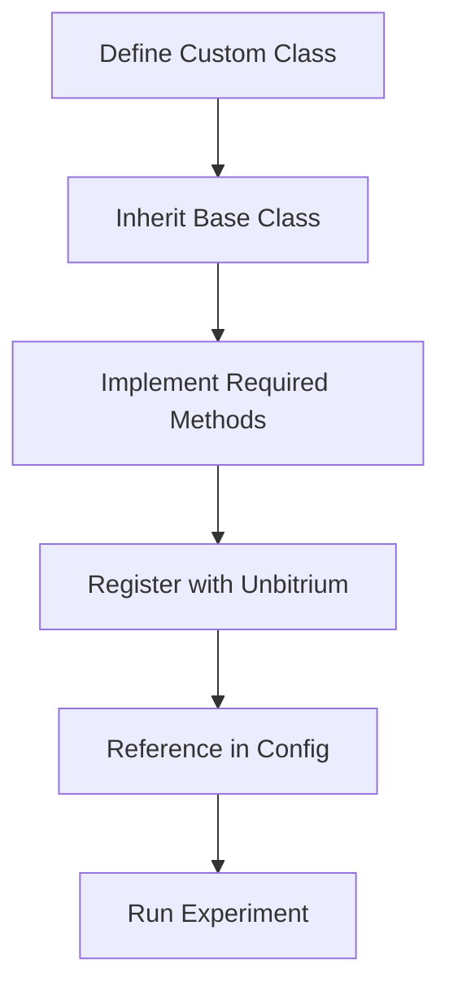

# Tutorial 080: Extending Unbitrium with Custom Aggregators and Metrics

This tutorial demonstrates how to extend Unbitrium by implementing custom aggregators and metrics.

## Background and Notation

- **Aggregator**: Function $\mathcal{A}: \{w_k\}_{k=1}^K \rightarrow w_g$ mapping client updates to global model.
- **Metric**: Function $\mathcal{M}: \{D_k\}, w_g \rightarrow \mathbb{R}$ measuring some property.

## Configuration File (YAML)

```yaml
# custom_aggregator_config.yaml
experiment:
  name: "custom_weighted_median"

aggregator:
  class: "custom_aggregators.WeightedMedian"
  params:
    epsilon: 0.01

metrics:
  - class: "custom_metrics.GradientAlignment"
  - class: "unbitrium.metrics.EMDLabelDistance"
```

## Minimal Runnable Code Example

### Custom Aggregator

```python
# custom_aggregators.py
from typing import Dict, List, Tuple, Any
import torch
from unbitrium.aggregators.base import Aggregator

class WeightedMedian(Aggregator):
    """
    Coordinate-wise weighted median aggregation.

    Robust to outliers while considering client sample sizes.

    Formal definition:
    For each parameter coordinate $i$:
    $$
    w_g^{(i)} = \text{weighted\_median}(\{w_k^{(i)}\}, \{n_k\})
    $$
    """

    def __init__(self, epsilon: float = 0.01):
        self.epsilon = epsilon

    def aggregate(
        self,
        updates: List[Dict[str, Any]],
        current_global_model: torch.nn.Module
    ) -> Tuple[torch.nn.Module, Dict[str, float]]:

        if not updates:
            return current_global_model, {}

        # Extract weights
        total_samples = sum(u["num_samples"] for u in updates)
        weights = [u["num_samples"] / total_samples for u in updates]

        new_state_dict = {}
        first_state = updates[0]["state_dict"]

        for key in first_state.keys():
            if isinstance(first_state[key], torch.Tensor):
                # Stack all values
                stacked = torch.stack([u["state_dict"][key] for u in updates])
                # Compute weighted median coordinate-wise
                median_val = self._weighted_median(stacked, weights)
                new_state_dict[key] = median_val
            else:
                new_state_dict[key] = first_state[key]

        current_global_model.load_state_dict(new_state_dict)
        return current_global_model, {"aggregator": "weighted_median"}

    def _weighted_median(
        self,
        values: torch.Tensor,
        weights: List[float]
    ) -> torch.Tensor:
        # Flatten, compute, reshape
        original_shape = values.shape[1:]
        flat = values.view(len(weights), -1)

        result = torch.zeros(flat.shape[1])
        weights_t = torch.tensor(weights)

        for i in range(flat.shape[1]):
            col = flat[:, i]
            sorted_idx = torch.argsort(col)
            sorted_vals = col[sorted_idx]
            sorted_weights = weights_t[sorted_idx]

            # Find median
            cum_weights = torch.cumsum(sorted_weights, dim=0)
            median_idx = torch.searchsorted(cum_weights, 0.5)
            result[i] = sorted_vals[min(median_idx, len(sorted_vals)-1)]

        return result.view(original_shape)
```

### Custom Metric

```python
# custom_metrics.py
from typing import Dict, List
import torch
import numpy as np

class GradientAlignment:
    """
    Measures average cosine similarity between client gradients.

    $$
    \text{Alignment} = \frac{1}{K(K-1)} \sum_{i \neq j} \cos(g_i, g_j)
    $$
    """

    def compute(
        self,
        client_gradients: List[Dict[str, torch.Tensor]],
        global_model: torch.nn.Module
    ) -> float:

        if len(client_gradients) < 2:
            return 1.0

        # Flatten gradients
        flat_grads = []
        for grad_dict in client_gradients:
            flat = torch.cat([g.view(-1) for g in grad_dict.values()])
            flat_grads.append(flat)

        # Compute pairwise cosine similarities
        similarities = []
        for i in range(len(flat_grads)):
            for j in range(i + 1, len(flat_grads)):
                cos_sim = torch.nn.functional.cosine_similarity(
                    flat_grads[i].unsqueeze(0),
                    flat_grads[j].unsqueeze(0)
                )
                similarities.append(cos_sim.item())

        return float(np.mean(similarities))
```

## Expected Outputs and Sanity Checks

1. Custom aggregator returns valid model state dict.
2. Custom metric returns scalar in expected range.
3. Registration with Unbitrium registry succeeds.

## Performance Considerations

- Weighted median is $O(K \cdot D \log K)$ where $D$ is parameter count.
- Gradient alignment is $O(K^2 \cdot D)$.
- Consider vectorization for large-scale experiments.

## Troubleshooting

| Issue | Cause | Solution |
|-------|-------|----------|
| Shape mismatch | Inconsistent model architectures | Validate shapes before aggregation |
| NaN values | Division by zero | Add epsilon guards |
| Import errors | Missing registration | Add to `__init__.py` |

## Pipeline Overview



## Exercises

1. Implement a custom aggregator that uses the geometric mean of client updates.
2. Create a metric that measures the effective number of classes per client.
3. How would you add hyperparameters to your custom aggregator?

## References

- Yin et al., "Byzantine-Robust Distributed Learning" (ICML 2018)
- Blanchard et al., "Machine Learning with Adversaries" (NeurIPS 2017)
