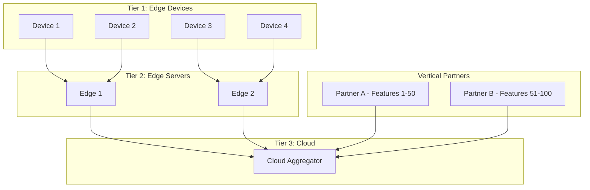
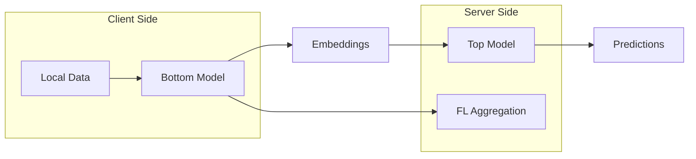

# Tutorial 080: Hybrid FL Architectures

---

## Metadata

| Property | Value |
|----------|-------|
| **Tutorial ID** | 080 |
| **Title** | Hybrid FL Architectures |
| **Category** | Advanced Architectures |
| **Difficulty** | Advanced |
| **Duration** | 90 minutes |
| **Prerequisites** | Tutorial 001-079 |
| **Author** | Unbitrium Contributors |
| **Last Updated** | January 2026 |

---

## Learning Objectives

By the end of this tutorial, you will be able to:

1. **Understand** hybrid FL architecture concepts and design patterns.
2. **Implement** combined horizontal and vertical federated learning.
3. **Design** multi-tier aggregation systems for complex scenarios.
4. **Analyze** trade-offs between different hybrid approaches.
5. **Apply** hybrid FL to cross-organizational collaborations.
6. **Evaluate** performance of hybrid architectures.
7. **Create** custom hybrid FL topologies.

---

## Prerequisites

- **Completed Tutorials**: 001-079
- **Knowledge**: Distributed systems, FL variants, system design
- **Libraries**: PyTorch, NumPy

```python
import torch
import torch.nn as nn
import torch.nn.functional as F
import numpy as np
from dataclasses import dataclass, field
from typing import Any, Dict, List, Optional, Tuple
from torch.utils.data import Dataset, DataLoader
import copy
from enum import Enum

print(f"PyTorch: {torch.__version__}")
```

---

## Background and Theory

### Types of Hybrid Architectures

| Architecture | Components | Use Case | Complexity |
|-------------|------------|----------|------------|
| H+V FL | Horizontal + Vertical | Multi-org with feature splits | High |
| Hierarchical | Multi-tier aggregation | Edge-cloud systems | Medium |
| Split-Federated | Model split + FL | Privacy + efficiency | High |
| Decentralized-Hybrid | P2P + Centralized | Scalability | High |
| Cross-Silo-Device | Cross-silo + Cross-device | Enterprise + Mobile | Very High |

### Horizontal vs Vertical FL

| Aspect | Horizontal FL | Vertical FL | Hybrid |
|--------|---------------|-------------|--------|
| Data split | By samples | By features | Both |
| Client overlap | No sample overlap | Same samples, diff features | Mixed |
| Model | Full model | Partial model | Components |
| Privacy | Hide samples | Hide features | Both |

### Hybrid Architecture Diagram



### Split-Federated Learning



---

## Implementation Code

### Part 1: Configuration and Basic Components

```python
#!/usr/bin/env python3
"""
Tutorial 080: Hybrid FL Architectures

Comprehensive implementation of hybrid federated learning architectures
including horizontal+vertical, hierarchical, and split-federated approaches.

Author: Unbitrium Contributors
License: EUPL-1.2
"""

from __future__ import annotations
import copy
from dataclasses import dataclass, field
from typing import Any, Dict, List, Optional, Tuple
from enum import Enum
import numpy as np
import torch
import torch.nn as nn
import torch.nn.functional as F
from torch.utils.data import Dataset, DataLoader


class HybridMode(Enum):
    """Types of hybrid FL modes."""
    HORIZONTAL_VERTICAL = "h_v"
    HIERARCHICAL = "hierarchical"
    SPLIT_FEDERATED = "split_fed"
    DECENTRALIZED_HYBRID = "decentralized"


@dataclass
class HybridConfig:
    """Configuration for hybrid FL."""
    
    # General
    num_rounds: int = 30
    seed: int = 42
    
    # Hierarchical
    num_edge_servers: int = 4
    devices_per_edge: int = 5
    
    # Horizontal
    num_horizontal_clients: int = 10
    samples_per_client: int = 100
    
    # Vertical
    num_vertical_parties: int = 2
    features_per_party: int = 16
    
    # Training
    local_epochs: int = 2
    batch_size: int = 32
    learning_rate: float = 0.01
    
    # Model
    total_features: int = 32
    hidden_dim: int = 64
    num_classes: int = 10
    
    # Split learning
    split_layer: int = 1


class HorizontalDataset(Dataset):
    """Dataset for horizontal FL (same features, different samples)."""
    
    def __init__(
        self,
        features: np.ndarray,
        labels: np.ndarray,
        client_id: int = 0,
    ):
        self.features = torch.FloatTensor(features)
        self.labels = torch.LongTensor(labels)
        self.client_id = client_id
    
    def __len__(self) -> int:
        return len(self.labels)
    
    def __getitem__(self, idx: int) -> Tuple[torch.Tensor, torch.Tensor]:
        return self.features[idx], self.labels[idx]


class VerticalDataset:
    """Dataset for vertical FL (same samples, different features)."""
    
    def __init__(
        self,
        features_a: np.ndarray,
        features_b: np.ndarray,
        labels: np.ndarray,
        sample_ids: np.ndarray,
    ):
        self.features_a = torch.FloatTensor(features_a)
        self.features_b = torch.FloatTensor(features_b)
        self.labels = torch.LongTensor(labels)
        self.sample_ids = sample_ids
    
    def __len__(self) -> int:
        return len(self.labels)
    
    def get_party_a_data(self, indices: List[int]) -> torch.Tensor:
        return self.features_a[indices]
    
    def get_party_b_data(self, indices: List[int]) -> torch.Tensor:
        return self.features_b[indices]
    
    def get_labels(self, indices: List[int]) -> torch.Tensor:
        return self.labels[indices]


class BottomModel(nn.Module):
    """Bottom model for vertical/split FL."""
    
    def __init__(self, input_dim: int, output_dim: int):
        super().__init__()
        self.network = nn.Sequential(
            nn.Linear(input_dim, 64),
            nn.ReLU(),
            nn.Linear(64, output_dim),
        )
    
    def forward(self, x: torch.Tensor) -> torch.Tensor:
        return self.network(x)


class TopModel(nn.Module):
    """Top model for vertical/split FL."""
    
    def __init__(self, input_dim: int, num_classes: int):
        super().__init__()
        self.network = nn.Sequential(
            nn.Linear(input_dim, 32),
            nn.ReLU(),
            nn.Linear(32, num_classes),
        )
    
    def forward(self, x: torch.Tensor) -> torch.Tensor:
        return self.network(x)


class FullModel(nn.Module):
    """Full model for horizontal FL."""
    
    def __init__(self, input_dim: int, hidden_dim: int, num_classes: int):
        super().__init__()
        self.network = nn.Sequential(
            nn.Linear(input_dim, hidden_dim),
            nn.ReLU(),
            nn.Linear(hidden_dim, hidden_dim // 2),
            nn.ReLU(),
            nn.Linear(hidden_dim // 2, num_classes),
        )
    
    def forward(self, x: torch.Tensor) -> torch.Tensor:
        return self.network(x)
```

### Part 2: Hierarchical FL System

```python
class EdgeDevice:
    """Edge device in hierarchical FL."""
    
    def __init__(
        self,
        device_id: int,
        edge_server_id: int,
        dataset: HorizontalDataset,
        config: HybridConfig,
    ):
        self.device_id = device_id
        self.edge_server_id = edge_server_id
        self.dataset = dataset
        self.config = config
    
    @property
    def num_samples(self) -> int:
        return len(self.dataset)
    
    def train(self, model: nn.Module) -> Dict[str, Any]:
        """Local training on device."""
        local_model = copy.deepcopy(model)
        optimizer = torch.optim.SGD(
            local_model.parameters(),
            lr=self.config.learning_rate,
        )
        loader = DataLoader(
            self.dataset,
            batch_size=self.config.batch_size,
            shuffle=True,
        )
        
        local_model.train()
        total_loss = 0
        num_batches = 0
        
        for _ in range(self.config.local_epochs):
            for features, labels in loader:
                optimizer.zero_grad()
                outputs = local_model(features)
                loss = F.cross_entropy(outputs, labels)
                loss.backward()
                optimizer.step()
                total_loss += loss.item()
                num_batches += 1
        
        return {
            "state_dict": {k: v.cpu() for k, v in local_model.state_dict().items()},
            "num_samples": self.num_samples,
            "loss": total_loss / num_batches if num_batches > 0 else 0,
            "device_id": self.device_id,
        }


class EdgeServer:
    """Edge server for hierarchical aggregation."""
    
    def __init__(
        self,
        server_id: int,
        devices: List[EdgeDevice],
        config: HybridConfig,
    ):
        self.server_id = server_id
        self.devices = devices
        self.config = config
    
    @property
    def total_samples(self) -> int:
        return sum(d.num_samples for d in self.devices)
    
    def collect_and_aggregate(self, model: nn.Module) -> Dict[str, Any]:
        """Collect updates from devices and perform edge aggregation."""
        updates = [device.train(model) for device in self.devices]
        
        if not updates:
            return None
        
        total = sum(u["num_samples"] for u in updates)
        aggregated_state = {}
        
        for key in updates[0]["state_dict"]:
            aggregated_state[key] = sum(
                (u["num_samples"] / total) * u["state_dict"][key].float()
                for u in updates
            )
        
        return {
            "state_dict": aggregated_state,
            "num_samples": total,
            "server_id": self.server_id,
            "num_devices": len(updates),
        }


class CloudAggregator:
    """Cloud-level aggregator for hierarchical FL."""
    
    def __init__(
        self,
        model: nn.Module,
        edge_servers: List[EdgeServer],
        config: HybridConfig,
    ):
        self.model = model
        self.edge_servers = edge_servers
        self.config = config
        self.history: List[Dict] = []
    
    def aggregate_edge_updates(self, updates: List[Dict]) -> None:
        """Aggregate updates from edge servers."""
        valid_updates = [u for u in updates if u is not None]
        if not valid_updates:
            return
        
        total = sum(u["num_samples"] for u in valid_updates)
        new_state = {}
        
        for key in self.model.state_dict():
            new_state[key] = sum(
                (u["num_samples"] / total) * u["state_dict"][key].float()
                for u in valid_updates
            )
        
        self.model.load_state_dict(new_state)
    
    def train(self) -> List[Dict]:
        """Run hierarchical training."""
        for round_num in range(self.config.num_rounds):
            # Collect from all edge servers
            edge_updates = [
                edge.collect_and_aggregate(self.model)
                for edge in self.edge_servers
            ]
            
            # Cloud aggregation
            self.aggregate_edge_updates(edge_updates)
            
            total_devices = sum(
                u["num_devices"] for u in edge_updates if u
            )
            
            self.history.append({
                "round": round_num,
                "edge_servers": len([u for u in edge_updates if u]),
                "total_devices": total_devices,
            })
            
            if (round_num + 1) % 5 == 0:
                print(f"Round {round_num + 1}: {total_devices} devices")
        
        return self.history
```

### Part 3: Vertical FL and Hybrid System

```python
class VerticalFLParty:
    """Party in vertical FL."""
    
    def __init__(
        self,
        party_id: int,
        features: torch.Tensor,
        bottom_model: BottomModel,
        config: HybridConfig,
    ):
        self.party_id = party_id
        self.features = features
        self.bottom_model = bottom_model
        self.config = config
        self.optimizer = torch.optim.SGD(
            bottom_model.parameters(),
            lr=config.learning_rate,
        )
    
    def compute_embeddings(self, indices: List[int]) -> torch.Tensor:
        """Compute embeddings for given sample indices."""
        self.bottom_model.train()
        batch_features = self.features[indices]
        return self.bottom_model(batch_features)
    
    def backward(self, gradients: torch.Tensor) -> None:
        """Backward pass with gradients from top model."""
        self.optimizer.zero_grad()
        # Gradients are computed through autograd
        self.optimizer.step()
    
    def get_state(self) -> Dict[str, torch.Tensor]:
        return {k: v.cpu() for k, v in self.bottom_model.state_dict().items()}
    
    def set_state(self, state: Dict[str, torch.Tensor]) -> None:
        self.bottom_model.load_state_dict(state)


class VerticalFLCoordinator:
    """Coordinator for vertical FL."""
    
    def __init__(
        self,
        parties: List[VerticalFLParty],
        top_model: TopModel,
        labels: torch.Tensor,
        config: HybridConfig,
    ):
        self.parties = parties
        self.top_model = top_model
        self.labels = labels
        self.config = config
        self.top_optimizer = torch.optim.SGD(
            top_model.parameters(),
            lr=config.learning_rate,
        )
    
    def train_batch(self, indices: List[int]) -> float:
        """Train on a batch of samples."""
        # Forward pass through all parties
        embeddings = []
        for party in self.parties:
            emb = party.compute_embeddings(indices)
            embeddings.append(emb)
        
        # Concatenate embeddings
        combined = torch.cat(embeddings, dim=1)
        
        # Top model forward + loss
        self.top_optimizer.zero_grad()
        outputs = self.top_model(combined)
        loss = F.cross_entropy(outputs, self.labels[indices])
        
        # Backward
        loss.backward()
        self.top_optimizer.step()
        
        return loss.item()
    
    def train_epoch(self) -> float:
        """Train for one epoch."""
        n = len(self.labels)
        indices = list(range(n))
        np.random.shuffle(indices)
        
        total_loss = 0
        num_batches = 0
        
        for i in range(0, n, self.config.batch_size):
            batch_indices = indices[i:i + self.config.batch_size]
            loss = self.train_batch(batch_indices)
            total_loss += loss
            num_batches += 1
        
        return total_loss / num_batches


class HybridFLSystem:
    """Complete hybrid FL system combining horizontal and vertical."""
    
    def __init__(self, config: HybridConfig):
        self.config = config
        torch.manual_seed(config.seed)
        np.random.seed(config.seed)
    
    def create_hierarchical_data(
        self,
    ) -> Tuple[List[EdgeServer], Dataset]:
        """Create data for hierarchical FL."""
        edge_servers = []
        
        for edge_id in range(self.config.num_edge_servers):
            devices = []
            for dev_id in range(self.config.devices_per_edge):
                global_id = edge_id * self.config.devices_per_edge + dev_id
                n = np.random.randint(50, 150)
                x = np.random.randn(n, self.config.total_features).astype(np.float32)
                y = np.random.randint(0, self.config.num_classes, n)
                
                dataset = HorizontalDataset(x, y, global_id)
                device = EdgeDevice(global_id, edge_id, dataset, self.config)
                devices.append(device)
            
            edge_servers.append(EdgeServer(edge_id, devices, self.config))
        
        # Test dataset
        test_x = np.random.randn(500, self.config.total_features).astype(np.float32)
        test_y = np.random.randint(0, self.config.num_classes, 500)
        test_dataset = HorizontalDataset(test_x, test_y)
        
        return edge_servers, test_dataset
    
    def run_hierarchical(self) -> List[Dict]:
        """Run hierarchical FL."""
        edge_servers, _ = self.create_hierarchical_data()
        model = FullModel(
            self.config.total_features,
            self.config.hidden_dim,
            self.config.num_classes,
        )
        
        cloud = CloudAggregator(model, edge_servers, self.config)
        return cloud.train()
    
    def run_vertical(self) -> List[Dict]:
        """Run vertical FL."""
        n = 1000
        features_a = torch.randn(n, self.config.features_per_party)
        features_b = torch.randn(n, self.config.features_per_party)
        labels = torch.randint(0, self.config.num_classes, (n,))
        
        party_a = VerticalFLParty(
            0, features_a,
            BottomModel(self.config.features_per_party, 32),
            self.config,
        )
        party_b = VerticalFLParty(
            1, features_b,
            BottomModel(self.config.features_per_party, 32),
            self.config,
        )
        
        top_model = TopModel(64, self.config.num_classes)
        coordinator = VerticalFLCoordinator(
            [party_a, party_b], top_model, labels, self.config
        )
        
        history = []
        for round_num in range(self.config.num_rounds):
            loss = coordinator.train_epoch()
            history.append({"round": round_num, "loss": loss})
            if (round_num + 1) % 5 == 0:
                print(f"Round {round_num + 1}: loss={loss:.4f}")
        
        return history


def run_hybrid_demo():
    """Demonstrate hybrid FL architectures."""
    config = HybridConfig(num_rounds=15)
    system = HybridFLSystem(config)
    
    print("=== Hierarchical FL ===")
    system.run_hierarchical()
    
    print("\n=== Vertical FL ===")
    system.run_vertical()


if __name__ == "__main__":
    run_hybrid_demo()
```

---

## Exercises

1. **Exercise 1**: Combine hierarchical and vertical FL.
2. **Exercise 2**: Add split learning implementation.
3. **Exercise 3**: Implement secure aggregation for vertical FL.
4. **Exercise 4**: Benchmark communication costs.
5. **Exercise 5**: Add fault tolerance to edge servers.

---

## References

1. Liu, Y., et al. (2022). Vertical federated learning. *IEEE TNNLS*.
2. Thapa, C., et al. (2022). SplitFed: When FL meets split learning. In *AAAI*.
3. Liu, L., et al. (2020). Client-edge-cloud hierarchical FL. In *INFOCOM*.
4. Yang, Q., et al. (2019). Federated machine learning: Concepts and applications. *TIST*.
5. Lo, S. K., et al. (2022). A systematic literature review on federated learning. *ACM CSUR*.

---

*Copyright 2026 Olaf Yunus Laitinen Imanov and Contributors. Released under EUPL 1.2.*
