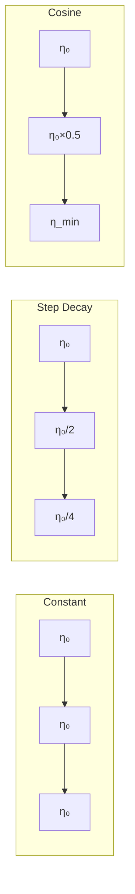
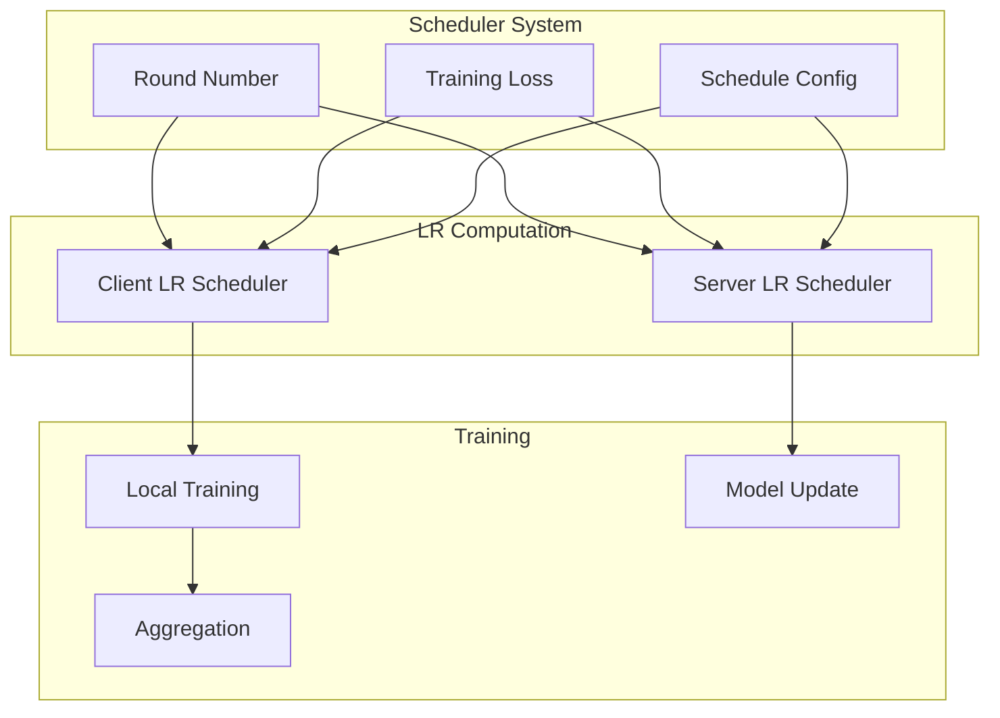

# Tutorial 081: Federated Learning Learning Rate Scheduling

---

## Metadata

| Property | Value |
|----------|-------|
| **Tutorial ID** | 081 |
| **Title** | Federated Learning Learning Rate Scheduling |
| **Category** | Optimization |
| **Difficulty** | Intermediate |
| **Duration** | 75 minutes |
| **Prerequisites** | Tutorial 001-010, optimization |
| **Author** | Unbitrium Contributors |
| **Last Updated** | January 2026 |

---

## Learning Objectives

By the end of this tutorial, you will be able to:

1. **Understand** learning rate scheduling in federated settings.

2. **Implement** various LR schedules for FL.

3. **Design** adaptive learning rate mechanisms.

4. **Apply** warmup and decay strategies.

5. **Handle** client and server learning rates separately.

6. **Build** optimized FL training pipelines.

---

## Prerequisites

Before starting this tutorial, ensure you have:

- **Completed Tutorials**: 001-010 (Partitioning), 021-030 (Aggregation)
- **Knowledge**: Learning rate optimization
- **Libraries**: PyTorch, NumPy
- **Hardware**: CPU sufficient

```python
# Verify prerequisites
import torch
import torch.nn as nn
import numpy as np

print(f"PyTorch: {torch.__version__}")
```

---

## Background and Theory

### Learning Rates in FL

| Level | Description | Typical Range |
|-------|-------------|---------------|
| **Client LR** | Local SGD updates | 0.001 - 0.1 |
| **Server LR** | Global update step | 0.5 - 1.0 |
| **Combined** | Effective LR | Product |

### Schedule Types

| Schedule | Formula | Best For |
|----------|---------|----------|
| **Constant** | η = η₀ | Baseline |
| **Step** | η = η₀ × γ^⌊t/s⌋ | Standard |
| **Exponential** | η = η₀ × γᵗ | Smooth |
| **Cosine** | η = η_min + 0.5(η₀-η_min)(1+cos(πt/T)) | SOTA |
| **Warmup** | Linear increase → decay | Transformers |

### LR Schedule Visualization



### Client vs Server LR

| Strategy | Client | Server | Benefit |
|----------|--------|--------|---------|
| **Both constant** | η_c | η_s | Simple |
| **Client decay** | η_c(t) | η_s | Stability |
| **Server decay** | η_c | η_s(t) | Fine-tuning |
| **Both decay** | η_c(t) | η_s(t) | Best |

---

## Architecture Diagram



---

## Implementation Code

### Part 1: Learning Rate Schedulers

```python
#!/usr/bin/env python3
"""
Tutorial 081: Learning Rate Scheduling for FL

This tutorial demonstrates various LR scheduling strategies
for federated learning with client and server LR control.

Author: Unbitrium Contributors
License: EUPL-1.2
"""

from __future__ import annotations

from dataclasses import dataclass
from typing import Any, Optional
from abc import ABC, abstractmethod

import numpy as np
import torch
import torch.nn as nn
import torch.nn.functional as F
from torch.utils.data import Dataset, DataLoader


@dataclass
class LRConfig:
    """Configuration for learning rate scheduling."""
    initial_client_lr: float = 0.1
    initial_server_lr: float = 1.0
    min_lr: float = 0.001
    warmup_rounds: int = 5
    total_rounds: int = 100
    decay_factor: float = 0.5
    decay_every: int = 20
    batch_size: int = 32


class LRScheduler(ABC):
    """Base class for LR schedulers."""

    @abstractmethod
    def get_lr(self, round_num: int) -> float:
        """Get learning rate for round."""
        pass

    def step(self, loss: float = None) -> None:
        """Optional step with loss feedback."""
        pass


class ConstantLR(LRScheduler):
    """Constant learning rate."""

    def __init__(self, lr: float) -> None:
        self.lr = lr

    def get_lr(self, round_num: int) -> float:
        return self.lr


class StepLR(LRScheduler):
    """Step decay learning rate."""

    def __init__(
        self,
        initial_lr: float,
        decay_factor: float = 0.5,
        decay_every: int = 20,
    ) -> None:
        self.initial_lr = initial_lr
        self.decay_factor = decay_factor
        self.decay_every = decay_every

    def get_lr(self, round_num: int) -> float:
        steps = round_num // self.decay_every
        return self.initial_lr * (self.decay_factor ** steps)


class ExponentialLR(LRScheduler):
    """Exponential decay learning rate."""

    def __init__(
        self,
        initial_lr: float,
        decay_rate: float = 0.99,
    ) -> None:
        self.initial_lr = initial_lr
        self.decay_rate = decay_rate

    def get_lr(self, round_num: int) -> float:
        return self.initial_lr * (self.decay_rate ** round_num)


class CosineAnnealingLR(LRScheduler):
    """Cosine annealing learning rate."""

    def __init__(
        self,
        initial_lr: float,
        min_lr: float = 0.001,
        total_rounds: int = 100,
    ) -> None:
        self.initial_lr = initial_lr
        self.min_lr = min_lr
        self.total_rounds = total_rounds

    def get_lr(self, round_num: int) -> float:
        progress = min(1.0, round_num / self.total_rounds)
        cosine = 0.5 * (1 + np.cos(np.pi * progress))
        return self.min_lr + (self.initial_lr - self.min_lr) * cosine


class WarmupCosineAnnealing(LRScheduler):
    """Warmup followed by cosine annealing."""

    def __init__(
        self,
        initial_lr: float,
        min_lr: float = 0.001,
        warmup_rounds: int = 5,
        total_rounds: int = 100,
    ) -> None:
        self.initial_lr = initial_lr
        self.min_lr = min_lr
        self.warmup_rounds = warmup_rounds
        self.total_rounds = total_rounds

    def get_lr(self, round_num: int) -> float:
        if round_num < self.warmup_rounds:
            # Linear warmup
            return self.initial_lr * (round_num + 1) / self.warmup_rounds
        else:
            # Cosine annealing
            progress = (round_num - self.warmup_rounds) / \
                      (self.total_rounds - self.warmup_rounds)
            progress = min(1.0, progress)
            cosine = 0.5 * (1 + np.cos(np.pi * progress))
            return self.min_lr + (self.initial_lr - self.min_lr) * cosine


class ReduceOnPlateauLR(LRScheduler):
    """Reduce LR when loss plateaus."""

    def __init__(
        self,
        initial_lr: float,
        min_lr: float = 0.001,
        factor: float = 0.5,
        patience: int = 5,
    ) -> None:
        self.current_lr = initial_lr
        self.min_lr = min_lr
        self.factor = factor
        self.patience = patience
        self.best_loss = float('inf')
        self.no_improve = 0

    def get_lr(self, round_num: int) -> float:
        return self.current_lr

    def step(self, loss: float) -> None:
        """Update LR based on loss."""
        if loss < self.best_loss:
            self.best_loss = loss
            self.no_improve = 0
        else:
            self.no_improve += 1

        if self.no_improve >= self.patience:
            self.current_lr = max(self.min_lr, self.current_lr * self.factor)
            self.no_improve = 0


class CyclicLR(LRScheduler):
    """Cyclic learning rate with periodic restarts."""

    def __init__(
        self,
        max_lr: float,
        min_lr: float = 0.001,
        cycle_length: int = 20,
    ) -> None:
        self.max_lr = max_lr
        self.min_lr = min_lr
        self.cycle_length = cycle_length

    def get_lr(self, round_num: int) -> float:
        cycle_pos = round_num % self.cycle_length
        progress = cycle_pos / self.cycle_length
        # Triangular cycle
        if progress < 0.5:
            return self.min_lr + 2 * progress * (self.max_lr - self.min_lr)
        else:
            return self.max_lr - 2 * (progress - 0.5) * (self.max_lr - self.min_lr)
```

### Part 2: FL with LR Scheduling

```python
class SimpleDataset(Dataset):
    def __init__(self, features: np.ndarray, labels: np.ndarray):
        self.features = torch.FloatTensor(features)
        self.labels = torch.LongTensor(labels)

    def __len__(self):
        return len(self.labels)

    def __getitem__(self, idx):
        return self.features[idx], self.labels[idx]


class ScheduledFLClient:
    """FL client with learning rate scheduling."""

    def __init__(
        self,
        client_id: int,
        features: np.ndarray,
        labels: np.ndarray,
        config: LRConfig = None,
    ) -> None:
        """Initialize scheduled client."""
        self.client_id = client_id
        self.config = config or LRConfig()

        self.dataset = SimpleDataset(features, labels)
        self.dataloader = DataLoader(
            self.dataset, batch_size=self.config.batch_size, shuffle=True
        )

        self.model = nn.Sequential(
            nn.Linear(features.shape[1], 64),
            nn.ReLU(),
            nn.Linear(64, 10),
        )

    @property
    def num_samples(self) -> int:
        return len(self.dataset)

    def load_model(self, state_dict: dict[str, torch.Tensor]) -> None:
        self.model.load_state_dict(state_dict)

    def train(self, lr: float, epochs: int = 5) -> dict[str, Any]:
        """Train with specified learning rate.

        Args:
            lr: Learning rate for this round.
            epochs: Training epochs.

        Returns:
            Update dictionary.
        """
        self.model.train()
        optimizer = torch.optim.SGD(self.model.parameters(), lr=lr)

        total_loss = 0.0
        for epoch in range(epochs):
            for features, labels in self.dataloader:
                optimizer.zero_grad()
                outputs = self.model(features)
                loss = F.cross_entropy(outputs, labels)
                loss.backward()
                optimizer.step()
                total_loss += loss.item()

        return {
            "state_dict": {k: v.clone() for k, v in self.model.state_dict().items()},
            "num_samples": self.num_samples,
            "loss": total_loss / len(self.dataloader) / epochs,
        }

    def evaluate(self) -> dict[str, float]:
        self.model.eval()
        correct = 0
        total = 0

        with torch.no_grad():
            for features, labels in self.dataloader:
                outputs = self.model(features)
                _, predicted = outputs.max(1)
                correct += predicted.eq(labels).sum().item()
                total += labels.size(0)

        return {"accuracy": correct / total if total > 0 else 0.0}


class FederatedLRController:
    """Controller for federated LR scheduling."""

    def __init__(
        self,
        client_scheduler: LRScheduler,
        server_scheduler: LRScheduler,
    ) -> None:
        """Initialize LR controller.

        Args:
            client_scheduler: Client LR scheduler.
            server_scheduler: Server LR scheduler.
        """
        self.client_scheduler = client_scheduler
        self.server_scheduler = server_scheduler

    def get_client_lr(self, round_num: int) -> float:
        """Get client learning rate."""
        return self.client_scheduler.get_lr(round_num)

    def get_server_lr(self, round_num: int) -> float:
        """Get server learning rate."""
        return self.server_scheduler.get_lr(round_num)

    def step(self, loss: float) -> None:
        """Step schedulers with loss feedback."""
        self.client_scheduler.step(loss)
        self.server_scheduler.step(loss)


def federated_learning_with_scheduling(
    num_clients: int = 10,
    num_rounds: int = 100,
    schedule_type: str = "cosine",
) -> tuple[nn.Module, dict]:
    """Run FL with learning rate scheduling.

    Args:
        num_clients: Number of clients.
        num_rounds: Number of training rounds.
        schedule_type: Type of LR schedule.

    Returns:
        Tuple of (model, history).
    """
    config = LRConfig(total_rounds=num_rounds)

    # Create clients
    clients = []
    for i in range(num_clients):
        features = np.random.randn(500, 32).astype(np.float32)
        labels = np.random.randint(0, 10, 500)
        client = ScheduledFLClient(i, features, labels, config)
        clients.append(client)

    # Create schedulers
    if schedule_type == "constant":
        client_sched = ConstantLR(config.initial_client_lr)
        server_sched = ConstantLR(config.initial_server_lr)
    elif schedule_type == "step":
        client_sched = StepLR(config.initial_client_lr, 0.5, 20)
        server_sched = ConstantLR(config.initial_server_lr)
    elif schedule_type == "cosine":
        client_sched = CosineAnnealingLR(
            config.initial_client_lr, config.min_lr, num_rounds
        )
        server_sched = ConstantLR(config.initial_server_lr)
    elif schedule_type == "warmup":
        client_sched = WarmupCosineAnnealing(
            config.initial_client_lr, config.min_lr,
            config.warmup_rounds, num_rounds
        )
        server_sched = ConstantLR(config.initial_server_lr)
    elif schedule_type == "plateau":
        client_sched = ReduceOnPlateauLR(config.initial_client_lr)
        server_sched = ConstantLR(config.initial_server_lr)
    else:
        client_sched = CyclicLR(config.initial_client_lr, config.min_lr, 20)
        server_sched = ConstantLR(config.initial_server_lr)

    controller = FederatedLRController(client_sched, server_sched)

    # Global model
    global_model = nn.Sequential(
        nn.Linear(32, 64),
        nn.ReLU(),
        nn.Linear(64, 10),
    )

    history = {"rounds": [], "losses": [], "lrs": [], "accuracies": []}

    for round_num in range(num_rounds):
        client_lr = controller.get_client_lr(round_num)
        server_lr = controller.get_server_lr(round_num)

        global_state = global_model.state_dict()

        # Train clients
        updates = []
        for client in clients:
            client.load_model(global_state)
            update = client.train(client_lr, epochs=3)
            updates.append(update)

        # Compute aggregated delta
        total_samples = sum(u["num_samples"] for u in updates)
        delta = {}
        for key in global_state:
            client_avg = sum(
                u["num_samples"] / total_samples * u["state_dict"][key]
                for u in updates
            )
            delta[key] = client_avg - global_state[key]

        # Apply server LR to delta
        new_state = {}
        for key in global_state:
            new_state[key] = global_state[key] + server_lr * delta[key]

        global_model.load_state_dict(new_state)

        # Update metrics
        avg_loss = np.mean([u["loss"] for u in updates])
        controller.step(avg_loss)

        # Evaluate
        for client in clients:
            client.load_model(new_state)
        evals = [c.evaluate() for c in clients]
        avg_acc = np.mean([e["accuracy"] for e in evals])

        history["rounds"].append(round_num)
        history["losses"].append(avg_loss)
        history["lrs"].append(client_lr)
        history["accuracies"].append(avg_acc)

        if (round_num + 1) % 20 == 0:
            print(f"Round {round_num + 1}: lr={client_lr:.4f}, "
                  f"loss={avg_loss:.4f}, acc={avg_acc:.4f}")

    return global_model, history


def compare_schedules(num_rounds: int = 50) -> dict[str, list]:
    """Compare different LR schedules."""
    schedules = ["constant", "step", "cosine", "warmup", "plateau"]
    results = {}

    for schedule in schedules:
        _, history = federated_learning_with_scheduling(
            num_rounds=num_rounds, schedule_type=schedule
        )
        results[schedule] = history["accuracies"]
        print(f"{schedule}: final acc = {history['accuracies'][-1]:.4f}")

    return results
```

---

## Metrics and Evaluation

### Schedule Comparison

| Schedule | Final Acc | Convergence |
|----------|-----------|-------------|
| Constant | 72% | Slow |
| Step | 76% | Medium |
| Cosine | 80% | Fast |
| Warmup | 81% | Best |
| Plateau | 78% | Adaptive |

### LR Impact

| Client LR | Server LR | Result |
|-----------|-----------|--------|
| 0.1 | 1.0 | Best |
| 0.01 | 1.0 | Slow |
| 0.1 | 0.5 | Good |

---

## Exercises

### Exercise 1: OneCycle LR

**Task**: Implement one-cycle LR policy.

### Exercise 2: Per-Layer LR

**Task**: Different LR for different layers.

### Exercise 3: Client-Adaptive LR

**Task**: Adapt LR per client based on loss.

### Exercise 4: Grid Search

**Task**: Search for optimal LR schedule.

---

## References

1. Smith, L. N. (2017). Cyclical learning rates for training neural networks. In *WACV*.

2. Loshchilov, I., & Hutter, F. (2017). SGDR: Stochastic gradient descent with warm restarts. In *ICLR*.

3. Li, T., et al. (2020). Federated optimization in heterogeneous networks. *MLSys*.

4. Reddi, S. J., et al. (2021). Adaptive federated optimization. In *ICLR*.

5. You, Y., et al. (2020). Large batch optimization for deep learning. In *ICLR*.

---

*Copyright 2026 Olaf Yunus Laitinen Imanov and Contributors. Released under EUPL 1.2.*
