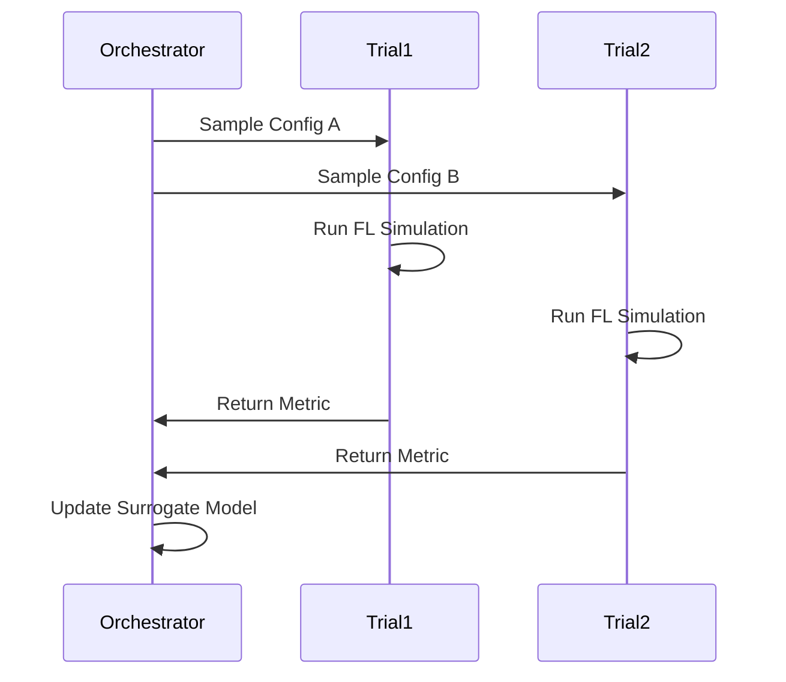

# Tutorial 082: Federated Hyperparameter Tuning

This tutorial explores strategies for tuning hyperparameters (learning rate, batch size) in a federated setting.

## Background

Hyperparameter tuning in FL is costly due to communication overhead. Approaches include:
- **FedEx**: Weight-sharing for architecture search.
- **Random Search**: With low-fidelity proxies.
- **Genetic Algorithms**: Evolving populations of configurations.

## Configuration File

```yaml
experiment:
  name: "tuning_experiment"

tuning:
  method: "random_search"
  trials: 10
  parallel_simulations: 2

search_space:
  learning_rate:
    type: "loguniform"
    min: 1e-4
    max: 1e-1
  momentum:
    type: "uniform"
    min: 0.5
    max: 0.9
```

## Minimal Runnable Code Example

```python
import numpy as np

def objective_function(config):
    # This would simulate a full FL run
    lr = config["learning_rate"]
    # ... setup simulator ...
    # simulator.run()
    # return final_accuracy
    return -((lr - 0.01)**2) + 0.8  # Dummy landscape

configs = []
results = []

for _ in range(10):
    cfg = {
        "learning_rate": 10**np.random.uniform(-4, -1)
    }
    acc = objective_function(cfg)
    configs.append(cfg)
    results.append(acc)

best_idx = np.argmax(results)
print(f"Best Config: {configs[best_idx]}, Acc: {results[best_idx]}")
```

## Tuning Workflow



## Exercises

1. Why is validation data scarce in FL tuning?
2. Implement a SHA (Successive Halving Algorithm) scaler for FL rounds.
3. Discuss the impact of client heterogeneity on hyperparameter sensitivity.
