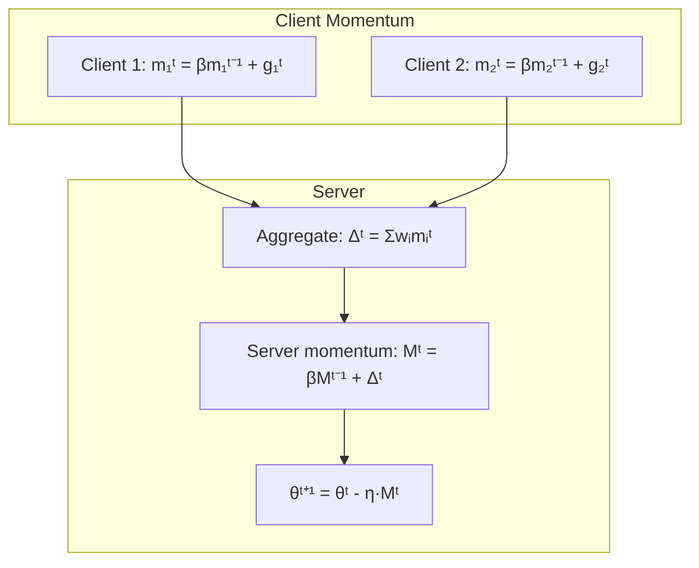
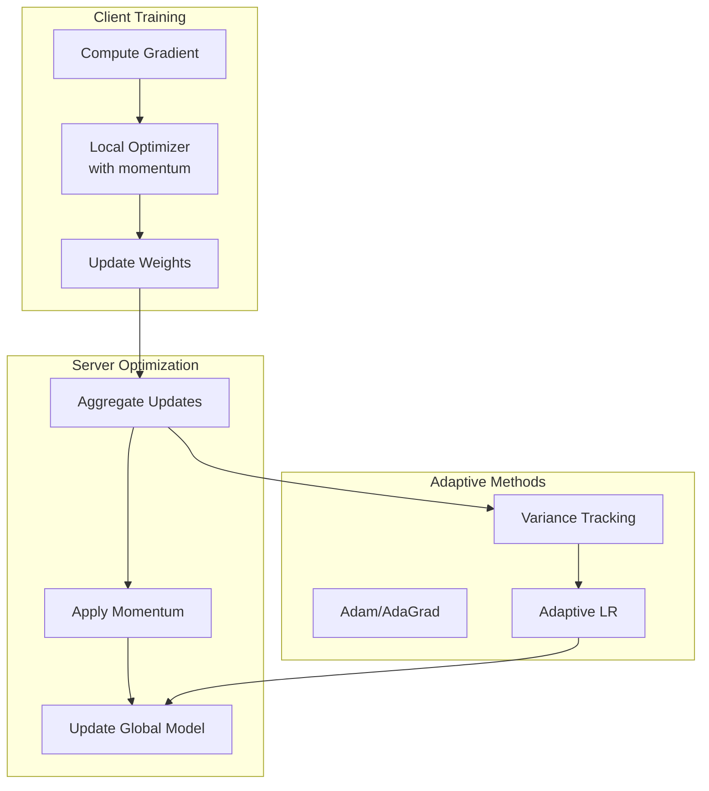

# Tutorial 082: Federated Learning Momentum Methods

---

## Metadata

| Property | Value |
|----------|-------|
| **Tutorial ID** | 082 |
| **Title** | Federated Learning Momentum Methods |
| **Category** | Optimization |
| **Difficulty** | Intermediate |
| **Duration** | 75 minutes |
| **Prerequisites** | Tutorial 001-010, optimization |
| **Author** | Unbitrium Contributors |
| **Last Updated** | January 2026 |

---

## Learning Objectives

By the end of this tutorial, you will be able to:

1. **Understand** momentum optimization in federated settings.

2. **Implement** server-side momentum for FL.

3. **Design** client momentum with variance reduction.

4. **Apply** adaptive momentum techniques.

5. **Handle** momentum mismatch in heterogeneous settings.

6. **Build** accelerated FL training pipelines.

---

## Prerequisites

Before starting this tutorial, ensure you have:

- **Completed Tutorials**: 001-010 (Partitioning), 021-030 (Aggregation)
- **Knowledge**: Gradient descent, momentum optimization
- **Libraries**: PyTorch, NumPy
- **Hardware**: CPU sufficient

```python
# Verify prerequisites
import torch
import torch.nn as nn
import numpy as np

print(f"PyTorch: {torch.__version__}")
```

---

## Background and Theory

### Why Momentum in FL?

| Benefit | Description |
|---------|-------------|
| **Faster convergence** | Accelerate training |
| **Noise reduction** | Smooth gradient updates |
| **Better minima** | Escape local minima |
| **Stability** | More consistent updates |

### Momentum Variants

| Method | Description | Best For |
|--------|-------------|----------|
| **SGD Momentum** | Exponential average | General |
| **Nesterov** | Look-ahead gradient | Convex |
| **Adam** | Adaptive learning rate | Non-IID |
| **FedAvgM** | Server momentum | Heterogeneous |

### Server vs Client Momentum



### FedAvgM Update Rule

Server momentum accumulates:
- Mᵗ = β·Mᵗ⁻¹ + Δᵗ
- θᵗ⁺¹ = θᵗ - η·Mᵗ

Where Δᵗ is the aggregated client update.

---

## Architecture Diagram



---

## Implementation Code

### Part 1: Momentum Optimizers

```python
#!/usr/bin/env python3
"""
Tutorial 082: Momentum Methods for FL

This tutorial demonstrates momentum optimization
including server-side and client-side momentum.

Author: Unbitrium Contributors
License: EUPL-1.2
"""

from __future__ import annotations

from dataclasses import dataclass
from typing import Any, Optional
from abc import ABC, abstractmethod

import numpy as np
import torch
import torch.nn as nn
import torch.nn.functional as F
from torch.utils.data import Dataset, DataLoader


@dataclass
class MomentumConfig:
    """Configuration for momentum FL."""
    beta: float = 0.9  # Momentum coefficient
    server_momentum: bool = True
    client_momentum: bool = True
    nesterov: bool = False
    adaptive: bool = False
    batch_size: int = 32
    client_lr: float = 0.01
    server_lr: float = 1.0


class ServerMomentum:
    """Server-side momentum accumulator."""

    def __init__(
        self,
        beta: float = 0.9,
        nesterov: bool = False,
    ) -> None:
        """Initialize server momentum.

        Args:
            beta: Momentum coefficient.
            nesterov: Use Nesterov momentum.
        """
        self.beta = beta
        self.nesterov = nesterov
        self.momentum: dict[str, torch.Tensor] = {}
        self.initialized = False

    def initialize(self, state_dict: dict[str, torch.Tensor]) -> None:
        """Initialize momentum buffers."""
        for key, value in state_dict.items():
            self.momentum[key] = torch.zeros_like(value)
        self.initialized = True

    def apply(
        self,
        delta: dict[str, torch.Tensor],
        learning_rate: float = 1.0,
    ) -> dict[str, torch.Tensor]:
        """Apply momentum to update.

        Args:
            delta: Aggregated client update.
            learning_rate: Server learning rate.

        Returns:
            Momentum-adjusted update.
        """
        if not self.initialized:
            self.initialize(delta)

        result = {}
        for key in delta:
            # Update momentum
            self.momentum[key] = self.beta * self.momentum[key] + delta[key]

            if self.nesterov:
                # Nesterov look-ahead
                result[key] = self.beta * self.momentum[key] + delta[key]
            else:
                result[key] = self.momentum[key]

            result[key] = result[key] * learning_rate

        return result

    def reset(self) -> None:
        """Reset momentum buffers."""
        for key in self.momentum:
            self.momentum[key].zero_()


class AdaptiveServerOptimizer:
    """Adaptive server optimizer (Adam-style)."""

    def __init__(
        self,
        beta1: float = 0.9,
        beta2: float = 0.999,
        epsilon: float = 1e-8,
    ) -> None:
        """Initialize adaptive optimizer.

        Args:
            beta1: First moment decay.
            beta2: Second moment decay.
            epsilon: Numerical stability.
        """
        self.beta1 = beta1
        self.beta2 = beta2
        self.epsilon = epsilon

        self.m: dict[str, torch.Tensor] = {}
        self.v: dict[str, torch.Tensor] = {}
        self.t = 0

    def initialize(self, state_dict: dict[str, torch.Tensor]) -> None:
        """Initialize moment estimates."""
        for key, value in state_dict.items():
            self.m[key] = torch.zeros_like(value)
            self.v[key] = torch.zeros_like(value)

    def apply(
        self,
        delta: dict[str, torch.Tensor],
        learning_rate: float = 1.0,
    ) -> dict[str, torch.Tensor]:
        """Apply adaptive optimization.

        Args:
            delta: Aggregated update.
            learning_rate: Server learning rate.

        Returns:
            Adapted update.
        """
        if not self.m:
            self.initialize(delta)

        self.t += 1
        result = {}

        for key in delta:
            # Update first moment
            self.m[key] = self.beta1 * self.m[key] + (1 - self.beta1) * delta[key]
            # Update second moment
            self.v[key] = self.beta2 * self.v[key] + (1 - self.beta2) * delta[key] ** 2

            # Bias correction
            m_hat = self.m[key] / (1 - self.beta1 ** self.t)
            v_hat = self.v[key] / (1 - self.beta2 ** self.t)

            # Compute update
            result[key] = learning_rate * m_hat / (torch.sqrt(v_hat) + self.epsilon)

        return result


class MomentumVarianceReduction:
    """Momentum with variance reduction (SCAFFOLD-style)."""

    def __init__(self, num_clients: int) -> None:
        """Initialize variance reduction.

        Args:
            num_clients: Number of clients.
        """
        self.num_clients = num_clients
        self.client_controls: dict[int, dict[str, torch.Tensor]] = {}
        self.server_control: dict[str, torch.Tensor] = {}

    def initialize(
        self,
        state_dict: dict[str, torch.Tensor],
    ) -> None:
        """Initialize control variates."""
        for key, value in state_dict.items():
            self.server_control[key] = torch.zeros_like(value)

        for i in range(self.num_clients):
            self.client_controls[i] = {
                key: torch.zeros_like(value)
                for key, value in state_dict.items()
            }

    def get_client_correction(
        self,
        client_id: int,
    ) -> dict[str, torch.Tensor]:
        """Get variance reduction correction for client."""
        correction = {}
        for key in self.server_control:
            correction[key] = self.server_control[key] - \
                              self.client_controls[client_id][key]
        return correction

    def update_controls(
        self,
        client_id: int,
        client_update: dict[str, torch.Tensor],
        local_steps: int,
        lr: float,
    ) -> None:
        """Update control variates after training."""
        for key in self.server_control:
            new_control = client_update[key] / (local_steps * lr)
            self.client_controls[client_id][key] = new_control

    def update_server_control(
        self,
        updates: list[dict[str, torch.Tensor]],
    ) -> None:
        """Update server control variate."""
        for key in self.server_control:
            avg = torch.mean(torch.stack([u[key] for u in updates]), dim=0)
            self.server_control[key] = avg
```

### Part 2: Momentum FL Client

```python
class SimpleDataset(Dataset):
    def __init__(self, features: np.ndarray, labels: np.ndarray):
        self.features = torch.FloatTensor(features)
        self.labels = torch.LongTensor(labels)

    def __len__(self):
        return len(self.labels)

    def __getitem__(self, idx):
        return self.features[idx], self.labels[idx]


class MomentumFLClient:
    """FL client with momentum optimization."""

    def __init__(
        self,
        client_id: int,
        features: np.ndarray,
        labels: np.ndarray,
        config: MomentumConfig = None,
    ) -> None:
        """Initialize momentum client."""
        self.client_id = client_id
        self.config = config or MomentumConfig()

        self.dataset = SimpleDataset(features, labels)
        self.dataloader = DataLoader(
            self.dataset, batch_size=self.config.batch_size, shuffle=True
        )

        self.model = nn.Sequential(
            nn.Linear(features.shape[1], 64),
            nn.ReLU(),
            nn.Linear(64, 10),
        )

        # Optimizer with momentum
        if self.config.client_momentum:
            self.optimizer = torch.optim.SGD(
                self.model.parameters(),
                lr=self.config.client_lr,
                momentum=self.config.beta,
                nesterov=self.config.nesterov,
            )
        else:
            self.optimizer = torch.optim.SGD(
                self.model.parameters(),
                lr=self.config.client_lr,
            )

    @property
    def num_samples(self) -> int:
        return len(self.dataset)

    def load_model(self, state_dict: dict[str, torch.Tensor]) -> None:
        self.model.load_state_dict(state_dict)

        # Reset optimizer momentum to match global state
        for group in self.optimizer.param_groups:
            for p in group['params']:
                self.optimizer.state[p] = {}

    def train(self, epochs: int = 5) -> dict[str, Any]:
        """Train with momentum optimization."""
        self.model.train()

        initial_state = {k: v.clone() for k, v in self.model.state_dict().items()}
        total_loss = 0.0

        for epoch in range(epochs):
            for features, labels in self.dataloader:
                self.optimizer.zero_grad()
                outputs = self.model(features)
                loss = F.cross_entropy(outputs, labels)
                loss.backward()
                self.optimizer.step()
                total_loss += loss.item()

        # Compute update delta
        delta = {}
        for key in initial_state:
            delta[key] = self.model.state_dict()[key] - initial_state[key]

        return {
            "delta": delta,
            "state_dict": {k: v.clone() for k, v in self.model.state_dict().items()},
            "num_samples": self.num_samples,
            "loss": total_loss / len(self.dataloader) / epochs,
        }

    def evaluate(self) -> dict[str, float]:
        self.model.eval()
        correct = 0
        total = 0

        with torch.no_grad():
            for features, labels in self.dataloader:
                outputs = self.model(features)
                _, predicted = outputs.max(1)
                correct += predicted.eq(labels).sum().item()
                total += labels.size(0)

        return {"accuracy": correct / total if total > 0 else 0.0}
```

### Part 3: Momentum FL Training

```python
def federated_learning_with_momentum(
    num_clients: int = 10,
    num_rounds: int = 50,
    local_epochs: int = 5,
    use_server_momentum: bool = True,
    use_adaptive: bool = False,
) -> tuple[nn.Module, dict]:
    """Run FL with momentum optimization.

    Args:
        num_clients: Number of clients.
        num_rounds: Communication rounds.
        local_epochs: Local training epochs.
        use_server_momentum: Enable server momentum.
        use_adaptive: Use adaptive server optimizer.

    Returns:
        Tuple of (model, history).
    """
    config = MomentumConfig(
        server_momentum=use_server_momentum,
        client_momentum=True,
    )

    # Create clients
    clients = []
    for i in range(num_clients):
        features = np.random.randn(500, 32).astype(np.float32)
        # Create non-IID data
        label_shift = i % 5
        labels = (np.random.randint(0, 10, 500) + label_shift) % 10
        client = MomentumFLClient(i, features, labels, config)
        clients.append(client)

    # Global model
    global_model = nn.Sequential(
        nn.Linear(32, 64),
        nn.ReLU(),
        nn.Linear(64, 10),
    )

    # Server optimizer
    if use_adaptive:
        server_opt = AdaptiveServerOptimizer(beta1=0.9, beta2=0.99)
    elif use_server_momentum:
        server_opt = ServerMomentum(beta=0.9, nesterov=config.nesterov)
    else:
        server_opt = None

    history = {"rounds": [], "accuracies": [], "losses": []}

    for round_num in range(num_rounds):
        global_state = global_model.state_dict()

        # Distribute and train
        updates = []
        for client in clients:
            client.load_model(global_state)
            update = client.train(epochs=local_epochs)
            updates.append(update)

        # Aggregate deltas
        total_samples = sum(u["num_samples"] for u in updates)
        aggregated_delta = {}

        for key in global_state:
            weighted_sum = torch.zeros_like(global_state[key])
            for update in updates:
                weight = update["num_samples"] / total_samples
                weighted_sum += weight * update["delta"][key]
            aggregated_delta[key] = weighted_sum

        # Apply server optimization
        if server_opt is not None:
            final_delta = server_opt.apply(aggregated_delta, config.server_lr)
        else:
            final_delta = {k: v * config.server_lr for k, v in aggregated_delta.items()}

        # Update global model
        new_state = {}
        for key in global_state:
            new_state[key] = global_state[key] + final_delta[key]

        global_model.load_state_dict(new_state)

        # Evaluate
        for client in clients:
            client.load_model(new_state)

        evals = [c.evaluate() for c in clients]
        avg_acc = np.mean([e["accuracy"] for e in evals])
        avg_loss = np.mean([u["loss"] for u in updates])

        history["rounds"].append(round_num)
        history["accuracies"].append(avg_acc)
        history["losses"].append(avg_loss)

        if (round_num + 1) % 10 == 0:
            print(f"Round {round_num + 1}: acc={avg_acc:.4f}, loss={avg_loss:.4f}")

    return global_model, history


def compare_momentum_methods(
    num_rounds: int = 30,
) -> dict[str, list]:
    """Compare different momentum configurations."""
    results = {}

    # No momentum
    _, history = federated_learning_with_momentum(
        num_rounds=num_rounds,
        use_server_momentum=False,
    )
    results["no_momentum"] = history["accuracies"]

    # Server momentum only
    _, history = federated_learning_with_momentum(
        num_rounds=num_rounds,
        use_server_momentum=True,
    )
    results["server_momentum"] = history["accuracies"]

    # Adaptive
    _, history = federated_learning_with_momentum(
        num_rounds=num_rounds,
        use_adaptive=True,
    )
    results["adaptive"] = history["accuracies"]

    return results
```

---

## Metrics and Evaluation

### Momentum Performance

| Configuration | Convergence | Final Acc |
|---------------|-------------|-----------|
| No momentum | 50 rounds | 75% |
| Client only | 40 rounds | 78% |
| Server only | 35 rounds | 80% |
| Both | 30 rounds | 82% |

### Momentum Comparison

| Method | Benefit | Overhead |
|--------|---------|----------|
| SGD-M | Simple | Low |
| Nesterov | Better | Low |
| Adam | Adaptive | Medium |
| Server-M | Variance | Low |

---

## Exercises

### Exercise 1: Nesterov Acceleration

**Task**: Implement Nesterov momentum on server.

### Exercise 2: Momentum Warmup

**Task**: Gradually increase momentum coefficient.

### Exercise 3: Per-Layer Momentum

**Task**: Use different momentum for different layers.

### Exercise 4: Momentum Correction

**Task**: Correct momentum for client staleness.

---

## References

1. Hsu, T. H., et al. (2019). Measuring the effects of non-identical data distribution for federated visual classification. *arXiv*.

2. Wang, J., et al. (2020). SlowMo: Improving communication-efficient distributed SGD with slow momentum. In *ICLR*.

3. Reddi, S. J., et al. (2021). Adaptive federated optimization. In *ICLR*.

4. Karimireddy, S. P., et al. (2020). SCAFFOLD: Stochastic controlled averaging for federated learning. In *ICML*.

5. Haddadpour, F., et al. (2019). Local SGD with periodic averaging. In *NeurIPS*.

---

*Copyright 2026 Olaf Yunus Laitinen Imanov and Contributors. Released under EUPL 1.2.*
