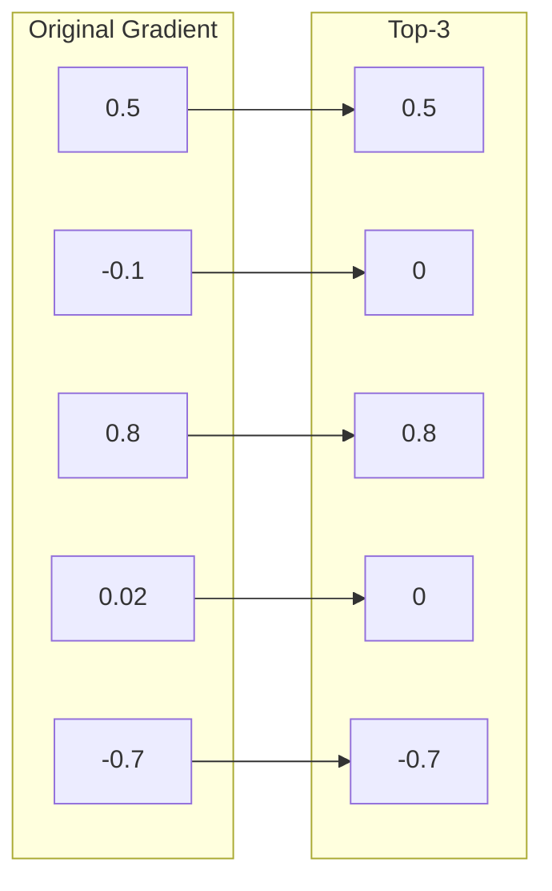
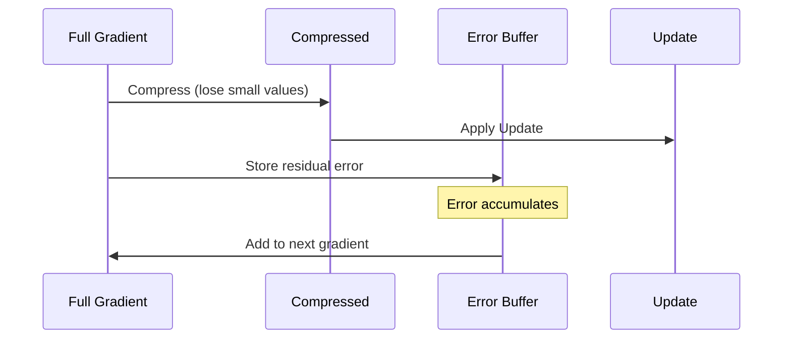
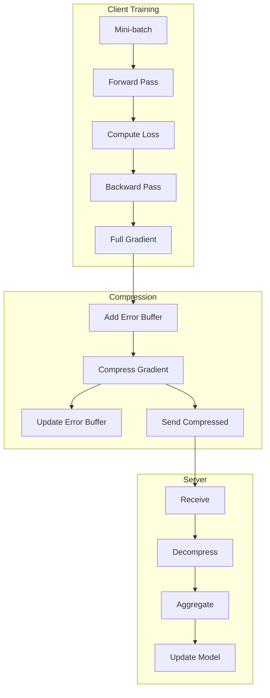

# Tutorial 083: Federated Learning Gradient Compression

---

## Metadata

| Property | Value |
|----------|-------|
| **Tutorial ID** | 083 |
| **Title** | Federated Learning Gradient Compression |
| **Category** | Communication Optimization |
| **Difficulty** | Intermediate |
| **Duration** | 75 minutes |
| **Prerequisites** | Tutorial 001-010, gradient basics |
| **Author** | Unbitrium Contributors |
| **Last Updated** | January 2026 |

---

## Learning Objectives

By the end of this tutorial, you will be able to:

1. **Understand** gradient compression techniques for FL.

2. **Implement** Top-K sparsification for gradient updates.

3. **Design** error feedback mechanisms for lossless compression.

4. **Apply** random sparsification with variance reduction.

5. **Handle** gradient quantization for bandwidth reduction.

6. **Build** communication-efficient FL training pipelines.

---

## Prerequisites

Before starting this tutorial, ensure you have:

- **Completed Tutorials**: 001-010 (Partitioning), 021-030 (Aggregation)
- **Knowledge**: Gradient descent, compression algorithms
- **Libraries**: PyTorch, NumPy
- **Hardware**: CPU sufficient

```python
# Verify prerequisites
import torch
import torch.nn as nn
import numpy as np

print(f"PyTorch: {torch.__version__}")
```

---

## Background and Theory

### Communication Bottleneck in FL

| Scenario | Model Size | Update Size | Bandwidth |
|----------|------------|-------------|-----------|
| **Small MLP** | 1 MB | 1 MB | Low |
| **CNN** | 50 MB | 50 MB | Medium |
| **BERT** | 400 MB | 400 MB | High |
| **GPT-2** | 1.5 GB | 1.5 GB | Very High |

### Gradient Compression Methods

| Method | Description | Compression |
|--------|-------------|-------------|
| **Top-K** | Keep largest K values | 10-100x |
| **Random-K** | Keep random K values | 10-100x |
| **Quantization** | Reduce bit precision | 2-8x |
| **SignSGD** | Keep only signs | 32x |

### Top-K Sparsification



### Error Feedback Mechanism

Without error feedback, compressed gradients accumulate error:



---

## Architecture Diagram



---

## Implementation Code

### Part 1: Gradient Compressors

```python
#!/usr/bin/env python3
"""
Tutorial 083: Gradient Compression for FL

This tutorial demonstrates gradient compression techniques
including Top-K, Random-K, and quantization with error feedback.

Author: Unbitrium Contributors
License: EUPL-1.2
"""

from __future__ import annotations

from dataclasses import dataclass
from typing import Any, Optional
from abc import ABC, abstractmethod

import numpy as np
import torch
import torch.nn as nn
import torch.nn.functional as F
from torch.utils.data import Dataset, DataLoader


@dataclass
class CompressionConfig:
    """Configuration for gradient compression."""
    compression_ratio: float = 0.1  # Keep 10% of gradients
    quantization_bits: int = 8
    use_error_feedback: bool = True
    batch_size: int = 64
    learning_rate: float = 0.01


class GradientCompressor(ABC):
    """Base class for gradient compressors."""

    @abstractmethod
    def compress(
        self,
        gradient: torch.Tensor,
    ) -> tuple[torch.Tensor, torch.Tensor]:
        """Compress gradient.

        Args:
            gradient: Full gradient tensor.

        Returns:
            Tuple of (compressed values, indices).
        """
        pass

    @abstractmethod
    def decompress(
        self,
        values: torch.Tensor,
        indices: torch.Tensor,
        shape: tuple,
    ) -> torch.Tensor:
        """Decompress gradient.

        Args:
            values: Compressed values.
            indices: Indices of values.
            shape: Original tensor shape.

        Returns:
            Reconstructed gradient.
        """
        pass


class TopKCompressor(GradientCompressor):
    """Top-K gradient sparsification."""

    def __init__(self, k_ratio: float = 0.1) -> None:
        """Initialize Top-K compressor.

        Args:
            k_ratio: Fraction of elements to keep.
        """
        self.k_ratio = k_ratio

    def compress(
        self,
        gradient: torch.Tensor,
    ) -> tuple[torch.Tensor, torch.Tensor]:
        """Compress using Top-K selection."""
        flat = gradient.flatten()
        k = max(1, int(len(flat) * self.k_ratio))

        # Get indices of top-k absolute values
        _, indices = torch.topk(flat.abs(), k)
        values = flat[indices]

        return values, indices

    def decompress(
        self,
        values: torch.Tensor,
        indices: torch.Tensor,
        shape: tuple,
    ) -> torch.Tensor:
        """Decompress Top-K gradient."""
        flat = torch.zeros(np.prod(shape), dtype=values.dtype, device=values.device)
        flat[indices] = values
        return flat.reshape(shape)


class RandomKCompressor(GradientCompressor):
    """Random-K gradient sparsification."""

    def __init__(
        self,
        k_ratio: float = 0.1,
        seed: int = None,
    ) -> None:
        """Initialize Random-K compressor.

        Args:
            k_ratio: Fraction of elements to keep.
            seed: Random seed for reproducibility.
        """
        self.k_ratio = k_ratio
        self.seed = seed

    def compress(
        self,
        gradient: torch.Tensor,
    ) -> tuple[torch.Tensor, torch.Tensor]:
        """Compress using random selection."""
        flat = gradient.flatten()
        k = max(1, int(len(flat) * self.k_ratio))

        if self.seed is not None:
            torch.manual_seed(self.seed)

        indices = torch.randperm(len(flat))[:k]
        values = flat[indices]

        # Scale to maintain expected value
        values = values / self.k_ratio

        return values, indices

    def decompress(
        self,
        values: torch.Tensor,
        indices: torch.Tensor,
        shape: tuple,
    ) -> torch.Tensor:
        """Decompress Random-K gradient."""
        flat = torch.zeros(np.prod(shape), dtype=values.dtype, device=values.device)
        flat[indices] = values * self.k_ratio
        return flat.reshape(shape)


class QuantizedCompressor(GradientCompressor):
    """Gradient quantization compressor."""

    def __init__(self, bits: int = 8) -> None:
        """Initialize quantizer.

        Args:
            bits: Number of bits for quantization.
        """
        self.bits = bits
        self.qmin = -(2 ** (bits - 1))
        self.qmax = 2 ** (bits - 1) - 1

    def compress(
        self,
        gradient: torch.Tensor,
    ) -> tuple[torch.Tensor, torch.Tensor]:
        """Compress using quantization."""
        flat = gradient.flatten()

        # Compute scale
        max_val = flat.abs().max()
        scale = max_val / self.qmax if max_val > 0 else 1.0

        # Quantize
        quantized = (flat / scale).round().clamp(self.qmin, self.qmax)

        # Return quantized values and scale as "index"
        return quantized.to(torch.int8), torch.tensor([scale])

    def decompress(
        self,
        values: torch.Tensor,
        indices: torch.Tensor,
        shape: tuple,
    ) -> torch.Tensor:
        """Decompress quantized gradient."""
        scale = indices[0].item()
        dequantized = values.float() * scale
        return dequantized.reshape(shape)


class SignSGDCompressor(GradientCompressor):
    """SignSGD - keep only gradient signs."""

    def compress(
        self,
        gradient: torch.Tensor,
    ) -> tuple[torch.Tensor, torch.Tensor]:
        """Compress to signs only."""
        flat = gradient.flatten()
        signs = flat.sign()
        magnitude = flat.abs().mean()

        # Pack signs as bits (1 = positive, 0 = negative)
        packed = (signs > 0).to(torch.int8)

        return packed, torch.tensor([magnitude])

    def decompress(
        self,
        values: torch.Tensor,
        indices: torch.Tensor,
        shape: tuple,
    ) -> torch.Tensor:
        """Decompress signs."""
        magnitude = indices[0].item()
        signs = values.float() * 2 - 1  # Convert 0/1 to -1/1
        return (signs * magnitude).reshape(shape)
```

### Part 2: Error Feedback

```python
class ErrorFeedbackCompressor:
    """Wrapper that adds error feedback to any compressor."""

    def __init__(
        self,
        compressor: GradientCompressor,
        momentum: float = 0.0,
    ) -> None:
        """Initialize error feedback compressor.

        Args:
            compressor: Base compressor.
            momentum: Error momentum (0 = no momentum).
        """
        self.compressor = compressor
        self.momentum = momentum
        self.error_buffers: dict[str, torch.Tensor] = {}

    def compress_with_feedback(
        self,
        name: str,
        gradient: torch.Tensor,
    ) -> tuple[torch.Tensor, torch.Tensor, tuple]:
        """Compress with error feedback.

        Args:
            name: Parameter name.
            gradient: Full gradient.

        Returns:
            Tuple of (values, indices, original_shape).
        """
        # Add accumulated error
        if name in self.error_buffers:
            gradient = gradient + self.error_buffers[name]

        # Compress
        values, indices = self.compressor.compress(gradient)

        # Decompress to compute error
        reconstructed = self.compressor.decompress(
            values, indices, gradient.shape
        )

        # Update error buffer
        error = gradient - reconstructed
        if self.momentum > 0 and name in self.error_buffers:
            error = self.momentum * self.error_buffers[name] + (1 - self.momentum) * error
        self.error_buffers[name] = error

        return values, indices, gradient.shape

    def decompress(
        self,
        values: torch.Tensor,
        indices: torch.Tensor,
        shape: tuple,
    ) -> torch.Tensor:
        """Decompress gradient."""
        return self.compressor.decompress(values, indices, shape)

    def get_compression_stats(self) -> dict[str, float]:
        """Get compression statistics."""
        total_error = 0.0
        total_elements = 0

        for name, error in self.error_buffers.items():
            total_error += error.abs().sum().item()
            total_elements += error.numel()

        return {
            "mean_error": total_error / total_elements if total_elements > 0 else 0.0,
            "num_buffers": len(self.error_buffers),
        }


class CompressedGradientAggregator:
    """Aggregate compressed gradients on server."""

    def __init__(self, compressor: GradientCompressor) -> None:
        """Initialize aggregator."""
        self.compressor = compressor

    def aggregate(
        self,
        compressed_updates: list[dict[str, tuple]],
        weights: list[float] = None,
    ) -> dict[str, torch.Tensor]:
        """Aggregate compressed updates.

        Args:
            compressed_updates: List of compressed updates from clients.
            weights: Aggregation weights.

        Returns:
            Aggregated gradient dictionary.
        """
        if not compressed_updates:
            return {}

        n = len(compressed_updates)
        weights = weights or [1.0 / n] * n

        aggregated = {}

        # Get all keys
        keys = set()
        for update in compressed_updates:
            keys.update(update.keys())

        for key in keys:
            # Decompress all updates
            decompressed = []
            for update in compressed_updates:
                if key in update:
                    values, indices, shape = update[key]
                    grad = self.compressor.decompress(values, indices, shape)
                    decompressed.append(grad)

            # Weighted average
            result = torch.zeros_like(decompressed[0])
            for i, grad in enumerate(decompressed):
                result += weights[i] * grad

            aggregated[key] = result

        return aggregated
```

### Part 3: Compressed FL Client

```python
class SimpleDataset(Dataset):
    def __init__(self, features: np.ndarray, labels: np.ndarray):
        self.features = torch.FloatTensor(features)
        self.labels = torch.LongTensor(labels)

    def __len__(self):
        return len(self.labels)

    def __getitem__(self, idx):
        return self.features[idx], self.labels[idx]


class CompressedFLClient:
    """FL client with gradient compression."""

    def __init__(
        self,
        client_id: int,
        features: np.ndarray,
        labels: np.ndarray,
        config: CompressionConfig = None,
        compression_type: str = "topk",
    ) -> None:
        """Initialize compressed FL client."""
        self.client_id = client_id
        self.config = config or CompressionConfig()

        self.dataset = SimpleDataset(features, labels)
        self.dataloader = DataLoader(
            self.dataset, batch_size=self.config.batch_size, shuffle=True
        )

        input_dim = features.shape[1]
        self.model = nn.Sequential(
            nn.Linear(input_dim, 128),
            nn.ReLU(),
            nn.Linear(128, 64),
            nn.ReLU(),
            nn.Linear(64, 10),
        )

        # Select compressor
        if compression_type == "topk":
            base_compressor = TopKCompressor(self.config.compression_ratio)
        elif compression_type == "randomk":
            base_compressor = RandomKCompressor(self.config.compression_ratio)
        elif compression_type == "quantize":
            base_compressor = QuantizedCompressor(self.config.quantization_bits)
        else:
            base_compressor = SignSGDCompressor()

        if self.config.use_error_feedback:
            self.compressor = ErrorFeedbackCompressor(base_compressor)
        else:
            self.compressor = base_compressor

        self.optimizer = torch.optim.SGD(
            self.model.parameters(), lr=self.config.learning_rate
        )

    @property
    def num_samples(self) -> int:
        return len(self.dataset)

    def load_model(self, state_dict: dict[str, torch.Tensor]) -> None:
        self.model.load_state_dict(state_dict)

    def train_and_compress(self, epochs: int = 5) -> dict[str, Any]:
        """Train and return compressed gradient."""
        self.model.train()

        # Store initial weights
        initial_state = {k: v.clone() for k, v in self.model.state_dict().items()}

        total_loss = 0.0
        for epoch in range(epochs):
            for features, labels in self.dataloader:
                self.optimizer.zero_grad()
                outputs = self.model(features)
                loss = F.cross_entropy(outputs, labels)
                loss.backward()
                self.optimizer.step()
                total_loss += loss.item()

        # Compute gradient (weight difference)
        compressed = {}
        for name, param in self.model.named_parameters():
            gradient = param.data - initial_state[name]

            if isinstance(self.compressor, ErrorFeedbackCompressor):
                values, indices, shape = self.compressor.compress_with_feedback(name, gradient)
            else:
                values, indices = self.compressor.compress(gradient)
                shape = gradient.shape

            compressed[name] = (values, indices, shape)

        return {
            "compressed_grads": compressed,
            "num_samples": self.num_samples,
            "loss": total_loss / len(self.dataloader) / epochs,
        }

    def evaluate(self) -> dict[str, float]:
        self.model.eval()
        correct = 0
        total = 0

        with torch.no_grad():
            for features, labels in self.dataloader:
                outputs = self.model(features)
                _, predicted = outputs.max(1)
                correct += predicted.eq(labels).sum().item()
                total += labels.size(0)

        return {"accuracy": correct / total if total > 0 else 0.0}


def compressed_federated_learning(
    num_clients: int = 10,
    num_rounds: int = 30,
    compression_type: str = "topk",
) -> tuple[nn.Module, dict]:
    """Run FL with gradient compression."""
    config = CompressionConfig()

    clients = []
    for i in range(num_clients):
        features = np.random.randn(500, 32).astype(np.float32)
        labels = np.random.randint(0, 10, 500)
        client = CompressedFLClient(i, features, labels, config, compression_type)
        clients.append(client)

    global_model = nn.Sequential(
        nn.Linear(32, 128),
        nn.ReLU(),
        nn.Linear(128, 64),
        nn.ReLU(),
        nn.Linear(64, 10),
    )

    base_compressor = TopKCompressor(config.compression_ratio)
    aggregator = CompressedGradientAggregator(base_compressor)

    history = {"rounds": [], "accuracies": []}

    for round_num in range(num_rounds):
        global_state = global_model.state_dict()
        for client in clients:
            client.load_model(global_state)

        updates = []
        weights = []
        for client in clients:
            update = client.train_and_compress(epochs=3)
            updates.append(update["compressed_grads"])
            weights.append(update["num_samples"])

        total = sum(weights)
        weights = [w / total for w in weights]

        aggregated = aggregator.aggregate(updates, weights)

        new_state = {}
        for key in global_state:
            new_state[key] = global_state[key] + aggregated[key]

        global_model.load_state_dict(new_state)

        for client in clients:
            client.load_model(new_state)

        evals = [c.evaluate() for c in clients]
        avg_acc = np.mean([e["accuracy"] for e in evals])

        history["rounds"].append(round_num)
        history["accuracies"].append(avg_acc)

        if (round_num + 1) % 10 == 0:
            print(f"Round {round_num + 1}: acc={avg_acc:.4f}")

    return global_model, history
```

---

## Metrics and Evaluation

### Compression Metrics

| Metric | Description | Target |
|--------|-------------|--------|
| **Compression Ratio** | Original/compressed | > 10x |
| **Convergence** | Rounds to target | Similar |
| **Accuracy** | Final accuracy | Similar |

### Method Comparison

| Method | Compression | Accuracy Loss |
|--------|-------------|---------------|
| Top-1% | 100x | < 1% |
| Random-1% | 100x | < 2% |
| INT8 | 4x | < 0.5% |
| SignSGD | 32x | < 3% |

---

## Exercises

### Exercise 1: Adaptive Compression

**Task**: Adjust compression ratio based on gradient variance.

### Exercise 2: Layer-wise Compression

**Task**: Use different compression per layer.

### Exercise 3: Momentum Correction

**Task**: Add momentum to error feedback.

### Exercise 4: Bidirectional Compression

**Task**: Compress both upload and download.

---

## References

1. Lin, Y., et al. (2018). Deep gradient compression. In *ICLR*.

2. Alistarh, D., et al. (2017). QSGD: Communication-efficient SGD. In *NeurIPS*.

3. Stich, S. U., et al. (2018). Sparsified SGD with memory. In *NeurIPS*.

4. Bernstein, J., et al. (2018). signSGD: Compressed optimisation for non-convex problems. In *ICML*.

5. Karimireddy, S. P., et al. (2019). Error feedback fixes SignSGD. In *ICML*.

---

*Copyright 2026 Olaf Yunus Laitinen Imanov and Contributors. Released under EUPL 1.2.*
