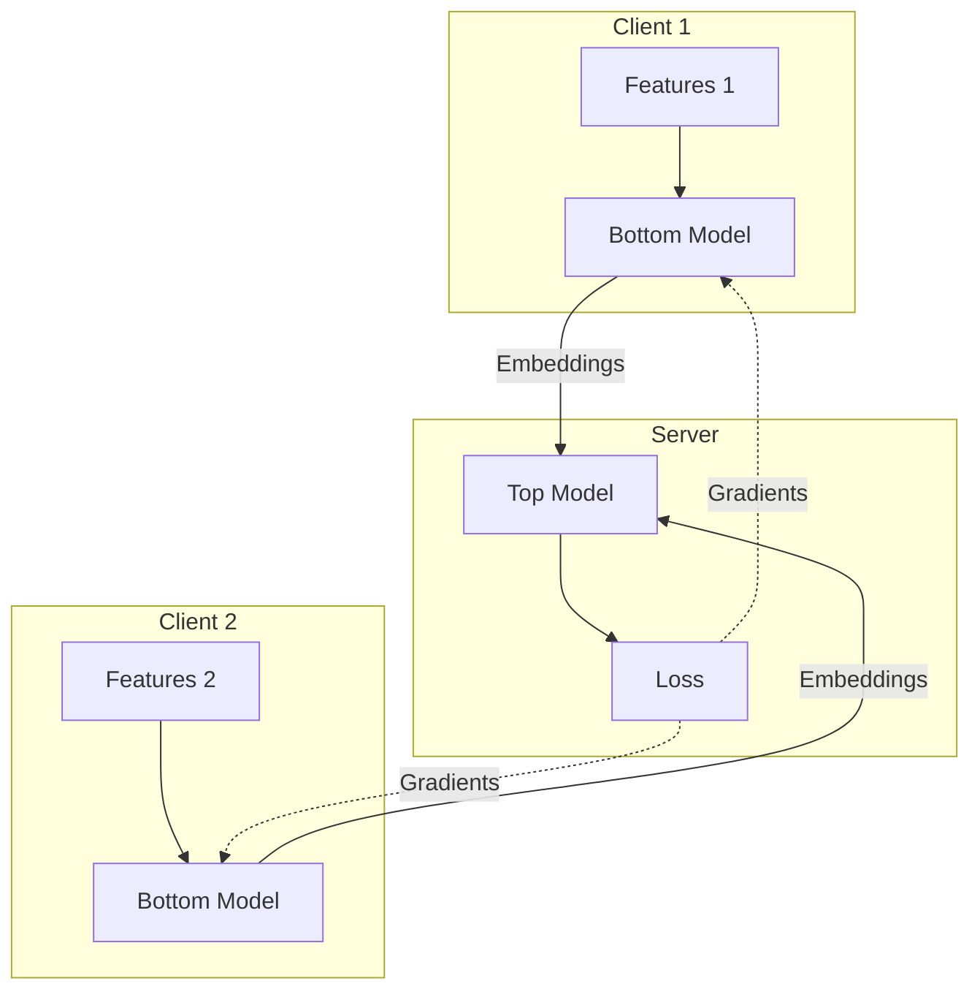

# Tutorial 083: Vertical Federated Learning Simulation

This tutorial covers simulating Vertical FL (VFL), where clients hold different features for the same users.

## Background and Notation

- **Parties**: $M$ active parties (hold features $X_m$) and 1 guest party (holds labels $Y$).
- **Alignment**: Assuming private set intersection (PSI) is already performed.
- **Split Learning**: Intermediate activations are exchanged.

## Configuration File

```yaml
experiment:
  name: "vfl_census_income"

data:
  split_type: "vertical"
  feature_partitions: [10, 20, 15] # Features per client

training:
  type: "split_nn"
  cut_layer_size: 64
```

## Minimal Runnable Code Example

```python
import torch

class ClientModel(torch.nn.Module):
    def __init__(self, input_dim):
        super().__init__()
        self.fc = torch.nn.Linear(input_dim, 32)

    def forward(self, x):
        return torch.relu(self.fc(x))

class ServerModel(torch.nn.Module):
    def __init__(self, input_dims):
        super().__init__()
        self.fc = torch.nn.Linear(32 * len(input_dims), 1)

    def forward(self, embeddings):
        cat = torch.cat(embeddings, dim=1)
        return torch.sigmoid(self.fc(cat))

# Forward pass simulation
embeddings = []
for client_mod, data in zip(clients, client_data):
    embeddings.append(client_mod(data))

# Embeddings sent to server (gradients returned)
output = server(embeddings)
loss = criterion(output, labels)
loss.backward()
```

## VFL Data Flow



## Exercises

1. What are the privacy leakage risks of embedding exchange?
2. Implement Marvell/norm-based attack defenses on the gradients.
3. Compare communication cost of VFL vs HFL for wide datasets.
