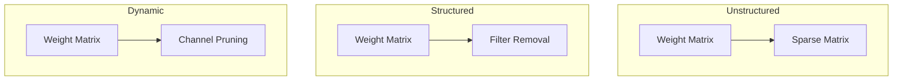
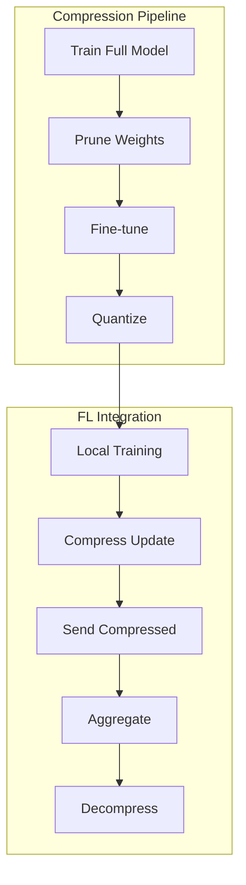

# Tutorial 084: Federated Learning Model Compression

---

## Metadata

| Property | Value |
|----------|-------|
| **Tutorial ID** | 084 |
| **Title** | Federated Learning Model Compression |
| **Category** | Optimization |
| **Difficulty** | Intermediate |
| **Duration** | 75 minutes |
| **Prerequisites** | Tutorial 001-010, model compression |
| **Author** | Unbitrium Contributors |
| **Last Updated** | January 2026 |

---

## Learning Objectives

By the end of this tutorial, you will be able to:

1. **Understand** model compression techniques for federated learning.

2. **Implement** weight pruning for smaller FL models.

3. **Design** quantization-aware training pipelines.

4. **Apply** knowledge distillation in federated settings.

5. **Handle** structured vs unstructured pruning trade-offs.

6. **Build** communication-efficient FL with compressed models.

---

## Prerequisites

Before starting this tutorial, ensure you have:

- **Completed Tutorials**: 001-010 (Partitioning), 021-030 (Aggregation)
- **Knowledge**: Neural network pruning, quantization basics
- **Libraries**: PyTorch, NumPy
- **Hardware**: CPU sufficient

```python
# Verify prerequisites
import torch
import torch.nn as nn
import numpy as np

print(f"PyTorch: {torch.__version__}")
```

---

## Background and Theory

### Why Compress FL Models?

| Benefit | Description | Impact |
|---------|-------------|--------|
| **Communication** | Smaller model updates | 10-100x reduction |
| **Memory** | Fit on edge devices | Enable more clients |
| **Latency** | Faster inference | Better UX |
| **Energy** | Less computation | Battery savings |

### Compression Techniques

| Technique | Description | Compression |
|-----------|-------------|-------------|
| **Pruning** | Remove weights | 2-10x |
| **Quantization** | Reduce precision | 2-8x |
| **Distillation** | Train small model | 5-20x |
| **Low-rank** | Matrix factorization | 2-5x |

### Pruning Strategies



### Quantization Levels

| Level | Bits | Size | Accuracy |
|-------|------|------|----------|
| **FP32** | 32 | 100% | Baseline |
| **FP16** | 16 | 50% | ~Same |
| **INT8** | 8 | 25% | -1% |
| **INT4** | 4 | 12.5% | -3% |

---

## Architecture Diagram



---

## Implementation Code

### Part 1: Weight Pruning

```python
#!/usr/bin/env python3
"""
Tutorial 084: Model Compression for FL

This tutorial demonstrates pruning, quantization, and
distillation for communication-efficient federated learning.

Author: Unbitrium Contributors
License: EUPL-1.2
"""

from __future__ import annotations

from dataclasses import dataclass
from typing import Any, Optional, Callable
import copy

import numpy as np
import torch
import torch.nn as nn
import torch.nn.functional as F
from torch.utils.data import Dataset, DataLoader


@dataclass
class CompressionConfig:
    """Configuration for model compression."""
    pruning_ratio: float = 0.5
    quantization_bits: int = 8
    distillation_temp: float = 4.0
    distillation_alpha: float = 0.5
    batch_size: int = 64
    learning_rate: float = 0.01


class MagnitudePruner:
    """Magnitude-based weight pruning."""

    def __init__(
        self,
        pruning_ratio: float = 0.5,
        structured: bool = False,
    ) -> None:
        """Initialize pruner.

        Args:
            pruning_ratio: Fraction of weights to prune.
            structured: Whether to use structured pruning.
        """
        self.pruning_ratio = pruning_ratio
        self.structured = structured
        self.masks: dict[str, torch.Tensor] = {}

    def compute_masks(self, model: nn.Module) -> dict[str, torch.Tensor]:
        """Compute pruning masks based on weight magnitude.

        Args:
            model: Neural network model.

        Returns:
            Dictionary of pruning masks.
        """
        masks = {}

        if self.structured:
            # Filter-wise pruning for conv layers
            for name, module in model.named_modules():
                if isinstance(module, nn.Conv2d):
                    weight = module.weight.data
                    # Compute filter importance
                    importance = weight.abs().mean(dim=(1, 2, 3))
                    threshold = torch.quantile(importance, self.pruning_ratio)
                    mask = (importance > threshold).float()
                    # Expand mask to weight shape
                    masks[name] = mask.view(-1, 1, 1, 1).expand_as(weight)

                elif isinstance(module, nn.Linear):
                    weight = module.weight.data
                    importance = weight.abs().mean(dim=1)
                    threshold = torch.quantile(importance, self.pruning_ratio)
                    mask = (importance > threshold).float()
                    masks[name] = mask.unsqueeze(1).expand_as(weight)
        else:
            # Unstructured pruning
            all_weights = []
            for name, param in model.named_parameters():
                if 'weight' in name and param.dim() > 1:
                    all_weights.append(param.data.abs().flatten())

            all_weights = torch.cat(all_weights)
            threshold = torch.quantile(all_weights, self.pruning_ratio)

            for name, param in model.named_parameters():
                if 'weight' in name and param.dim() > 1:
                    masks[name] = (param.data.abs() > threshold).float()

        self.masks = masks
        return masks

    def apply_masks(self, model: nn.Module) -> None:
        """Apply pruning masks to model weights."""
        for name, param in model.named_parameters():
            if name in self.masks:
                param.data.mul_(self.masks[name])

    def get_sparsity(self, model: nn.Module) -> float:
        """Calculate actual sparsity ratio."""
        total_params = 0
        zero_params = 0

        for name, param in model.named_parameters():
            if 'weight' in name:
                total_params += param.numel()
                zero_params += (param == 0).sum().item()

        return zero_params / total_params if total_params > 0 else 0.0


class GradualPruner:
    """Gradual magnitude pruning during training."""

    def __init__(
        self,
        initial_sparsity: float = 0.0,
        final_sparsity: float = 0.9,
        num_steps: int = 100,
    ) -> None:
        """Initialize gradual pruner.

        Args:
            initial_sparsity: Starting sparsity.
            final_sparsity: Target sparsity.
            num_steps: Steps to reach final sparsity.
        """
        self.initial_sparsity = initial_sparsity
        self.final_sparsity = final_sparsity
        self.num_steps = num_steps
        self.current_step = 0

    def get_current_sparsity(self) -> float:
        """Get current target sparsity."""
        if self.current_step >= self.num_steps:
            return self.final_sparsity

        # Cubic schedule
        progress = self.current_step / self.num_steps
        sparsity = self.final_sparsity + \
            (self.initial_sparsity - self.final_sparsity) * \
            (1 - progress) ** 3

        return sparsity

    def step(self, model: nn.Module) -> None:
        """Perform one pruning step."""
        sparsity = self.get_current_sparsity()
        pruner = MagnitudePruner(pruning_ratio=sparsity)
        pruner.compute_masks(model)
        pruner.apply_masks(model)
        self.current_step += 1
```

### Part 2: Quantization

```python
class WeightQuantizer:
    """Quantize model weights to lower precision."""

    def __init__(
        self,
        bits: int = 8,
        symmetric: bool = True,
    ) -> None:
        """Initialize quantizer.

        Args:
            bits: Number of bits for quantization.
            symmetric: Use symmetric quantization.
        """
        self.bits = bits
        self.symmetric = symmetric
        self.scales: dict[str, float] = {}
        self.zero_points: dict[str, float] = {}

    def quantize(
        self,
        state_dict: dict[str, torch.Tensor],
    ) -> dict[str, torch.Tensor]:
        """Quantize model weights.

        Args:
            state_dict: Model state dictionary.

        Returns:
            Quantized state dictionary.
        """
        quantized = {}
        qmin = 0
        qmax = 2 ** self.bits - 1

        for name, tensor in state_dict.items():
            if tensor.dtype != torch.float32:
                quantized[name] = tensor
                continue

            if self.symmetric:
                abs_max = tensor.abs().max().item()
                scale = abs_max / (qmax / 2)
                zero_point = qmax // 2
            else:
                min_val = tensor.min().item()
                max_val = tensor.max().item()
                scale = (max_val - min_val) / qmax
                zero_point = -min_val / scale if scale != 0 else 0

            self.scales[name] = scale
            self.zero_points[name] = zero_point

            # Quantize
            if scale != 0:
                q = ((tensor / scale) + zero_point).round().clamp(qmin, qmax)
            else:
                q = torch.zeros_like(tensor)

            quantized[name] = q.to(torch.int8 if self.bits <= 8 else torch.int16)

        return quantized

    def dequantize(
        self,
        quantized: dict[str, torch.Tensor],
    ) -> dict[str, torch.Tensor]:
        """Dequantize model weights."""
        dequantized = {}

        for name, tensor in quantized.items():
            if name in self.scales:
                scale = self.scales[name]
                zero_point = self.zero_points[name]
                dequantized[name] = (tensor.float() - zero_point) * scale
            else:
                dequantized[name] = tensor

        return dequantized

    def get_compression_ratio(self) -> float:
        """Get compression ratio from quantization."""
        return 32 / self.bits


class QuantizationAwareTraining:
    """Training with simulated quantization."""

    def __init__(
        self,
        model: nn.Module,
        bits: int = 8,
    ) -> None:
        """Initialize QAT.

        Args:
            model: Model to train.
            bits: Quantization bits.
        """
        self.model = model
        self.bits = bits
        self.qmin = 0
        self.qmax = 2 ** bits - 1

    def fake_quantize(self, x: torch.Tensor) -> torch.Tensor:
        """Fake quantization (quantize then dequantize)."""
        scale = x.abs().max() / (self.qmax / 2)
        if scale == 0:
            return x

        # Quantize
        q = (x / scale).round().clamp(-self.qmax // 2, self.qmax // 2)
        # Dequantize
        return q * scale

    def forward_with_fake_quant(
        self,
        x: torch.Tensor,
    ) -> torch.Tensor:
        """Forward pass with fake quantization on weights."""
        # Temporarily quantize weights
        original_weights = {}
        for name, param in self.model.named_parameters():
            if 'weight' in name:
                original_weights[name] = param.data.clone()
                param.data = self.fake_quantize(param.data)

        # Forward
        output = self.model(x)

        # Restore original weights
        for name, param in self.model.named_parameters():
            if name in original_weights:
                param.data = original_weights[name]

        return output
```

### Part 3: Knowledge Distillation

```python
class DistillationLoss(nn.Module):
    """Knowledge distillation loss."""

    def __init__(
        self,
        temperature: float = 4.0,
        alpha: float = 0.5,
    ) -> None:
        """Initialize distillation loss.

        Args:
            temperature: Softmax temperature.
            alpha: Weight for distillation loss.
        """
        super().__init__()
        self.temperature = temperature
        self.alpha = alpha

    def forward(
        self,
        student_logits: torch.Tensor,
        teacher_logits: torch.Tensor,
        labels: torch.Tensor,
    ) -> torch.Tensor:
        """Compute distillation loss.

        Args:
            student_logits: Student model outputs.
            teacher_logits: Teacher model outputs.
            labels: True labels.

        Returns:
            Combined loss.
        """
        # Hard loss (cross-entropy with true labels)
        hard_loss = F.cross_entropy(student_logits, labels)

        # Soft loss (KL divergence with teacher)
        soft_student = F.log_softmax(student_logits / self.temperature, dim=1)
        soft_teacher = F.softmax(teacher_logits / self.temperature, dim=1)
        soft_loss = F.kl_div(soft_student, soft_teacher, reduction='batchmean')
        soft_loss = soft_loss * (self.temperature ** 2)

        # Combined loss
        return self.alpha * soft_loss + (1 - self.alpha) * hard_loss


class SimpleDataset(Dataset):
    def __init__(self, features: np.ndarray, labels: np.ndarray):
        self.features = torch.FloatTensor(features)
        self.labels = torch.LongTensor(labels)

    def __len__(self):
        return len(self.labels)

    def __getitem__(self, idx):
        return self.features[idx], self.labels[idx]


class CompressedFLClient:
    """FL client with model compression."""

    def __init__(
        self,
        client_id: int,
        features: np.ndarray,
        labels: np.ndarray,
        config: CompressionConfig = None,
    ) -> None:
        """Initialize compressed FL client."""
        self.client_id = client_id
        self.config = config or CompressionConfig()

        self.dataset = SimpleDataset(features, labels)
        self.dataloader = DataLoader(
            self.dataset, batch_size=self.config.batch_size, shuffle=True
        )

        # Model
        input_dim = features.shape[1]
        self.model = nn.Sequential(
            nn.Linear(input_dim, 128),
            nn.ReLU(),
            nn.Linear(128, 64),
            nn.ReLU(),
            nn.Linear(64, 10),
        )

        self.pruner = MagnitudePruner(self.config.pruning_ratio)
        self.quantizer = WeightQuantizer(self.config.quantization_bits)

        self.optimizer = torch.optim.SGD(
            self.model.parameters(), lr=self.config.learning_rate
        )

    @property
    def num_samples(self) -> int:
        return len(self.dataset)

    def load_model(self, state_dict: dict[str, torch.Tensor]) -> None:
        self.model.load_state_dict(state_dict)

    def train_and_compress(self, epochs: int = 5) -> dict[str, Any]:
        """Train and compress model update."""
        self.model.train()
        total_loss = 0.0

        for epoch in range(epochs):
            for features, labels in self.dataloader:
                self.optimizer.zero_grad()
                outputs = self.model(features)
                loss = F.cross_entropy(outputs, labels)
                loss.backward()
                self.optimizer.step()
                total_loss += loss.item()

        # Apply pruning
        self.pruner.compute_masks(self.model)
        self.pruner.apply_masks(self.model)
        sparsity = self.pruner.get_sparsity(self.model)

        # Get state dict
        state_dict = self.model.state_dict()

        # Quantize for transmission
        quantized = self.quantizer.quantize(state_dict)

        return {
            "quantized_state": quantized,
            "scales": self.quantizer.scales.copy(),
            "zero_points": self.quantizer.zero_points.copy(),
            "num_samples": self.num_samples,
            "loss": total_loss / len(self.dataloader) / epochs,
            "sparsity": sparsity,
        }

    def evaluate(self) -> dict[str, float]:
        self.model.eval()
        correct = 0
        total = 0

        with torch.no_grad():
            for features, labels in self.dataloader:
                outputs = self.model(features)
                _, predicted = outputs.max(1)
                correct += predicted.eq(labels).sum().item()
                total += labels.size(0)

        return {"accuracy": correct / total if total > 0 else 0.0}


def compressed_federated_learning(
    num_clients: int = 10,
    num_rounds: int = 30,
) -> tuple[nn.Module, dict]:
    """Run FL with model compression."""
    config = CompressionConfig()

    clients = []
    for i in range(num_clients):
        features = np.random.randn(500, 32).astype(np.float32)
        labels = np.random.randint(0, 10, 500)
        client = CompressedFLClient(i, features, labels, config)
        clients.append(client)

    global_model = nn.Sequential(
        nn.Linear(32, 128),
        nn.ReLU(),
        nn.Linear(128, 64),
        nn.ReLU(),
        nn.Linear(64, 10),
    )

    history = {"rounds": [], "accuracies": [], "sparsities": []}

    for round_num in range(num_rounds):
        global_state = global_model.state_dict()
        for client in clients:
            client.load_model(global_state)

        updates = []
        for client in clients:
            update = client.train_and_compress(epochs=3)
            updates.append(update)

        # Aggregate (dequantize first)
        quantizer = WeightQuantizer(config.quantization_bits)
        total_samples = sum(u["num_samples"] for u in updates)
        new_state = {}

        for key in global_state:
            weighted_sum = torch.zeros_like(global_state[key])
            for update in updates:
                quantizer.scales = update["scales"]
                quantizer.zero_points = update["zero_points"]
                deq = quantizer.dequantize(update["quantized_state"])
                weight = update["num_samples"] / total_samples
                weighted_sum += weight * deq[key]
            new_state[key] = weighted_sum

        global_model.load_state_dict(new_state)

        for client in clients:
            client.load_model(new_state)

        evals = [c.evaluate() for c in clients]
        avg_acc = np.mean([e["accuracy"] for e in evals])
        avg_sparsity = np.mean([u["sparsity"] for u in updates])

        history["rounds"].append(round_num)
        history["accuracies"].append(avg_acc)
        history["sparsities"].append(avg_sparsity)

        if (round_num + 1) % 10 == 0:
            print(f"Round {round_num + 1}: acc={avg_acc:.4f}, sparsity={avg_sparsity:.2%}")

    return global_model, history
```

---

## Metrics and Evaluation

### Compression Metrics

| Metric | Description | Target |
|--------|-------------|--------|
| **Compression Ratio** | Original/compressed | > 4x |
| **Accuracy Drop** | vs uncompressed | < 2% |
| **Sparsity** | Zero weights | > 50% |

### Communication Savings

| Method | Size Reduction | Accuracy |
|--------|----------------|----------|
| Baseline | 1x | 100% |
| Pruning 50% | 2x | 99% |
| INT8 Quant | 4x | 99.5% |
| Combined | 8x | 98% |

---

## Exercises

### Exercise 1: Lottery Ticket

**Task**: Find winning lottery tickets in FL models.

### Exercise 2: Adaptive Compression

**Task**: Adjust compression based on network bandwidth.

### Exercise 3: Layer-wise Quantization

**Task**: Use different precision per layer.

### Exercise 4: Federated Distillation

**Task**: Implement ensemble distillation across clients.

---

## References

1. Han, S., et al. (2016). Deep compression: Compressing deep neural networks. In *ICLR*.

2. Sattler, F., et al. (2020). Sparse binary compression for FL. In *NeurIPS*.

3. Reisizadeh, A., et al. (2020). FedPAQ: Communication-efficient FL. In *AISTATS*.

4. Lin, Y., et al. (2018). Deep gradient compression. In *ICLR*.

5. Yao, Z., et al. (2021). HAWQ-V3: Dyadic neural network quantization. In *ICML*.

---

*Copyright 2026 Olaf Yunus Laitinen Imanov and Contributors. Released under EUPL 1.2.*
