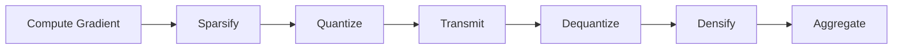

# Tutorial 084: Model Compression and Quantization

This tutorial covers reducing communication overhead via quantization and sparsification.

## Background

- **Quantization**: Mapping floats to low-bit integers (e.g., INT8).
- **Sparsification**: Sending only top-k gradients.
- **Error Feedback**: Accumulating unsent residuals.

## Configuration File

```yaml
compression:
  method: "top_k"
  k: 0.1
  error_feedback: true

quantization:
  bits: 8
  stochastic: true
```

## Minimal Runnable Code Example

```python
import torch

def quantize(tensor, bits=8):
    scale = tensor.abs().max() / (2**(bits-1) - 1)
    q_tensor = (tensor / scale).round().clamp(-(2**(bits-1)), 2**(bits-1)-1)
    return q_tensor, scale

def dequantize(q_tensor, scale):
    return q_tensor * scale

def sparsify(tensor, ratio=0.1):
    k = int(tensor.numel() * ratio)
    topk, indices = torch.topk(tensor.abs().flatten(), k)
    mask = torch.zeros_like(tensor.flatten())
    mask[indices] = 1.0
    return tensor * mask.view_as(tensor)

# Demo
grad = torch.randn(10, 10)
compressed, scale = quantize(grad)
recon = dequantize(compressed, scale)
print(f"Reconstruction Error: {(grad - recon).norm().item()}")
```

## Compression Pipeline



## Exercises

1. Why is error feedback critical for SGD convergence with biased compressors?
2. Implement 1-bit SGD (SignSGD) with majority voting.
3. Analyze the trade-off between CPU cost of compression vs network savings.
