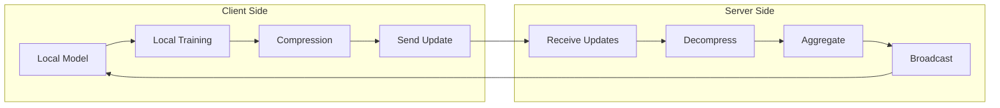

# Tutorial 085: FL Model Compression

---

## Metadata

| Property | Value |
|----------|-------|
| **Tutorial ID** | 085 |
| **Title** | FL Model Compression |
| **Category** | Optimization |
| **Difficulty** | Intermediate |
| **Duration** | 90 minutes |
| **Prerequisites** | Tutorial 001-084 |
| **Author** | Unbitrium Contributors |
| **Last Updated** | January 2026 |

---

## Learning Objectives

By the end of this tutorial, you will be able to:

1. **Understand** model compression techniques for federated learning.
2. **Implement** pruning strategies to reduce model size.
3. **Design** quantization schemes for efficient communication.
4. **Analyze** trade-offs between compression and accuracy.
5. **Apply** knowledge distillation in FL settings.
6. **Evaluate** compression impact on convergence.
7. **Create** custom compression pipelines.

---

## Prerequisites

- **Completed Tutorials**: 001-084
- **Knowledge**: Neural networks, optimization
- **Libraries**: PyTorch, NumPy

```python
import torch
import torch.nn as nn
import torch.nn.functional as F
import numpy as np
from dataclasses import dataclass, field
from typing import Any, Dict, List, Optional, Tuple
from torch.utils.data import Dataset, DataLoader
import copy

print(f"PyTorch: {torch.__version__}")
```

---

## Background and Theory

### Why Compression in FL?

| Challenge | Description | Solution |
|-----------|-------------|----------|
| Communication | Model transfers are expensive | Reduce model size |
| Bandwidth | Limited network capacity | Fewer bytes per round |
| Energy | Mobile devices have battery limits | Less computation |
| Storage | Edge devices have limited memory | Smaller models |
| Latency | Real-time requirements | Faster inference |

### Compression Techniques

| Technique | Reduction | Accuracy Impact | Complexity |
|-----------|-----------|-----------------|------------|
| Pruning | 50-90% | Low-Medium | Low |
| Quantization | 4-8x | Low | Medium |
| Knowledge Distillation | Variable | Low | High |
| Low-rank factorization | 2-10x | Medium | Medium |
| Weight sharing | 2-4x | Low | Low |

### Pruning Types

| Type | Description | Granularity |
|------|-------------|-------------|
| Unstructured | Individual weights | Fine |
| Structured | Neurons/filters | Coarse |
| Block | Weight blocks | Medium |
| Global | Across all layers | Fine |
| Layer-wise | Per-layer thresholds | Medium |

### Compression Pipeline



---

## Implementation Code

### Part 1: Configuration and Basic Components

```python
#!/usr/bin/env python3
"""
Tutorial 085: FL Model Compression

Comprehensive implementation of model compression techniques
for communication-efficient federated learning.

Author: Unbitrium Contributors
License: EUPL-1.2
"""

from __future__ import annotations
import copy
from dataclasses import dataclass, field
from typing import Any, Dict, List, Optional, Tuple, Callable
from enum import Enum
import numpy as np
import torch
import torch.nn as nn
import torch.nn.functional as F
from torch.utils.data import Dataset, DataLoader


class CompressionType(Enum):
    """Types of compression."""
    NONE = "none"
    PRUNING = "pruning"
    QUANTIZATION = "quantization"
    BOTH = "both"
    DISTILLATION = "distillation"


class PruningType(Enum):
    """Types of pruning."""
    UNSTRUCTURED = "unstructured"
    STRUCTURED = "structured"
    GLOBAL = "global"


@dataclass
class CompressionConfig:
    """Configuration for model compression."""
    
    # General
    num_rounds: int = 50
    num_clients: int = 20
    clients_per_round: int = 10
    local_epochs: int = 2
    batch_size: int = 32
    learning_rate: float = 0.01
    seed: int = 42
    
    # Model
    input_dim: int = 32
    hidden_dim: int = 128
    num_classes: int = 10
    
    # Pruning
    prune_ratio: float = 0.5
    pruning_type: PruningType = PruningType.UNSTRUCTURED
    prune_frequency: int = 5  # Rounds between pruning
    
    # Quantization
    quantization_bits: int = 8
    min_quantization_bits: int = 4
    dynamic_quantization: bool = True
    
    # Distillation
    temperature: float = 3.0
    alpha: float = 0.5  # Balance between hard and soft labels


class CompressionDataset(Dataset):
    """Dataset for compression experiments."""
    
    def __init__(
        self,
        num_samples: int,
        input_dim: int,
        num_classes: int,
        client_id: int = 0,
    ):
        np.random.seed(client_id)
        self.features = torch.randn(num_samples, input_dim)
        self.labels = torch.randint(0, num_classes, (num_samples,))
        
        # Add class-specific patterns
        for i in range(num_samples):
            label = self.labels[i].item()
            self.features[i, label % input_dim] += 2.0
    
    def __len__(self) -> int:
        return len(self.labels)
    
    def __getitem__(self, idx: int) -> Tuple[torch.Tensor, torch.Tensor]:
        return self.features[idx], self.labels[idx]


class CompressibleModel(nn.Module):
    """Model that supports various compression techniques."""
    
    def __init__(self, config: CompressionConfig):
        super().__init__()
        self.config = config
        
        self.layers = nn.Sequential(
            nn.Linear(config.input_dim, config.hidden_dim),
            nn.ReLU(),
            nn.Linear(config.hidden_dim, config.hidden_dim // 2),
            nn.ReLU(),
            nn.Linear(config.hidden_dim // 2, config.num_classes),
        )
        
        # Pruning masks
        self.masks: Dict[str, torch.Tensor] = {}
        self._initialize_masks()
    
    def _initialize_masks(self) -> None:
        """Initialize pruning masks to all ones."""
        for name, param in self.named_parameters():
            if 'weight' in name:
                self.masks[name] = torch.ones_like(param)
    
    def forward(self, x: torch.Tensor) -> torch.Tensor:
        return self.layers(x)
    
    def apply_masks(self) -> None:
        """Apply pruning masks to weights."""
        with torch.no_grad():
            for name, param in self.named_parameters():
                if name in self.masks:
                    param.data *= self.masks[name]
    
    def get_sparsity(self) -> float:
        """Calculate current model sparsity."""
        total_params = 0
        zero_params = 0
        
        for name, param in self.named_parameters():
            if 'weight' in name:
                total_params += param.numel()
                zero_params += (param == 0).sum().item()
        
        return zero_params / total_params if total_params > 0 else 0
    
    def count_parameters(self) -> Dict[str, int]:
        """Count model parameters."""
        total = sum(p.numel() for p in self.parameters())
        nonzero = sum((p != 0).sum().item() for p in self.parameters())
        return {"total": total, "nonzero": nonzero, "zero": total - nonzero}
```

### Part 2: Pruning Implementation

```python
class Pruner:
    """Implements various pruning strategies."""
    
    def __init__(self, config: CompressionConfig):
        self.config = config
    
    def unstructured_prune(
        self,
        model: CompressibleModel,
        ratio: float,
    ) -> Dict[str, torch.Tensor]:
        """Apply unstructured (magnitude-based) pruning."""
        masks = {}
        
        for name, param in model.named_parameters():
            if 'weight' not in name:
                continue
            
            # Get threshold for this layer
            weight_abs = param.abs()
            threshold = torch.quantile(weight_abs.flatten(), ratio)
            
            # Create mask
            mask = (weight_abs >= threshold).float()
            masks[name] = mask
            
            # Apply mask
            param.data *= mask
        
        model.masks = masks
        return masks
    
    def structured_prune(
        self,
        model: CompressibleModel,
        ratio: float,
    ) -> Dict[str, torch.Tensor]:
        """Apply structured pruning (remove entire neurons)."""
        masks = {}
        
        for name, param in model.named_parameters():
            if 'weight' not in name or len(param.shape) != 2:
                continue
            
            # Calculate importance per output neuron (row)
            importance = param.abs().sum(dim=1)
            
            # Get threshold
            num_to_prune = int(ratio * len(importance))
            if num_to_prune == 0:
                masks[name] = torch.ones_like(param)
                continue
            
            # Find neurons to prune
            _, indices_to_prune = importance.topk(num_to_prune, largest=False)
            
            # Create mask
            mask = torch.ones_like(param)
            mask[indices_to_prune, :] = 0
            masks[name] = mask
            
            # Apply mask
            param.data *= mask
        
        model.masks = masks
        return masks
    
    def global_prune(
        self,
        model: CompressibleModel,
        ratio: float,
    ) -> Dict[str, torch.Tensor]:
        """Apply global unstructured pruning across all layers."""
        # Collect all weights
        all_weights = []
        for name, param in model.named_parameters():
            if 'weight' in name:
                all_weights.append(param.abs().flatten())
        
        all_weights = torch.cat(all_weights)
        threshold = torch.quantile(all_weights, ratio)
        
        # Apply global threshold
        masks = {}
        for name, param in model.named_parameters():
            if 'weight' in name:
                mask = (param.abs() >= threshold).float()
                masks[name] = mask
                param.data *= mask
        
        model.masks = masks
        return masks
    
    def prune(
        self,
        model: CompressibleModel,
        ratio: Optional[float] = None,
    ) -> Dict[str, torch.Tensor]:
        """Apply pruning based on configuration."""
        ratio = ratio or self.config.prune_ratio
        
        if self.config.pruning_type == PruningType.UNSTRUCTURED:
            return self.unstructured_prune(model, ratio)
        elif self.config.pruning_type == PruningType.STRUCTURED:
            return self.structured_prune(model, ratio)
        elif self.config.pruning_type == PruningType.GLOBAL:
            return self.global_prune(model, ratio)
        else:
            return {}
```

### Part 3: Quantization Implementation

```python
class Quantizer:
    """Implements fixed-point quantization."""
    
    def __init__(self, config: CompressionConfig):
        self.config = config
    
    def quantize_tensor(
        self,
        tensor: torch.Tensor,
        bits: int,
    ) -> Tuple[torch.Tensor, Dict[str, float]]:
        """Quantize a tensor to fixed-point representation."""
        min_val = tensor.min().item()
        max_val = tensor.max().item()
        
        # Handle edge case
        if max_val == min_val:
            return tensor, {"min": min_val, "max": max_val, "scale": 1.0}
        
        # Compute scale
        num_levels = 2 ** bits
        scale = (max_val - min_val) / (num_levels - 1)
        
        # Quantize
        quantized = ((tensor - min_val) / scale).round()
        quantized = quantized.clamp(0, num_levels - 1)
        
        # Dequantize for training
        dequantized = quantized * scale + min_val
        
        return dequantized, {"min": min_val, "max": max_val, "scale": scale}
    
    def quantize_state_dict(
        self,
        state_dict: Dict[str, torch.Tensor],
        bits: Optional[int] = None,
    ) -> Tuple[Dict[str, torch.Tensor], Dict[str, Dict]]:
        """Quantize entire state dict."""
        bits = bits or self.config.quantization_bits
        
        quantized_state = {}
        metadata = {}
        
        for name, param in state_dict.items():
            q_param, meta = self.quantize_tensor(param, bits)
            quantized_state[name] = q_param
            metadata[name] = meta
        
        return quantized_state, metadata
    
    def dequantize_state_dict(
        self,
        quantized_state: Dict[str, torch.Tensor],
        metadata: Dict[str, Dict],
    ) -> Dict[str, torch.Tensor]:
        """Dequantize state dict (already dequantized in quantize)."""
        return quantized_state
    
    def compute_compression_ratio(self, bits: int) -> float:
        """Compute compression ratio compared to 32-bit floats."""
        return 32.0 / bits


class ModelCompressor:
    """Combined model compression manager."""
    
    def __init__(self, config: CompressionConfig):
        self.config = config
        self.pruner = Pruner(config)
        self.quantizer = Quantizer(config)
    
    def compress_update(
        self,
        state_dict: Dict[str, torch.Tensor],
        apply_pruning: bool = True,
        apply_quantization: bool = True,
    ) -> Tuple[Dict[str, torch.Tensor], Dict[str, Any]]:
        """Compress model update."""
        compressed = {k: v.clone() for k, v in state_dict.items()}
        metadata = {"original_size": self._compute_size(state_dict)}
        
        # Apply pruning (zeros out values)
        if apply_pruning:
            for name in compressed:
                if 'weight' in name:
                    weight = compressed[name]
                    threshold = torch.quantile(
                        weight.abs().flatten(),
                        self.config.prune_ratio
                    )
                    mask = weight.abs() >= threshold
                    compressed[name] = weight * mask
        
        # Apply quantization
        if apply_quantization:
            compressed, q_meta = self.quantizer.quantize_state_dict(
                compressed,
                self.config.quantization_bits,
            )
            metadata["quantization"] = q_meta
        
        metadata["compressed_size"] = self._compute_size(compressed)
        metadata["compression_ratio"] = (
            metadata["original_size"] / metadata["compressed_size"]
            if metadata["compressed_size"] > 0 else 1.0
        )
        
        return compressed, metadata
    
    def _compute_size(self, state_dict: Dict[str, torch.Tensor]) -> int:
        """Compute size in bytes."""
        return sum(p.numel() * 4 for p in state_dict.values())


class CompressedFLClient:
    """FL client with compression support."""
    
    def __init__(
        self,
        client_id: int,
        dataset: CompressionDataset,
        config: CompressionConfig,
    ):
        self.client_id = client_id
        self.dataset = dataset
        self.config = config
        self.compressor = ModelCompressor(config)
    
    def train(
        self,
        model: CompressibleModel,
        compress: bool = True,
    ) -> Dict[str, Any]:
        """Train locally and optionally compress update."""
        local_model = copy.deepcopy(model)
        local_model.apply_masks()
        
        optimizer = torch.optim.SGD(
            local_model.parameters(),
            lr=self.config.learning_rate,
        )
        loader = DataLoader(
            self.dataset,
            batch_size=self.config.batch_size,
            shuffle=True,
        )
        
        local_model.train()
        total_loss = 0
        num_batches = 0
        
        for _ in range(self.config.local_epochs):
            for features, labels in loader:
                optimizer.zero_grad()
                outputs = local_model(features)
                loss = F.cross_entropy(outputs, labels)
                loss.backward()
                optimizer.step()
                local_model.apply_masks()
                
                total_loss += loss.item()
                num_batches += 1
        
        # Prepare update
        state_dict = {k: v.cpu() for k, v in local_model.state_dict().items()}
        
        if compress:
            compressed, metadata = self.compressor.compress_update(state_dict)
            return {
                "state_dict": compressed,
                "num_samples": len(self.dataset),
                "loss": total_loss / num_batches,
                "compression_metadata": metadata,
            }
        else:
            return {
                "state_dict": state_dict,
                "num_samples": len(self.dataset),
                "loss": total_loss / num_batches,
            }


class CompressedFLServer:
    """FL server with compression support."""
    
    def __init__(
        self,
        model: CompressibleModel,
        clients: List[CompressedFLClient],
        test_dataset: Dataset,
        config: CompressionConfig,
    ):
        self.model = model
        self.clients = clients
        self.test_dataset = test_dataset
        self.config = config
        self.pruner = Pruner(config)
        self.history: List[Dict] = []
    
    def aggregate(self, updates: List[Dict]) -> None:
        """Aggregate compressed updates."""
        total = sum(u["num_samples"] for u in updates)
        new_state = {}
        
        for key in self.model.state_dict():
            new_state[key] = sum(
                (u["num_samples"] / total) * u["state_dict"][key].float()
                for u in updates
            )
        
        self.model.load_state_dict(new_state)
    
    def evaluate(self) -> Tuple[float, float]:
        """Evaluate global model."""
        self.model.eval()
        loader = DataLoader(self.test_dataset, batch_size=128)
        
        correct, total, total_loss = 0, 0, 0.0
        with torch.no_grad():
            for features, labels in loader:
                outputs = self.model(features)
                total_loss += F.cross_entropy(outputs, labels).item() * len(labels)
                correct += (outputs.argmax(1) == labels).sum().item()
                total += len(labels)
        
        return correct / total, total_loss / total
    
    def train(self) -> List[Dict]:
        """Run compressed FL training."""
        for round_num in range(self.config.num_rounds):
            # Select clients
            selected = np.random.choice(
                self.clients,
                min(self.config.clients_per_round, len(self.clients)),
                replace=False,
            )
            
            # Collect updates
            updates = [c.train(self.model, compress=True) for c in selected]
            
            # Aggregate
            self.aggregate(updates)
            
            # Apply pruning periodically
            if (round_num + 1) % self.config.prune_frequency == 0:
                self.pruner.prune(self.model)
            
            # Evaluate
            acc, loss = self.evaluate()
            sparsity = self.model.get_sparsity()
            
            self.history.append({
                "round": round_num,
                "accuracy": acc,
                "loss": loss,
                "sparsity": sparsity,
            })
            
            if (round_num + 1) % 10 == 0:
                print(f"Round {round_num + 1}: acc={acc:.4f}, sparsity={sparsity:.2%}")
        
        return self.history


def run_compression_demo():
    """Demonstrate FL model compression."""
    config = CompressionConfig(
        num_rounds=30,
        num_clients=10,
        prune_ratio=0.3,
        quantization_bits=8,
    )
    
    torch.manual_seed(config.seed)
    np.random.seed(config.seed)
    
    # Create clients
    clients = [
        CompressedFLClient(
            i,
            CompressionDataset(100, config.input_dim, config.num_classes, i),
            config,
        )
        for i in range(config.num_clients)
    ]
    
    # Create test set
    test_dataset = CompressionDataset(500, config.input_dim, config.num_classes, 999)
    
    # Create model and server
    model = CompressibleModel(config)
    server = CompressedFLServer(model, clients, test_dataset, config)
    
    # Train
    history = server.train()
    
    # Summary
    params = model.count_parameters()
    print(f"\nFinal sparsity: {model.get_sparsity():.2%}")
    print(f"Non-zero params: {params['nonzero']:,} / {params['total']:,}")


if __name__ == "__main__":
    run_compression_demo()
```

---

## Exercises

1. **Exercise 1**: Implement iterative pruning with gradual sparsity increase.
2. **Exercise 2**: Add mixed-precision quantization.
3. **Exercise 3**: Implement lottery ticket hypothesis experiments.
4. **Exercise 4**: Compare structured vs unstructured pruning.
5. **Exercise 5**: Add adaptive compression based on bandwidth.

---

## References

1. Han, S., et al. (2016). Deep compression. In *ICLR*.
2. Singh, A., et al. (2020). Detailed comparison of communication efficiency. *AISTATS*.
3. Frankle, J., & Carbin, M. (2019). The lottery ticket hypothesis. In *ICLR*.
4. Sattler, F., et al. (2019). Robust and communication-efficient FL. *IEEE TNNLS*.
5. Li, D., & Wang, J. (2019). FedMD: Heterogeneous FL via model distillation. *NeurIPS*.

---

*Copyright 2026 Olaf Yunus Laitinen Imanov and Contributors. Released under EUPL 1.2.*
