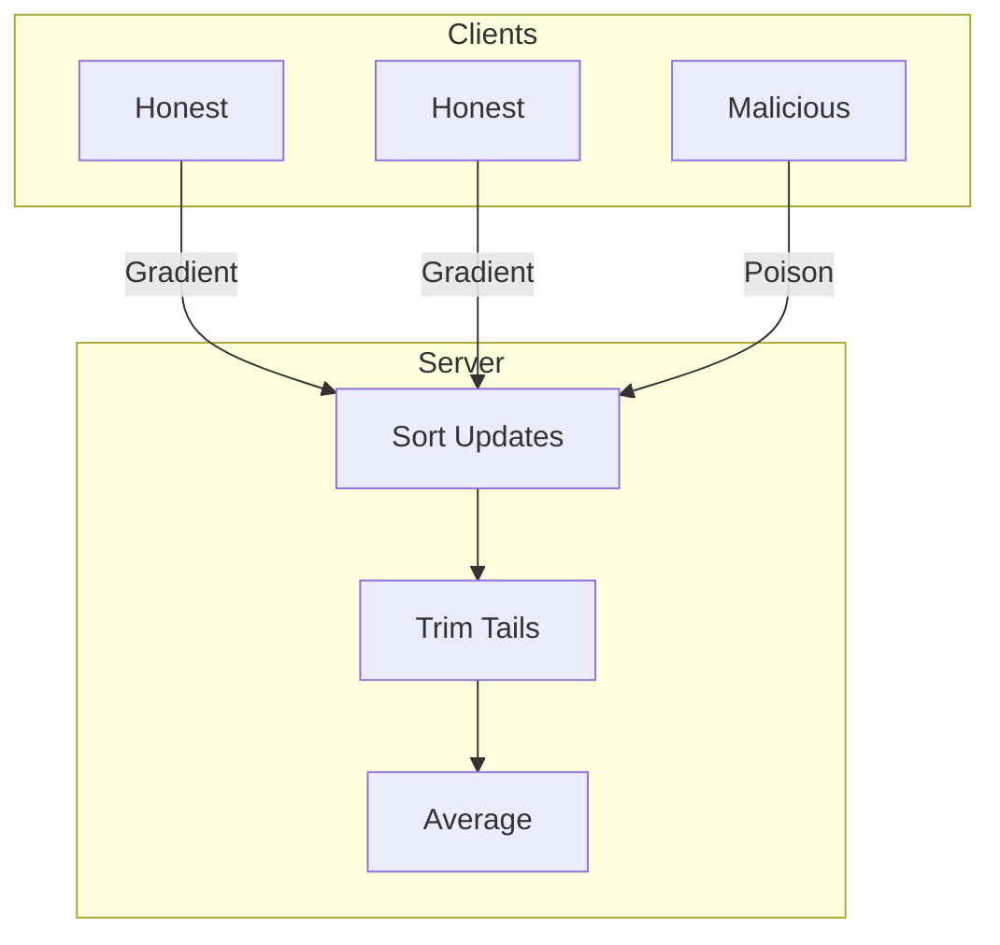

# Tutorial 085: Byzantine Robustness with Trimmed Mean

This tutorial demonstrates defense against Byzantine attacks (poisoning) using robust aggregation.

## Background

- **Byzantine Failures**: Arbitrary malicious behavior by a fraction $f$ of clients.
- **Breakdown Point**: The fraction of malicious clients an aggregator can withstand.
- **Trimmed Mean**: Removes largest and smallest values coordinate-wise.

## Configuration File

```yaml
attack:
  type: "sign_flip"
  fraction: 0.2

defense:
  aggregator: "trimmed_mean"
  beta: 0.2 # Fraction to trim from each end
```

## Minimal Runnable Code Example

```python
import torch

def trimmed_mean_aggregate(updates, beta=0.1):
    stacked = torch.stack(updates)
    n = len(updates)
    k = int(n * beta)

    # Sort coordinate-wise
    sorted_updates, _ = torch.sort(stacked, dim=0)

    # Trim
    trimmed = sorted_updates[k : n-k]

    # Mean
    return torch.mean(trimmed, dim=0)

# Scenario: 10 clients, 2 malicious
true_grad = torch.tensor([1.0, 1.0])
updates = [true_grad + torch.randn(2)*0.1 for _ in range(8)]
updates += [torch.tensor([-10.0, -10.0]) for _ in range(2)] # Attack

robust = trimmed_mean_aggregate(updates, beta=0.2)
simple = torch.mean(torch.stack(updates), dim=0)

print(f"Robust Update: {robust}")
print(f"Simple Avg Update: {simple}")
```

## Robustness Visualization



## Exercises

1. What is the maximum fraction of attackers Trimmed Mean can handle?
2. How does high data heterogeneity affect the performance of Trimmed Mean?
3. Compare Trimmed Mean vs Median aggregation.
