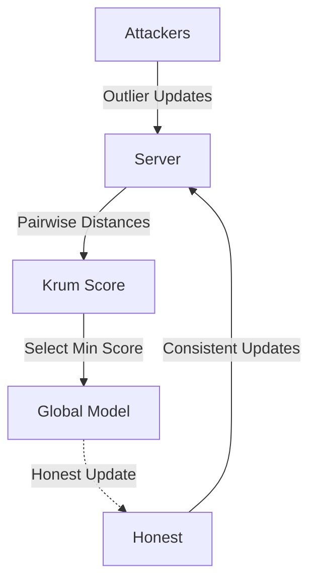

# Tutorial 086: Defending against Model Poisoning with Krum

This tutorial demonstrates how to use the Krum aggregator to defend against model poisoning attacks.

## Background

- **Krum**: Selects one of the $n$ local updates that is closest to its $n-f-2$ neighbors.
- **Multi-Krum**: Selects $m$ best updates and averages them.
- **Guarantee**: Converges if fraction of malicious clients $f < \frac{n-2}{2}$.

## Configuration File

```yaml
defense:
  aggregator: "krum"
  num_neighbors: 7 # n - f - 2 roughly
  multi_krum_m: 1 # Default Krum
```

## Minimal Runnable Code Example

```python
import torch

def krum_select(updates, f):
    n = len(updates)
    k = n - f - 2
    scores = []

    # Compute pairwise distances
    dists = torch.zeros((n, n))
    for i in range(n):
        for j in range(i+1, n):
            d = (updates[i] - updates[j]).norm().item()
            dists[i, j] = d
            dists[j, i] = d

    # Score = sum of distances to k nearest neighbors
    for i in range(n):
        row = dists[i]
        sorted_dists, _ = torch.sort(row)
        score = sorted_dists[1:k+1].sum() # Skip self (dist 0)
        scores.append(score)

    best_idx = torch.argmin(torch.tensor(scores))
    return updates[best_idx]
```

## Resilience Analysis



## Exercises

1. Why does Krum fail if $f \ge n/2$?
2. What is the impact of Krum on convergence speed compared to FedAvg?
3. Implement Multi-Krum.
