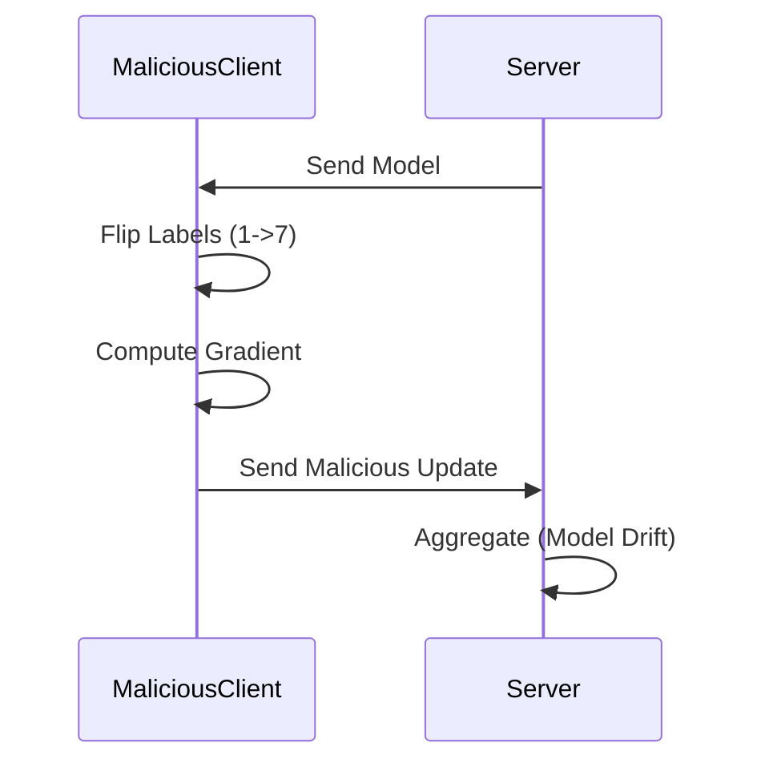

# Tutorial 087: Simulating Label Flipping Attacks

This tutorial demonstrates how to simulate a label flipping attack where malicious clients train on manipulated labels.

## Background

- **Label Flipping**: Attackers map label $y$ to $N - 1 - y$ or a random label.
- **Goal**: Degrade model accuracy or introduce backdoors.

## Configuration File

```yaml
attack:
  type: "label_flip"
  source_label: 1
  target_label: 7
  fraction: 0.3
```

## Minimal Runnable Code Example

```python
import torch
from torch.utils.data import Dataset

class PoisonedDataset(Dataset):
    def __init__(self, dataset, target_map):
        self.dataset = dataset
        self.target_map = target_map

    def __getitem__(self, index):
        x, y = self.dataset[index]
        if y in self.target_map:
            y = self.target_map[y]
        return x, y

    def __len__(self):
        return len(self.dataset)

# Usage
# clean_ds = CIFAR10(...)
# poisoned_ds = PoisonedDataset(clean_ds, {1: 7})
# train_on(poisoned_ds)
```

## Attack Flow



## Exercises

1. Does FedProx mitigate label flipping?
2. How does label flipping differ from gradient poisoning?
3. Visualize the t-SNE embedding of the final layer for poisoned vs clean models.
