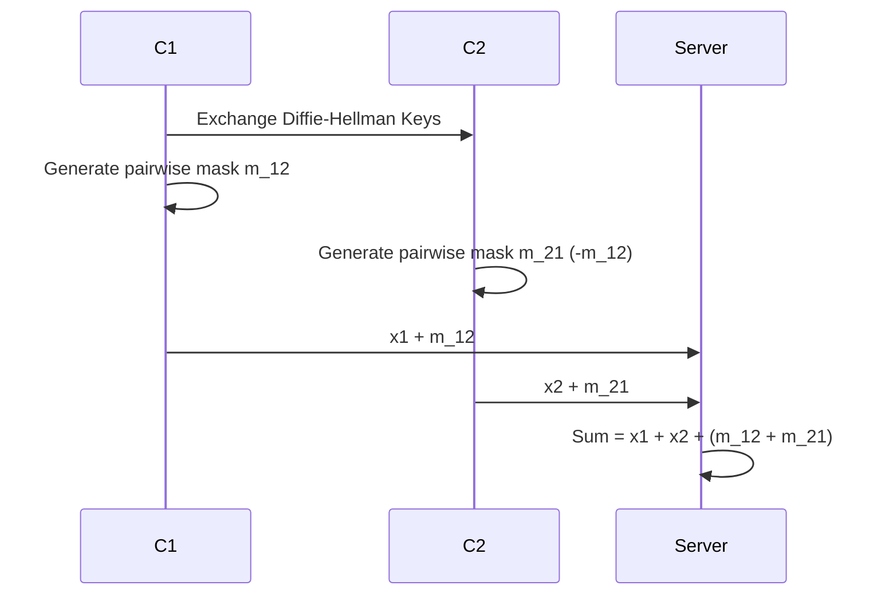

# Tutorial 088: Secure Aggregation Simulation

This tutorial covers the concept of Secure Aggregation (SecAgg) and how to simulate its overhead.

## Background

- **Goal**: Server learns $\sum x_i$ but nothing else about individual $x_i$.
- **Masking**: $y_i = x_i + \sum_{j} s_{i,j}$ where $s_{i,j} = -s_{j,i}$.
- **Sum**: $\sum y_i = \sum x_i$ as masks cancel out.

## Configuration File

```yaml
privacy:
  secure_aggregation: true
  dropout_handling: "shamir_secret_sharing"
  key_size_bits: 128
```

## Minimal Runnable Code Example

```python
import torch

def generate_masks(n_clients):
    masks = torch.zeros(n_clients, n_clients)
    for i in range(n_clients):
        for j in range(i+1, n_clients):
            r = torch.randn(1).item()
            masks[i, j] = r
            masks[j, i] = -r
    return masks

n = 5
secrets = torch.randn(n) # Client updates
masks = generate_masks(n)

# Each client adds row sum of masks
masked_updates = secrets + masks.sum(dim=1)

# Server aggregates
start_sum = masked_updates.sum()
true_sum = secrets.sum()

print(f"Reconstructed: {start_sum:.4f}")
print(f"True Sum: {true_sum:.4f}")
```

## Protocol Steps



## Exercises

1. What happens if a client drops out after sending the masked update?
2. Explain the role of Shamir Secret Sharing in robust SecAgg.
3. Calculate the communication complexity of pair-wise masking.
