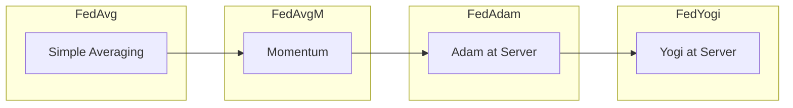

# Tutorial 088: FL Adaptive Learning Rates

---

## Metadata

| Property | Value |
|----------|-------|
| **Tutorial ID** | 088 |
| **Title** | FL Adaptive Learning Rates |
| **Category** | Optimization |
| **Difficulty** | Intermediate |
| **Duration** | 90 minutes |
| **Prerequisites** | Tutorial 001-087 |
| **Author** | Unbitrium Contributors |
| **Last Updated** | January 2026 |

---

## Learning Objectives

By the end of this tutorial, you will be able to:

1. **Understand** adaptive optimization in federated settings.
2. **Implement** FedAdam and FedYogi optimizers.
3. **Design** server-side adaptive learning rate schedules.
4. **Analyze** convergence with adaptive methods.
5. **Apply** per-parameter learning rates in FL.
6. **Evaluate** adaptive methods on non-IID data.
7. **Compare** various adaptive optimization strategies.

---

## Prerequisites

- **Completed Tutorials**: 001-087
- **Knowledge**: Adam, Adagrad, optimization theory
- **Libraries**: PyTorch, NumPy

```python
import torch
import torch.nn as nn
import torch.nn.functional as F
import numpy as np
from dataclasses import dataclass
from typing import Any, Dict, List, Tuple
from torch.utils.data import Dataset, DataLoader
import copy

print(f"PyTorch: {torch.__version__}")
```

---

## Background and Theory

### Adaptive Optimizers

| Optimizer | First Moment | Second Moment | Properties |
|-----------|--------------|---------------|------------|
| SGD | None | None | Simple, robust |
| Adagrad | None | Sum of squares | Decreasing LR |
| Adam | EMA | EMA | Adaptive per-param |
| Yogi | EMA | Additive update | More stable |
| AdaFactor | Low-rank | Low-rank | Memory efficient |

### FedOpt Framework

Server-side adaptive optimization:
$$m_{t+1} = \beta_1 m_t + (1-\beta_1) \Delta_t$$
$$v_{t+1} = \beta_2 v_t + (1-\beta_2) \Delta_t^2$$
$$w_{t+1} = w_t - \eta_s \frac{m_{t+1}}{\sqrt{v_{t+1}} + \epsilon}$$

### Algorithm Comparison



---

## Implementation Code

### Part 1: Configuration and Optimizers

```python
#!/usr/bin/env python3
"""
Tutorial 088: FL Adaptive Learning Rates

Comprehensive implementation of adaptive optimization methods
for federated learning including FedAdam, FedYogi, and FedAdagrad.

Author: Unbitrium Contributors
License: EUPL-1.2
"""

from __future__ import annotations
import copy
from dataclasses import dataclass
from typing import Any, Dict, List, Tuple
from enum import Enum
import numpy as np
import torch
import torch.nn as nn
import torch.nn.functional as F
from torch.utils.data import Dataset, DataLoader


class ServerOptimizer(Enum):
    """Types of server-side optimizers."""
    SGD = "sgd"
    SGDM = "sgdm"
    ADAM = "adam"
    YOGI = "yogi"
    ADAGRAD = "adagrad"


@dataclass
class AdaptiveConfig:
    """Configuration for adaptive FL."""
    
    # General
    num_rounds: int = 100
    num_clients: int = 20
    clients_per_round: int = 10
    local_epochs: int = 5
    batch_size: int = 32
    seed: int = 42
    
    # Client optimizer
    client_lr: float = 0.01
    client_momentum: float = 0.0
    
    # Server optimizer
    server_optimizer: ServerOptimizer = ServerOptimizer.ADAM
    server_lr: float = 0.01
    beta1: float = 0.9
    beta2: float = 0.99
    epsilon: float = 1e-3
    tau: float = 1e-3  # For Yogi
    
    # Model
    input_dim: int = 32
    hidden_dim: int = 128
    num_classes: int = 10
    
    # Heterogeneity
    alpha: float = 0.3


class AdaptiveDataset(Dataset):
    """Dataset for adaptive FL experiments."""
    
    def __init__(self, features: np.ndarray, labels: np.ndarray):
        self.features = torch.FloatTensor(features)
        self.labels = torch.LongTensor(labels)
    
    def __len__(self): return len(self.labels)
    
    def __getitem__(self, idx): return self.features[idx], self.labels[idx]


class AdaptiveModel(nn.Module):
    """Model for adaptive optimization."""
    
    def __init__(self, config: AdaptiveConfig):
        super().__init__()
        self.network = nn.Sequential(
            nn.Linear(config.input_dim, config.hidden_dim),
            nn.ReLU(),
            nn.Linear(config.hidden_dim, config.hidden_dim // 2),
            nn.ReLU(),
            nn.Linear(config.hidden_dim // 2, config.num_classes),
        )
    
    def forward(self, x): return self.network(x)


class ServerOptimizerBase:
    """Base class for server-side optimizers."""
    
    def __init__(self, model: nn.Module, config: AdaptiveConfig):
        self.model = model
        self.config = config
        self.t = 0
    
    def step(self, pseudo_gradient: Dict[str, torch.Tensor]) -> None:
        raise NotImplementedError


class FedSGD(ServerOptimizerBase):
    """Server-side SGD."""
    
    def step(self, pseudo_gradient: Dict[str, torch.Tensor]) -> None:
        with torch.no_grad():
            for name, param in self.model.named_parameters():
                param.data -= self.config.server_lr * pseudo_gradient[name]


class FedSGDM(ServerOptimizerBase):
    """Server-side SGD with momentum."""
    
    def __init__(self, model: nn.Module, config: AdaptiveConfig):
        super().__init__(model, config)
        self.momentum = {
            name: torch.zeros_like(param)
            for name, param in model.named_parameters()
        }
    
    def step(self, pseudo_gradient: Dict[str, torch.Tensor]) -> None:
        with torch.no_grad():
            for name, param in self.model.named_parameters():
                self.momentum[name] = (
                    self.config.beta1 * self.momentum[name] +
                    pseudo_gradient[name]
                )
                param.data -= self.config.server_lr * self.momentum[name]


class FedAdam(ServerOptimizerBase):
    """Server-side Adam optimizer."""
    
    def __init__(self, model: nn.Module, config: AdaptiveConfig):
        super().__init__(model, config)
        self.m = {name: torch.zeros_like(p) for name, p in model.named_parameters()}
        self.v = {name: torch.zeros_like(p) for name, p in model.named_parameters()}
    
    def step(self, pseudo_gradient: Dict[str, torch.Tensor]) -> None:
        self.t += 1
        
        with torch.no_grad():
            for name, param in self.model.named_parameters():
                g = pseudo_gradient[name]
                
                # Update biased first moment
                self.m[name] = self.config.beta1 * self.m[name] + (1 - self.config.beta1) * g
                
                # Update biased second moment
                self.v[name] = self.config.beta2 * self.v[name] + (1 - self.config.beta2) * (g ** 2)
                
                # Bias correction
                m_hat = self.m[name] / (1 - self.config.beta1 ** self.t)
                v_hat = self.v[name] / (1 - self.config.beta2 ** self.t)
                
                # Update parameters
                param.data -= self.config.server_lr * m_hat / (torch.sqrt(v_hat) + self.config.epsilon)


class FedYogi(ServerOptimizerBase):
    """Server-side Yogi optimizer (more stable than Adam)."""
    
    def __init__(self, model: nn.Module, config: AdaptiveConfig):
        super().__init__(model, config)
        self.m = {name: torch.zeros_like(p) for name, p in model.named_parameters()}
        self.v = {name: torch.zeros_like(p) for name, p in model.named_parameters()}
    
    def step(self, pseudo_gradient: Dict[str, torch.Tensor]) -> None:
        self.t += 1
        
        with torch.no_grad():
            for name, param in self.model.named_parameters():
                g = pseudo_gradient[name]
                
                # Update first moment
                self.m[name] = self.config.beta1 * self.m[name] + (1 - self.config.beta1) * g
                
                # Yogi second moment update (additive, not multiplicative)
                g_sq = g ** 2
                sign = torch.sign(g_sq - self.v[name])
                self.v[name] = self.v[name] + (1 - self.config.beta2) * sign * g_sq
                
                # Bias correction
                m_hat = self.m[name] / (1 - self.config.beta1 ** self.t)
                v_hat = self.v[name] / (1 - self.config.beta2 ** self.t)
                
                # Update
                param.data -= self.config.server_lr * m_hat / (torch.sqrt(v_hat) + self.config.tau)


class FedAdagrad(ServerOptimizerBase):
    """Server-side Adagrad optimizer."""
    
    def __init__(self, model: nn.Module, config: AdaptiveConfig):
        super().__init__(model, config)
        self.v = {name: torch.zeros_like(p) for name, p in model.named_parameters()}
    
    def step(self, pseudo_gradient: Dict[str, torch.Tensor]) -> None:
        with torch.no_grad():
            for name, param in self.model.named_parameters():
                g = pseudo_gradient[name]
                self.v[name] += g ** 2
                param.data -= self.config.server_lr * g / (torch.sqrt(self.v[name]) + self.config.epsilon)


def get_server_optimizer(
    optimizer_type: ServerOptimizer,
    model: nn.Module,
    config: AdaptiveConfig,
) -> ServerOptimizerBase:
    """Factory function for server optimizers."""
    if optimizer_type == ServerOptimizer.SGD:
        return FedSGD(model, config)
    elif optimizer_type == ServerOptimizer.SGDM:
        return FedSGDM(model, config)
    elif optimizer_type == ServerOptimizer.ADAM:
        return FedAdam(model, config)
    elif optimizer_type == ServerOptimizer.YOGI:
        return FedYogi(model, config)
    elif optimizer_type == ServerOptimizer.ADAGRAD:
        return FedAdagrad(model, config)
    else:
        return FedSGD(model, config)
```

### Part 2: FL System

```python
def create_heterogeneous_data(config: AdaptiveConfig) -> Tuple[List[AdaptiveDataset], AdaptiveDataset]:
    """Create heterogeneous client data."""
    np.random.seed(config.seed)
    
    n_total = config.num_clients * 100
    features = np.random.randn(n_total, config.input_dim).astype(np.float32)
    labels = np.random.randint(0, config.num_classes, n_total)
    
    for i in range(n_total):
        features[i, labels[i] % config.input_dim] += 2.0
    
    # Dirichlet partitioning
    dist = np.random.dirichlet([config.alpha] * config.num_classes, config.num_clients)
    class_indices = {c: np.where(labels == c)[0] for c in range(config.num_classes)}
    
    client_datasets = []
    for client_id in range(config.num_clients):
        indices = []
        for c in range(config.num_classes):
            n = int(dist[client_id, c] * 100)
            if n > 0 and len(class_indices[c]) > 0:
                sel = np.random.choice(class_indices[c], min(n, len(class_indices[c])), replace=True)
                indices.extend(sel.tolist())
        
        if indices:
            client_datasets.append(AdaptiveDataset(features[indices], labels[indices]))
    
    # Test set
    test_f = np.random.randn(500, config.input_dim).astype(np.float32)
    test_l = np.random.randint(0, config.num_classes, 500)
    for i in range(500):
        test_f[i, test_l[i] % config.input_dim] += 2.0
    
    return client_datasets, AdaptiveDataset(test_f, test_l)


class AdaptiveClient:
    """FL client for adaptive optimization."""
    
    def __init__(self, client_id: int, dataset: AdaptiveDataset, config: AdaptiveConfig):
        self.client_id = client_id
        self.dataset = dataset
        self.config = config
    
    def train(self, model: nn.Module) -> Dict[str, Any]:
        local = copy.deepcopy(model)
        opt = torch.optim.SGD(local.parameters(), lr=self.config.client_lr, momentum=self.config.client_momentum)
        loader = DataLoader(self.dataset, batch_size=self.config.batch_size, shuffle=True)
        
        local.train()
        total_loss, n_batches = 0, 0
        
        for _ in range(self.config.local_epochs):
            for x, y in loader:
                opt.zero_grad()
                loss = F.cross_entropy(local(x), y)
                loss.backward()
                opt.step()
                total_loss += loss.item()
                n_batches += 1
        
        return {
            "state_dict": {k: v.cpu() for k, v in local.state_dict().items()},
            "num_samples": len(self.dataset),
            "loss": total_loss / n_batches if n_batches > 0 else 0,
        }


class AdaptiveServer:
    """FL server with adaptive optimization."""
    
    def __init__(self, model: nn.Module, clients: List[AdaptiveClient], 
                 test_dataset: AdaptiveDataset, config: AdaptiveConfig):
        self.model = model
        self.clients = clients
        self.test_dataset = test_dataset
        self.config = config
        self.optimizer = get_server_optimizer(config.server_optimizer, model, config)
        self.history = []
    
    def aggregate_and_optimize(self, updates: List[Dict]) -> None:
        total = sum(u["num_samples"] for u in updates)
        
        # Compute weighted average and pseudo-gradient
        pseudo_grad = {}
        for name, param in self.model.named_parameters():
            avg = sum((u["num_samples"]/total) * u["state_dict"][name].float() for u in updates)
            pseudo_grad[name] = param.data - avg
        
        # Apply server optimizer
        self.optimizer.step(pseudo_grad)
    
    def evaluate(self) -> Tuple[float, float]:
        self.model.eval()
        loader = DataLoader(self.test_dataset, batch_size=128)
        correct, total, loss = 0, 0, 0.0
        
        with torch.no_grad():
            for x, y in loader:
                out = self.model(x)
                loss += F.cross_entropy(out, y).item() * len(y)
                correct += (out.argmax(1) == y).sum().item()
                total += len(y)
        
        return correct / total, loss / total
    
    def train(self) -> List[Dict]:
        for r in range(self.config.num_rounds):
            selected = np.random.choice(self.clients, min(self.config.clients_per_round, len(self.clients)), replace=False)
            updates = [c.train(self.model) for c in selected]
            self.aggregate_and_optimize(updates)
            
            acc, loss = self.evaluate()
            self.history.append({"round": r, "accuracy": acc, "loss": loss})
            
            if (r + 1) % 10 == 0:
                print(f"Round {r+1}: acc={acc:.4f}")
        
        return self.history


def compare_adaptive_optimizers():
    """Compare different server optimizers."""
    results = {}
    
    for opt_type in [ServerOptimizer.SGD, ServerOptimizer.ADAM, ServerOptimizer.YOGI]:
        config = AdaptiveConfig(num_rounds=50, num_clients=10, server_optimizer=opt_type)
        torch.manual_seed(config.seed)
        np.random.seed(config.seed)
        
        datasets, test = create_heterogeneous_data(config)
        clients = [AdaptiveClient(i, d, config) for i, d in enumerate(datasets)]
        model = AdaptiveModel(config)
        server = AdaptiveServer(model, clients, test, config)
        
        print(f"\n=== {opt_type.value.upper()} ===")
        history = server.train()
        results[opt_type.value] = history[-1]["accuracy"]
    
    print("\n=== Results ===")
    for name, acc in results.items():
        print(f"{name}: {acc:.4f}")


if __name__ == "__main__":
    compare_adaptive_optimizers()
```

---

## Exercises

1. **Exercise 1**: Implement learning rate warmup.
2. **Exercise 2**: Add gradient clipping.
3. **Exercise 3**: Compare with RAdam.
4. **Exercise 4**: Implement layer-wise learning rates.
5. **Exercise 5**: Add weight decay (AdamW style).

---

## References

1. Reddi, S., et al. (2021). Adaptive federated optimization. In *ICLR*.
2. Kingma, D. P., & Ba, J. (2015). Adam: A method for stochastic optimization. In *ICLR*.
3. Zaheer, M., et al. (2018). Adaptive methods for nonconvex optimization. In *NeurIPS*.
4. Loshchilov, I., & Hutter, F. (2019). Decoupled weight decay regularization. In *ICLR*.
5. Liu, L., et al. (2020). On the variance of the adaptive learning rate. In *ICLR*.

---

*Copyright 2026 Olaf Yunus Laitinen Imanov and Contributors. Released under EUPL 1.2.*
