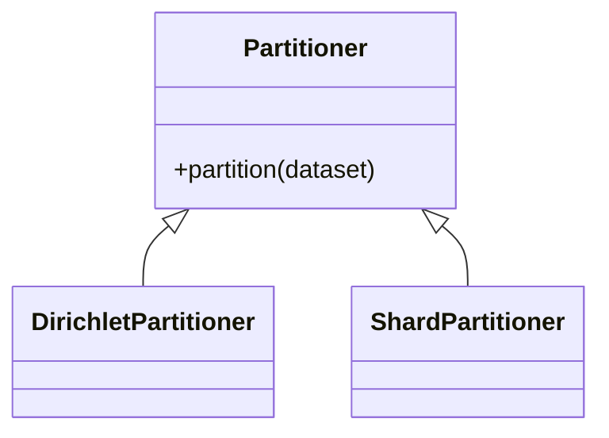

# Tutorial 089: Implementing a Custom Partitioner

This tutorial guides you through creating a new data partitioning strategy in Unbitrium.

## Interface

Your partitioner must inherit from `Partitioner` and implement `partition(dataset) -> Dict[int, List[int]]`.

## Example: Shard-Based Partitioning

Splits data into shards, assigns $s$ shards to each client.

```python
from typing import Dict, List, Any
import random
import math
from unbitrium.partitioning.base import Partitioner

class ShardsPartitioner(Partitioner):
    def __init__(self, num_clients: int, shards_per_client: int = 2):
        self.num_clients = num_clients
        self.shards_per_client = shards_per_client

    def partition(self, dataset: Any) -> Dict[int, List[int]]:
        total_data = len(dataset)
        total_shards = self.num_clients * self.shards_per_client
        shard_size = total_data // total_shards

        # Sort by label if possible for non-IID
        if hasattr(dataset, 'targets'):
            indices = torch.argsort(torch.tensor(dataset.targets)).tolist()
        else:
            indices = list(range(total_data))

        shards = [indices[i:i+shard_size] for i in range(0, total_data, shard_size)]

        random.shuffle(shards)

        partitions = {}
        for i in range(self.num_clients):
            client_shards = []
            for _ in range(self.shards_per_client):
                if shards:
                    client_shards.extend(shards.pop())
            partitions[i] = client_shards

        return partitions
```

## Integration

1. Register class.
2. Update config YAML.
3. Run verification test.



## Exercises

1. Modify `ShardsPartitioner` to handle unbalanced shard sizes.
2. Implement a partitioner based on geospatial coordinates.
3. Verify the label distribution skew of the shard partitioner.
