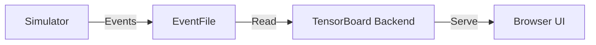

# Tutorial 090: Visualizing FL Convergence with TensorBoard

This tutorial demonstrates how to instrument Unbitrium to log metrics to TensorBoard.

## Configuration

```yaml
logging:
  system: "tensorboard"
  log_dir: "./logs"
  metrics: ["accuracy", "loss", "gradient_norm", "client_drift"]
```

## Logging Hook

```python
from torch.utils.tensorboard import SummaryWriter

class TbLogger:
    def __init__(self, log_dir):
        self.writer = SummaryWriter(log_dir)

    def log_round(self, round_num, metrics):
        for k, v in metrics.items():
            self.writer.add_scalar(k, v, round_num)

    def close(self):
        self.writer.close()
```

## Integrating into Simulator

```python
# In Simulator.run()
logger = TbLogger("./runs/exp1")

for r in range(rounds):
    # ... aggregation ...
    metrics = {
        "test_acc": global_acc,
        "train_loss": avg_train_loss
    }
    logger.log_round(r, metrics)
```

## Dashboard Layout



## Exercises

1. Log the histogram of client weights per round.
2. Visualize the EMD drift over time.
3. Use the HParams plugin to visualize grid search results.
