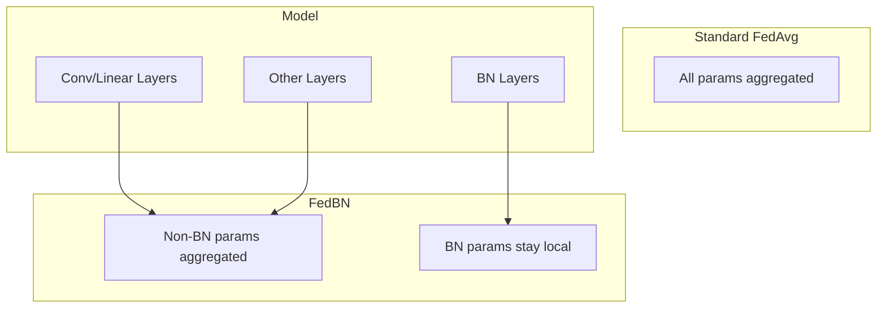

# Tutorial 091: FL Batch Normalization

---

## Metadata

| Property | Value |
|----------|-------|
| **Tutorial ID** | 091 |
| **Title** | FL Batch Normalization |
| **Category** | Optimization |
| **Difficulty** | Intermediate |
| **Duration** | 90 minutes |
| **Prerequisites** | Tutorial 001-090 |
| **Author** | Unbitrium Contributors |
| **Last Updated** | January 2026 |

---

## Learning Objectives

By the end of this tutorial, you will be able to:

1. **Understand** BatchNorm challenges in federated settings.
2. **Implement** GroupNorm and LayerNorm alternatives.
3. **Design** local BatchNorm handling strategies.
4. **Analyze** normalization impact on non-IID data.
5. **Apply** FedBN and similar techniques.
6. **Evaluate** normalization strategies for FL.
7. **Create** custom normalization layers.

---

## Prerequisites

- **Completed Tutorials**: 001-090
- **Knowledge**: Normalization layers, statistics
- **Libraries**: PyTorch, NumPy

```python
import torch
import torch.nn as nn
import torch.nn.functional as F
import numpy as np
from dataclasses import dataclass
from typing import Any, Dict, List, Tuple
from torch.utils.data import Dataset, DataLoader
import copy

print(f"PyTorch: {torch.__version__}")
```

---

## Background and Theory

### BatchNorm in FL Challenges

| Challenge | Description | Impact |
|-----------|-------------|--------|
| Statistics mismatch | Running mean/var differ | Poor generalization |
| Small batches | Noisy estimates | Training instability |
| Non-IID | Different distributions | Biased stats |
| Aggregation | How to average BN? | Unclear protocol |

### Normalization Alternatives

| Type | Normalizes Over | Parameters | FL Friendly |
|------|-----------------|------------|-------------|
| BatchNorm | Batch dimension | γ, β, running stats | ❌ |
| LayerNorm | Feature dimension | γ, β | ✅ |
| GroupNorm | Channel groups | γ, β | ✅ |
| InstanceNorm | Single sample | γ, β | ✅ |
| FedBN | Local BN | Local stats | ✅ |

### FedBN Strategy



---

## Implementation Code

### Part 1: Configuration and Normalization Layers

```python
#!/usr/bin/env python3
"""
Tutorial 091: FL Batch Normalization

Comprehensive implementation of normalization strategies
for federated learning including FedBN, GroupNorm, LayerNorm.

Author: Unbitrium Contributors
License: EUPL-1.2
"""

from __future__ import annotations
import copy
from dataclasses import dataclass
from typing import Any, Dict, List, Tuple, Optional
from enum import Enum
import numpy as np
import torch
import torch.nn as nn
import torch.nn.functional as F
from torch.utils.data import Dataset, DataLoader


class NormType(Enum):
    """Types of normalization layers."""
    BATCH = "batch"
    LAYER = "layer"
    GROUP = "group"
    INSTANCE = "instance"
    NONE = "none"


class AggregationType(Enum):
    """How to handle BN during aggregation."""
    FULL = "full"  # Aggregate all params including BN
    EXCLUDE_BN = "exclude_bn"  # FedBN - keep BN local
    AVERAGE_STATS = "average_stats"  # Average running stats


@dataclass
class BNConfig:
    """Configuration for batch normalization experiments."""
    
    # General
    num_rounds: int = 100
    num_clients: int = 20
    clients_per_round: int = 10
    local_epochs: int = 5
    batch_size: int = 32
    learning_rate: float = 0.01
    seed: int = 42
    
    # Normalization
    norm_type: NormType = NormType.GROUP
    agg_type: AggregationType = AggregationType.EXCLUDE_BN
    num_groups: int = 4  # For GroupNorm
    
    # Model (CNN-like for 2D data)
    input_channels: int = 1
    input_size: int = 28
    hidden_channels: int = 32
    num_classes: int = 10


class BNDataset(Dataset):
    """Dataset simulating image-like data."""
    
    def __init__(self, num_samples: int, input_size: int, num_classes: int, seed: int = 0):
        np.random.seed(seed)
        
        # Create 2D data (like flattened images)
        self.features = torch.randn(num_samples, 1, input_size, input_size)
        self.labels = torch.randint(0, num_classes, (num_samples,))
        
        # Add class-specific patterns
        for i in range(num_samples):
            label = self.labels[i].item()
            # Add a pattern based on class
            row = label % input_size
            col = (label * 3) % input_size
            self.features[i, 0, row:row+3, col:col+3] += 2.0
    
    def __len__(self): return len(self.labels)
    def __getitem__(self, idx): return self.features[idx], self.labels[idx]


def get_norm_layer(norm_type: NormType, num_features: int, num_groups: int = 4) -> nn.Module:
    """Get appropriate normalization layer."""
    if norm_type == NormType.BATCH:
        return nn.BatchNorm2d(num_features)
    elif norm_type == NormType.LAYER:
        return nn.GroupNorm(1, num_features)  # LayerNorm for Conv
    elif norm_type == NormType.GROUP:
        return nn.GroupNorm(min(num_groups, num_features), num_features)
    elif norm_type == NormType.INSTANCE:
        return nn.InstanceNorm2d(num_features, affine=True)
    else:
        return nn.Identity()


class NormalizedCNN(nn.Module):
    """CNN with configurable normalization."""
    
    def __init__(self, config: BNConfig):
        super().__init__()
        self.config = config
        
        # Conv block 1
        self.conv1 = nn.Conv2d(config.input_channels, config.hidden_channels, 3, padding=1)
        self.norm1 = get_norm_layer(config.norm_type, config.hidden_channels, config.num_groups)
        
        # Conv block 2
        self.conv2 = nn.Conv2d(config.hidden_channels, config.hidden_channels * 2, 3, padding=1)
        self.norm2 = get_norm_layer(config.norm_type, config.hidden_channels * 2, config.num_groups)
        
        # Classifier
        flat_size = (config.input_size // 4) ** 2 * config.hidden_channels * 2
        self.fc = nn.Linear(flat_size, config.num_classes)
        
        self.pool = nn.MaxPool2d(2)
        self.relu = nn.ReLU()
    
    def forward(self, x: torch.Tensor) -> torch.Tensor:
        x = self.conv1(x)
        x = self.norm1(x)
        x = self.relu(x)
        x = self.pool(x)
        
        x = self.conv2(x)
        x = self.norm2(x)
        x = self.relu(x)
        x = self.pool(x)
        
        x = x.flatten(1)
        x = self.fc(x)
        
        return x
    
    def get_bn_params(self) -> Dict[str, torch.Tensor]:
        """Get only BatchNorm parameters."""
        bn_params = {}
        for name, module in self.named_modules():
            if isinstance(module, (nn.BatchNorm1d, nn.BatchNorm2d)):
                for param_name, param in module.named_parameters():
                    bn_params[f"{name}.{param_name}"] = param.data.clone()
                # Include running stats
                bn_params[f"{name}.running_mean"] = module.running_mean.clone()
                bn_params[f"{name}.running_var"] = module.running_var.clone()
        return bn_params
    
    def set_bn_params(self, bn_params: Dict[str, torch.Tensor]) -> None:
        """Set BatchNorm parameters."""
        for name, module in self.named_modules():
            if isinstance(module, (nn.BatchNorm1d, nn.BatchNorm2d)):
                for param_name in ["weight", "bias"]:
                    key = f"{name}.{param_name}"
                    if key in bn_params:
                        getattr(module, param_name).data.copy_(bn_params[key])
                if f"{name}.running_mean" in bn_params:
                    module.running_mean.copy_(bn_params[f"{name}.running_mean"])
                    module.running_var.copy_(bn_params[f"{name}.running_var"])
```

### Part 2: FL System with FedBN

```python
def create_heterogeneous_data(config: BNConfig) -> Tuple[List[BNDataset], BNDataset]:
    """Create heterogeneous data with different distributions."""
    np.random.seed(config.seed)
    
    datasets = []
    for i in range(config.num_clients):
        # Each client has different data characteristics
        n = np.random.randint(50, 150)
        dataset = BNDataset(n, config.input_size, config.num_classes, seed=i)
        
        # Add client-specific noise/shift
        shift = (i / config.num_clients) * 2 - 1  # Range [-1, 1]
        dataset.features += shift * 0.5
        
        datasets.append(dataset)
    
    # Balanced test set
    test_dataset = BNDataset(500, config.input_size, config.num_classes, seed=9999)
    
    return datasets, test_dataset


class BNClient:
    """FL client with batch normalization handling."""
    
    def __init__(self, client_id: int, dataset: BNDataset, config: BNConfig):
        self.client_id = client_id
        self.dataset = dataset
        self.config = config
        
        # Store local BN parameters for FedBN
        self.local_bn_params: Optional[Dict[str, torch.Tensor]] = None
    
    def train(self, model: nn.Module) -> Dict[str, Any]:
        """Train locally, optionally preserving BN stats."""
        local = copy.deepcopy(model)
        
        # Restore local BN params if using FedBN
        if self.config.agg_type == AggregationType.EXCLUDE_BN and self.local_bn_params:
            local.set_bn_params(self.local_bn_params)
        
        opt = torch.optim.SGD(local.parameters(), lr=self.config.learning_rate, momentum=0.9)
        loader = DataLoader(self.dataset, batch_size=self.config.batch_size, shuffle=True)
        
        local.train()
        total_loss, n_batches = 0, 0
        
        for _ in range(self.config.local_epochs):
            for x, y in loader:
                opt.zero_grad()
                loss = F.cross_entropy(local(x), y)
                loss.backward()
                opt.step()
                total_loss += loss.item()
                n_batches += 1
        
        # Save local BN params for FedBN
        if self.config.agg_type == AggregationType.EXCLUDE_BN:
            self.local_bn_params = local.get_bn_params()
        
        return {
            "state_dict": {k: v.cpu() for k, v in local.state_dict().items()},
            "bn_params": local.get_bn_params() if self.config.norm_type == NormType.BATCH else {},
            "num_samples": len(self.dataset),
            "loss": total_loss / n_batches if n_batches > 0 else 0,
        }


class BNServer:
    """FL server with batch normalization handling."""
    
    def __init__(self, model: nn.Module, clients: List[BNClient],
                 test_dataset: BNDataset, config: BNConfig):
        self.model = model
        self.clients = clients
        self.test_dataset = test_dataset
        self.config = config
        self.history = []
    
    def aggregate(self, updates: List[Dict]) -> None:
        """Aggregate with BN handling."""
        total = sum(u["num_samples"] for u in updates)
        new_state = {}
        
        for key in self.model.state_dict():
            # Check if this is a BN parameter
            is_bn = any(bn_key in key for bn_key in ["running_mean", "running_var", "num_batches"])
            
            if self.config.agg_type == AggregationType.EXCLUDE_BN and is_bn:
                # Keep current server BN params
                new_state[key] = self.model.state_dict()[key]
            elif self.config.agg_type == AggregationType.AVERAGE_STATS and is_bn:
                # Average BN stats
                new_state[key] = sum(
                    (u["num_samples"]/total) * u["state_dict"][key].float()
                    for u in updates
                )
            else:
                # Standard averaging
                new_state[key] = sum(
                    (u["num_samples"]/total) * u["state_dict"][key].float()
                    for u in updates
                )
        
        self.model.load_state_dict(new_state)
    
    def evaluate(self) -> Tuple[float, float]:
        self.model.eval()
        loader = DataLoader(self.test_dataset, batch_size=128)
        correct, total, loss = 0, 0, 0.0
        
        with torch.no_grad():
            for x, y in loader:
                out = self.model(x)
                loss += F.cross_entropy(out, y).item() * len(y)
                correct += (out.argmax(1) == y).sum().item()
                total += len(y)
        
        return correct / total, loss / total
    
    def train(self) -> List[Dict]:
        for r in range(self.config.num_rounds):
            selected = np.random.choice(self.clients, min(self.config.clients_per_round, len(self.clients)), replace=False)
            updates = [c.train(self.model) for c in selected]
            self.aggregate(updates)
            
            acc, loss = self.evaluate()
            self.history.append({"round": r, "accuracy": acc, "loss": loss})
            
            if (r + 1) % 10 == 0:
                print(f"Round {r+1}: acc={acc:.4f}")
        
        return self.history


def compare_normalization():
    """Compare different normalization strategies."""
    results = {}
    
    for norm_type in [NormType.BATCH, NormType.GROUP, NormType.LAYER]:
        config = BNConfig(
            num_rounds=30,
            num_clients=10,
            norm_type=norm_type,
            agg_type=AggregationType.EXCLUDE_BN if norm_type == NormType.BATCH else AggregationType.FULL,
        )
        
        torch.manual_seed(config.seed)
        np.random.seed(config.seed)
        
        datasets, test = create_heterogeneous_data(config)
        clients = [BNClient(i, d, config) for i, d in enumerate(datasets)]
        model = NormalizedCNN(config)
        server = BNServer(model, clients, test, config)
        
        print(f"\n=== {norm_type.value.upper()} ===")
        history = server.train()
        results[norm_type.value] = history[-1]["accuracy"]
    
    print("\n=== Results ===")
    for name, acc in results.items():
        print(f"{name}: {acc:.4f}")


if __name__ == "__main__":
    compare_normalization()
```

---

## Exercises

1. **Exercise 1**: Implement SwitchNorm.
2. **Exercise 2**: Add running stats momentum tuning.
3. **Exercise 3**: Compare with weight standardization.
4. **Exercise 4**: Implement batch renormalization.
5. **Exercise 5**: Add per-client normalization adaptation.

---

## References

1. Li, X., et al. (2021). FedBN: Federated learning on non-IID features via local batch normalization. In *ICLR*.
2. Hsieh, K., et al. (2020). The non-IID data quagmire of decentralized ML. In *ICML*.
3. Wu, Y., & He, K. (2018). Group normalization. In *ECCV*.
4. Ioffe, S., & Szegedy, C. (2015). Batch normalization. In *ICML*.
5. Ba, J.L., et al. (2016). Layer normalization. *arXiv*.

---

*Copyright 2026 Olaf Yunus Laitinen Imanov and Contributors. Released under EUPL 1.2.*
