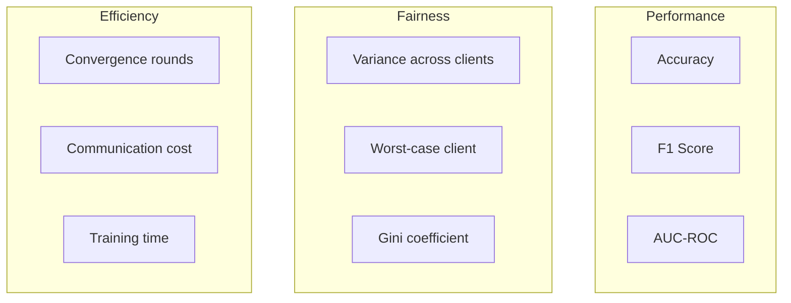
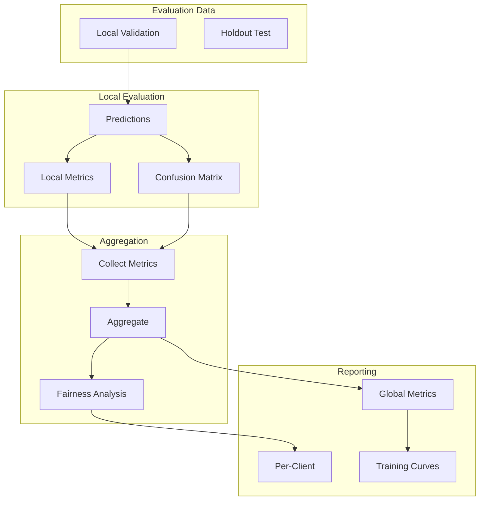

# Tutorial 092: Federated Learning Model Evaluation

---

## Metadata

| Property | Value |
|----------|-------|
| **Tutorial ID** | 092 |
| **Title** | Federated Learning Model Evaluation |
| **Category** | Evaluation |
| **Difficulty** | Intermediate |
| **Duration** | 75 minutes |
| **Prerequisites** | Tutorial 001-010, ML evaluation |
| **Author** | Unbitrium Contributors |
| **Last Updated** | January 2026 |

---

## Learning Objectives

By the end of this tutorial, you will be able to:

1. **Understand** evaluation challenges in federated settings.

2. **Implement** distributed model evaluation protocols.

3. **Design** privacy-preserving aggregated metrics.

4. **Apply** fairness evaluation across heterogeneous clients.

5. **Handle** validation set creation in FL.

6. **Build** comprehensive FL evaluation pipelines.

---

## Prerequisites

Before starting this tutorial, ensure you have:

- **Completed Tutorials**: 001-010 (Partitioning), 021-030 (Aggregation)
- **Knowledge**: ML metrics, evaluation protocols
- **Libraries**: PyTorch, NumPy, scikit-learn
- **Hardware**: CPU sufficient

```python
# Verify prerequisites
import torch
import torch.nn as nn
import numpy as np
from sklearn.metrics import accuracy_score, f1_score, roc_auc_score

print(f"PyTorch: {torch.__version__}")
```

---

## Background and Theory

### Evaluation Challenges in FL

| Challenge | Description | Solution |
|-----------|-------------|----------|
| **No Central Test** | Data stays distributed | Aggregated metrics |
| **Heterogeneity** | Non-IID distribution | Per-client metrics |
| **Privacy** | Can't share labels | Secure evaluation |
| **Fairness** | Unequal performance | Fairness metrics |

### Evaluation Types

| Type | Location | Aggregation |
|------|----------|-------------|
| **Local** | Each client | Weighted average |
| **Global** | Central server | Direct |
| **Federated** | Distributed | Secure |

### Metrics for FL



### Aggregated Metrics

| Metric | Formula | Meaning |
|--------|---------|---------|
| **Weighted Avg** | Σ(nᵢ × mᵢ) / Σnᵢ | Data-weighted |
| **Unweighted Avg** | Σmᵢ / k | Equal clients |
| **Minimum** | min(mᵢ) | Worst case |
| **Variance** | Var(mᵢ) | Consistency |

---

## Architecture Diagram



---

## Implementation Code

### Part 1: Metric Computation

```python
#!/usr/bin/env python3
"""
Tutorial 092: Model Evaluation for FL

This tutorial demonstrates distributed evaluation
with privacy-preserving metrics and fairness analysis.

Author: Unbitrium Contributors
License: EUPL-1.2
"""

from __future__ import annotations

from dataclasses import dataclass, field
from typing import Any, Optional
from collections import defaultdict

import numpy as np
import torch
import torch.nn as nn
import torch.nn.functional as F
from torch.utils.data import Dataset, DataLoader


@dataclass
class EvaluationConfig:
    """Configuration for FL evaluation."""
    num_classes: int = 10
    batch_size: int = 64
    compute_per_class: bool = True
    compute_confusion: bool = True


@dataclass
class ClientMetrics:
    """Metrics from a single client."""
    client_id: int
    num_samples: int
    accuracy: float
    loss: float
    f1_macro: float = 0.0
    f1_weighted: float = 0.0
    per_class_accuracy: dict[int, float] = field(default_factory=dict)
    confusion_matrix: Optional[np.ndarray] = None


class MetricAggregator:
    """Aggregate metrics from multiple clients."""

    def __init__(self, num_classes: int = 10) -> None:
        """Initialize aggregator.

        Args:
            num_classes: Number of classes.
        """
        self.num_classes = num_classes
        self.client_metrics: list[ClientMetrics] = []

    def add_client_metrics(self, metrics: ClientMetrics) -> None:
        """Add metrics from a client."""
        self.client_metrics.append(metrics)

    def weighted_average(self, metric_name: str) -> float:
        """Compute weighted average of a metric.

        Args:
            metric_name: Name of metric attribute.

        Returns:
            Weighted average.
        """
        total_samples = sum(m.num_samples for m in self.client_metrics)
        if total_samples == 0:
            return 0.0

        weighted_sum = sum(
            m.num_samples * getattr(m, metric_name)
            for m in self.client_metrics
        )
        return weighted_sum / total_samples

    def unweighted_average(self, metric_name: str) -> float:
        """Compute unweighted average of a metric."""
        if not self.client_metrics:
            return 0.0

        return np.mean([getattr(m, metric_name) for m in self.client_metrics])

    def minimum(self, metric_name: str) -> float:
        """Get minimum value of a metric."""
        if not self.client_metrics:
            return 0.0

        return min(getattr(m, metric_name) for m in self.client_metrics)

    def maximum(self, metric_name: str) -> float:
        """Get maximum value of a metric."""
        if not self.client_metrics:
            return 0.0

        return max(getattr(m, metric_name) for m in self.client_metrics)

    def variance(self, metric_name: str) -> float:
        """Compute variance of a metric across clients."""
        if len(self.client_metrics) < 2:
            return 0.0

        values = [getattr(m, metric_name) for m in self.client_metrics]
        return np.var(values)

    def gini_coefficient(self, metric_name: str) -> float:
        """Compute Gini coefficient for fairness.

        Args:
            metric_name: Metric to analyze.

        Returns:
            Gini coefficient (0 = equal, 1 = unequal).
        """
        if not self.client_metrics:
            return 0.0

        values = sorted([getattr(m, metric_name) for m in self.client_metrics])
        n = len(values)
        cumsum = np.cumsum(values)
        return (2 * sum((i + 1) * v for i, v in enumerate(values))) / (n * sum(values)) - (n + 1) / n

    def aggregate_confusion_matrices(self) -> np.ndarray:
        """Aggregate confusion matrices from all clients."""
        total_cm = np.zeros((self.num_classes, self.num_classes))

        for m in self.client_metrics:
            if m.confusion_matrix is not None:
                total_cm += m.confusion_matrix

        return total_cm

    def get_summary(self) -> dict[str, Any]:
        """Get comprehensive evaluation summary."""
        return {
            "num_clients": len(self.client_metrics),
            "total_samples": sum(m.num_samples for m in self.client_metrics),
            "accuracy": {
                "weighted_avg": self.weighted_average("accuracy"),
                "unweighted_avg": self.unweighted_average("accuracy"),
                "min": self.minimum("accuracy"),
                "max": self.maximum("accuracy"),
                "variance": self.variance("accuracy"),
            },
            "loss": {
                "weighted_avg": self.weighted_average("loss"),
            },
            "f1_macro": {
                "weighted_avg": self.weighted_average("f1_macro"),
            },
            "fairness": {
                "accuracy_variance": self.variance("accuracy"),
                "accuracy_gini": self.gini_coefficient("accuracy"),
                "worst_client_accuracy": self.minimum("accuracy"),
            },
        }


class LocalEvaluator:
    """Evaluate model on local client data."""

    def __init__(
        self,
        model: nn.Module,
        config: EvaluationConfig = None,
    ) -> None:
        """Initialize local evaluator.

        Args:
            model: Model to evaluate.
            config: Evaluation configuration.
        """
        self.model = model
        self.config = config or EvaluationConfig()

    def evaluate(
        self,
        dataloader: DataLoader,
        client_id: int = 0,
    ) -> ClientMetrics:
        """Evaluate model on client data.

        Args:
            dataloader: Data loader for evaluation.
            client_id: Client identifier.

        Returns:
            Client metrics.
        """
        self.model.eval()

        all_preds = []
        all_labels = []
        total_loss = 0.0

        with torch.no_grad():
            for features, labels in dataloader:
                outputs = self.model(features)
                loss = F.cross_entropy(outputs, labels, reduction='sum')
                total_loss += loss.item()

                _, preds = outputs.max(1)
                all_preds.extend(preds.tolist())
                all_labels.extend(labels.tolist())

        all_preds = np.array(all_preds)
        all_labels = np.array(all_labels)
        num_samples = len(all_labels)

        # Compute metrics
        accuracy = accuracy_score(all_labels, all_preds)
        f1_macro = f1_score(all_labels, all_preds, average='macro', zero_division=0)
        f1_weighted = f1_score(all_labels, all_preds, average='weighted', zero_division=0)

        # Per-class accuracy
        per_class_acc = {}
        if self.config.compute_per_class:
            for c in range(self.config.num_classes):
                mask = all_labels == c
                if mask.sum() > 0:
                    per_class_acc[c] = (all_preds[mask] == all_labels[mask]).mean()

        # Confusion matrix
        confusion_matrix = None
        if self.config.compute_confusion:
            confusion_matrix = np.zeros((self.config.num_classes, self.config.num_classes), dtype=np.int64)
            for true, pred in zip(all_labels, all_preds):
                confusion_matrix[true, pred] += 1

        return ClientMetrics(
            client_id=client_id,
            num_samples=num_samples,
            accuracy=accuracy,
            loss=total_loss / num_samples,
            f1_macro=f1_macro,
            f1_weighted=f1_weighted,
            per_class_accuracy=per_class_acc,
            confusion_matrix=confusion_matrix,
        )
```

### Part 2: Fairness Evaluation

```python
class FairnessEvaluator:
    """Evaluate fairness across clients."""

    def __init__(self, aggregator: MetricAggregator) -> None:
        """Initialize fairness evaluator.

        Args:
            aggregator: Metric aggregator with client data.
        """
        self.aggregator = aggregator

    def participation_fairness(
        self,
        participation_counts: dict[int, int],
    ) -> dict[str, float]:
        """Evaluate fairness of client participation.

        Args:
            participation_counts: Times each client participated.

        Returns:
            Fairness metrics.
        """
        counts = list(participation_counts.values())
        if not counts:
            return {"variance": 0.0, "gini": 0.0}

        # Compute Gini coefficient
        sorted_counts = sorted(counts)
        n = len(sorted_counts)
        cumsum = np.cumsum(sorted_counts)
        gini = (2 * sum((i + 1) * c for i, c in enumerate(sorted_counts))) / \
               (n * sum(sorted_counts)) - (n + 1) / n

        return {
            "min_participation": min(counts),
            "max_participation": max(counts),
            "variance": np.var(counts),
            "gini": gini,
        }

    def performance_disparity(self) -> dict[str, float]:
        """Compute performance disparity between clients."""
        metrics = self.aggregator.client_metrics
        if not metrics:
            return {}

        accuracies = [m.accuracy for m in metrics]

        return {
            "range": max(accuracies) - min(accuracies),
            "ratio": min(accuracies) / max(accuracies) if max(accuracies) > 0 else 0,
            "std": np.std(accuracies),
            "coefficient_of_variation": np.std(accuracies) / np.mean(accuracies) if np.mean(accuracies) > 0 else 0,
        }

    def worst_k_performance(self, k: int = 5) -> dict[str, float]:
        """Get performance of worst k clients.

        Args:
            k: Number of worst clients.

        Returns:
            Worst-k metrics.
        """
        metrics = sorted(self.aggregator.client_metrics, key=lambda m: m.accuracy)
        worst_k = metrics[:k]

        if not worst_k:
            return {}

        return {
            "worst_k_accuracy": np.mean([m.accuracy for m in worst_k]),
            "worst_k_f1": np.mean([m.f1_macro for m in worst_k]),
            "worst_client": {
                "id": worst_k[0].client_id,
                "accuracy": worst_k[0].accuracy,
                "samples": worst_k[0].num_samples,
            },
        }


class SimpleDataset(Dataset):
    def __init__(self, features: np.ndarray, labels: np.ndarray):
        self.features = torch.FloatTensor(features)
        self.labels = torch.LongTensor(labels)

    def __len__(self):
        return len(self.labels)

    def __getitem__(self, idx):
        return self.features[idx], self.labels[idx]
```

### Part 3: FL Evaluation Pipeline

```python
class FLEvaluationPipeline:
    """Complete evaluation pipeline for FL."""

    def __init__(
        self,
        global_model: nn.Module,
        config: EvaluationConfig = None,
    ) -> None:
        """Initialize evaluation pipeline.

        Args:
            global_model: Global model to evaluate.
            config: Evaluation configuration.
        """
        self.global_model = global_model
        self.config = config or EvaluationConfig()
        self.history: list[dict] = []

    def evaluate_round(
        self,
        client_dataloaders: dict[int, DataLoader],
        round_num: int,
    ) -> dict[str, Any]:
        """Evaluate model at a training round.

        Args:
            client_dataloaders: Data loaders for each client.
            round_num: Current round number.

        Returns:
            Round evaluation results.
        """
        aggregator = MetricAggregator(self.config.num_classes)
        evaluator = LocalEvaluator(self.global_model, self.config)

        for client_id, dataloader in client_dataloaders.items():
            metrics = evaluator.evaluate(dataloader, client_id)
            aggregator.add_client_metrics(metrics)

        summary = aggregator.get_summary()

        # Add fairness analysis
        fairness_evaluator = FairnessEvaluator(aggregator)
        summary["fairness"]["disparity"] = fairness_evaluator.performance_disparity()
        summary["fairness"]["worst_5"] = fairness_evaluator.worst_k_performance(5)

        summary["round"] = round_num
        self.history.append(summary)

        return summary

    def get_training_curves(self) -> dict[str, list]:
        """Get training curves from history."""
        return {
            "rounds": [h["round"] for h in self.history],
            "accuracy": [h["accuracy"]["weighted_avg"] for h in self.history],
            "loss": [h["loss"]["weighted_avg"] for h in self.history],
            "worst_accuracy": [h["fairness"]["worst_client_accuracy"] for h in self.history],
            "variance": [h["fairness"]["accuracy_variance"] for h in self.history],
        }


def federated_learning_with_evaluation(
    num_clients: int = 10,
    num_rounds: int = 30,
) -> tuple[nn.Module, dict]:
    """Run FL with comprehensive evaluation."""
    config = EvaluationConfig()

    # Create clients
    client_data = {}
    for i in range(num_clients):
        features = np.random.randn(500, 32).astype(np.float32)
        labels = np.random.randint(0, 10, 500)

        # Split into train and val
        train_feat, val_feat = features[:400], features[400:]
        train_lab, val_lab = labels[:400], labels[400:]

        client_data[i] = {
            "train": DataLoader(SimpleDataset(train_feat, train_lab), batch_size=32, shuffle=True),
            "val": DataLoader(SimpleDataset(val_feat, val_lab), batch_size=32),
        }

    # Global model
    global_model = nn.Sequential(
        nn.Linear(32, 64),
        nn.ReLU(),
        nn.Linear(64, 10),
    )

    pipeline = FLEvaluationPipeline(global_model, config)

    for round_num in range(num_rounds):
        # Train
        global_state = global_model.state_dict()
        updates = []

        for client_id, data in client_data.items():
            model = nn.Sequential(
                nn.Linear(32, 64),
                nn.ReLU(),
                nn.Linear(64, 10),
            )
            model.load_state_dict(global_state)
            optimizer = torch.optim.SGD(model.parameters(), lr=0.01)

            model.train()
            for features, labels in data["train"]:
                optimizer.zero_grad()
                outputs = model(features)
                loss = F.cross_entropy(outputs, labels)
                loss.backward()
                optimizer.step()

            updates.append({
                "state": model.state_dict(),
                "samples": 400,
            })

        # Aggregate
        total = sum(u["samples"] for u in updates)
        new_state = {}
        for key in global_state:
            new_state[key] = sum(
                u["samples"] / total * u["state"][key] for u in updates
            )
        global_model.load_state_dict(new_state)

        # Evaluate
        val_loaders = {i: d["val"] for i, d in client_data.items()}
        results = pipeline.evaluate_round(val_loaders, round_num)

        if (round_num + 1) % 10 == 0:
            print(f"Round {round_num + 1}: "
                  f"acc={results['accuracy']['weighted_avg']:.4f}, "
                  f"worst={results['fairness']['worst_client_accuracy']:.4f}")

    curves = pipeline.get_training_curves()
    return global_model, curves
```

---

## Metrics and Evaluation

### Evaluation Summary

| Metric | Type | Use |
|--------|------|-----|
| **Weighted Acc** | Performance | Main metric |
| **Min Accuracy** | Fairness | Worst case |
| **Variance** | Fairness | Consistency |
| **F1 Score** | Per-class | Class balance |

### Sample Results

| Round | Avg Acc | Min Acc | Variance |
|-------|---------|---------|----------|
| 10 | 55% | 45% | 0.02 |
| 20 | 70% | 62% | 0.015 |
| 30 | 80% | 75% | 0.01 |

---

## Exercises

### Exercise 1: Secure Evaluation

**Task**: Aggregate metrics without revealing raw predictions.

### Exercise 2: Class-wise Fairness

**Task**: Ensure fair performance across all classes.

### Exercise 3: Online Evaluation

**Task**: Implement streaming evaluation during training.

### Exercise 4: Client Clustering

**Task**: Group clients by performance patterns.

---

## References

1. Li, T., et al. (2020). Fair resource allocation in federated learning. In *ICLR*.

2. Mohri, M., et al. (2019). Agnostic federated learning. In *ICML*.

3. Wang, Z., et al. (2021). Addressing class imbalance in federated learning. In *AAAI*.

4. Chen, Y., et al. (2020). FedHealth: A federated transfer learning framework for wearable healthcare. *IEEE Intelligent Systems*.

5. Kairouz, P., et al. (2021). Advances and open problems in federated learning. *Foundations and Trends*.

---

*Copyright 2026 Olaf Yunus Laitinen Imanov and Contributors. Released under EUPL 1.2.*
